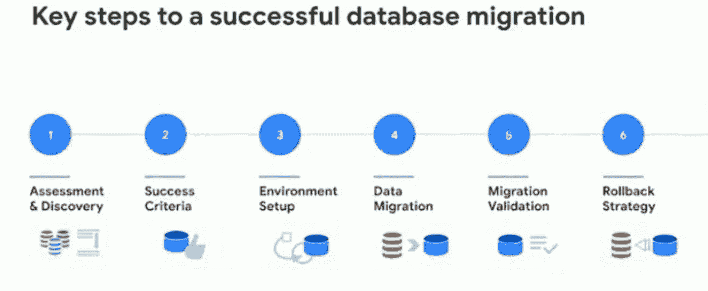
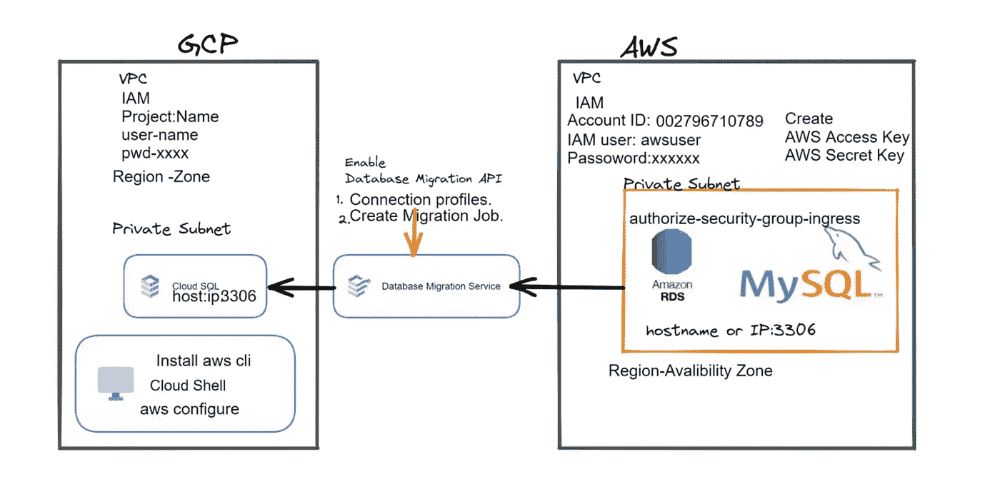

# 谷歌云数据库工程师考试分步指南

> 原文：<https://medium.com/google-cloud/google-cloud-database-engineer-exam-step-by-step-guide-58a33ad59f6e?source=collection_archive---------5----------------------->

**什么是谷歌云数据库工程师？**

谷歌云数据库工程师是专门从事谷歌云平台上数据库的设计、实现和管理的专业人士。这包括设置和配置数据库系统、设计数据模型、优化数据库性能以及确保数据安全性和可用性。

谷歌云平台提供了几个数据库服务，比如云 SQL、云扳手、云 Bigtable、云 Firestore。Google 云数据库工程师负责为特定应用程序选择合适的数据库服务，并确保数据库的设计、部署和管理符合应用程序的要求。

对于依赖数据库来存储和管理关键业务数据的组织来说，Google 云数据库工程师的角色至关重要。通过让熟练的数据库工程师加入他们的团队，组织可以确保他们的数据库得到高效的设计和管理，具有高可用性和可伸缩性，并且能够承受任何潜在的故障或安全漏洞。

**为什么需要谷歌云数据库认证？**

谷歌云数据库认证之所以有益，有几个原因:

1.  验证您的技能和专业知识:认证对您在 Google 云平台上设计和管理数据库的技能和专业知识进行第三方验证。它表明你对谷歌云数据库服务有着深刻的理解，并能使用它们来解决现实世界中的问题。
2.  增强你的职业前景:拥有谷歌云数据库认证可以让你在就业市场上更具竞争力，增加你的收入潜力。它可以在云计算和数据库管理方面开辟新的职业机会。
3.  提高您的知识和技能:认证过程涉及广泛的培训和谷歌云数据库服务的实践经验。它可以帮助您扩展数据库设计、部署和管理方面的知识和技能，并跟上最新的行业趋势和最佳实践。
4.  与客户和雇主建立信任:客户和雇主可以信任你的技能和专业知识，知道你通过了严格的认证考试，并获得了谷歌的数据库工程师认证。

# 首先，记住所有谷歌云数据库产品及其定义

**AlloyDB for PostgreSQL:**

AlloyDB 是一个基于 PostgreSQL 的开源数据库管理系统。它是由 LinkedIn 开发的，以满足他们对高可伸缩性、高性能和可靠的数据库系统的特定需求。

AlloyDB 包括几个扩展 PostgreSQL 功能的特性，包括自动分片和分区、多主机复制和分布式 SQL 处理。它旨在处理大量数据，并为实时应用程序提供低延迟响应时间。

AlloyDB 支持 PostgreSQL 的 SQL 方言，可以与现有的 PostgreSQL 工具和库一起使用。它还为管理和监控 AlloyDB 节点的分布式集群提供了额外的工具和 API。

AlloyDB 的一些关键特性包括:

*   自动分片和分区:AlloyDB 自动跨多个节点对数据进行分区，以实现可伸缩性和容错性。
*   多主复制:多个 AlloyDB 节点可以充当主节点并接受写操作，从而提供高可用性和持久性。
*   分布式 SQL 处理:AlloyDB 可以跨多个节点处理 SQL 查询，并实时返回结果。
*   弹性可伸缩性:AlloyDB 可以轻松伸缩，以应对不断变化的工作负载。
*   一致的全局状态:AlloyDB 确保所有节点上的数据一致，即使在网络分区或其他故障期间也是如此。

**数据库裸机解决方案:**

谷歌云裸机解决方案并不专门提供数据库服务，但它确实为客户提供了在谷歌云中的专用、非虚拟化硬件上运行自己的数据库软件的能力。

借助裸机解决方案，客户可以灵活地在专用硬件上运行他们选择的任何软件或操作系统，包括流行的数据库软件，如 MySQL、PostgreSQL、Oracle 和 Microsoft SQL Server。这使客户能够在高度可扩展和可靠的云环境中运行其数据库工作负载，同时保持对底层硬件的完全控制。

在裸机解决方案上运行数据库有几个好处，包括:

1.  低延迟性能:通过在专用硬件上运行数据库，客户可以实现更低的延迟和更高的吞吐量，这对实时和高性能工作负载非常重要。
2.  增强的控制和灵活性:裸机解决方案使客户能够完全控制底层硬件，包括选择自己的硬件规格、操作系统和数据库软件。
3.  高可用性和可靠性:裸机解决方案提供对谷歌云的高可用性和弹性基础设施的访问，包括冗余电源和网络，以及根据需要轻松扩展或缩减的能力。
4.  合规性和安全性:裸机解决方案旨在满足最严格的安全性和合规性要求，包括 PCI DSS、HIPAA 和 ISO 27001，并提供安全引导和基于 TPM 的证明等功能来增强安全性。

**云大表:**

Cloud Bigtable 是由 Google 云平台提供的完全托管的 NoSQL 数据库服务。它旨在处理大规模、高吞吐量、低延迟的工作负载，非常适合需要实时访问大量数据的应用，如分析、物联网和金融应用。

云 Bigtable 建立在谷歌的内部数据库技术上，该技术为一些世界上最大的应用程序提供支持，如谷歌搜索、Gmail 和谷歌分析。这是一项完全托管的服务，意味着 Google 处理底层基础设施的所有方面，包括扩展、复制和维护。

云 Bigtable 的一些关键特性包括:

1.  高性能和可扩展性:云 Bigtable 可以处理 Pb 级工作负载，具有低延迟和高吞吐量。它可以支持每秒数百万次的操作，并且可以根据需要扩大或缩小规模。
2.  完全托管服务:云 Bigtable 完全由 Google 管理，这意味着客户不需要担心管理底层基础设施。
3.  NoSQL 数据模型:Cloud Bigtable 是一个 NoSQL 数据库，这意味着它不受传统关系数据库的约束。它提供了一个灵活的数据模型，可以处理各种各样的数据类型和结构。
4.  与 Google 云平台集成:Cloud Bigtable 与 Google 云平台集成，便于与其他 Google 云服务一起使用，如 BigQuery、Cloud Dataflow 和 Cloud Pub/Sub。
5.  高可用性和持久性:云 Bigtable 通过自动复制和故障转移提供高可用性和持久性。

**云 SQL:**

Cloud SQL 是 Google Cloud Platform 提供的完全托管的关系数据库服务。它为客户提供了一个高度可用和可伸缩的数据库解决方案，该解决方案与流行的关系数据库管理系统(如 MySQL、PostgreSQL 和 SQL Server)兼容。

云 SQL 提供了几个关键特性，包括:

1.  完全托管的服务:云 SQL 是一种完全托管的服务，这意味着谷歌云平台处理底层基础设施的所有方面，包括扩展、备份和维护。
2.  自动备份和恢复:云 SQL 提供自动备份、时间点恢复和故障转移，以确保客户数据的高可用性和持久性。
3.  与 Google 云平台的集成:Cloud SQL 与其他 Google 云平台服务紧密集成，如 Compute Engine、Kubernetes Engine 和 App Engine，便于与其他 Google 云平台服务一起使用。
4.  高可用性和可伸缩性:云 SQL 提供高可用性和可伸缩性，支持自动伸缩和水平伸缩，具体取决于所使用的数据库引擎。

**云扳手:**

Cloud Spanner 是由 Google Cloud 提供的一个完全托管的、高度可扩展的、全球分布的关系数据库服务。它旨在处理大量结构化数据，能够跨多个地区和大洲进行水平扩展。

Cloud Spanner 建立在 Google 专有的 Spanner 技术之上，该技术结合了传统关系数据库和非关系数据库的优点，提供了强大的一致性和水平可伸缩性。它为任务关键型应用程序提供了高度可用、高度可靠和高度安全的数据库基础架构。

Cloud Spanner 广泛应用于一系列应用中，如金融服务、电子商务、游戏等，在这些应用中，高可扩展性、可靠性和可用性是关键要求。

**数据库迁移服务:**

云 DMS(数据库迁移服务)是由谷歌云平台提供的完全托管的服务，使用户能够在最少停机和中断的情况下将其数据库迁移到谷歌云。它提供了一种简单、灵活、可靠的方式，将数据库从内部数据中心、其他云平台或虚拟机迁移到 Google Cloud。

云 DMS 支持广泛的数据库，包括 MySQL、PostgreSQL、Oracle、SQL Server 等，它可以在源数据库和目标数据库之间执行一次性迁移和连续复制。该服务使用本机复制功能来最大限度地减少迁移过程中的停机时间和数据丢失，并且它可以自动处理模式和数据转换，以确保与目标数据库的兼容性。

云 DMS 的一些关键特性包括:

1.  最短的停机时间:云 DMS 使用本机复制功能来最大限度地减少迁移过程中的停机时间。
2.  自动化迁移:该服务可以自动处理模式和数据转换，以确保与目标数据库的兼容性。
3.  灵活的迁移:云 DMS 支持广泛的数据库，并提供一次性迁移和连续复制。
4.  完全托管:该服务完全由谷歌管理，这意味着用户不需要担心管理基础设施或软件。
5.  安全性:云 DMS 使用 SSL 加密来确保数据在迁移过程中安全传输。

**第一商店:**

Firestore 是谷歌云平台提供的面向 NoSQL 文档的数据库。这是一个完全托管的无服务器数据库，旨在为 web 和移动应用程序存储、同步和查询数据。Firestore 是谷歌 Firebase 平台的一部分，该平台是一个移动和 web 应用程序开发平台。

Firestore 将数据存储在文档中，这些文档被组织成集合。每个文档都由一组键-值对组成，它们可以嵌套起来创建复杂的数据结构。Firestore 还支持对这些数据的查询，从而可以根据特定条件轻松检索数据。

Firestore 针对跨多个客户端和设备的实时数据同步进行了优化，这使得它非常适合开发需要实时更新的应用程序。它还支持离线数据访问和冲突解决，使用户即使没有连接到互联网也能处理数据。

Firestore 的一些主要功能包括:

1.  实时数据同步:Firestore 提供跨多个客户端和设备的实时更新。
2.  可扩展性:Firestore 可以处理大量数据，并且可以自动扩展以满足不断增长的应用程序的需求。
3.  安全性:Firestore 通过基于角色的访问控制提供安全的数据存储。
4.  开发者工具:Firestore 为开发者提供了一套工具和库，用于集成各种编程语言和平台。
5.  完全管理和无服务器:Firestore 完全由 Google 管理，不需要用户管理任何基础设施。

**Firebase 实时数据库:**

Firebase 实时数据库是一个云托管的 NoSQL 数据库，由 Google 作为 Firebase 平台的一部分提供。它是一个灵活的、可扩展的、无服务器的数据库，跨多个客户端和设备实时存储和同步数据。

Firebase 实时数据库使用树状数据结构，数据以分层格式存储为 JSON 文档。数据库允许您实时读取和写入数据，这意味着对数据库的更改会立即传播到所有连接的客户端，而无需手动同步。这使得它非常适合构建实时应用程序，如聊天应用程序、实时仪表板和协作工具。

Firebase 实时数据库为访问和操作数据提供了一个简单直观的 API，使其易于与移动和 web 应用程序集成。它还提供了强大的查询和索引功能，允许您基于各种标准检索数据。

Firebase 实时数据库的一些关键功能包括:

1.  实时同步:跨多个客户端和设备实时同步数据。
2.  NoSQL 数据库:该数据库使用灵活的 NoSQL 数据模型，便于开发和扩展。
3.  脱机支持:数据库支持脱机数据访问和用户重新联机时的自动数据同步。
4.  实时事件触发器:您可以设置触发器来执行代码，以响应数据库中的更改。
5.  安全性:数据库提供了一个强大的安全模型，允许您使用身份验证和授权规则来保护数据访问。

**记忆商店:**

Memorystore 是由谷歌云平台提供的完全托管的内存数据存储。这是一个 NoSQL 数据库，旨在为需要高性能、实时数据访问的应用程序提供快速、低延迟的数据访问。Memorystore 构建在开源的 Redis 内存数据存储之上，这是构建高性能应用程序的流行选择。

与传统的基于磁盘的数据存储相比，Memorystore 提供了许多优势，例如更快的读写操作、更短的数据访问延迟和更高的吞吐量。这项服务是完全托管的，这意味着谷歌云负责底层基础设施，包括扩展、备份和软件更新。

Memorystore 提供了两种不同的部署选项:标准和 Redis Enterprise。标准选项提供带有单个碎片的基本 Redis 部署，而 Redis Enterprise 提供带有多个碎片的更高级 Redis 部署和高级功能，如主动-主动地理复制。

Memorystore 的一些主要功能包括:

1.  高性能:Memorystore 为高性能应用程序提供快速、低延迟的数据访问。
2.  完全托管:该服务完全由谷歌云管理，这意味着用户不需要担心管理基础设施或软件。
3.  安全性:Memorystore 提供 SSL 加密，以确保数据在网络上安全传输。
4.  高可用性:Memorystore 提供高可用性和自动故障转移，确保即使在硬件故障的情况下，服务仍然可用。
5.  易于集成:Memorystore 与 Redis API 完全兼容，这使得它易于与现有的应用程序和工具集成。

**数据流:**

Datastream 是 Google 云平台提供的托管服务，允许您从各种来源向各种目标实时复制数据。借助 Datastream，您可以轻松设置、配置和管理实时数据复制，使您能够在数据生成后立即加以利用。

数据流支持各种源和目标，包括 Google 云服务，如 BigQuery、Cloud SQL 和 Cloud Spanner，以及非 Google 服务，如 Amazon Web Services (AWS)和内部数据库。它使用变更数据捕获(CDC)技术来捕获发生的数据变更，确保复制的数据始终是最新的。

数据流提供了许多好处，包括:

1.  实时复制:数据流实时复制数据，确保数据始终是最新的并可供使用。
2.  托管服务:数据流是一种完全托管的服务，这意味着您无需担心管理基础设施、扩展或监控。
3.  易于集成:Datastream 提供了一个易于使用的基于 web 的界面和 API，使得设置、配置和管理数据复制变得容易。
4.  灵活性:数据流支持各种源和目标，允许您跨各种系统和服务复制数据。
5.  安全性:Datastream 提供强大的安全功能，包括传输中和静态数据的加密，以确保您的数据是安全的。

***参考链接***

【https://cloud.google.com/products#section-8】T5[T6](https://cloud.google.com/products#section-8)

观看这段关于[玛拉·索斯](https://medium.com/u/90c8a646571f?source=post_page-----58a33ad59f6e--------------------------------)和[普里扬卡·韦尔加迪亚](https://medium.com/u/9b9e67983b04?source=post_page-----58a33ad59f6e--------------------------------)的富有洞察力的讨论视频。这将有助于准备迎接新的专业云数据库工程师认证。

# ➡️Check 在空中链接上推出了谷歌云

 [## 认识新的专业云数据库工程师认证

### 认识新的专业云数据库工程师认证

认识新的专业云数据库工程师 certificationcloudonair.withgoogle.com](https://cloudonair.withgoogle.com/events/new-professional-cloud-data-engineer-certification/watch?talk=talk) 

# ➡️See:如何利用谷歌云实现数据库现代化

回顾学习路径，并在数据库工程师学习路径中获得技能徽章。这涵盖了考试中的许多主题，包括将数据库迁移到 Google Cloud 和管理 Google Cloud 数据库。

# ➡️Complete 数据库工程师谷歌云提供学习*路径:*

> [参考学习路径链接](https://www.cloudskillsboost.google/paths/22?utm_source=cgc&utm_medium=et&utm_campaign=-&utm_content=cgc-cert-database&utm_term=-)

> 课程

## 1.谷歌云基础:核心基础设施

## 2.企业数据库迁移

> 探索

## 1.使用数据库迁移服务将 MySQL 数据迁移到云 SQL

## 2.在 Google Cloud 上管理 Bigtable

## 3.创建和管理云扳手数据库

## 4.在云 SQL 上管理 PostgreSQL 数据库

> **记住要点**

## ✅Design 可扩展且高度可用的云数据库解决方案

配置网络和安全性(云 SQL 身份验证代理、CMEK、SSL 证书)

自我管理、裸机、Google 管理的数据库和合作伙伴数据库产品)

结构化、半结构化、非结构化

分析在谷歌云中运行数据库解决方案的成本

确定数据库连接和访问管理

确定数据库连接和访问控制的身份和访问管理(IAM)策略

管理数据库用户，包括身份验证和访问

监控和调查数据库关键要素:RAM、CPU 存储、I/O、云日志记录

为错误和性能指标设置警报

根据服务级别协议和服务级别协议，推荐备份和恢复选项(自动定时备份)

## ✅Manage 是一个可以跨越多个数据库解决方案的解决方案

为数据库配置导出和导入数据

恢复时间目标(RTO)和恢复点目标(RPO)

纵向扩展和横向扩展。

复制策略

执行数据库维护

灾难和恢复解决方案

## ✅Migrate 数据解决方案

制定并执行迁移策略和计划，包括零停机时间、接近零停机时间、延长停机时间和回退计划

从 Google 云到源的反向复制

计划并执行数据库迁移，包括回退计划和模式转换

为给定场景确定正确的数据库迁移工具

## 谷歌云中的✅Deploy 可扩展和高可用性数据库

在谷歌云中提供高可用性数据库解决方案

定期测试高可用性和灾难恢复策略

为数据库设置多区域复制

评估读取副本的要求

自动化数据库实例供应

# ▶️Deep 涉足数据库服务

# 1️⃣云扳手

*参考链接*

[*https://cloud . Google . com/blog/topics/developers-practices/what-cloud-spanner？UTM _ source = ext&UTM _ medium = partner&UTM _ campaign = CDR _ pve _ GCP _ gcpsketchnote _&UTM _ content =-*](https://cloud.google.com/blog/topics/developers-practitioners/what-cloud-spanner?utm_source=ext&utm_medium=partner&utm_campaign=CDR_pve_gcp_gcpsketchnote_&utm_content=-)

# 2️⃣云 SQL

*参考链接*

[*https://cloud . Google . com/blog/topics/developers-practices/what-cloud-SQL？UTM _ source = ext&UTM _ medium = partner&UTM _ campaign = CDR _ pve _ GCP _ gcpsketchnote _&UTM _ content =-*](https://cloud.google.com/blog/topics/developers-practitioners/what-cloud-sql?utm_source=ext&utm_medium=partner&utm_campaign=CDR_pve_gcp_gcpsketchnote_&utm_content=-)

# 3️⃣大餐桌

*参考链接*

[*https://cloud . Google . com/blog/topics/开发者-从业者/how-big-cloud-bigtable？UTM _ source = ext&UTM _ medium = partner&UTM _ campaign = CDR _ pve _ GCP _ gcpsketchnote _&UTM _ content =-*](https://cloud.google.com/blog/topics/developers-practitioners/how-big-cloud-bigtable?utm_source=ext&utm_medium=partner&utm_campaign=CDR_pve_gcp_gcpsketchnote_&utm_content=-)

# 4️⃣·费尔斯托

*参考链接*

[*https://cloud . Google . com/blog/topics/developers-从业者/all-you-need-know-on-firestore-cheat sheet？UTM _ source = ext&UTM _ medium = partner&UTM _ campaign = CDR _ pve _ GCP _ gcpsketchnote _&UTM _ content =-*](https://cloud.google.com/blog/topics/developers-practitioners/all-you-need-know-about-firestore-cheatsheet?utm_source=ext&utm_medium=partner&utm_campaign=CDR_pve_gcp_gcpsketchnote_&utm_content=-)

# 5️⃣数据流

*参考链接*

[*https://cloud . Google . com/blog/topics/developers-从业者/all-you-need-know-about-datastream？UTM _ source = ext&UTM _ medium = partner&UTM _ campaign = CDR _ pve _ GCP _ gcpsketchnote _&UTM _ content =-*](https://cloud.google.com/blog/topics/developers-practitioners/all-you-need-know-about-datastream?utm_source=ext&utm_medium=partner&utm_campaign=CDR_pve_gcp_gcpsketchnote_&utm_content=-)

# 6️⃣记忆商店

*参考链接*[*https://cloud . Google . com/blog/topics/developers-从业者/what-memorystore？UTM _ source = ext&UTM _ medium = partner&UTM _ campaign = CDR _ pve _ GCP _ gcpsketchnote _&UTM _ content =-*](https://cloud.google.com/blog/topics/developers-practitioners/what-memorystore?utm_source=ext&utm_medium=partner&utm_campaign=CDR_pve_gcp_gcpsketchnote_&utm_content=-)

# 我应该使用✅Which 数据库吗？

*参考链接*[*https://cloud . Google . com/blog/topics/developers-从业者/your-Google-cloud-database-options-explained*](https://cloud.google.com/blog/topics/developers-practitioners/your-google-cloud-database-options-explained)

# 云 SQL 的✅DR 和高可用性解决方案架构

# ✅Database 迁移选项

# ✅Options 1:将您的数据从甲骨文转移到扳手

*参考链接*

[https://cloud . Google . com/spanner/docs/migrating-Oracle-to-cloud-spanner](https://cloud.google.com/spanner/docs/migrating-oracle-to-cloud-spanner)

# ✅Options 2:使用数据库迁移服务从 Amazon RDS for MySQL 迁移到云 SQL

*参考链接*

[*https://bgiri-g cloud . medium . com/migrating-to-cloud-SQL-from-Amazon-rds-for-MySQL-using-database-migration-service-fdf8c 520294 a*](https://bgiri-gcloud.medium.com/migrating-to-cloud-sql-from-amazon-rds-for-mysql-using-database-migration-service-fdf8c520294a)

# **✅Options 3:从 Oracle 迁移到 PostgreSQL，使用数据流最大限度减少停机时间**

*参考链接*

[*https://cloud . Google . com/blog/products/databases/migrating-Oracle-to-PostgreSQL-just-get-a-lot-easy*](https://cloud.google.com/blog/products/databases/migrating-oracle-to-postgresql-just-got-a-lot-easier)

# ✅Options 4:将内部 PostgreSQL 集群迁移到 Google Cloud

*参考链接*

 [## 将内部 PostgreSQL 集群迁移到 Google Cloud |云架构中心

### 注意:本文档或章节包含一个或多个谷歌认为不尊重或…

cloud.google.com](https://cloud.google.com/architecture/migrating-postgresql-to-gcp) 

# ✅Options 5:

# ✅Options 6:

# 数据库迁移的✅Different 方法

# ✅How 成本是为谷歌云数据库计算的？

# ✅Export/Import 数据库迁移

*参考链接*

[*https://chriskyfung . github . io/blog/qwikilabs/Migrate-a-MySQL-Database-to-Google-Cloud-SQL*](https://chriskyfung.github.io/blog/qwiklabs/Migrate-a-MySQL-Database-to-Google-Cloud-SQL)

# 使用 PostgreSQL 工具将✅Migrating PostgreSQL 转换为 alloy db-PostgreSQL—pg _ dump 和 pg_restore 工具

*参考链接*

 [## 如何使用 PostgreSQL 工具将 PostgreSQL 迁移到 alloy db-PostgreSQL—pg _ dump 和…

### 此次迁移的架构

bgiri-gcloud.medium.com](https://bgiri-gcloud.medium.com/how-to-migrating-postgresql-to-alloydb-postgresql-from-using-postgresql-tools-pg-dump-and-49dd1453eae4) 

# 迁移数据库的➡️Some 选项和原因

# ➡️Some 重要参考网址

**云 SQL:-**

[https://cloud.google.com/sql/docs/mysql/import-export](https://cloud.google.com/sql/docs/mysql/import-export)

[https://cloud . Google . com/SQL/docs/MySQL/backup-recovery/backups](https://cloud.google.com/sql/docs/mysql/backup-recovery/backups)

[https://cloud . Google . com/architecture/scheduling-cloud-SQL-database-exports-using-cloud-scheduler](https://cloud.google.com/architecture/scheduling-cloud-sql-database-exports-using-cloud-scheduler)

**维护:-**

[https://cloud.google.com/sql/docs/mysql/maintenance](https://cloud.google.com/sql/docs/mysql/maintenance)

[https://cloud . Google . com/SQL/docs/MySQL/set-maintenance-window # opt-in](https://cloud.google.com/sql/docs/mysql/set-maintenance-window#opt-in)

**扳手:**

[https://cloud . Google . com/blog/topics/developers-从业者/what-cloud-spanner？UTM _ source = ext&UTM _ medium = partner&UTM _ campaign = CDR _ pve _ GCP _ gcpsketchnote _&UTM _ content =-](https://cloud.google.com/blog/topics/developers-practitioners/what-cloud-spanner?utm_source=ext&utm_medium=partner&utm_campaign=CDR_pve_gcp_gcpsketchnote_&utm_content=-)

https://www.youtube.com/watch?v=hRDpbHtNceU T2

## [最后，复习样题](https://docs.google.com/forms/d/e/1FAIpQLSe55cAg8a3NzgV_QCJ2_F75NAyE44Z-XuVB6oPJXaWnI5UBIQ/viewform)

## [准备安排考试](https://www.webassessor.com/wa.do?page=enterCatalog&branding=GOOGLECLOUD&tabs=7)

**结论:**

正确的方法和准备可以增加你成功的机会。在准备数据库工程考试时，请记住以下几点。

➡️Understand 的概念:从理解数据库工程的关键概念和原则开始。确保您对数据库设计、数据建模、SQL 和数据库管理有很好的理解。

➡️Practice:练习对准备任何考试都是必不可少的。尝试获得数据库工具和技术的实践经验。练习设计和实现数据库、编写 SQL 查询以及执行数据库管理任务。

➡️Review 考试题目:确保彻底复习考试题目。仔细阅读考试大纲，确保你已经详细地涵盖了所有的主题。

➡️Use 学习材料:利用学习材料，如书籍，在线课程和实践考试。这些可以帮助你更好地理解概念，并对实际考试有所了解。

➡️Manage 你的时间:准备考试时，时间管理很重要。制定一个学习计划，让你能够在考试前及时涵盖所有主题。

➡️Stay 冷静:考试当天，保持冷静和自信。仔细阅读问题，慢慢回答。

请记住，通过数据库工程师考试不仅仅是记忆事实和数字，还包括理解概念并能够在现实世界中应用它们。祝你考试准备顺利！

➡️if，你喜欢我的内容，不要忘了喜欢和关注我，以获得更多这样的技术内容，这将有助于你肯定👌

**关于我** —我是一名资深谷歌云架构师，在 IT 行业有 14 年的经验。我也是多云认证专家。还有哈希公司(10 倍于 GCP)。

目前正在为供应商、客户和利益相关方提供端到端的 google cloud 解决方案，帮助他们实现从内部到 Google Cloud 的数字化转型。

如果您有任何问题，可以通过以下方式联系我

电报:[https://t.me/growwithgcp](https://t.me/growwithgcp)

推特:【https://twitter.com/bgiri_gcloud 

insta gram:【https://www.instagram.com/google_cloud_trainer/ 

领英:[https://www.linkedin.com/in/biswanathgirigcloudcertified/](https://www.linkedin.com/in/biswanathgirigcloudcertified/)

https://www.facebook.com/biswanath.giri 脸书

还有 DM 我:)很乐意帮忙！！

您还可以在 topmate.io/gcloud_biswanath_giri[与我安排 121 次讨论，讨论任何与谷歌云相关的问题:😁](https://topmate.io/gcloud_biswanath_giri)