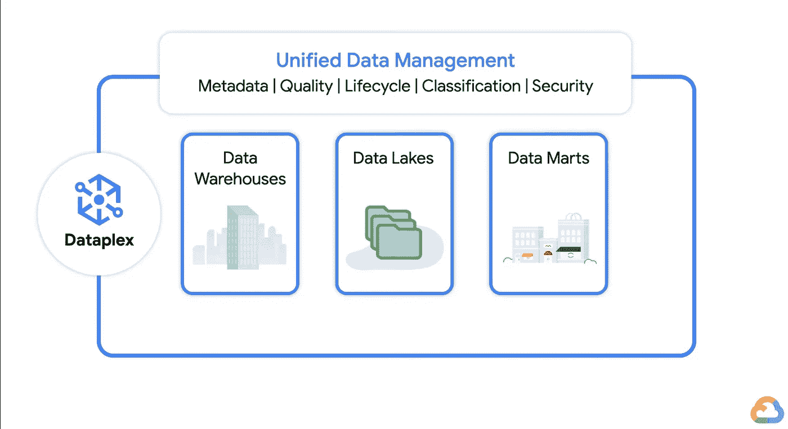
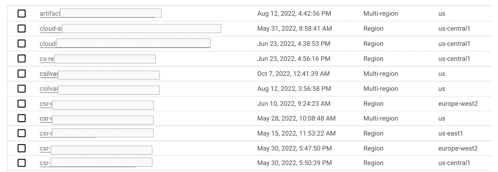

# Google Cloud Dataplex API-自动化您的数据湖和区域

> 原文：<https://medium.com/google-cloud/google-cloud-dataplex-api-automate-your-data-lakes-and-zones-94bb330198ff?source=collection_archive---------4----------------------->

随着数据网格和数据结构越来越受欢迎，Google Cloud [Dataplex](https://cloud.google.com/dataplex) 现在是一个重要的组件，它拥有一个单一的平面来发现和管理跨湖泊、数据仓库和数据集市的所有数据。



Dataplex 一览

然而，一位客户问我:我可以调用 API 来批量创建我的所有湖泊、区域和资产吗？另外，我可以自动化这个过程吗？例如，每当创建新的湖泊/区域时，也会创建新的 GCS 存储桶或 BigQuery 数据集。

这就是为什么我喜欢和顾客一起工作——总是有新的挑战！情况如下:想象有超过 1000 个存储桶和数据集跨多个项目，您希望将它们附加到您的 Dataplex 区域:



想象一下这个+1000！

这就是 Dataplex 的 CLI 和 REST APIs 的用武之地。在这篇文章中，我们将从后者开始。

# 入门指南

在下面的例子中，我们将基于 GCS bucket 的区域创建一个新的湖(如果它不存在的话)。

第一步是使用 pip 安装 python 库(pro 提示:你可以通过 [Vertex AI workbench](https://cloud.google.com/vertex-ai-workbench) 在 Jupyter 笔记本中完成以下所有操作)。

```
pip install google-cloud-dataplex
```

下一步是定义一个 python 字典来保存我们的基本变量。一旦我们定义了它，我们就可以初始化环境:

```
#### Initialize the environmentfrom google.cloud import storage
from google.cloud import dataplex_v1
import os# initialize the common variables
dataplex_dict= {
    "project": "{PROJECT_ID}", 
    "region": "none",
    "gcs_bucket_name":"{SOURCE_BUCKET}",
    "zone_type": "RAW",
    "zone_location_type": "SINGLE_REGION",
    "zone_id": "{ZONE_ID}",
    "asset_type":"STORAGE_BUCKET",
    "asset_id":"{ASSET_ID}",
    "asset_name":"projects/{PROJECT_ID}/buckets/{SOURCE_BUCKET}",
    "bq_dataset":"none"
}# authenticate using service account key
os.environ['GOOGLE_APPLICATION_CREDENTIALS'] = 'key.json'# obtain the bucket that we will attach to the zone
storage_client = storage.Client()
bucket = storage_client.get_bucket(dataplex_dict["gcs_bucket_name"])# update the dict's location. This will be used to create a lake if doesn't exists
dataplex_dict["region"] = bucket.location.lower()# Create a dataplex client
dataplex_client = dataplex_v1.DataplexServiceClient()
```

现在，我们已经初始化了我们的环境，我们可以开始创建一个新的湖，如果它不存在于该地区:

```
### Step 1 Dataplex Lake creation# Setup the parent URL with format : project/{PROJECT_ID}/locations/{REGION}
parent="projects/" + dataplex_dict["project"] + "/locations/"+dataplex_dict["region"]# Setup the lake_id for the newly created lake
lake_id= dataplex_dict["region"] + "-lake"# List lakes by location
request = dataplex_v1.ListLakesRequest(
    parent=parent,
)# Initialize request argument(s)
request = dataplex_v1.CreateLakeRequest(
        parent=parent,
        lake_id=lake_id,
)
operation = dataplex_client.create_lake(request=request)print("Waiting for operation to complete...")response = operation.result()# Handle the response
print(response)
```

请注意，我们创建的客户端类型是同步的。因此，我们将需要等待，直到湖已经创建到下一步。您可以利用异步客户端来涵盖这些异步用例。

```
### Step 2 Create zone into lake # zone
zone = dataplex_v1.Zone()
zone.type_ = dataplex_dict["zone_type"]
zone.resource_spec.location_type = dataplex_dict["zone_location_type"]
zone.discovery_spec.enabled = True
zone_id=dataplex_dict["zone_id"]
zone_parent =  parent+"/lakes/"+lake_idrequest = dataplex_v1.CreateZoneRequest(
    parent=zone_parent,
    zone_id=zone_id,
    zone=zone,
)# Make the request
operation = dataplex_client.create_zone(request=request)print("Waiting for operation to complete...")response = operation.result()# Handle the response
print(response)
```

最后，我们将把我们的 GCS 存储桶和 BQ 数据集作为资产附加到分区！

```
### Step 3 add asset to zoneasset_parent = zone_parent + "/zones/" + zone_id
# bucket asset
asset = dataplex_v1.Asset()
asset.resource_spec.type_ = dataplex_dict["asset_type"]
asset.resource_spec.name=dataplex_dict["asset_name"]
asset_id=dataplex_dict["asset_id"]request = dataplex_v1.CreateAssetRequest(
    parent=asset_parent,
    asset_id=asset_id,
    asset=asset,
)# Make the request
operation = dataplex_client.create_asset(request=request)print("Waiting for operation to complete...")response = operation.result()# Handle the response
print(response)## Step 4 : attach a BQ dataset to the zone# create a BQ asset
asset = dataplex_v1.Asset()
asset.resource_spec.type_ = "BIGQUERY_DATASET"
asset.resource_spec.name="projects/"+ dataplex_dict["project"] +/datasets/product_dataplex_eu"
asset_id="product-transactions-bq"
asset_parent = zone_parent + "/zones/" + zone_idrequest = dataplex_v1.CreateAssetRequest(
    parent=asset_parent,
    asset_id=asset_id,
    asset=asset,
)# Make the request
operation = dataplex_client.create_asset(request=request)print("Waiting for operation to complete...")response = operation.result()# Handle the response
print(response)
```

从这里开始，用例的数量是无穷的。

# 结论

Dataplex 提供了一个 REST API 来自动创建所有大规模的湖泊和区域。[这是让你发挥创意的参考文件](https://cloud.google.com/python/docs/reference/dataplex/latest)！

自动化快乐。