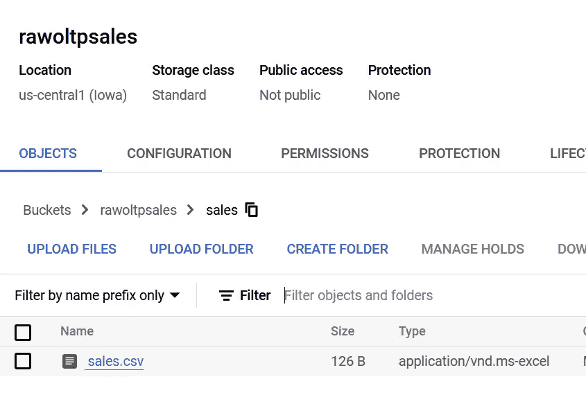

# Google Cloud data plex-第 1 部分-湖泊、区域、资产和发现

> 原文：<https://medium.com/google-cloud/google-cloud-dataplex-part-1-lakes-zones-assets-and-discovery-5f288486cb2f?source=collection_archive---------0----------------------->

# 介绍

*声明:本文中表达的所有观点都是我个人的，仅代表我个人，不代表我现在或以前的雇主。*

我打算在 Google Cloud Dataplex 上发布一系列帖子，从最基础的开始，到最终执行逐渐变得更加复杂的任务。这是本系列的第 1 部分，面向希望开始使用 Dataplex 的 L100 从业者。

根据 Gartner(此处为)的说法，数据结构是一个数据平台设计概念，其中数据发现、数据监管和数据处理是在发现的元数据上连续处理的。

当企业数据工程团队创建跨 LoB(业务线)数据应用程序/数据产品时，高级决策者的业务需求通常会超越 LoB，以从多个 LoB 中提取洞察力。

像 Google Cloud [Dataplex](https://cloud.google.com/dataplex) 这样的智能数据结构提供了发现、收集不同数据源的元数据的能力，并使用 Apache Spark 这样的流行框架运行数据监管工作。

在 discovery 之上，Dataplex 还充当现代数据平台的中央数据治理组件。在后续的文章中，我将展示 Dataplex 如何使完成诸如数据质量检查、托管数据安全策略等任务变得容易..

随着 ELT(提取-加载-转换)作为在云上运行分析工作负载的模式的出现和随后的广泛采用，像 Dataplex 这样的产品的重要性变得更加突出。如今，全球许多企业客户将从不同数据源(如 ERP、OLTP RDBMS 系统、实时流系统以及合作伙伴组织数据)中提取的大量数据集复制到云中。通常，在对原始数据应用后续转换之前，复制的数据保存在指定的原始区域中。

Google Cloud、AWS 和 Azure 等云提供商在 Data Lake raw zones 上提供这种提取数据的持久存储，其中文件保存在对象存储中。

对于云数据湖原始区，原始数据的转换主要是使用高性能分布式数据处理框架完成的，如 Apache Spark、Apache Beam 和 Apache Flink(用于流系统)。

ELT 在原始数据保存在指定的原始区域的云数据仓库中也很普遍，很好的例子是 Google BigQuery、Snowflake 等...

有强大的转换框架，如 [dbt](https://github.com/dbt-labs/dbt-core) 和 [dataform](https://dataform.co/) ，它们允许对保存在云数据仓库中的原始数据进行复杂的数据管理、数据质量和数据新鲜度检查。

对于上述数据湖和云数据仓库的情况，数据监管和后续数据转换的基本方面依赖于数据发现和元数据的收集，并根据元数据做出决策。

在这个博客系列中，将涵盖 Google Cloud Dataplex 的数据发现、数据监管和数据处理方面。第 1 部分将重点介绍如何在 Google 云存储(GCS)上获取结构化的 CSV 文件，以及随后如何以表格的形式发现元数据。

# Dataplex 数据发现

为了理解执行 Dataplex 数据发现所需的步骤，让我们首先模拟一个业务场景。“sales.csv”和“customers.csv”是 OLTP 数据被复制到 Google Cloud Data Lake 并作为对象存储在 Google Cloud Storage 中的两个模拟示例。

**步骤 1:模拟数据创建**

```
orderno,orderlineno,orderqty,unitprice,year,custid
97274,3,23,103.5,2019,32
97282,6,12,44.0,2019,55
97355,2,14,12.5,2019,68
```

将上述文件另存为“sales.csv”

```
custid,custname,email,country
32,ross brown,rossb@fmail.com,US
55,emily fay,efay@fmail.com,US
68,jane rock,jrock@fmail.com,US
```

将该文件另存为“customers.csv”。

**第二步:谷歌云存储和前缀**

选择 Google Cloud 项目，在那里进行团队实验，并启用 Google Cloud Storage API(如果尚未启用)。将上面创建的文件上传到 Google 云存储。首先，让我们创建一个名为“rawoltpsales”的存储桶。在这个桶内，我们创建一个文件夹——“销售”。类似地，创建另一个 bucket“ravoltpcustomers ”,并在这个 bucket 中创建一个文件夹“customers”。

两个铲斗都将具有以下配置:

名称:rawaltpsales/rawaltpcustomers

位置类型:地区(美国中部 1)

默认存储类别:标准

访问控制:统一

数据加密:谷歌管理的密钥

一旦创建了存储桶，就在各自的存储桶中创建两个文件夹，并将这些文件夹分别命名为:sales 和 customers


在存储桶内创建“销售”文件夹


在存储桶内创建“客户”文件夹

现在，分别将“sales.csv”上传到“ravoltpsasles/sales”文件夹，将“customers.csv”上传到“ravoltpcustomers/customers”文件夹。


将 customers.csv 上传到 GS://rawaltpcustomers/customers/folder



将 sales.csv 上传到 GS://ravoltpsales/sales/folder

**步骤 3:数据复用湖、区域和资产**

既然 OLTP 模拟数据被复制到各自的 GCS 存储桶/文件夹中，那么就可以开始使用 Dataplex 进行数据发现了。

Dataplex 将存储在 Google 云存储和 BigQuery 中的数据组织成“湖”和“区”。参考 Dataplex [文档](https://cloud.google.com/dataplex/docs/quickstart-guide)。

Dataplex lake 通常映射到一个数据网格域。不严格地说，我们可以将湖泊与吸收和处理数据的业务线联系起来。例如，我们的例子可以是市场营销，它使用销售和客户数据来构建“数据产品”。

在 Dataplex 湖中，区域在逻辑上隔离原始数据和精选数据。

在区域内，Dataplex 将结构化和非结构化数据组织为“资产”。资产映射到云存储或 BigQuery 中存储的数据。您可以将存储在单独的 Google Cloud 项目中的数据作为资产映射到湖中的一个区域。您可以附加现有的云存储桶或 BigQuery 数据集，以便从湖中进行管理。

资产遵循 Hive 风格的约定，因此，bucket 中的一个文件夹(也称为“前缀”)代表一个实体或一组具有相似模式的实体。这就是为什么在存储桶中创建了一个文件夹——一个用于销售，一个用于客户，这样，Dataplex 将这些资产作为两个独立的表来发现。每个文件夹可以存放许多 Hive 风格的分区文件，只要这些文件具有相同的模式，dataplex 就会发现这些文件并创建一个表。

**步骤 4:创建一个数据湖**

现在，我们已经定义了湖泊、区域和资产，让我们一个接一个地创建这些构造。

为了在 [Spark 查询](https://cloud.google.com/dataplex/docs/metadata#accessing_metadata_in_spark)中使用 Hive Metastore 访问 Dataplex 元数据，Dataproc Metastore 服务实例需要与 Dataplex lake 相关联。因此，应该首先创建一个支持 gRPC 的 data proc Metastore(3 . 1 . 2 或更高版本)。

在谷歌云控制台的搜索栏中，搜索“Dataproc”。

确保您在 google cloud 项目上启用了 Dataproc Metastore API。


启用 Dataproc Metastore API

创建 Dataproc Metastore 服务


创建 Dataproc Metastore 服务

分配一个服务名，选择“服务层”作为“开发者”,并选择您的 VPC 网络。为简单起见，我选择了默认网络


Dataproc Metastore 服务名

将其余部分保留为默认值，但选择 gRPC 作为端点协议:


Dataproc Metastore 端点协议

创建服务需要一段时间(我的大约需要 15 分钟)。

现在，我们可以创建 Dataplex 湖。在 Google Cloud console 中搜索“Dataplex ”,并启用 Google Cloud Dateplex API(如果尚未启用)。通常情况下，一个湖和一个域会有 1:1 的映射。一个域中的数据产品将以湖作为统一存储抽象来构建。


创建 Dataplex 湖

让我们称数据复合湖为“市场 1”


选择先前为 Dataplex lake 创建而创建的 Dataproc Metastore

在创建 lake 时，还要选择在前面的步骤中创建的 Dataproc metastore 服务。

这个湖将在几分钟内形成。创建完成后，点击“营销 1”查看详细信息。


Dataplex 湖详细信息

虽然有多个选项卡提供单独的功能，但让我们将重点放在“区域”上。在湖中，区域托管资产。资产在逻辑上等同于 BigQuery 表或文件夹中的 Google 云存储文件集。区域可以是“原始区域”或“管理区域”。这些标签定义了数据集中存在的丰富/监管级别。而原始文件，如 CSV、JSON 等..将存储在一个原始区，策划和有效压缩的文件格式，如拼花，ORC，AVRO 等将是策划区的一部分。Dataplex 不允许用户在“管理区域”中创建 CSV 文件。

因为我们的数据集只包含两个 CSV 文件，所以让我们单击“Add Zone”并创建一个区域“marketing1raw”。


创建一个 Dataplex 区域

此外，通过选择“启用元数据发现”和“启用 csv 解析选项”来启用发现设置。因为我们的数据集有一个标题，让我们在“标题行”文本框中插入“1”。将其余字段保留默认值。


Dataplex 区域发现设置

创建区域后，单击创建的区域，然后单击添加资产。


添加 Dataplex 资产


添加 Dataplex 资产(续)..

一个资产用 Dataplex 映射存储在 BigQuery 或 Google 云存储中的物理数据。在本例中，我们创建了两个资产，一个用于“rawoltpsales”，另一个用于“rawoltpcustomers”。

选择类型作为存储桶，并选择之前创建的“rawoltpsales”桶，然后单击“完成”。


为 Dataplex 资产选择存储桶/文件夹

单击继续并为发现设置选择继承，然后单击继续并提交。

类似地，按照完全相同的步骤，单击“Add Assets”并创建另一个资产“rawoltpcustomer”。创建此资产时，选择“ravoltpcustomers”GCS 存储桶。

等待两项资产的发现状态从“进行中”变为“已计划”。


Dataplex 发现作业已调度

一旦 Datapelx 发现任务被调度并完成，让我们检查左侧菜单上的“发现”链接。


代表 GCS 存储桶资产的数据复合表实体

我们可以看到“marketing1”湖有一个“marketing1raw”区域，其中发现了两个表——customers 和 sales。

为了获得更准确的搜索结果，请使用 Dataplex 特定的过滤器，例如湖和数据区名称。每个方面的前 50 个项目显示在过滤器列表中。您可以使用搜索框查找任何其他项目。

每个条目都包含详细的技术和操作元数据。

单击 sales 表描述了配置，请注意还提到了 source bucket。Dataplex 已经从前缀“GS//ravoltpsales/sales”中读取了销售表，并为前缀创建了一个表。


Dataplex 表详细信息

点击“在 BigQuery 中打开”链接，您将能够查询该表。这是可能的，因为每个 Dataplex 数据区都映射到 BigQuery 中的一个数据集或 Dataproc Metastore 中的一个数据库，其中的元数据信息是自动可用的。

请注意“marketing1raw”如何在 bigquery 中显示为数据集


Datapelx 表作为 BigQuery 数据集自动可用

事实上，Dataplex 已经推断出了可能的模式类型


Dataplex 模式推理

您可以运行下面的简单查询来从表中获取结果。


使用 BigQuery 查询作为 Dataplex 表发现的资产

有了 Dataplex，您不再需要为 BigQuery 创建外部表。此外，您还可以使用 Jupyter 笔记本中的 Spark SQL 查询这些表(将在后面的文章中用例子解释)，因为 Dataplex 提供了一个统一的元数据层。

现在，如果您返回到 Dataplex 区域“marketing1raw ”,您会看到数据项发现仪表板提到检测到两个表。


Dataplex 区域仪表板

在下一篇文章中，我将解释 security 和 IAM 如何与 Dataplex 实体一起工作，并在后续文章中解释使用定制 spark 作业、数据探索(目前在预览中)和数据质量检查的数据监管。

查看以下文档，了解更多关于 Dataplex 的信息:

发现数据:[https://cloud.google.com/dataplex/docs/discover-data](https://cloud.google.com/dataplex/docs/discover-data)

最佳实践:【https://cloud.google.com/dataplex/docs/best-practices 