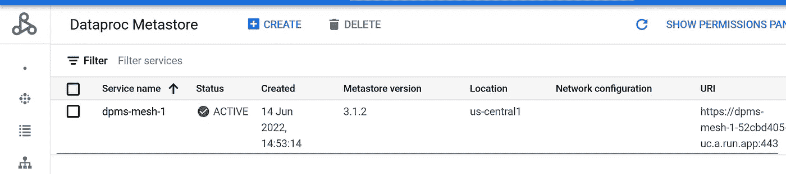
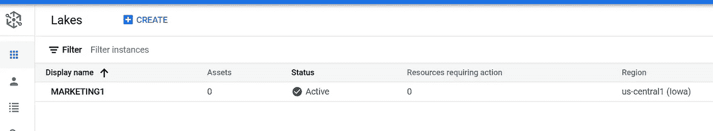
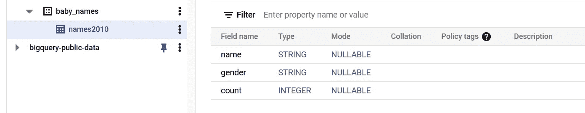
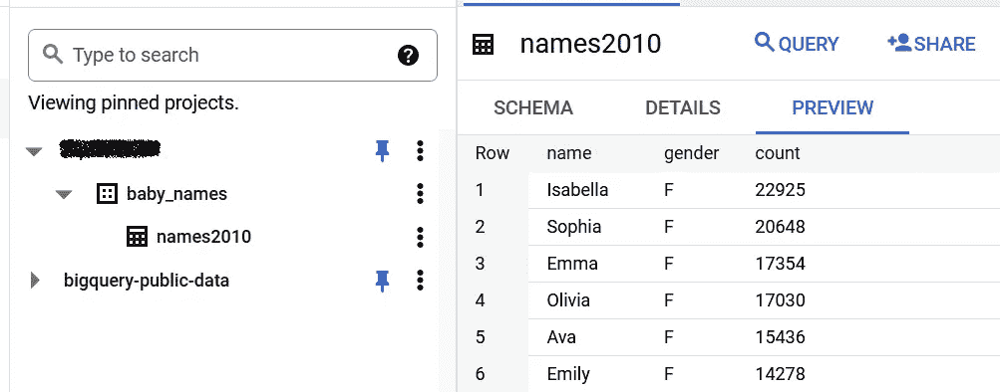
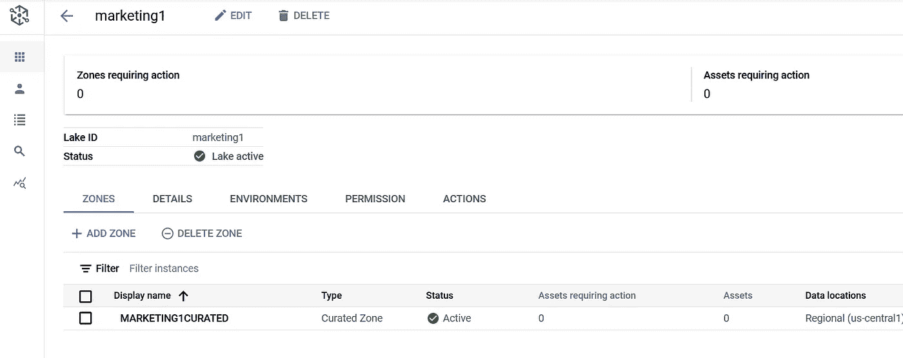
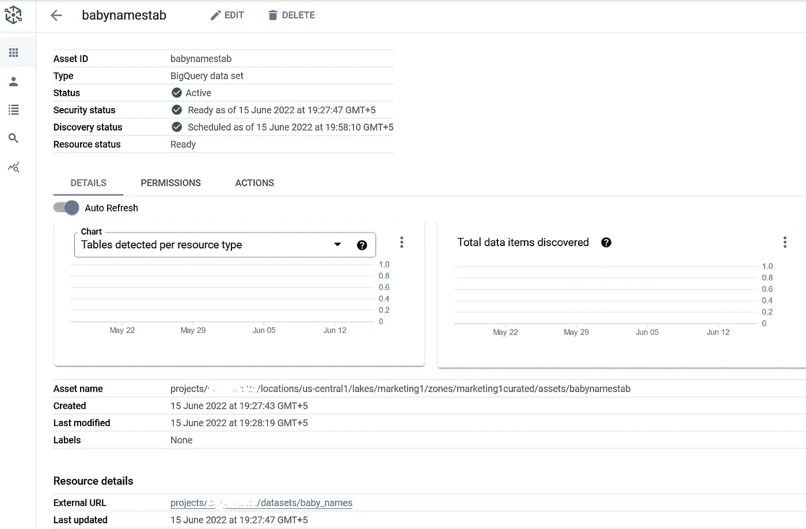
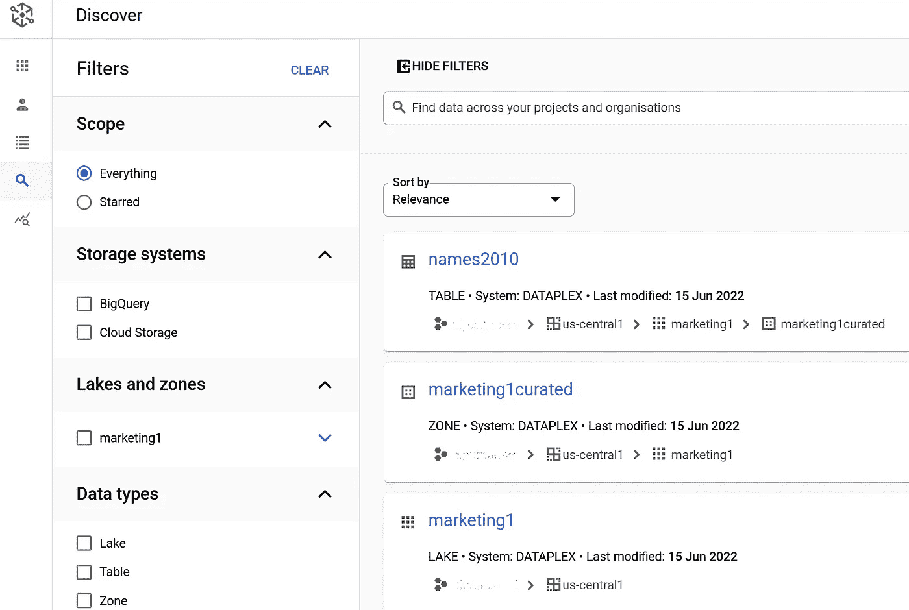

# Google Cloud data plex-第 2 部分-Dataplex gCloud CLI

> 原文：<https://medium.com/google-cloud/google-cloud-dataplex-part-2-dataplex-gcloud-cli-819d3c678518?source=collection_archive---------1----------------------->

## 介绍

*声明:本文中表达的所有观点都是我个人的，仅代表我个人，不代表我现在或以前的雇主。*

我打算在 Google Cloud Dataplex 上发布一系列帖子，从最基础的开始，到最终执行逐渐变得更加复杂的任务。这是本系列的第 2 部分，面向希望开始使用 Dataplex 的 L100 从业者。

到目前为止，这个系列看起来是这样的:

第 1 部分:[谷歌云数据复合体——第 1 部分——湖泊、区域、资产和发现](/google-cloud/google-cloud-dataplex-part-1-lakes-zones-assets-and-discovery-5f288486cb2f)

第 2 部分:Google Cloud Dataplex —第 2 部分—用于 Dataplex 的 gCloud CLI(当前帖子)

在这篇文章中，我将演示 gCloud CLI 如何与 Dataplex 一起工作。上一篇文章解释了如何使用 Google Cloud console 用 Google Cloud Storage (GCS)对象创建 Dataplex lake、zone 和 asset。这篇文章将大量讨论 gCloud CLI 命令。

## Google Cloud Shell 上的 gCloud CLI

首先，让我们使用 Google Cloud Shell 来启用所需的 Google Cloud APIs。

点击右上角的“终端”图标，即“铃声/通知”图标之前的图标，打开 Google Cloud Shell。


打开谷歌云外壳

这将在底部窗格中打开 Google Cloud Shell。

我们需要启用 Dataproc Metastore、Dataplex 和 BigQuery APIs。

键入以下命令以启用这些服务:

```
gcloud services enable metastore.googleapis.comgcloud services enable dataplex.googleapis.comgcloud services enable bigquery.googleapis.com
```

在继续之前，您可以决定在 Cloud Shell 中设置项目 id:

```
gcloud config set project <YOUR_PROJECT_ID>
```

或者，您也可以通过在命令后附加项目 Id 来运行三个 API enable 命令:

```
gcloud services enable bigquery.googleapis.com --project=<PROJ_ID>
```

## 使用 gCloud CLI 创建 Dataproc Metastore 服务

现在服务已经启用，我们需要创建一个 Google Cloud Dataproc Metastore，以便可以访问 Dataplex 元数据。在 Cloud Shell 上键入以下 gCloud 命令，创建一个启用 gRPC 的 Dataproc Metastore 服务。

如果您已经按照我的系列文章的第 1 部分创建了服务，那么您可以跳过这一步。(对我来说，完成这一步大约需要 15 分钟)。

```
gcloud beta metastore services create dpms-mesh-1 \
--location=us-central1 \
--hive-metastore-version=3.1.2 \
--endpoint-protocol=GRPC
```

一旦创建了 Dataproc Metastore 服务“dpms-mesh-1 ”,我们将在下一节创建一个 Dataplex lake。



检查是否创建了 Dataproc Metastore 服务

您还可以在 Cloud Shell 中运行以下 gCloud CLI 来检查 Dataproc metastore 服务是否创建正确:

```
gcloud metastore services describe dpms-mesh-1 \
--project <YOUR_PROJECT_ID> \
--location us-central1 \
--format “value(endpointUri)”
```

这应该会返回 metastore 服务的 API 端点。

## 使用 gCloud CLI 创建一个数据湖

希望你知道什么是数据湖，如果不知道，请阅读本系列的[第 1 部分](/google-cloud/google-cloud-dataplex-part-1-lakes-zones-assets-and-discovery-5f288486cb2f)。我们将使用下面的 gCloud CLI 创建一个 Dataplex lake。如果您已经在第 1 部分中创建了一个 Dataplex lake，可以跳过这一步。

```
gcloud dataplex lakes create marketing1 \
--project <YOUR_PROJECT_ID> \
--location=us-central1 \
--metastore-service=projects/<YOUR_PROJECT_ID>/locations/us-central1/services/dpms-mesh-1
```

一旦命令返回，您应该看到 Dataplex lake 已经创建:



使用 gCloud CLI 命令创建的 Dataplex Lake

## 使用 gCloud CLI 将数据加载到 BigQuery

到目前为止，我们已经使用 gCloud CLI 创建了 Dataplex lake。现在，我们将使用 gCloud CLI 创建一个 Google BigQuery 数据集，并将一些测试数据加载到 Dataplex 的数据集中，以发现 BigQuery 表的模式。

让我们首先在云 shell 上使用以下 gCloud CLI 命令在我们的项目中创建一个 BigQuery 数据集:

```
bq mk -d --location=us-central1 --project_id=<PROJ_ID> baby_names
```


创建 BigQuery 数据集

一旦创建了 BigQuery 数据集，我们将从以下 URL 下载美国社会安全局的数据集:

```
https://www.ssa.gov/OACT/babynames/names.zip
```

让我们使用 curl 命令从 Cloud Shell 下载 zip 文件:

```
curl -O [https://www.ssa.gov/OACT/babynames/names.zip](https://www.ssa.gov/OACT/babynames/names.zip)
```

如果您提取“names.zip”文件，它将产生许多 babynames 文件，每一个文件都是一年，从 1880 年到 2021 年。

让我们将文件“yob2010.txt”加载到 baby_names 数据集中的 BigQuery 表中。首先，让我们用正确的模式创建一个表:

```
bq mk --schema=name:string,gender:string,count:integer --table <PROJ_ID>:baby_names.names2010
```

这将使用提供的模式在 BigQuery 中创建一个空表“names2010 ”:



使用 gCloud CLI 创建的 BigQuery 表

成功创建该表后，我们可以在该表中加载“yob2010.txt ”,在云 Shell 中运行以下 gCloud CLI 命令:

```
bq load --project_id=<PROJ_ID> <PROJ_ID>:baby_names.names2010 yob2010.txt
```

这将创建一个 bq 作业，该文件将加载到我们创建的表中:



使用 gCloud CLI 将记录插入 BigQuery 表

因此，通过以上所有步骤，我们已经使用 gCloud CLI 命令成功创建了一个 BigQuery 数据集，创建了一个具有自定义模式的表，并在表中加载了一个平面文件。在下一节中，我们将创建 Dataplex 区域和资产，以使用 Dataplex 和 gCloud CLI 命令发现和获取元数据。

## 使用 gCloud CLI 创建 Dataplex 资产

我们已经创建了 data plex Lake“marketing 1”。

让我们首先创建 Dataplex 区域。让我们将它创建为一个管理区域，考虑数据集已经被清理和清理，并被加载到 BigQuery 中。

```
gcloud dataplex zones create marketing1curated \
--lake=marketing1 \
--location=us-central1 \
--project=<PROJ_ID> \
--resource-location-type=SINGLE_REGION \
--type=CURATED
```

值得回过头来检查一下在本教程的第 1 部分中创建一个原始 Dataplex 区域所遵循的步骤，这里是。

创建区域后，使用控制台确认它是在 lake“marketing 1”中创建的:



使用 gCloud CLI 创建的 Dataplex 区域

一旦成功创建了区域，我们就将 BigQuery 数据集作为资产添加到区域中。我们将在刚刚创建的区域中选择资源类型作为 BigQuery 数据集:

```
gcloud dataplex assets create babynamestab \
--location=us-central1 \
--lake=marketing1 \
--zone=marketing1curated \
--resource-type=BIGQUERY_DATASET \
--resource-name=projects/<PROJ_ID>/datasets/baby_names \
--discovery-enabled \
--project=<PROJ_ID>
```

查看资产“资源类型”和“资源名称”是如何添加的。“启用发现”选项运行发现作业。我们还可以使用“discovery-schedule”选项，该选项采用一个 CRON 表达式来按照预设的计划运行发现作业。

这类似于我们在本系列第 1 部分中使用控制台所遵循的步骤。这将创建 Dataplex 资产“babynamestab ”,如下所示:



使用 gCloud CLI 创建的 Dataplex 资产

一旦资产被创建，我们可以点击‘Discover’左侧菜单，并看到 BigQuery 表被 Dataplex 发现:



Dataplex 发现 BigQuery 表

注意 data plex Lake(marketing 1)> data plex 管理的区域(marketing1curated) > Dataplex 发现的表(names2010)的层次结构

总之，在 Dataplex 系列的第 2 部分中，gCloud CLI 命令已经针对 Dataplex 进行了测试，用于创建湖泊、区域和资产。我们还使用 BigQuery 获得了一个新的数据源，因为在第 1 部分中，我们将 Google 云存储作为原始 Dataplex 区域中的数据源。

在第 3 部分中，我们将深入探讨 Dataplex 安全性，并理解 Dataplex 发现的保护表的细微差别。

## 有用的链接:

[https://cloud.google.com/sdk/gcloud/reference/dataplex](https://cloud.google.com/dataplex/docs/create-lake#gcloud)

[](https://cloud.google.com/sdk/docs/install) [## 安装 gcloud CLI | Google Cloud

### 本页包含选择和维护 Google Cloud CLI 安装的说明。谷歌云客户端…

cloud.google.com](https://cloud.google.com/sdk/docs/install) [](https://cloud.google.com/bigquery/docs/quickstarts/load-data-bq) [## 快速入门:使用 bq 工具| Google Cloud 将数据加载到 BigQuery 中

### 这个快速入门向您展示了如何使用 bq 命令行工具来运行查询并将数据加载到 BigQuery 中。在你之前…

cloud.google.com](https://cloud.google.com/bigquery/docs/quickstarts/load-data-bq)