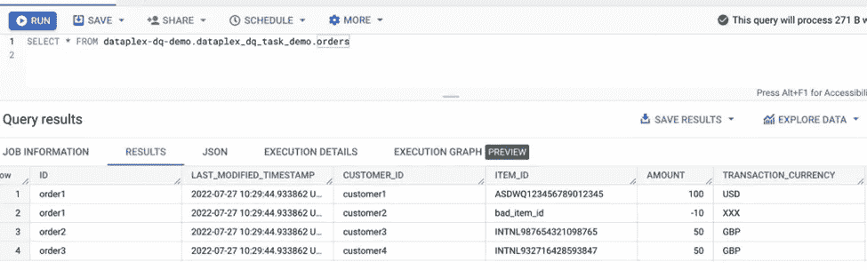
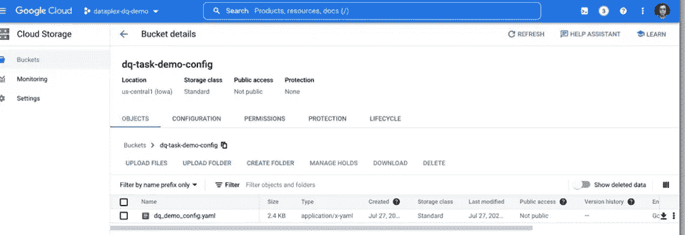

# 谷歌云数据复合体-第 3 部分-使用云 DQ 的数据质量

> 原文：<https://medium.com/google-cloud/google-cloud-dataplex-part-3-data-quality-using-cloud-dq-b9b1ca5b80b0?source=collection_archive---------0----------------------->

# 介绍

*声明:本文中表达的所有观点都是我个人的，仅代表我个人，不代表我现在或以前的雇主。*

我打算在 Google Cloud Dataplex 上发布一系列帖子，从最基础的开始，到最终执行逐渐变得更加复杂的任务。这是本系列的第 3 部分，描述了如何使用 Dataplex 数据质量任务为现代数据平台构建一个复杂的、可管理的数据质量组件。

到目前为止，这个系列看起来是这样的:

第 1 部分:[谷歌云数据复合体——第 1 部分——湖泊、区域、资产和发现](/google-cloud/google-cloud-dataplex-part-1-lakes-zones-assets-and-discovery-5f288486cb2f)

第 2 部分: [Google Cloud Dataplex —第 2 部分—用于 Dataplex 的 g Cloud CLI](/google-cloud/google-cloud-dataplex-part-2-dataplex-gcloud-cli-819d3c678518)

第 3 部分:Google Cloud Data plex-第 3 部分-使用云 DQ 的数据质量(当前帖子)

构建企业数据平台几乎总是需要强大的数据治理实践来确保数据的可信性。数据质量或 DQ 仍然是数据平台上数据治理实践的最重要支柱之一。

数据质量定义了表明其有用性的数据内容的属性。

受管 DQ 产品为最终用户提供了一系列特性和功能，用于测量、监控和改善数据平台的 DQ。

数据质量在概念上可以分为多个阶段，这些阶段代表了数据质量操作通常是如何流动的。

这些阶段呈现了事件的概念性流程，有助于对各种 DQ 能力进行分类。它们不一定反映 DQ 功能的实施顺序。通常，所有 4 个阶段的要素都需要到位，以提供可操作的 DQ 功能。

*   **定义**包括围绕建立 DQ 基准/规则的众多功能，分为手动和自动 DQ 规则定义、DQ 规则部署和 DQ 规则治理。
*   **测量**包括根据预定义的 DQ 基准/规则测量数据的流程。对于用户来说，这些流程需要高效、可扩展且易于管理(最好是透明的)。此阶段还包括定义如何在数据环境中部署 DQ 度量。
*   **观察**包括捕捉 DQ 测量输出，并使其对用户可用。此阶段还包括识别 DQ 输出中可能构成问题的负面模式，并标记它们以供后续故障排除。
*   **故障排除**包括解决之前发现的数据问题，包括捕获、交流、区分优先级、上报和补救。


数据质量生命周期

# 谷歌云数据质量

Google cloud 上的数据质量不是一项孤立的功能，而是与数据空间中的许多其他流程和功能相互关联的。数据质量既依赖于它们，也支持它们。

Google cloud Dataplex 支持在使用 Google 产品和工具构建的数据平台上进行数据治理。请阅读[第 1 部分](/google-cloud/google-cloud-dataplex-part-1-lakes-zones-assets-and-discovery-5f288486cb2f)和[第 2 部分](/google-cloud/google-cloud-dataplex-part-2-dataplex-gcloud-cli-819d3c678518)以了解 Dataplex 的核心功能，data plex 是一种智能数据结构，它提供元数据主导的数据管理和内置的数据质量和治理，因此数据从业人员可以减少与基础架构边界和低效问题的斗争，信任静态数据，并花更多时间从这些数据中获取价值。

数据质量是 Dataplex 支持的数据治理的关键部分。

Dataplex 通过一个内置的数据质量任务来支持数据质量，该任务可用于定义规则并在任何 BigQuery 或 Google Cloud Storage (GCS)表上执行。

Dataplex 中的数据质量任务在 BigQuery 和 GCS 中为跨数据团队和资产的分布式部署提供了高效的、可伸缩的和完全托管的 DQ 验证。

对于数据质量验证，数据质量任务使用 Google 专业服务组织开发的 CloudDQ 开源引擎(此处[为](https://github.com/GoogleCloudPlatform/cloud-data-quality))。这些任务可以在由 Dataplex 管理的无服务器基础设施上按计划或以特定方式运行。

Dataplex DQ 任务的关键属性如下所示:

1.  CI/CD 的声明性规则配置和支持
2.  在 BQ 和 GCS 内部进行验证，无需提取数据，受益于 BQ 的可扩展性并最大限度地降低安全风险
3.  为编程消费(持久 BQ 存储和云日志记录接收器)设计的端点，支持与 UI 的定制集成(如 BI 和元数据管理工具)
4.  由 Dataplex 编排的托管执行

了解了 Dataplex DQ 任务的关键特性后，让我们构建一个动手演示来说明 Dataplex DQ 在实践中是如何工作的。在这个演示中，我们将构建一个 Dataplex 数据质量任务，并安排它在一个 BigQuery 表上运行，我们将在任务被安排并成功运行后解释任务的结果。

**步骤 1:创建一个新的谷歌云项目**

创建一个新的谷歌云项目' dataplex-dq-demo '


一个新的谷歌云项目

**步骤 2:创建新的 BigQuery 数据集**

在 BigQuery 中为我们将要创建的示例表创建一个新的数据集和一个表。

让我们把数据集称为 dataplex_dq_task_demo


新的 BigQuery 数据集

让我们使用下面的脚本创建一个名为 orders 的表:

```
CREATE OR REPLACE TABLE dataplex-dq-demo.dataplex_dq_task_demo.orders(ID STRING NOT NULL,LAST_MODIFIED_TIMESTAMP TIMESTAMP,CUSTOMER_ID STRING,ITEM_ID STRING,AMOUNT NUMERIC,TRANSACTION_CURRENCY STRING);
```


创建新的 BigQuery 订单表

**第三步:插入一些样本记录**

一旦成功地创建了表，让我们插入一些样本记录，数据质量任务将在这些记录上运行。

```
INSERT INTO dataplex-dq-demo.dataplex_dq_task_demo.orders(ID,LAST_MODIFIED_TIMESTAMP,CUSTOMER_ID,ITEM_ID,AMOUNT,TRANSACTION_CURRENCY)VALUES("order1", CURRENT_TIMESTAMP(), "customer1", "ASDWQ123456789012345", 100, "USD"),("order1", CURRENT_TIMESTAMP(), "customer2", "bad_item_id", -10, "XXX"),("order2", CURRENT_TIMESTAMP(), "customer3", "INTNL987654321098765", 50, "GBP"),("order3", CURRENT_TIMESTAMP(), "customer4", "INTNL932716428593847", 50, "GBP")
```


插入样本记录



检查样本记录

**步骤 4:将 BigQuery 数据集作为 Dataplex 资产**

现在，我们将 BigQuery 数据集映射为 Dataplex 中的资产。为此，首先，我们创建一个名为 dq-demo-lake 的数据湖。要了解更多关于如何创建 Dataplex 湖、区域和资产的信息，请阅读本系列的前两篇博客，[第一部分](/google-cloud/google-cloud-dataplex-part-1-lakes-zones-assets-and-discovery-5f288486cb2f)和[第二部分](/google-cloud/google-cloud-dataplex-part-2-dataplex-gcloud-cli-819d3c678518)。


创建一个新的数据湖


数据湖

我们还在 Dataplex lake 中创建了一个名为“transactions”的区域，并将其创建为原始区域。


创建一个 Dataplex 原始区域

让我们将之前创建的 BigQuery 数据集作为资产添加到‘transactions’data plex 区域中。


作为 Dataplex 资产添加的 BigQuery 数据集


Dataplex 资产已创建

我们还在同一个项目中创建了另一个数据集，称为“data plex _ dq _ task _ summary _ dataset ”,它将保存数据质量任务运行的结果。


DQ 任务摘要 BigQuery 数据集

作为最后一步，我们还创建了一个名为“dq-task-demo-config”的 Google 云存储桶，用于编写规则的配置文件将存储在这里。


DQ 的 Google 云存储配置文件

至此，运行 Dataplex 数据质量任务的先决条件已经完成。

**步骤 4 : DQ 规则配置**

我们现在用数据质量检查的规则来定义配置文件。

在这一节中，让我们分解规则文件的每个部分，并理解它到底做什么。

第一部分提供数据资产的元数据，在本例中是发现 BigQuery 数据集的 Dataplex 表。

```
metadata_registry_defaults: dataplex: projects: dataplex-dq-demo locations: us-central1 lakes: dq-demo-lake zones: TRANSACTIONS
```

元数据注册表默认值为每个方案定义了默认的 entity_uri 值。

对于我们的例子，由于我们使用 Dataplex 实体，我们将使用 entity_uri 来发现将应用数据质量规则的表。Dataplex 数据质量任务也可以应用于没有使用 Dataplex 发现的 BigQuery 表。在这种情况下，除了下面的四个部分，还需要创建一个“实体”部分来描述 BigQuery 表的模式和列细节。

一般来说，除了 metadata_registry_defaults，一个配置文件中有 4 个部分。

行过滤器

```
row_filters: INTERNATIONAL_ITEMS: filter_sql_expr: |- REGEXP_CONTAINS(item_id, 'INTNL')
```

行过滤器为从相应实体提取的数据定义过滤条件，以生成用于验证的数据子集。

规则维度

```
rule_dimensions: - consistency - correctness - duplication - completeness - conformance - integrity
```

规则维定义了数据质量规则可以在相应的维字段中定义的数据质量规则维的允许列表。

规则

```
rules: VALUE_ZERO_OR_POSITIVE: rule_type: CUSTOM_SQL_EXPR dimension: correctness params: custom_sql_expr: |- $column >= 0
```

规则定义了数据质量验证的可重用逻辑。

规则绑定

```
rule_bindings:TRANSACTION_AMOUNT_VALID: entity_uri: dataplex://projects/dataplex-dq-demo/locations/us-  central1/lakes/dq-demo-lake/zones/transactions/entities/orders column_id: amount row_filter_id: NONE incremental_time_filter_column_id: last_modified_timestamp rule_ids: - VALUE_ZERO_OR_POSITIVE
```

规则绑定定义了一个数据质量验证例程。entity_id / entity_url、column_id、filter_id 和 rule_id 中声明的每个值都是更详细配置的查找关键字，这些配置必须在各自的配置文件中定义。

既然我们已经理解了编写规则的配置文件的结构，下面是我们将用于在示例 BigQuery 表上应用规则的示例文件。

## dq_demo_config.yaml

```
metadata_registry_defaults:
 dataplex:
   projects: dataplex-dq-demo
   locations: us-central1 
   lakes: dq-demo-lake
   zones: TRANSACTIONSrow_filters:
 NONE:
   filter_sql_expr: |-
      True
 INTERNATIONAL_ITEMS:
   filter_sql_expr: |-
      REGEXP_CONTAINS(item_id, 'INTNL')rule_dimensions:
  - consistency
  - correctness
  - duplication
  - completeness
  - conformance
  - integrityrules:
 NO_DUPLICATES_IN_COLUMN_GROUPS:
   rule_type: CUSTOM_SQL_STATEMENT
   dimension: duplication
   params:
     custom_sql_arguments:
       - column_names
     custom_sql_statement: |-
       select a.*
       from data a
       inner join (
         select
           $column_names
         from data
         group by $column_names
         having count(*) > 1
       ) duplicates
       using ($column_names)VALUE_ZERO_OR_POSITIVE:
   rule_type: CUSTOM_SQL_EXPR
   dimension: correctness
   params:
     custom_sql_expr: |-
       $column >= 0VALID_ITEM_ID:
   rule_type: REGEX
   dimension: conformance
   params:
     pattern: |-
       [A-Z]{5}[0-9]{15}VALID_CURRENCY_ID:
   rule_type: CUSTOM_SQL_EXPR
   dimension: integrity
   params:
     custom_sql_expr: |-
      $column in ('GBP', 'JPY')rule_bindings:
 TRANSACTIONS_UNIQUE:
   entity_uri: dataplex://projects/dataplex-dq-demo/locations/us-central1/lakes/dq-demo-lake/zones/transactions/entities/orders
   column_id: id
   row_filter_id: NONE
   incremental_time_filter_column_id: last_modified_timestamp
   rule_ids:
     - NO_DUPLICATES_IN_COLUMN_GROUPS:
         column_names: "id"TRANSACTION_AMOUNT_VALID:
   entity_uri: dataplex://projects/dataplex-dq-demo/locations/us-central1/lakes/dq-demo-lake/zones/transactions/entities/orders
   column_id: amount
   row_filter_id: NONE
   incremental_time_filter_column_id: last_modified_timestamp
   rule_ids:
     - VALUE_ZERO_OR_POSITIVETRANSACTION_VALID_ITEM_ID:
   entity_uri: dataplex://projects/dataplex-dq-demo/locations/us-central1/lakes/dq-demo-lake/zones/transactions/entities/orders
   column_id: item_id
   row_filter_id: NONE
   incremental_time_filter_column_id: last_modified_timestamp
   rule_ids:
     - VALID_ITEM_IDTRANSACTION_CURRENCY_VALID:
   entity_uri: dataplex://projects/dataplex-dq-demo/locations/us-central1/lakes/dq-demo-lake/zones/transactions/entities/orders
   column_id: transaction_currency
   row_filter_id: INTERNATIONAL_ITEMS
   incremental_time_filter_column_id: last_modified_timestamp
   rule_ids:
     - VALID_CURRENCY_ID
```

**第六步:上传 DQ 规则配置文件到谷歌云存储**

我们需要上传之前已经创建好的云存储桶中的 dq_demo_config.yaml 规则配置文件‘dq-task-demo-config’。



GCS 的 DQ 规则配置文件

**步骤 7:创建一个 Dataplex 数据质量任务**

上传配置文件后，我们现在可以从 Google Cloud 控制台创建一个 Dataplex 数据质量任务。同样的任务也可以用 gCloud CLI 创建。点击左侧导航菜单中的 Dataplex ->管理湖泊->流程。然后点击数据质量->创建任务。


创建 Dataplex 数据质量任务


检查数据质量

然后单击检查数据质量打开创建任务屏幕。在创建任务屏幕中，需要填写以下字段


创建任务

除了任务名称之外，还需要选择规则配置文件，该文件是在指定的云存储桶中上传的。

对于结果表，让我们选择前面创建的 BigQuery 数据集来存储结果摘要。因为在该数据集中没有创建表，所以让我们添加一个表名，该表将由任务创建。


选择 BigQuery 结果表

对于此任务，我们安排它立即运行。


立即计划任务

该任务也可以计划为每天、每月、每周运行，如下所示:


每天或每月计划

或者，它也可以使用 UNIX cron 表达式按自定义计划运行:


任务 CRON 计划

任务成功运行后，数据质量控制台会显示“成功”消息


任务成功

**第八步:BigQuery 汇总表上的任务汇总**

现在，任务运行已经成功，BigQuery 汇总表将保存运行的汇总统计信息。


BQ 汇总表

如果我们深入到表 dq_summary，下面是任务运行细节如何插入到表中:


任务运行详细信息

每个规则和 rule_binding_id 与成功计数、成功百分比、失败计数、失败百分比等一起收集..


规则成功失败计数

**步骤 9:使用 Google Data Studio 的数据质量仪表板**

一旦使用任务运行汇总统计信息填充了 BigQuery 汇总表，就可以使用 Google Data Studio 在这些数据的基础上构建一个仪表板，可以通过单击表上的 Export -> Explore with Data Studio 链接来激活该仪表板。


使用 Google Data Studio 探索

下面是一个使用 Google Data Studio 创建的数据质量仪表板示例


样本数据质量仪表板

在本例中，显示了四个图表:

*   每个 rule_binding_id 和 dq_run_id 的成功验证数据百分比
*   每个表标识、列标识、规则绑定标识和规则标识的最高验证失败次数
*   每个规则绑定标识和 dq 运行标识的验证失败计数
*   每个 dq_run_id 的验证成功、失败和空值的计数

类似地，还可以基于度量和维度来创建不同的数据质量仪表板，并且可以基于成功计数和失败计数以及在指定的数据范围上运行平均值来计算总体质量分数。

总而言之，Dataplex 数据质量任务可以用来构建描述实时数据质量度量的复杂的数据质量仪表板。数据质量任务与 Google 云数据集成产品进行了本机集成，并使用无服务器 Spark 作业以托管方式运行 dq 任务。

作为一个开源项目，cloud-data-quality 接收社区反馈以添加功能，并且仍然是在基于 Google Cloud 的现代数据平台中建立数据质量组件的一种简单和声明性的方式。

阅读更多信息:

1.  [谷歌云平台云数据质量](https://github.com/GoogleCloudPlatform/cloud-data-quality)
2.  [谷歌云 Dataplex 数据质量任务](https://cloud.google.com/dataplex/docs/check-data-quality)