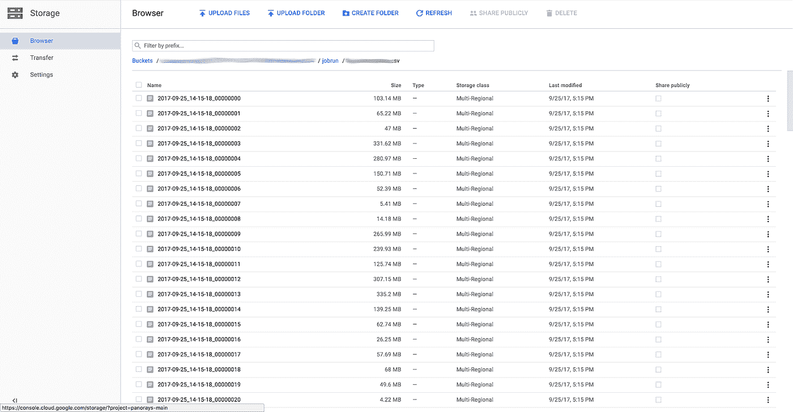

# Google Cloud Dataprep -数据处理变得更简单

> 原文：<https://medium.com/google-cloud/google-cloud-dataprep-data-handling-made-easier-79d7c35fbbe7?source=collection_archive---------0----------------------->

当我们在 [**Panorays**](https://panorays.com/) 上看到有一个选项可以在 [**Google 云平台**](https://cloud.google.com/) 上试用 [**Cloud Dataprep**](https://cloud.google.com/dataprep/) 作为测试版时，我们立即注册，发现非常有用和省时，可以说这让我们的数据科学家，令人敬畏的 [**Tal Peretz**](/@talperetz24) 非常非常高兴！

云数据准备

让我们从我们试图解决的问题开始(总有一个“问题”:)，

我们有很多(大约 700 GB)文件需要解析、过滤和一些转换(原始 CSV、SQL 和常规文本文件，其中一些是压缩格式的“tar.gz”)。
如您所知，数据科学家 80%的日常工作是数据准备、数据过滤和数据丰富，因此我们的目标当然是在这一阶段尽可能节省时间。

# **TL；博士:**

使用 Dataprep，我们已经能够节省大量的时间和精力(可能还有计算资源)。(不，没有人付钱让我写这个帖子……)

**好处:**

1.  易于使用和升级。
2.  不需要在任何虚拟机上运行“代码”(几乎没有服务器)。
3.  方便的图形用户界面，让您可以看到整个过程和统计数据和元数据。
4.  以非常高效的方式运行。

**我们仍然不能用 Dataprep 做什么:**

1.  在开箱即用的压缩文件上运行流。
2.  在拯救 GCP 项目中的不同用户之间共享流量。
3.  将数据存储在另一个数据存储中，用于数据管道的其余部分——但在我看来，这也不是使用 Dataprep 的用例。

**现在到实际过程:**

我们把它们放在[谷歌云存储](https://cloud.google.com/storage/)上用于存储目的(你知道，它是完全复制的，非常便宜，为什么不呢)，正因为如此，它非常适合我们使用 Dataprep 从云存储中读取输入的方式。

**主要目标:**

1.  检查所有文件，其他类型的文件有不同的逻辑。
2.  提取相关特征，最后将它们合并到包含所有行的最终输出“文件”中，然后继续处理数据管道。
3.  将它移动到另一个索引数据存储，以便以后能够以单个数据点的分辨率查询数据。
4.  能够运行分析，并利用输出数据创建一些机器学习模型。

**那么，我们是如何通过 Dataprep** 做到这一点的(当然有一些截图):

*   我们已经创建了一个流程来处理所有的原始数据，在这个流程中，我们为每种类型的文件格式创建了一个“配方”,其中包含了数据的上下文。
    所有这些都将通过特定的特征被合并到同一个输出“文件”中，我们通过这些特征进行连接。

*   在这里，您可以看到特定作业的“作业”执行和数据分布，然后再对从其中一个数据源获取的样本数据进行运行。(看起来挺酷的吧？)

*   作业结果以一种非常方便的方式导出报告。
    还可以看到所有匹配和不匹配的行的计数，运行大约需要 30 分钟，输出结果大约为 12GB(当然是在过滤之后)。我们还可以看到输出数据分布的一些概述，这真的很酷

*   我们可以看到，这基本上是在[云数据流](https://cloud.google.com/dataflow/)的后台运行的，作业本身可以显示为数据流作业，其所有 DAG 都已分解。

1.  毕竟它必须被保存在某个地方，对吗？
    所以如果不去谷歌云存储的话。您可以看到输出以分片分布式的方式保存在 Dataprep 环境的已定义沙箱桶中。

# 所以总结一下，

我们在大约一天的工作中成功地转换和过滤了大量的原始数据。
如果我们尝试通过“ [Apache Spark](https://spark.apache.org/) ”(我个人迄今为止最喜欢的)来做这件事，即使是在像 [Cloud Dataproc](https://cloud.google.com/dataproc/) 这样的托管环境中，编写代码和运行所有转换也要花费我们长得多的时间。
运行时间非常好，我们不需要自己维护或安排任何资源。

我们在测试版中仍然有一些障碍，例如，我们不能在同一个 GCP 项目的不同用户之间共享作业，这非常不方便。

此外，我们无法在 Dataprep 中提取带转换的压缩文件，所以我们事先手动完成了提取阶段，并将提取的文件重新上传到云存储。

但总的来说，它看起来是一个很好的数据准备工具，有着非常好的用户界面，我相信在 GA 版本中会有更多的功能。

**我要感谢** [**塔尔·佩雷茨**](https://www.linkedin.com/in/tal-per/) **的伟大作品伟大的作品！(很多“快速见效”都是因为他)。**

希望 **Cloud Dataprep** 团队提供更多出色的功能，让数据工程师和数据科学家的生活变得更加轻松。

