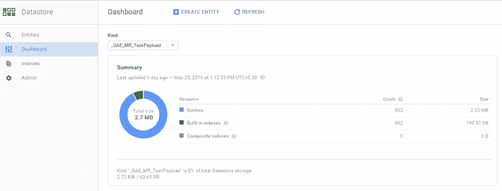
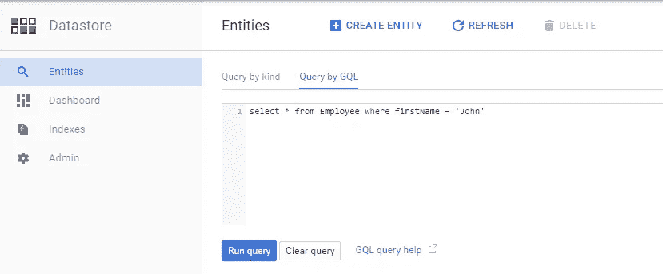

# 谷歌云数据存储:NoSQL 数据库

> 原文：<https://medium.com/google-cloud/google-cloud-datastore-nosql-database-fa16a0b3556c?source=collection_archive---------0----------------------->

> Google Cloud Datastore 是谷歌云平台提供的 NoSQL 数据库之一。数据存储高度可扩展且速度超快。与其他 NoSQL 数据库相比，Datastore 有许多很酷的东西，我们将逐一介绍。

1.  **Aromatic sharing&复制**您的数据，因此无需担心扩展问题，这是一款完全托管的产品。
2.  **超快且随时可用**，无需等待预热实例之类的事情。
3.  **多种数据类型**，包括整数、浮点数、字符串、日期、二进制数据等。
4.  类似 SQL 的查询支持，您可以在多个列上设置过滤器，并从数据库中检索所需的结果集
5.  **RESTful API** ，你可以把你的应用放在任何地方，并且可以远程访问云数据存储。如果您的应用程序在 Google App Engine 上，那么您可以使用原生 API 进行数据存储，它的速度快如闪电，而 RESTful 与原生 API 相比速度较慢，因为它必须经过授权，并且可能会面临延迟问题。
6.  **全功能 UI 控制台**，可让您访问仪表板、查询控制台、索引信息和管理区域。
7.  **支持父子(祖先)查询**，支持事务和索引
8.  **强一致性**，这是我在其他 NoSQL 云数据库中没有看到的特性之一。通过强一致性查询，它保证了最新的数据
9.  **语言** : JAVA，NODE。JS，PYTHON，GO，PHP
10.  **经济高效的**，高度耐用的低价数据库

# 数据存储云控制台

云控制台数据存储

# 查询控制台

数据存储查询控制台

# **定价**

*   1 GB 可用空间
*   50k 每日读/写操作

# 对极客来说

*我是 java 极客，所以我想给你更多的细节*

*   POJO 是用来存储数据的，POJO 基本上就成了你的表。
*   如果 POJO 中有 Object，那么它的所有字段在 datastore 中都被标记为 column，所以以后可以基于这个对象运行查询。例如**雇员** POJO 将**地址**作为字段(地址),如果您将雇员对象保存在数据存储中，它将为地址创建类似于[address.firstName，address.lastName]的列。
*   您可以在数据存储中运行类似 SQL 的查询，即通过查询排序结果、限制结果和删除记录。
*   1 行最多可以容纳 1MB 的数据。
*   数据存储中的每个表都有一个名为 **ID** 的列，它是可以自动生成的主键。
*   在数据存储中，一个表不需要固定的列数，例如，Employee 表的第一行可以有 6 列，第二行有 15 列。
*   在 NoSQL 建议使用冗余数据。
*   当您的数据是关系型数据时，不要使用 Datastore，否则您会变得非常复杂。
*   两个表之间不支持联接。
*   对您的数据存储库使用 Objectify 来执行操作，这将节省更多时间。

我希望这篇指南能让你对谷歌的云数据存储有一个初步的了解。免费注册 [*谷歌云平台*](https://cloud.google.com/) *，在那里创建一个项目并探索更多。如果您有任何问题，请评论并提问。*

> [官方网站](https://cloud.google.com/datastore/)
> 
> [开发者快速入门指南](https://cloud.google.com/datastore/docs/quickstart)
> 
> [对象化库参考(Java)](https://github.com/objectify/objectify) 带有完整的示例