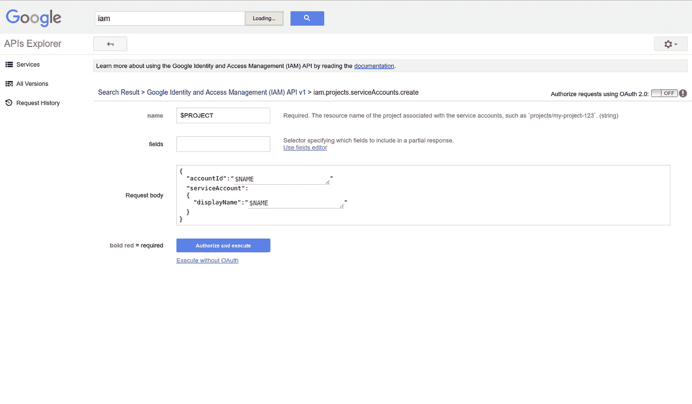
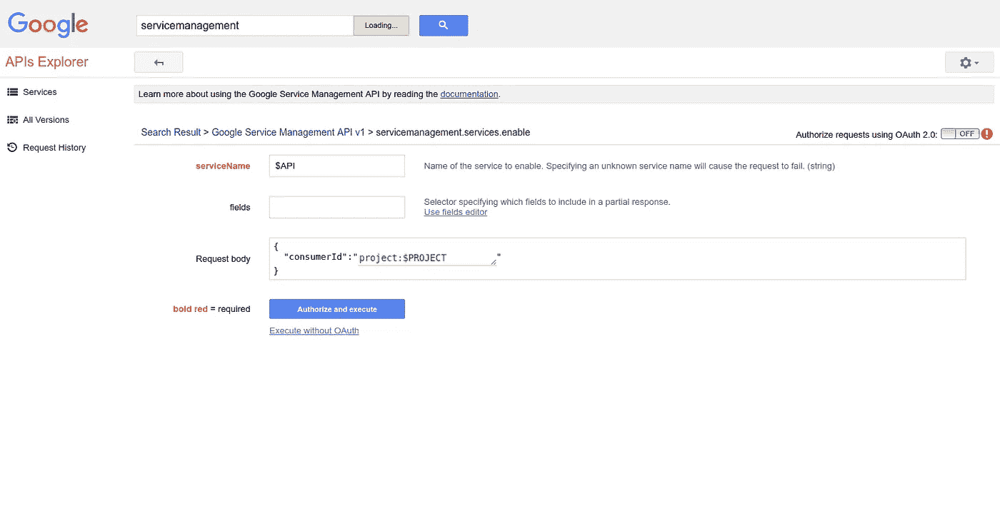

# 谷歌云部署管理器

> 原文：<https://medium.com/google-cloud/google-cloud-deployment-manager-865931dd6880?source=collection_archive---------0----------------------->

## “缺失教程”系列

决定重温一篇早先的帖子[以群集模式将 Docker 引擎部署到 GCP](/@DazWilkin/deploy-docker-engine-in-swarm-mode-to-google-cloud-platform-8b88a5a43be8) 以尝试利用谷歌的运行时配置。我希望通过让多个 workers 从运行时配置变量中获取 swarm join-token 来协调它们的生成。

这使我有机会扩展我的部署管理器知识，因为我需要使用服务管理服务来启用 API，IAM 为 docker 节点虚拟机生成服务帐户(具有增强的范围)，云资源管理器修改项目的策略，当然，还有运行时配置来创建和管理令牌。

这篇文章将是我在遇到问题和解决问题时学到的一系列写作经验。

## 巨蟒不是姬娜

部署管理器服务支持 Python 脚本和 JINJA 模板，并且支持两者的混合和匹配。我不鼓励你使用 JINJA 模板。很可能您需要接受 Python 提供的功能超集，最好将所有东西都放在 Python 中。

## 支持的资源类型

部署管理器(DM)脚本定义了 GCP 资源的预期状态。当您需要对不熟悉的资源使用 DM 时，可以从支持的资源类型页面开始:

```
[https://cloud.google.com/deployment-manager/docs/configuration/supported-resource-types](https://cloud.google.com/deployment-manager/docs/configuration/supported-resource-types)
```

或者，您可以从命令行枚举该列表:

```
gcloud deployment-manager types list
```

服务、服务端点和它们的资源(类型)之间存在 1:1 的映射关系，但这种映射并不总是显而易见的。它也不是双射的:不是所有的服务资源类型都映射到部署管理器资源类型；服务资源类型是一个超集。因此，您不能使用部署管理器来管理 GCP 的所有资源。

计算(引擎)v1 [服务](https://pantheon.corp.google.com/apis/library/compute.googleapis.com)全面且一致地映射到部署管理器类型:

```
gcloud deployment-manager types list \
--filter="name ~ ^compute\.v1\."NAME
compute.v1.regionInstanceGroupManager
compute.v1.firewall
compute.v1.router
compute.v1.regionBackendService
compute.v1.instanceGroupManager
compute.v1.sslCertificate
compute.v1.disk
compute.v1.image
compute.v1.targetInstance
compute.v1.healthCheck
compute.v1.subnetwork
compute.v1.autoscaler
compute.v1.targetSslProxy
compute.v1.route
compute.v1.httpHealthCheck
compute.v1.vpnTunnel
compute.v1.instanceGroup
compute.v1.urlMap
compute.v1.regionAutoscaler
compute.v1.httpsHealthCheck
compute.v1.forwardingRule
compute.v1.regionInstanceGroup
compute.v1.targetPool
compute.v1.targetHttpProxy
compute.v1.address
compute.v1.globalAddress
compute.v1.targetHttpsProxy
compute.v1.globalForwardingRule
compute.v1.instanceTemplate
compute.v1.backendService
compute.v1.network
compute.v1.targetVpnGateway
compute.v1.instance
```

部署管理器 v2 [服务](https://console.cloud.google.com/apis/api/deploymentmanager.googleapis.com/overview)有一个资源类型[清单](https://cloud.google.com/deployment-manager/docs/reference/latest/#Manifests)，但这不能作为受支持的部署管理器资源类型进行访问:

```
gcloud deployment-manager types list --filter="name ~ ^deploymentmanager\.v2\."No types were found for your project!
```

部署管理器 v2 端点是:

```
[https://www.googleapis.com/deploymentmanager/v2/projects](https://www.googleapis.com/deploymentmanager/v2/projects)
```

然而，IAM [服务](https://console.cloud.google.com/apis/api/iam.googleapis.com/overview)端点是:

```
https://iam.googleapis.com
```

并且该服务用项目或组织前缀定义它的一些资源类型，例如 projects.serviceAccounts 和 projects.serviceAccounts.keys:

```
[https://cloud.google.com/iam/reference/rest/#collection-v1projectsserviceaccounts](https://cloud.google.com/iam/reference/rest/#collection-v1projectsserviceaccounts)
[https://cloud.google.com/iam/reference/rest/v1/projects.serviceAccounts.keys](https://cloud.google.com/iam/reference/rest/v1/projects.serviceAccounts.keys)
```

但是这些映射到没有“项目”前缀的部署管理器资源类型:

```
gcloud deployment-manager types list --filter="name ~ ^iam\.v1\."iam.v1.serviceAccounts.key
iam.v1.serviceAccount
```

## 创建服务帐户

部署管理器 GitHub 示例[包括](https://github.com/GoogleCloudPlatform/deploymentmanager-samples/blob/master/examples/v2/project_creation/service-accounts.py)服务帐户(类型)的表示，但这在其他地方没有记录，我将使用它作为遇到新资源类型的示例。在这种情况下，我们可以创建一个没有附带密钥的服务帐户，因为计算引擎虚拟机将使用该服务帐户。

使用 Cloud SDK 命令行，等效的命令将是:

```
PROJECT=[[YOUR-PROJECT-ID]]
INSTANCE=[[YOUR-INSTANCE]]
NAME=[[YOUR-SERVICE_ACCOUNT_NAME]]SERVICE_ACCOUNT=${NAME}@${PROJECT}.iam.gserviceaccount.comgcloud iam service-accounts create $NAME --project=$PROJECTgcloud compute instances set-service-account $INSTANCE \
--[service-account=${SERVICE_ACCOUNT](mailto:service-account=dazwilkin-170925-sa@dazwilkin-170828-medium.iam.gserviceaccount.com)} \
--scopes=...
--project=$PROJECT \
--zone=$ZONE
```

[项目的文档。]serviceAccounts](https://cloud.google.com/iam/reference/rest/v1/projects.serviceAccounts) 总结了与该资源相关的(一些)属性。这些属性表示实例化的资源:

```
{
  "name": string,
  "projectId": string,
  "uniqueId": string,
  "email": string,
  "displayName": string,
  "etag": string,
  "oauth2ClientId": string,
}
```

但是，要创建服务帐户，必须提供 accoundId 和 displayName。我怎么知道这个？创建方法记录了这一点:

```
[https://cloud.google.com/iam/reference/rest/v1/projects.serviceAccounts/create](https://cloud.google.com/iam/reference/rest/v1/projects.serviceAccounts/create)
```

值得信赖的 API Explorer 证明了这一点:

```
[https://developers.google.com/apis-explorer/#search/iam/iam/v1/iam.projects.serviceAccounts.create](https://developers.google.com/apis-explorer/#search/iam/iam/v1/iam.projects.serviceAccounts.create)
```



iam . projects . service accounts . create

部署管理器(似乎)使用一组简单的属性，因此 API 方法的层次结构没有保留:

```
{
  accountId,
  serviceAccount: {
    displayName
  }
}
```

变成了:

```
{
  'name': $NAME,
  'type': 'iam.v1.serviceAccount',
  'metadata': {
    'dependsOn': [
      'cloudresourcemanager',
      'iam'
    ]
  },
  'properties':{
    'accountId': $NAME,
    'displayName': $NAME
  }
}
```

## 支持服务

默认情况下，在项目中不启用 IAM 服务。如果您尝试如上所述创建一个服务帐户，DM 很可能会遇到一个错误:

```
'{"ResourceType":"iam.v1.serviceAccount","ResourceErrorCode":"403","ResourceErrorMessage":{"code":403,"message":"Google Identity and Access Management (IAM) API has not been used in project ... before or it is disabled. Enable it by visiting [https://console.developers.google.com/apis/api/iam.googleapis.com/overview?project=.](https://console.developers.google.com/apis/api/iam.googleapis.com/overview?project=dazwilkin-170925-deleteme-01).. then retry. If you enabled this API recently, wait a few minutes for the action to propagate to our systems and retry.","status":"PERMISSION_DENIED","details":...
```

我们需要使用服务管理服务来启用 IAM API，然后我们需要从部署管理器 serviceAccount 类型添加一个依赖项，这是我们之前创建的，以依赖于正在启用的 IAM。

您不会找到服务管理[服务](https://console.cloud.google.com/apis/api/servicemanagement.googleapis.com/overview)的部署管理器类型:

```
gcloud deployment-manager types list \
--filter="name ~ ^servicemanagement"No types were found for your project!
```

GitHub 示例再次提供了[解决方案](https://github.com/GoogleCloudPlatform/deploymentmanager-samples/blob/master/examples/v2/project_creation/apis.py)。我在搜索创建服务帐户的方法时无意中发现了这一点。虽然这并不明显，但这种方法有一个独特的结果:

```
{
  'name': ...,
  'type': 'deploymentmanager.v2.virtual.enableService',
  'metadata': {
    'dependsOn': ...
  },
  'properties': {
    'consumerId': 'project:' + project_id,
    'serviceName': ...
  }
}
```

这个代码有效！我不知道它为什么会起作用，但它确实起作用了。我不理解对 deploymentmanager.v2.virtual.X 的引用，但我能够理解其属性。同样，API Explorer 有助于:

```
[https://developers.google.com/apis-explorer/#search/servicemanagement/servicemanagement/v1/servicemanagement.services.enable](https://developers.google.com/apis-explorer/#search/servicemanagement/servicemanagement/v1/servicemanagement.services.enable)
```



服务管理.服务.启用

展平 API 方法的必需属性(serviceName，consumerId)会产生 Google 示例中提供的代码。注意，我还使用 context.env 从运行时环境中获取“项目”(== GCP 项目 Id)，因为这是消费 ID 的值所必需的。我将代码转换成一个函数，在本例中，我调用该函数并传递$API == "iam "来启用 iam.googleapis.com

```
{
    'name': $API,
    'type': 'deploymentmanager.v2.virtual.enableService',
    'properties': {
      'consumerId': 'project:' + context.env['project'],
      'serviceName': $API + '.googleapis.com'
    }
```

这相当于以下 Cloud SDK 命令:

```
gcloud service-management enable iam[.googleapis.com] \
--project=$PROJECT
```

## 变异(IAM)策略

好吧，“改变政策”，“更新政策”，但“变异”只是听起来更有趣！我正在 GitHub 网站上等待一些示例代码来展示如何执行这一操作。这项服务的运作方式很复杂。

通常，改变 IAM 策略的方法是:

*   获取当前策略
*   变异它
*   将修改后的策略放回服务中

策略文档不仅包括例如项目的当前策略绑定列表，还包括用作并发机制的 etag。这实际上是政策的混乱。如果当您将策略放回服务时，服务的存储策略的散列与您放入服务的文档中的 etag 不同，则服务知道该策略已被修订，并且您的更改未被应用并将被拒绝。

这是一个在部署管理器中表示的具有挑战性的机制，GitHub 示例包括一个将服务帐户合并到策略中的[助手函数](https://github.com/GoogleCloudPlatform/deploymentmanager-samples/blob/master/examples/v2/project_creation/project.py)。我从部署经理团队那里了解到，一个替代的解决方案应该很快就会出现。

Cloud SDK 包括一个方便的方法 add-iam-policy，它在后台执行工作:

```
gcloud projects add-iam-policy-binding $PROJECT \
--member=serviceAccount:${SERVICE_ACCOUNT} \
--role=roles/editor
```

部署管理器团队告诉我，这一功能即将推出，并以一种叫做“动作”的新功能的形式出现。当功能发布时，我会更新这些内容。

## 运行时配置(urator)

部署管理器包括一个名为[运行时配置(urator)](https://cloud.google.com/deployment-manager/runtime-configurator/) 的特性。它提供了与部署管理器特别相关的功能，但事实上，它是一个独立的服务。我[描述了](/@DazWilkin/cloud-functions-global-scope-7450a5f08038)一种结合使用运行时配置和全局作用域的方法，这是一种将配置数据传递给云函数的方法。

运行时配置为部署 Docker swarm 提供了一个关键的改进。当一个群被初始化时，第一个(Docker 引擎)节点生成一个管理者令牌和一个工作者令牌，当加入集群时，其他节点必须提供这两个令牌来证明它们自己。

第一个(源)节点:

```
sudo docker swarm initSwarm initialized: current node (73gqde43chycmq9s7f93klmmf) is now a manager.

To add a worker to this swarm, run the following command:

    docker swarm join --token SWMTKN-1-243cu5kol7pfie85svs8cnvsmbypm2gp8mhe29b12izyj5cr92-e2r75b6yxdx8mk3rrwjf4kfzi 10.138.0.2:2377

To add a manager to this swarm, run 'docker swarm join-token manager' and follow the instructions.
```

从这个 genesis 节点获取令牌最简单的方法是重新查询它，并为一个环境变量赋值，作为我们如何继续的提示:

```
WORKER_TOKEN=$(sudo docker swarm join-token worker --quiet)
MANAGER_TOKEN=$(sudo docker swarm join-token manager --quiet)
```

这些命令仅返回令牌。

使用这些令牌，从其他(Docker 引擎)节点(在其他虚拟机上)，我们可以:

```
sudo docker swarm join --token ${WORKER_TOKEN} swarm-master:2377sudo docker swarm join --token ${MANAGER_TOKEN} swarm-master:2377
```

因此，两个突出的问题是，我们如何:

*   使令牌对其他节点可用？
*   其他群节点对令牌可用性的阻塞创建？

这就是运行时配置为我们提供的。运行时配置的范围是单个项目，并允许通过 namspaces 进一步确定范围。让我们首先为 Docker swarm 模式令牌创建一个名为“swarm”的名称空间:

```
gcloud beta runtime-config configs create swarm
```

然后，我们可以在这个“群体”名称空间内任意创建变量。我选择创建一个名为“worker”的变量和一个名为“manager”的变量，但将它们放在“token”下的层次结构中。“令牌”前缀是多余的，但是..

```
gcloud beta runtime-config configs \
variables set /token/worker ${WORKER_TOKEN} \
--config-name swarm \
--is-textgcloud beta runtime-config configs \
variables set /token/manager ${MANAGER_TOKEN} \
--config-name swarm \
--is-text
```

我使用“— is-text”标志。这些标记是明文(字母数字),这样就不必在检索时对值进行 base64 解码。

运行时配置提供了监视和等待变量的机制，但我并不清楚这两者是否提供了这里需要的功能。相反——有点不高兴——我决定“破解”一个解决方案(请给我评论改进)。

部署管理器脚本在创建任何虚拟机(显然包括源节点)之前，使用 DUMMY 设置创建令牌/管理器和令牌/工作器变量。虚拟机都知道，如果变量 if $DUMMY 的值为空，则源节点尚未就绪，它们会阻塞并在一分钟后重试。

***【优势】***

*   简单的

**缺点 **

*   不太优雅
*   潜在无限阻塞
*   需要共享$DUMMY 值的知识

```
def GenerateRuntimeConfigConfig(context, name):
  """Generate a Runtime-Config Config 'name'"""
  return {
    'name': 'config-name-' + name,
    'type': 'runtimeconfig.v1beta1.config',
    'metadata': {
      'dependsOn': [
        'runtimeconfig',
      ],
    },
    'properties': {
      'config': name,
    }
  }def GenerateRuntimeConfigVariable(context, name, variable, default):
  """Generate Runtime-Config 'variable' with 'default' text value"""
  project_id = context.env['project']
  config_name = 'config-name-' + name
  return {
    'name': 'variable-' + variable,
    'type': 'runtimeconfig.v1beta1.variable',
    'metadata': {
      'dependsOn': [
        config_name,
      ]
    },
    'properties': {
      'parent': '$(ref.'+ config_name +'.name)',
      'variable': variable,
      'text': default,
    },
  }
```

**NB** 必须启用运行时配置服务，这是创建配置时在 dependsOn 中检查的内容。

然后，在第一个(genesis)节点的启动脚本中，在 swarm init 之后，请求 worker 和 manager 令牌并用于替换$DUMMY 值:

```
sudo docker swarm initWORKER_TOKEN=$(sudo docker swarm join-token worker --quiet)
MANAGER_TOKEN=$(sudo docker swarm join-token manager --quiet)gcloud beta runtime-config configs variables set \
  /token/worker ${WORKER_TOKEN} \
  --config-name=swarm \
  --is-textgcloud beta runtime-config configs variables set \
  /token/manager ${MANAGER_TOKEN} \
  --config-name=swarm \
  --is-text
```

以便工作线程的启动脚本可以从令牌的运行时配置变量中提取值。它可能是$DUMMY，但如果不是，它将是正确的工作令牌值:

```
WORKER_TOKEN=$(gcloud beta runtime-config configs variables get-value /token/worker --config-name=swarm)while [ "${WORKER_TOKEN}" == "DUMMY" ]
do
  sleep 60s
donesudo docker swarm join --token ${WORKER_TOKEN} swarm-master:2377
```

显然，经理的启动脚本会翻转变量:

```
MANAGER_TOKEN=$(gcloud beta runtime-config configs variables get-value /token/manager --config-name=swarm)while [ "${MANAGER_TOKEN}" == "DUMMY" ]
do
  sleep 60s
done
sudo docker swarm join --token ${MANAGER_TOKEN} swarm-master:2377
```

让我们来测试一下:

```
gcloud deployment-manager deployments create docker-swarm \
--config=docker_swarm.yaml \
--project=$PROJECTThe fingerprint of the deployment is ...
Waiting for update [operation-...]...done.
Update operation operation-... completed successfully.cloudresourcemanager    deploymentmanager.v2...          COMPLETED
$PROJECT                cloudresourcemanager.v1.project  COMPLETED
iam                     deploymentmanager.v2...          COMPLETED
runtimeconfig           deploymentmanager.v2...          COMPLETED
swarm                   runtimeconfig.v1beta1.config     COMPLETED
swarm-manager-mig       compute.v1.instanceGroupManager  COMPLETED
swarm-manager-template  compute.v1.instanceTemplate      COMPLETED
swarm-master            compute.v1.instance              COMPLETED
swarm-robot             iam.v1.serviceAccount            COMPLETED
swarm-worker-mig        compute.v1.instanceGroupManagers COMPLETED
swarm-worker-template   compute.v1.instanceTemplate      COMPLETED
variable-manager        runtimeconfig.v1beta1.variable   COMPLETED
variable-worker         runtimeconfig.v1beta1.variable   COMPLETED
```

然后，进入 swarm-master:

```
sudo docker node lsID                            HOSTNAME            STATUS              AVAILABILITY        MANAGER STATUS
jt7vcsgb2jnst0z33aolmzs0t *   swarm-master        Ready       Active
s3su15bvothaswr17l6fugbml     swarm-master-0pj9   Ready       Active
jsi7dsfbp9zjcreihrzhr5g7q     swarm-master-lb6q   Ready       Active
ftsrgxyfqeiu1l9o5b9nhs45q     swarm-master-tjpm   Ready       Active
w5mq06h0gvirfldd0ezm1s1j7     swarm-worker-4p1p   Ready       Active
b9279nr43pjhog2d4pl9crjt4     swarm-worker-r1mx   Ready       Active
krik9fnw8p4w0jrca3qcicw46     swarm-worker-znmt   Ready       Active
```

我对输出进行了修改，使它在这里看起来更像:虫群主人被标注为“首领”，三个主人都被标记为“可到达”

## 结论

部署管理器很强大，但是对于像我这样的新手来说，更全面的文档会更有帮助。该服务设计良好，但并不总是直观的(一致的)。