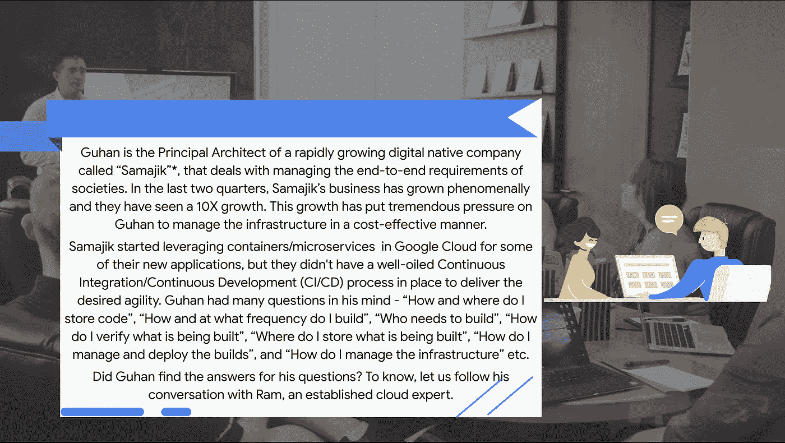
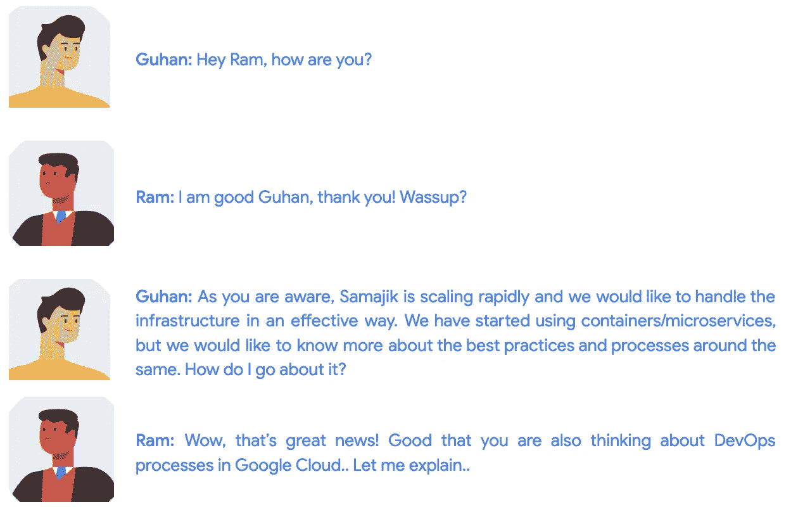
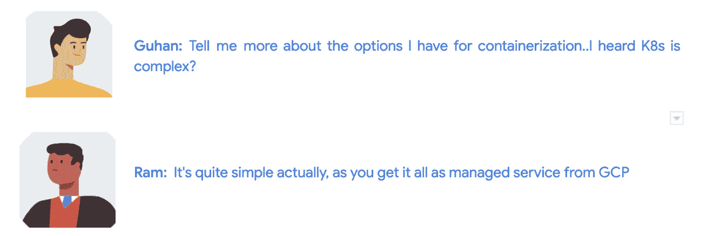
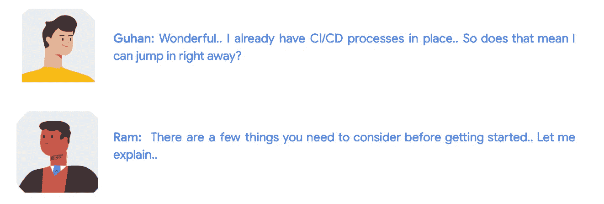
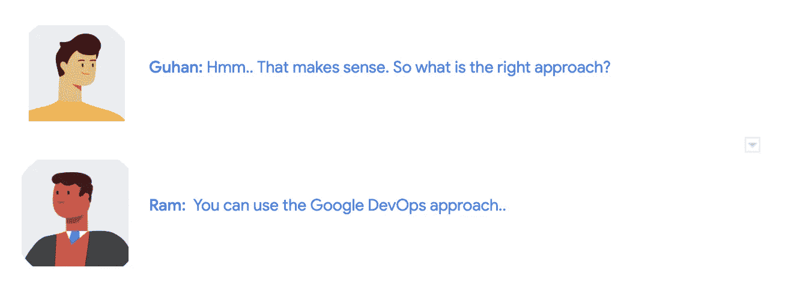
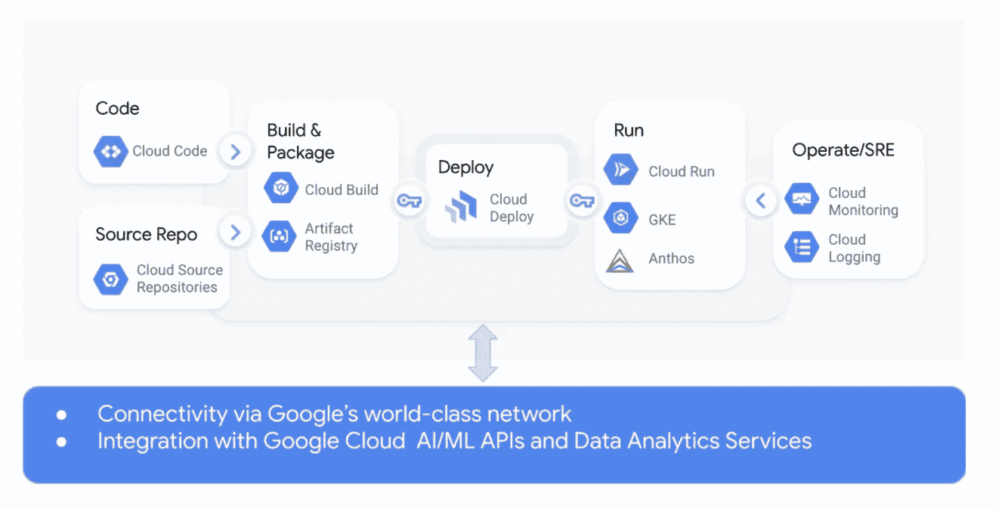
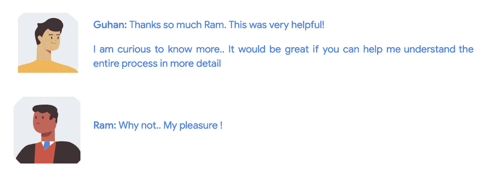

# Google Cloud DevOps 系列:Google Cloud 中的 DevOps 介绍

> 原文：<https://medium.com/google-cloud/google-cloud-devops-part-1-introduction-to-google-native-devops-process-bfb55be9e3f3?source=collection_archive---------0----------------------->

## Google Cloud DevOps 系列:第 1 部分

*故事情节中提到的公司名称和人物角色是虚构的

Google 眼中的 DevOps 是什么？

随着每个组织都成为软件公司，敏捷软件开发实践和 DevOps 实践正在成为当今的主流。作为数字化转型之旅的一部分，组织正在采用 DevOps 实践，其主要目标是增强开发团队和运营团队之间的协作，以实现频繁、快速和可靠的软件发布。提高投资回报率(RoI)是这一过程的自然副产品。

由于每个组织都有不同的文化、流程、技术能力、技术采用和技术债务，谷歌云通过谷歌云应用程序现代化计划(*)提供了全面的解决方案，以满足客户的需求，并使他们的应用程序开发和部署流程更好。CAMP 计划利用了 Google 几十年的软件开发经验和 DevOps 研究与评估(DORA)项目的研究成果。Google Cloud 建立在 CAMP 和 DORA 的基础上，为容器化工作负载的端到端应用程序开发提供了自以为是的解决方案。*

*我们将详细了解以下所有开发运维阶段:*

***Part-1**:Google Cloud 中的 DevOps 介绍(本博客)*

***第二部分**:[Kubernetes 的谷歌云计算选项](/google-cloud/google-cloud-devops-series-4013adab603b)*

***第三部分**:[Google devo PS-持续开发工作流程](/@pushkarbk/part-3-google-devops-continuous-development-workflow-3ef446edfeb7)*

***第四部分**:[Google devo PS-持续集成/持续部署工作流程](/@anchitn_19522/part-4-google-devops-continuous-development-workflow-3feb1ea2227e)*

***第五部分** : [谷歌 devo PS——符合 SRE 原则的可观测性](/google-cloud/part-5-google-devops-observability-with-sre-principles-33446da05c16)*

***第六部分**:[Google devo PS-成本优化的敏捷性](/@tusharguptag/google-devops-agility-with-cost-optimization-930ad77ccc63)*

**

*Kubernetes 是容器的实际平台*

*谷歌是 Kubernetes 的发源地。它建立在运行 Google 的容器化生产工作负载的 15 年以上的经验以及大型开源社区的宝贵贡献之上。Kubernetes 是谷歌内部集群管理系统 Borg 的副产品。谷歌在 2014 年决定开源 Kubernetes 项目，目前该项目由 CNCF 基金会托管。*

*Kubernetes 是当今领先的容器编排和管理开源平台。它提供了容器化应用程序的自动化部署、操作、扩展和管理。随着容器在数字本地人和企业业务中的广泛采用，Kubernetes 已经成为部署和操作容器化应用程序的事实上的标准。在当今快节奏的云计算世界中，敏捷性是成功的关键。Kubernetes 提供了一个自动化的容器编排，可以缩短关键业务应用程序的上市时间(TTM ),使您能够以更快的迭代速度向客户交付价值。它增强了系统的可靠性，降低了运营开销，有助于组织获得更好的投资回报。*

*谷歌 Kubernetes 引擎(GKE)在谷歌云平台上提供托管的 Kubernetes 集群。只需点击几下鼠标，即可在几分钟内部署 GKE。*

*GKE 提供了一个高度可用、可扩展、安全且完全托管的平台来运行生产级工作负载。(我们将在本博客系列的第二部分详细探索 GKE)*

**

*如何为 Kubernetes 建立 CI/CD 系统？*

*Kubernetes 在 2014 年发布后，围绕容器的整个 CI/CD 生态系统也开始演变。与任何新技术一样，Kubernetes was 流程的这一演变也并非没有挑战。一方面，组织开始利用未针对容器化工作负载进行优化的现有工具和部署方法；另一方面，人们也开始尝试和集成各种开源工具，如用于 CI/CD 的 Argo CD、用于容器注册的 Harbour、用于包管理的 Helm 等。Kubernetes 本地 CI/CD 系统主要由以下构件组成:*

*   *版本控制系统(如 Git)*
*   *CI 工具(如 Jenkins)*
*   *集装箱登记处(如码头工人登记处)*
*   *CD 工具(如 Spinnaker)*
*   *用于容器的计算平台(例如自我管理或管理的 Kubernetes 平台)*

*尽管这些解决方案服务于 CI/CD 的目的，但是开发运维团队在构建和维护集成方面花费了大量的精力。在 Google Cloud，我们通过提供完整的端到端 CI/CD 平台来解决这一挑战，将容器放在中心位置。*

**

***使用 Google DevOps 的端到端应用程序现代化平台***

*Google Cloud 为整个 DevOps 流程提供端到端的固执己见的解决方案。谷歌网站可靠性工程(SRE)团队管理谷歌 DevOps 平台服务，它本质上也是完全无服务器的。根据 Forrester Wave，2020 年报告([参考](https://www.forrester.com/report/The-Forrester-Wave-Multicloud-Container-Development-Platforms-Q3-2020/RES157266))，Google Cloud 被定位为“多云容器开发平台”类别的领导者，这并不奇怪。*

***谷歌 DevOps 平台——构建模块***

*Google DevOps 平台由以下构建模块组成，这些模块描述了每个阶段的关键活动/工具——编码、源代码回购、构建和打包、部署、运行、操作/SRE。下面显示了它们如何相互集成的高级概述:*

**

*让我们来详细探索每一个构件*

***代号***

*云代码是一组集成开发环境(IDE)插件，可以与现有的 IDE 结合使用，为了简化云原生开发流程，开发人员可以直接从 IDE(如 [VS Code](https://cloud.google.com/code) 和 [IntelliJ](https://cloud.google.com/code) )编写、部署和调试容器化的应用程序，到完全托管的计算产品上，如 GKE 和云运行(无服务器)。*

***来源回购***

*Google Source Repository 是整个团队存储、管理和跟踪代码库的单一位置。这项服务的一些显著特点是:*

*   *Google Source Repository 符合 Git 标准*
*   *它可以配置为自动与 GitHub 或 Bitbucket 上的托管存储库同步*
*   *提供一个内置视图来关注特定的分支、标记或提交*

***构建***

*Cloud Build 提供了一个完全托管的无服务器平台，可以跨所有编程语言快速构建软件，包括 Golang、Java、Python、Node.js 和其他编程语言。*

***包装***

*Artifact Registry 是一个通用的包管理器，它使客户能够集中存储工件并构建依赖关系。与云构建和 GKE 等其他云服务的无缝集成，提供了集成的谷歌云体验。*

***运行***

*Google Cloud 提供了多种选项来运行您的容器化应用程序工作负载，包括:*

*   *GKE:谷歌云提供 GKE 服务，这是运行 Kubernetes 的托管服务*
*   *云运行:它提供了一个完全托管的无服务器平台来运行容器化的无状态应用程序工作负载*

***操作/SRE***

*谷歌云的操作套件将谷歌最好的 SRE 工具和实践扩展到客户。云监控、云日志记录和高级可观察性工具(跟踪、调试器和分析器)是 Google Cloud 操作套件的一部分，具有以下开箱即用的功能*

*   *从应用程序和云服务中捕获指标、日志和跟踪等信号*
*   *为可视化和分析提供仪表板和故障排除工具*
*   *通过警报、错误和服务级别目标(SLO)管理事件*

**

***即将到来..***

*在这篇博客中，我们听取了拉姆就谷歌云 DevOps 的主要结构以及谷歌云如何帮助他通过 DevOps 和容器化工作负载开始现代化之旅向古汉提出的建议。让我们继续关注拉姆·古汉分享的关于工具和托管服务的更多细节，这些工具和托管服务可以帮助他为现代工作负载构建自己的 DevOps 流程。*

*供稿人:[施吉莫尔·阿克](https://medium.com/u/41b475b881ff?source=post_page-----bfb55be9e3f3--------------------------------)、[丹杜斯](https://medium.com/u/71d9487165c6?source=post_page-----bfb55be9e3f3--------------------------------)、[安其特·尼尚](https://medium.com/u/2d47f7f3f8e2?source=post_page-----bfb55be9e3f3--------------------------------)、[杰瓦纳·黑德](https://medium.com/u/ad9524f7f7fa?source=post_page-----bfb55be9e3f3--------------------------------)*

*更新:你可以在这里阅读 Part-2 [。](/google-cloud/google-cloud-devops-series-4013adab603b)*