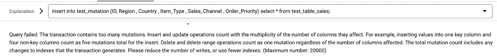

# 谷歌云:GCP 云扳手中的 DML 操作限制(突变)

> 原文：<https://medium.com/google-cloud/google-cloud-dml-operation-limits-in-gcp-cloud-spanner-mutations-95fce3db442?source=collection_archive---------5----------------------->

# Cloud Spanner 是一种全面管理的任务关键型关系数据库服务，可在全球范围内提供事务一致性、自动同步复制以实现高可用性。

作为在 GCP 上开发和构建 Cloud Spanner 应用程序之前必须了解的一部分，理解 Spanner 中 DML 操作的局限性是一个先决条件，这样我们就不会在开发的后期阶段遇到问题。

检查下述限制的要点是 DML 操作中允许的 20K 突变数。现在，在插入、更新和删除操作的情况下，这些突变被不同地计数。下面举例说明不同类型的突变计数。

# 在云扳手中插入、更新和删除数据的限制:

*   *提交大小(包括索引和更改流):100 MB*
*   *每个会话的并发读取数:100*
*   *每次提交的突变数(包括索引):* ***20，000***
*   *每个数据库的并发分区 DML 语句:20，000 条*

# **插入 DML 示例:**

*   **插入突变是每列 1 个。如果一行中有 10 列，那么每插入一行就会有 10 个突变。每次操作允许的总突变数为 20000。**

在下面的例子中，有 6 列，所以每行的总突变数是 6。

表中允许的插入总数是 20000/6=3333 行。

以下是 DML 操作的一些测试截图:

尝试插入百万条记录，查询失败，因为突变超过(1 百万* 6 = 6 百万):

尝试插入 3334 条记录，查询失败，因为突变超过(3334 * 6= 20004):

尝试插入 3333 条记录，查询成功，因为突变少于 20K (3333 * 6= 19，998):

# **更新 DML 示例:**

*   **更新突变是更新的列数+一行中的索引数。例如，如果在具有 2 个索引的行中有一个列更新，则每行有 3 个突变。**

尝试更新 1M 行，查询失败，因为突变数为 100 万(超过 20K):

尝试更新 10001 行中的 1 列，查询失败，因为突变数为(10001*2=200002)。这里，每行的总突变数为 2(我们添加了一列，更新了一列)。

尝试更新 10000 行中的 1 列，查询成功，因为每行 2 个突变乘以 10K 正好得到 20K:

# **删除 DML 示例:**

*   **删除突变是每行删除 1 个，与索引无关。**

删除 200001 行:

以下查询失败，因为我们尝试对 200001 行(200001 个突变)执行单一操作。

下面的查询成功了，因为我们尝试在一次操作中准确删除 20K 行(20K 个突变)。

**重要提示:处理这些限制的一种方法是调度查询以批量执行 20K 突变的操作。我们还必须记住，包括索引和更改流在内的提交大小小于 100 MB。**