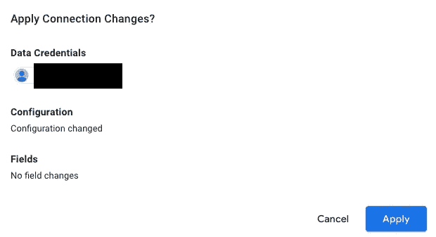

# Google Cloud —将账单数据导出到 BigQuery

> 原文：<https://medium.com/google-cloud/google-cloud-export-billing-data-to-bigquery-ce004fb87ce3?source=collection_archive---------1----------------------->

> FinOps 是一种不断发展的云财务管理规则和文化实践，通过帮助工程、财务、技术和业务团队协作制定数据驱动的支出决策，使组织能够获得最大的商业价值。— [*FinOps 基金会*](https://www.finops.org/introduction/what-is-finops/) *技术顾问委员会*

换句话说，FinOps 是一种实践，在这种实践中，用户获得他们的云消费的所有权，相应地管理他们的成本，并考虑他们的云支出如何影响商业价值。这涉及教育、可见性和共享最佳实践的结合。对于谷歌云的客户来说，FinOps 策略的一部分是将计费数据导出到 BigQuery 中，使整个组织的成本可见。

谷歌云计费报告帮助您监控、优化和分析您的谷歌云成本。您可以使用它从 Google 控制台查看您的成本历史、成本趋势和预测成本。但是，为了进行更细致的分析，可以使用“[将您的账单数据导出到 BigQuery](https://cloud.google.com/billing/docs/how-to/export-data-bigquery) ”。将您的账单数据导出到 BigQuery 允许您使用 BigQuery 的查询功能对您的账单数据进行分割，并提供最可定制的分析形式。您可以使用高级查询微调您的分析，然后使用 [Data Studio](https://cloud.google.com/billing/docs/how-to/visualize-data) 或 [Looker](https://marketplace.looker.com/marketplace/detail/datatonic-gcp-billing-v2) 可视化您的结果。Google Cloud 的[建议](https://cloud.google.com/billing/docs/how-to/export-data-bigquery)是在创建计费账户时设置计费导出。

好处:

*   默认计费报表仪表板之外的成本分析。
*   创建自定义查询和仪表板。
*   将数据导出到可视化工具或 csv 文件。
*   FinOps 战略的一部分。

# 设置计费导出

1.  启用 BigQuery 数据传输服务 API


BigQuery 数据传输 API

2.创建一个 BigQuery 数据集来管理您的所有账单数据。谷歌的建议是使用[多区域](https://cloud.google.com/bigquery/docs/locations#multi-regional-locations)选项，因为一些功能，如[详细使用成本数据](https://cloud.google.com/billing/docs/how-to/export-data-bigquery-tables#detailed-usage-cost-data-schema)仅在多区域位置受支持。单击项目 ID 旁边的 3 个点，然后选择“创建数据集”。


创建 BigQuery 数据集

要创建数据集:

*   输入数据集 ID。这是用户定义的。
*   选择一个数据位置。谷歌推荐是多地区的。
*   确保清除了表过期选项。
*   确保清除“使用客户管理的加密密钥(CMEK)”选项。


您应该在 BigQuery 中的项目 ID 下看到 create dataset。


已创建嵌套在项目 ID 下的数据集

3.从计费菜单启用云计费导出到 BigQuery 数据集。选择[标准使用成本或详细使用成本](https://cloud.google.com/billing/docs/how-to/export-data-bigquery-tables#detailed-usage-cost-data-schema)中的一项。详细使用成本提供与标准使用成本相同的信息，以及提供资源级别数据的附加字段。


启用云计费导出选项

在 billing export 配置中，选择 BigQuery 所在的项目，并选择您创建的数据集。


Biling 导出页面将显示启用和导出的项目。这些设置可以通过启用/禁用选项来更改。您还可以导出定价，这是适用于您的云计费帐户的定价数据。


计费导出选项

几分钟后，BigQuery 数据集中自动创建了[账单数据表](https://cloud.google.com/billing/docs/how-to/export-data-bigquery-tables)。不要修改任何这些数据表。根据导出数据的类型，可能需要 48 小时才能开始看到数据。


BigQuery 数据集收集导出的计费数据

Google Cloud 提供了几个[样本查询](https://cloud.google.com/billing/docs/how-to/bq-examples)你可以用来分析你的账单数据。

[](https://cloud.google.com/billing/docs/how-to/bq-examples#sum-costs-per-invoice)

计算每张发票总成本的查询示例

# 形象化

因为计费数据在 BigQuery 中，所以可以使用任何与 BigQuery 兼容的可视化工具。谷歌云推荐的两个工具是 [Looker](https://marketplace.looker.com/marketplace/detail/datatonic-gcp-billing-v2) 和 [Data Studio](https://cloud.google.com/billing/docs/how-to/visualize-data) 。Looker 功能丰富，是两个选项中更灵活的一个。如果你需要快捷和免费，那么试试 Data Studio。Data Studio 也有一个[示例仪表板](https://datastudio.google.com/u/0/reporting/1MJ0GHVvcHI6cRHwMKyeSK3r7UoabEHOH/page/WXzW)，你可以复制它以便快速可视化。

## 使用 Data Studio 可视化计费数据

在左侧，选择“(为我朗读)”。这显示了如何复制仪表板并将数据源更改为您创建的 BigQuery 表的说明。


```
TIP: To easily find the fully qualified table name, create a query in BigQuery
```


创建查询时，会自动生成完全限定的表名

当您重新连接并查看确认信息时，您应该会看到以下弹出屏幕。任何字段都不应更改。



确认连接到大查询

完成后，data studio 将使用预构建的查询来可视化您的数据。


使用 Data Studio 可视化计费数据

## 进一步观察

导出计费数据

```
**Further Reading** [Google Cloud: Export Cloud Billing daa to BigQuery](https://cloud.google.com/billing/docs/how-to/export-data-bigquery) 
[Google Cloud: Understand BigQuery Cloud Billing Data Tables](https://cloud.google.com/billing/docs/how-to/export-data-bigquery-tables)
[Google Cloud: Example Queries for Cloud Billing Data Export](https://cloud.google.com/billing/docs/how-to/bq-examples)
[Google Cloud: Labelling and grouping your Google Cloud Platform Resources](https://cloud.google.com/blog/products/gcp/labelling-and-grouping-your-google-cloud-platform-resources)
[Google Cloud: Visualize spend over time with Google Data Studio](https://cloud.google.com/billing/docs/how-to/visualize-data)
[Google Cloud: Optimizing your Google Cloud spend with BigQuery and Looker](https://cloud.google.com/blog/topics/developers-practitioners/optimizing-your-google-cloud-spend-bigquery-and-looker)
[Medium: Visualize GCP Billing using BigQuery and Data Studio](/google-cloud/visualize-gcp-billing-using-bigquery-and-data-studio-d3e695f90c08) (2017) [FinOps Foundation: What is FinOps?](https://www.finops.org/introduction/what-is-finops/)
```