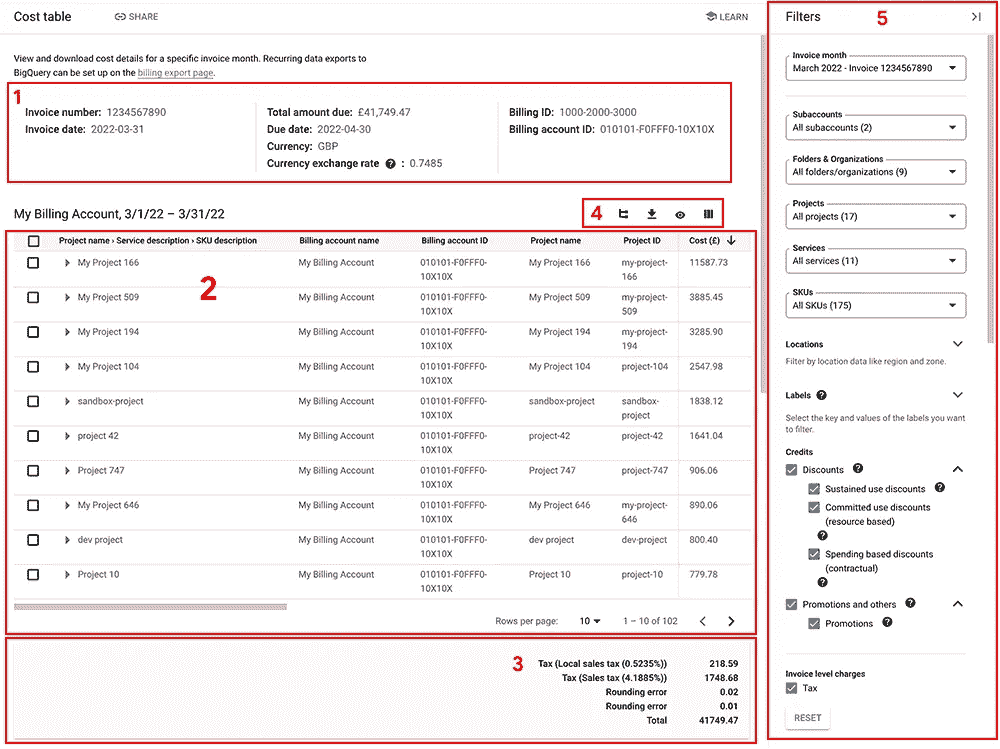

# Google Cloud —将账单数据导出到 CSV

> 原文：<https://medium.com/google-cloud/google-cloud-export-billing-data-to-csv-6fc2543dc39a?source=collection_archive---------0----------------------->

自从我将[导出计费数据发布到 BigQuery](/google-cloud/google-cloud-export-billing-data-to-bigquery-ce004fb87ce3) 后，有人问我，是否可以将计费数据导出到 CSV 文件。答案是[是的](https://cloud.google.com/billing/docs/how-to/cost-table#download-to-csv)。这个过程很容易，但找到“下载到 CSV”按钮很难。

打开 Google Cloud 控制台导航菜单，然后选择计费。转到“*计费→费用表*”。费用表显示了您的账单信息的明细视图。在下面截图的第 4 部分，点击“**向下箭头**图标，下载 CSV 格式的报告。就这么简单。

[](https://cloud.google.com/billing/docs/how-to/cost-table)

从 Google Cloud 文档复制的成本表报告示例

我看到的最常见的场景是下载最近的发票月份，因为大多数人都想分析他们最新的发票。这是默认值。但是，在屏幕截图的第 5 部分，您可以选择不同的发票月份和/或应用过滤器，以便您可以下载账单数据的子集，而不是完整的数据集。

## 摘要

对于希望使用电子表格或其他 CSV 工具分析其计费信息的组织来说，将计费信息导出到 CSV 文件是一个很好的选择。诀窍是知道“下载到 CSV”按钮位于计费的成本表部分。

```
**Further Reading** Google Cloud: [Download report to CSV](https://cloud.google.com/billing/docs/how-to/cost-table#download-to-csv)
Google Cloud: [View and download the cost details of your invoice or statement](https://cloud.google.com/billing/docs/how-to/cost-table)
Google Cloud: [Matching your Invoice](https://cloud.google.com/billing/docs/how-to/cost-table#match-invoice)
```