# 谷歌云——安全指挥中心免费漏洞扫描

> 原文：<https://medium.com/google-cloud/google-cloud-free-vulnerability-scanning-with-security-command-center-beb6f6b71bcf?source=collection_archive---------0----------------------->

没有多少人知道 Google Cloud 中有使用[安全指挥中心(SCC)](https://cloud.google.com/security-command-center/docs/concepts-security-command-center-overview) 的免费漏洞扫描。SCC 是一种内置的安全管理工具，有助于预防、检测和修复漏洞和威胁。借助 SCC，您可以从一个集中的仪表板执行多项与安全相关的操作。它分为两层:标准版(免费)和高级版(订阅)。默认情况下，SCC 支持的所有资源都被自动监控；没有安装或管理代理。由于标准层没有成本，并且提供漏洞评估，因此建议启用 SCC。

> 安全指挥中心提供了一套统一的工具来控制谷歌云的安全。

## 首次设置

选择您的组织，然后选择安全命令中心。如果这是第一次使用安全命令中心，注册过程开始。

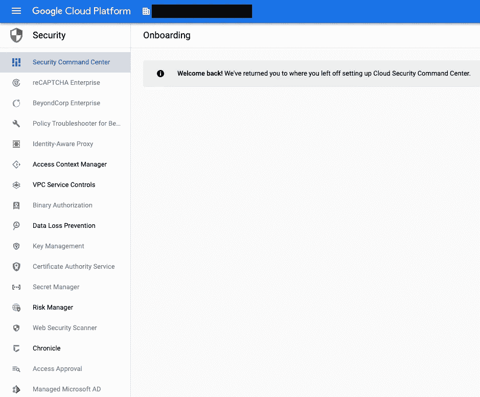

呈现了两个层，每个层中提供了服务摘要。标准等级是免费的，而高级等级是付费的。单击下一步。

这篇文章将关注免费标准层。升级到高级层的好处包括 Web 安全扫描、事件威胁检测和容器威胁检测，这些都是 Google 用来保护其服务的安全工具。

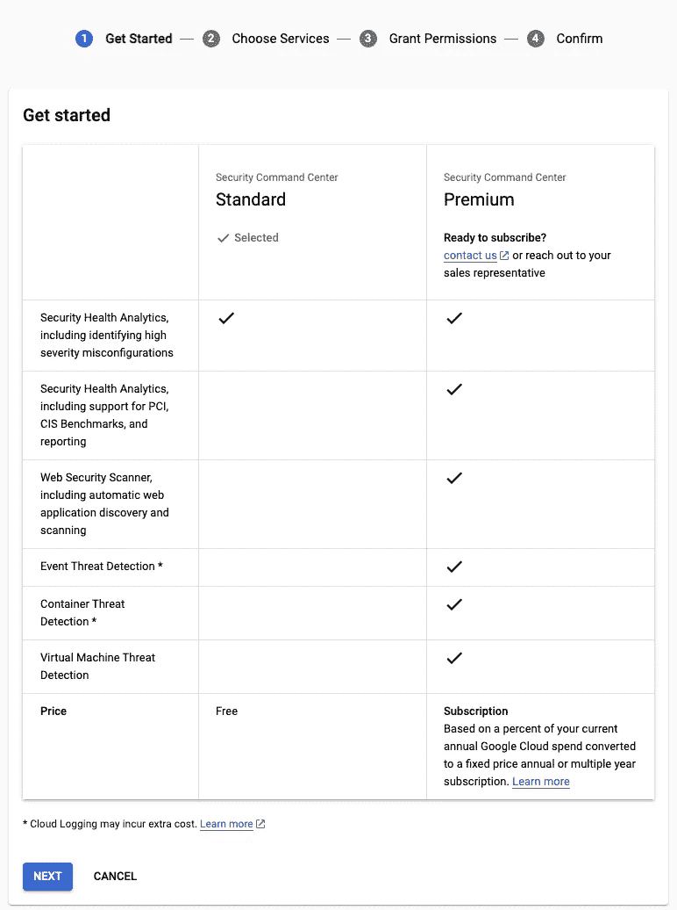

标准层和高级层的功能比较。

检查 ***安全健康分析*** 服务是否启用。该服务包含在免费层中。单击下一步。

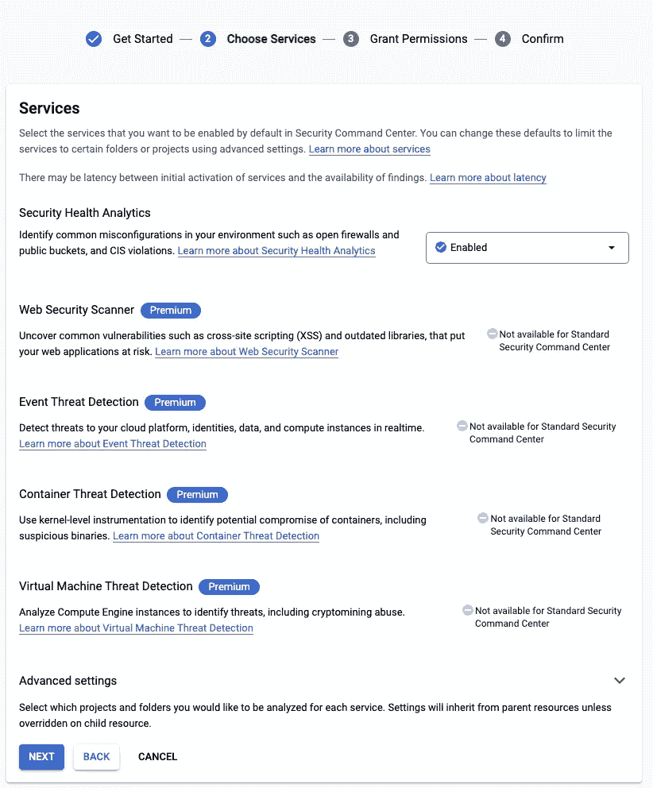

安全健康分析在免费标准层中提供。

单击授予角色。SCC 创建一个服务帐户，并授予扫描资源所需的角色。

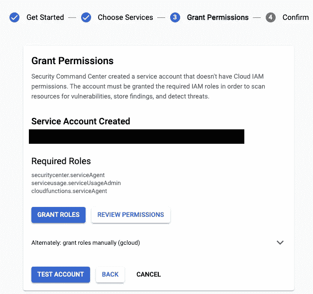

单击下一步。角色和相应的权限被授予服务帐户。

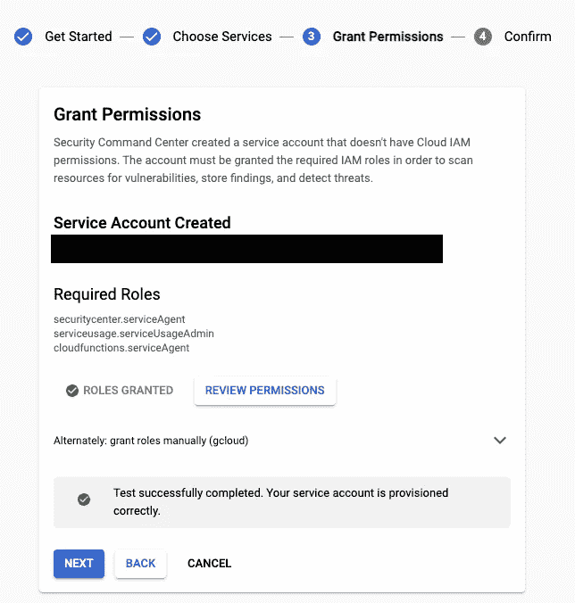

单击完成。

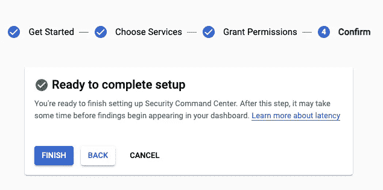

点击确认启用安全指挥中心。

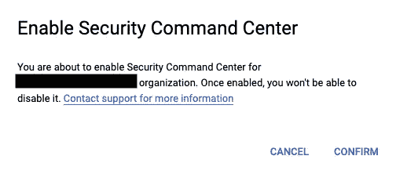

启用后，您将看到安全指挥中心的主菜单。安全指挥中心位于组织级别，因此如果您看不到主菜单，请切换到您的组织。

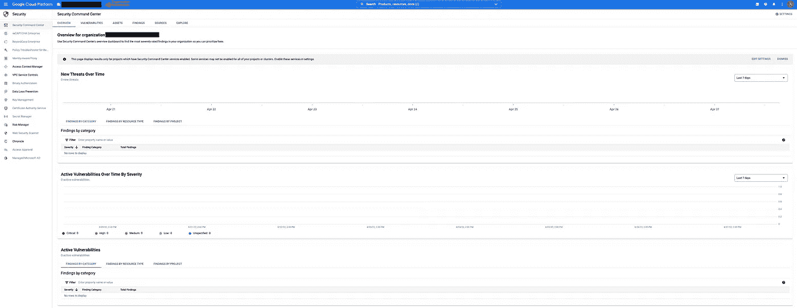

选择您的组织以查看安全指挥中心数据

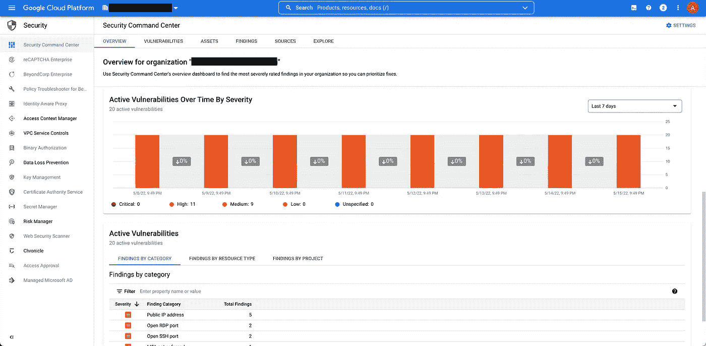

安全指挥中心概述页面

## 安全健康分析

Security Health Analytics 是 Security Command Center 中的本机扫描器。它利用谷歌安全最佳实践来提供跨存储、计算和其他几个谷歌云服务的检测和建议。每个检测都包括分类、查找和操作所需的元数据，包括特定于上下文的补救说明。免费标准层包括对高严重性错误配置的扫描。此外，您还可以根据 PCI DSS、CIS GCP 和 ISO 27001 等标准和框架进行合规性监控和安全状况管理。安全健康分析每天运行两次，或者在资产配置发生变化时进行扫描。

选择漏洞选项卡。这将列出您的组织中所有检测到的漏洞，提供如何修复它们的建议，并显示违反了哪些框架要求。该列表还按严重性排序，以便快速分类。有一个按一个或多个项目过滤的选项。在本例中，存在一些严重程度较高的漏洞，如开放的防火墙和不必要的公共 IP 地址。“类别”和“建议”列中的文本是指向“调查结果”选项卡的超链接，用于进一步分析。

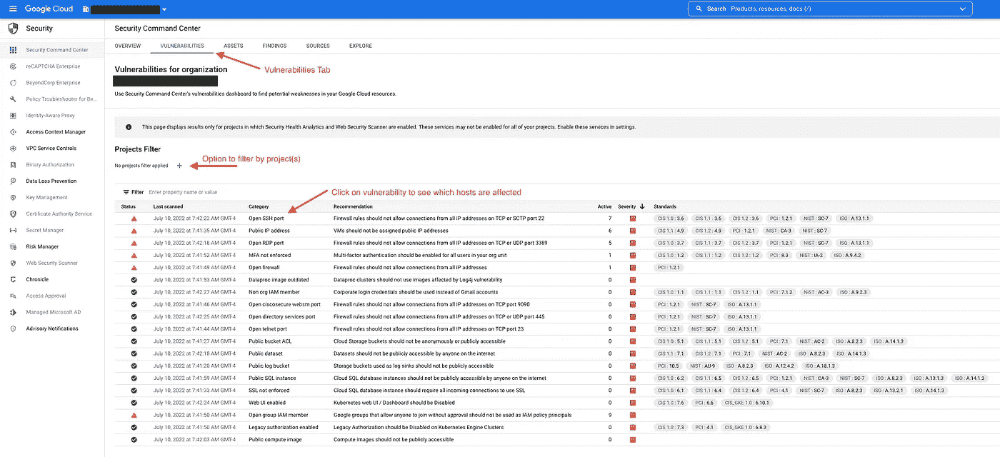

漏洞选项卡

“调查结果”选项卡对漏洞进行分类。单击类别列中的漏洞将显示漏洞描述。resourceName 列下是受影响的资源。

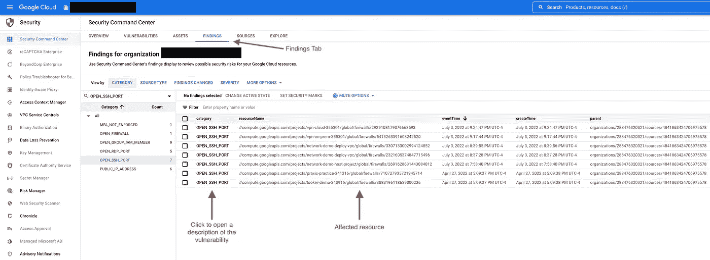

调查结果选项卡

通过点击漏洞，这将显示问题的概述以及如何修复它的说明。在本例中，漏洞是一个开放的防火墙规则，允许所有主机通过 SSH 连接到一个虚拟机。补救措施是删除 0.0.0.0/0(所有主机),仅允许特定主机访问虚拟机。概述还显示了哪些资产受到影响。有一个关于如何修复与易受攻击资源的链接问题的建议。

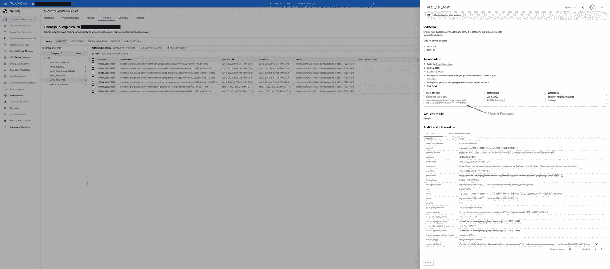

漏洞概述和补救

通过快速访问易受攻击的资源，根据建议将源过滤器从 0.0.0.0/0(所有主机)更改为特定主机。

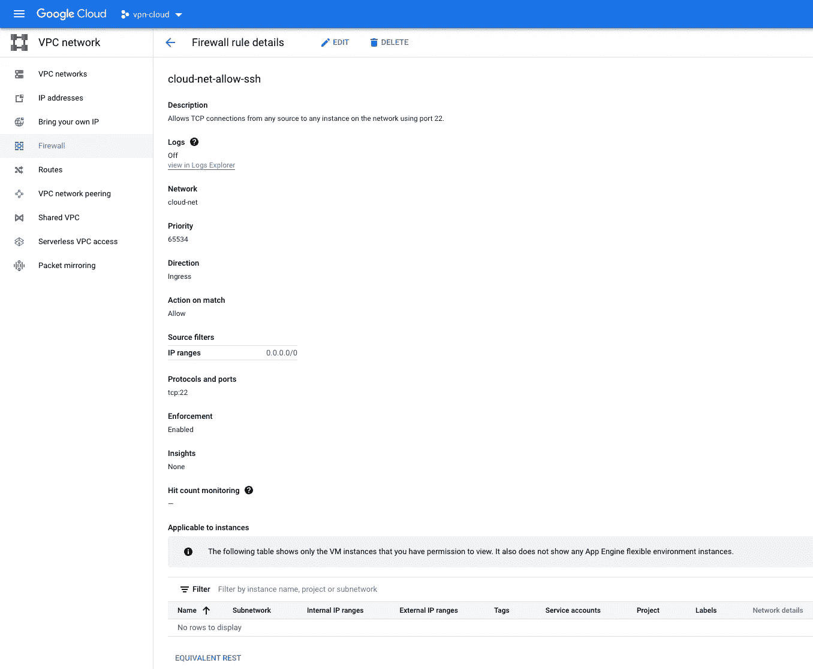

补救

## 摘要

安全指挥中心的免费标准层包括安全健康分析，可自动监控、识别和修复组织中的漏洞。它以最少的配置拥有广泛的开箱即用范围。随着项目和资源的创建，安全指挥中心的自动监控减少了无意中出现盲点的危险。

## 进一步观察

设置安全指挥中心

从...开始。安全健康分析

```
 **Further Reading:**[Google Cloud: Security Command Center Overview](https://cloud.google.com/security-command-center/docs/concepts-security-command-center-overview)
[Google Cloud: How to configure Security Command Center](https://cloud.google.com/security-command-center/docs/how-to-use-security-command-center)
[Google Cloud: Vulnerabilities findings](https://cloud.google.com/security-command-center/docs/concepts-vulnerabilities-findings)
[Google Cloud: Using Security Health Analytics](https://cloud.google.com/security-command-center/docs/how-to-use-security-health-analytics)
[Google Cloud: Security Command Center FAQ](https://cloud.google.com/security-command-center/docs/faq)
[YouTube: Security Command Center](https://www.youtube.com/watch?v=Q-fzz2P6omQ&list=PLIivdWyY5sqKd-Cu1HZ7v5RiYE8gVsM7P&index=2)
```