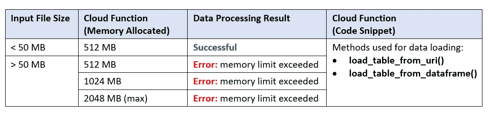
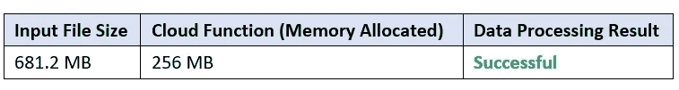
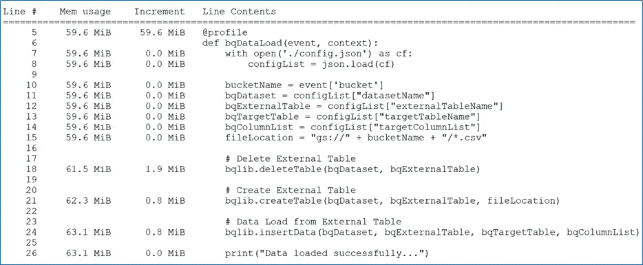

# 超越极限的谷歌云功能

> 原文：<https://medium.com/google-cloud/google-cloud-function-beyond-the-limits-ea1f16c577b?source=collection_archive---------0----------------------->

## 利用 BigQuery 计算能力有效利用云功能

Google Cloud Functions 是一个无服务器的执行环境，旨在构建和连接云服务。它支持完全托管的基础架构，因此云用户只需专注于应用程序代码，而无需担心底层硬件和软件。

## 用例

1.  设计一个数据处理管道，将数据从云存储加载到 BigQuery
2.  当新文件到达云存储桶时，立即执行数据提取和基本转换加载
3.  输入文件大小从 1 MB 到 1000 MB 不等

## 挑战

虽然有几个云服务可以满足这个目的，但是云功能的细粒度、按需特性使它成为一个容易的选择。话虽如此，但几乎没有什么限制让我们难以找到一个最优的解决方案。下面是几个例子:

云函数数据加载统计

## 解决办法

在这个 blob 中，实现的解决方案解决了加载不符合云功能限制的大文件的挑战。这种
方法的特点是利用云功能的所有必要特性，并利用 BigQuery 的计算能力。以下步骤解释了如何完成:

1.  新文件到达云存储桶时调用云功能
2.  使用 ExternalConfig()创建的 BigQuery 外部表指向云存储桶文件
3.  BigQuery insert 语句用于从外部表中读取数据，并将其加载到 BigQuery 事务/主表中

## 云函数源代码

云函数源代码拆分成多个文件:

1.  **模式文件** (schema.json):该文件包含 BigQuery 外部表列名和数据类型。
2.  **配置文件** (config.json):该文件包含 BigQuery 外部和内部表输入参数。
3.  **库文件** (bqlib.py):该文件包含用户自定义的库函数，用于执行数据提取和数据加载。
4.  **入口点/主文件** (bqDataLoad.py):该文件包含云函数入口点代码，调用库函数

模式文件

配置文件

库文件

入口点/主文件

## 试验结果

下图所示的测试结果证明了使用云函数成功加载了一个 **681.2** MB 文件。

云函数属性

云函数作业执行统计

内存分析器(Python)

## 源代码库

[https://github . com/soumendra-mis HRA/big query-data-loader . git](https://github.com/soumendra-mishra/bigquery-data-loader.git)