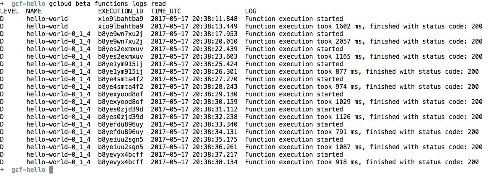
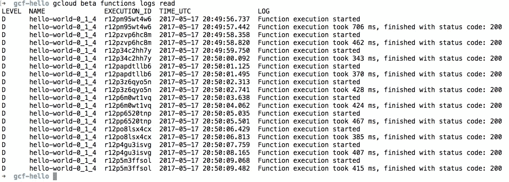

# 谷歌云功能，跟进。

> 原文：<https://medium.com/google-cloud/google-cloud-functions-follow-up-f9c6e4b9694b?source=collection_archive---------2----------------------->

功能即服务是一个惊人的概念。这种暗示起初可能看起来不明显，但是有很多。

在上一篇文章([https://medium . com/Google-cloud/creating-a-mongodb-crud-back end-on-Google-cloud-functions-88 bb 5 C1 cef 77](/google-cloud/creating-a-mongodb-crud-backend-on-google-cloud-functions-88bb5c1cef77))中，我试图展示使用 GCF 从 MongoDB 数据库中存储和检索数据来实现后端 API 是多么容易。在这样做的时候，我想我把巴贝利斯(【http://babeljs.io/】)加入进来，把必要的步骤搞得有点复杂了。

拥有 ES6 特性是很好的，但是对于所示的例子来说并不是必需的。我认为，除非你想要一些漂亮的 ES6 特性(导入、异步/等待等)或者使用 Flow(【https://flow.org/】)来添加静态类型检查。

*index.js* 和 *package.json* 的简化版本是:

以及 *package.json* :

```
{
  "name": "gcf-hello",
  "version": "1.0.0",
  "description": "",
  "main": "index.js",
  "scripts": {
    "deploy": "gcloud beta functions deploy hello-world --entry-point handler --trigger-http --stage-bucket medium-post-functions --memory=256MB"
  },
  "author": "",
  "license": "ISC",
  "dependencies": {
    "dotenv": "^4.0.0",
    "mongodb": "^2.2.26"
  }
}
```

更简单对吗？

在写这篇文章时，出现了几个考虑因素，包括版本、内存选择、NPM 包、URL、本地运行时、配置/环境等。我会试着在这里集合他们。

## 用于部署的打包

部署脚本的第一步是打包我们的云函数根文件夹(您也可以使用`— local-path '参数来指定不同的根文件夹)。当然， *node_modules* 文件夹没有打包，但是，遗憾的是，其他文件夹都打包了，比如*。git* (这大概是我个人在 GCF 的 bug 追踪上备案的一个 bug)。为什么这很重要？*。git* 文件夹往往会随着时间的推移而增长，随着时间的推移会增加到兆字节。不幸的是，这使得我们的部署包比它们应该的要大。他们也有一个 250Mb 的限制，使部署速度较慢。

我的观点是，我们应该能够控制是否包含在我们正在部署的包中。

如果您想查看部署中打包了什么，只需使用 *gsutil* 命令将包从 GC 上的 deploy bucket 复制到您的本地机器上:

```
$ gsutil cp gs://path-to-file.zip .
```

每次成功部署后，都会显示*文件路径*部分。这是一个普通的 zip 文件，所以你可以自己试一下，看看里面都有什么。

## NPM 或纱或…

由于部署包中没有包含 *node_modules* 文件夹和，我们必须假设 GCF 平台会在部署过程中安装我们的函数依赖项。这实际上并不是一件坏事，可以加快部署速度。缺点是现在我们实际上不能控制如何安装这些依赖项。更重要的是，当我们现在有几种选择来做这件事的时候， **NPM** 是默认的和最常用的，而**纱**(我个人更喜欢)。

我找不到 GCF 使用的是哪一个，但是，经过反复试验，我必须假设这两个都不是。NPM 和 Yarn 都支持使用(git+ssh)语法从 git 安装软件包。我试了一下，发现它失败了，并显示了一条神秘的错误消息。(对此也有一个 bug 备案)。

所以，目前我们可以猜测是 NPM，但是，也缺乏对私人回购的支持。因此，向其他一些包中添加私有函数依赖甚至是分叉仍然很困难。

## 版本控制和/或标记

GCF 缺乏对版本和/或标记的支持。但是，因为我们可以用自定义名称来命名我们的函数，所以这不是什么大问题。我们完全可以在函数名上使用微格式来表示版本，比如:

```
$ gcloud beta functions deploy hello-world-0_1_4 --entry-point handler --trigger-http --stage-bucket medium-post-functions --memory=256MB
```

请注意，我没有在版本号上使用点。

"函数名必须只包含小写拉丁字母、数字和连字符(-)。它必须以字母开头，不得以连字符结尾，并且长度不得超过 63 个字符。

那么我们可以有这样一个端点:

```
https://us-central1-revelatio-165320.cloudfunctions.net/hello-world-0_1_4
```

在我看来这其实是件好事。

## URL 路由和其他请求属性

因为我们正在编写一个 HTTP 函数，所以我们可以访问常规的请求属性。

```
{
  "httpVersionMajor": 1,
  "httpVersionMinor": 1,
  "httpVersion": "1.1",
  "headers": {
    "host": "us-central1-revelatio-165320.cloudfunctions.net",
    "user-agent": "curl/7.43.0 AppEngine-Google; (+http://code.google.com/appengine; appid: s~gcf-http-proxy)",
    "accept": "*/*",
    "function-execution-id": "iwwhmh5om3tq",
    "x-appengine-api-ticket": "c8972c61af61e994",
    "x-appengine-city": "san francisco",
    "x-appengine-citylatlong": "37.774929,-122.419416",
    "x-appengine-country": "ZZ",
    "x-appengine-https": "on",
    "x-appengine-inbound-appid": "gcf-http-proxy",
    "x-appengine-region": "ca",
    "x-appengine-user-ip": "0.1.0.40",
    "x-cloud-trace-context": "d4106ea1f08a0ec355e6014fcc600464/18238227398167355466",
    "x-forwarded-for": "2607:f598:b199:eb00:1919:d4c:c1e0:c4e0",
    "x-zoo": "app-id=gcf-http-proxy,domain=gmail.com,host=*.cloudfunctions.net",
    "accept-encoding": "gzip"
  },
  "url": "",
  "method": "GET",
  "baseUrl": "",
  "originalUrl": "",
  "params": {
    "0": ""
  },
  "query": {},
  "body": {}
}
```

不错啊。我们可以直接使用 **req.body** (就像我们在上一篇文章中看到的)来访问发布的和数据。 **req.url、req.params、req.query** 和 **req.method** 也做一些基本的路由。但是，由于我们无法访问更高级的上下文应用程序(比如在 Expressjs 中),所以我们需要在单个函数中完成所有的路由。这方面有一些好的库，微路由器([https://www.npmjs.com/package/microrouter](https://www.npmjs.com/package/microrouter))是我关注的一个。它甚至支持 async/await，因此为我们的路由创建异步处理程序变得很容易。

我们的 HTTP 函数的根路径将在 req.url 中作为空字符串传递给我们，所以如果您使用某种路由库，请确保包含这种情况，否则您的函数将超时并失败。

## 部署配置/环境

在部署我们的 HTTP 函数时，还没有办法定义环境属性，例如 MongoDB 数据库连接参数。在我们找到最终的解决方案之前，我们可以使用*dotenv*(【https://www.npmjs.com/package/dotenv】T2)一个简单的 nodejs 包从一个文件(通常是*)加载属性。env* )变成 *process.env.* **我们只需要记住不要版本。环境文件**

## 内存就是钱！

到目前为止，我一直使用分配内存中第二低的内存值来部署我的函数。所有可能的值为:128MB、256MB、512MB、1024MB 和 2048MB。这意味着什么？我如何选择我的函数需要多少内存？

答案是……看情况。取决于你的功能。很高兴看到约束消失，GCF 随着时间的推移自动建议并使用我的函数可能需要的最佳内存参数。

直观上，我们可以测试响应时间来进行选择。Apache Bench 是一种简单的方法，如果您愿意，也可以手动完成。只需获取云函数日志，查看您的函数响应需要多长时间。



正如您所看到的，我们有 2057 ms 到 877 ms 运行我们的函数，分配了 256Mb 内存。

如果我们将内存分配增加到 2048MB 会怎么样？



是的，我们有更快的执行功能。请注意，账单在这里很重要。您可以使用 Google Cloud 提供的估算计算器，根据不同的参数集来计算成本。

《出埃及记》在 aprox 700 ms 中运行并且具有 2Mb 网络带宽的 2048MB 函数的 100 万次调用花费大约 257 美元，而在 aprox 1500 ms 中运行 256MB 的相同函数花费大约 237 美元

关于[https://cloud.google.com/functions/pricing](https://cloud.google.com/functions/pricing)定价的更详细信息

## 记录

这个很简单，每个**控制台. log** 或**控制台. error** 都会被记录。不错！

## 本地运行时

如果我想在本地运行我的函数呢？提供了一个本地仿真器。这辆车有点大，但很好用。

 [## 云函数本地仿真器|云函数文档| Google 云平台

### 云函数仿真器是一个 Node.js 应用程序，它实现了云函数 REST 和 gRPC APIs，并且…

cloud.google.com](https://cloud.google.com/functions/docs/emulator) 

在我的例子中，命令**函数**已经存在，所以我必须将模拟器重命名为 **gfunctions。**

```
$ **gfunctions start**Starting Google Cloud Functions Emulator...
Google Cloud Functions Emulator STARTED$ **gfunctions deploy hello-world -e handler --trigger-http**Copying file:///var/folders/f9/_xttz7rs7t10grd6_q_8s1dr0000gn/T/us-central1-hello-world-62471iys5P7qVjGo7.zip...
Waiting for operation to finish...done.
Deploying function.......done.
Function hello-world deployed.
Name        │ hello-world                                                                                           
Entry Point │ handler
Trigger     │ HTTP
Resource    │ [http://localhost:8010/revelatio-165320/us-central1/hello-world](http://localhost:8010/revelatio-165320/us-central1/hello-world)
Timeout     │ 60 seconds
Local path  │ /Users/ernestofreyre/Documents/revelatio/gcf-hello
Archive     │ file:///var/folders/f9/_xttz7rs7t10grd6_q_8s1dr0000gn/T/us-central1-hello-world-62471iys5P7qVjGo7.zip$ **curl** [**http://localhost:8010/revelatio-165320/us-central1/hello-world**](http://localhost:8010/revelatio-165320/us-central1/hello-world)[{"_id":"591bf40e734d1d38b5b63d51","name":"Ernesto Freyre","email":"[ernestofreyreg@gmail.com](mailto:ernestofreyreg@gmail.com)"}]$
```

## 最后删除

是的，我的好东西应该是删除一个不再需要的功能。

```
$ gcloud beta functions delete hello-world-0_1_4
```

最后，我希望 GCF 走出 beta 版的不确定性。谷歌应该加大油门，扩大他们的 GCF 产品。更多的语言(当然要去)，更好的文档和更多的内部细节。