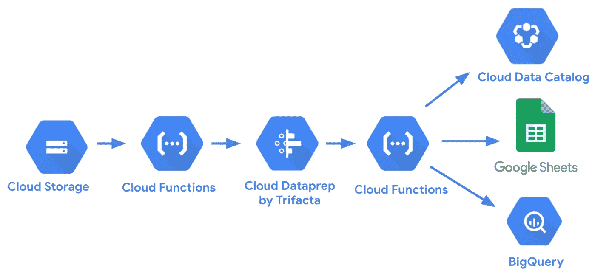

# 用于云数据准备的谷歌云功能

> 原文：<https://medium.com/google-cloud/google-cloud-functions-for-cloud-dataprep-c0e92c31507?source=collection_archive---------3----------------------->

[谷歌云功能](https://cloud.google.com/functions)示例为[云数据准备](https://cloud.google.com/dataprep)。

所有代码都可以在**GitHub**[https://GitHub . com/victorcouste/Google-cloud functions-data prep](https://github.com/victorcouste/google-cloudfunctions-dataprep)上找到

*   [**GCS _ trigger _ dataprep _ job . py**](https://github.com/victorcouste/google-cloudfunctions-dataprep/blob/master/gcs_trigger_dataprep_job.py):在 Google 云存储桶文件夹中创建文件时触发 data prep 作业的后台 Python 函数。Dataprep 作业以 REST API 调用和新文件作为参数开始。博客文章中的实现细节[当文件到达时如何自动化云数据准备管道](/google-cloud/how-to-automate-a-cloud-dataprep-pipeline-when-a-file-arrives-9b85f2745a09)
*   [**job-result-Google-Sheet . js**](https://github.com/victorcouste/google-cloudfunctions-dataprep/blob/master/job-result-google-sheet.js):HTTP node . js 函数，用于在 Google Sheet 中写入一个带有配方名称的 Dataprep 作业结果信息(id，status ),链接到作业页面，链接到结果的 PDF 文件。当作业完成时(成功或失败)，从 Dataprep Webhook 调用这个 HTTP Cloud 函数。博文[中的实现细节利用云函数和 API 来监控 Google 表单中的云数据准备作业状态](https://towardsdatascience.com/leverage-cloud-functions-and-apis-to-monitor-cloud-dataprep-jobs-status-in-a-google-sheet-b412ee2b9acc)。
*   [**publishing _ googlesheet . js**](https://github.com/victorcouste/google-cloudfunctions-dataprep/blob/master/publishing_googlesheet.js):HTTP node . js 函数，在 Google Sheet 中发布 Dataprep 输出。谷歌表名创建将基于在 GSC + Dataprep 工作 id 生成的默认单个 CSV 文件名。在云函数代码中，您需要更新您的 [Dataprep 令牌访问](https://docs.trifacta.com/display/DP/Access+Tokens+Page)(以调用 REST API)和 [Google 电子表格 ID](https://developers.google.com/sheets/api/guides/concepts#spreadsheet_id) 。当通过 [Dataprep Webhook](https://docs.trifacta.com/display/DP/Create+Flow+Webhook+Task) 完成一个 Dataprep 作业时，可以触发这个云功能。
*   [**job-result-google-big query . py**](https://github.com/victorcouste/google-cloudfunctions-dataprep/blob/master/job-result-google-bigquery.py):HTTP Python 函数在 Google BigQuery 表中写入一个 Dataprep 作业结果信息(id，status)，带有数据集输出名(配方名)、Google 用户和作业页面的链接。当作业完成时(成功或失败)，从 Dataprep Webhook 调用这个 HTTP Cloud 函数。博文[中的实现细节使用 Data Studio](/google-cloud/monitor-your-bigquery-data-warehouse-dataprep-pipeline-with-data-studio-8e46b2beda1) 监控您的 BigQuery 数据仓库 Dataprep 管道。
*   [**Export _ import _ dataprep _ flow . py**](https://github.com/victorcouste/google-cloudfunctions-dataprep/blob/master/export_import_dataprep_flow.py):从一个项目中导出一个 data prep 流，并导入到另一个项目中。用于在 GCS bucket 文件夹中保存或获取流包(zip 文件)的选项。
*   [**更新 Google 云数据目录**](https://victorcouste.github.io/google-data-catalog-dataprep/) :一个云函数，用 Cloud Dataprep 元数据和列的配置文件在 BigQuery 表上创建或更新 Google 云数据目录标签。

谷歌云功能[https://cloud.google.com/functions](https://cloud.google.com/functions)

由 Trifacta 制作的云数据图[https://cloud.google.com/dataprep](https://cloud.google.com/dataprep)

云数据准备标准 API[https://api.trifacta.com/dataprep-standard](https://api.trifacta.com/dataprep-standard)

云数据准备高级 API【https://api.trifacta.com/dataprep-premium 