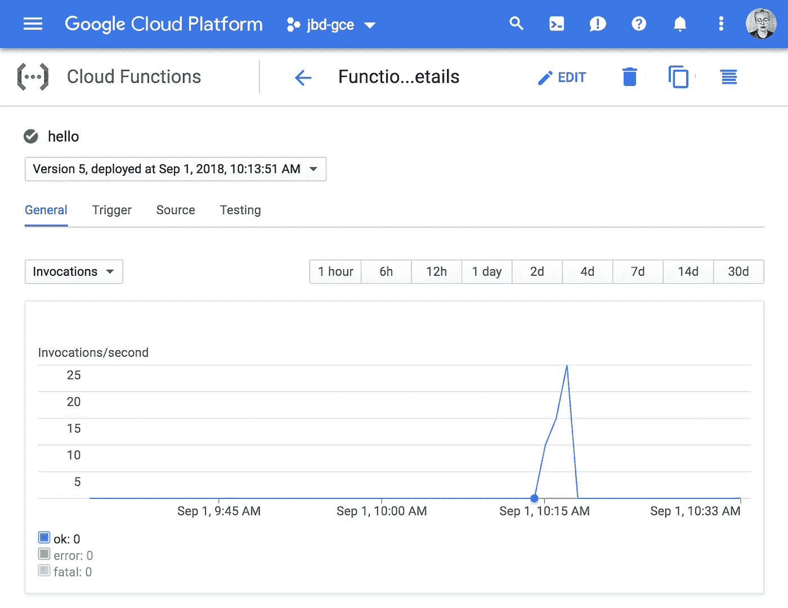
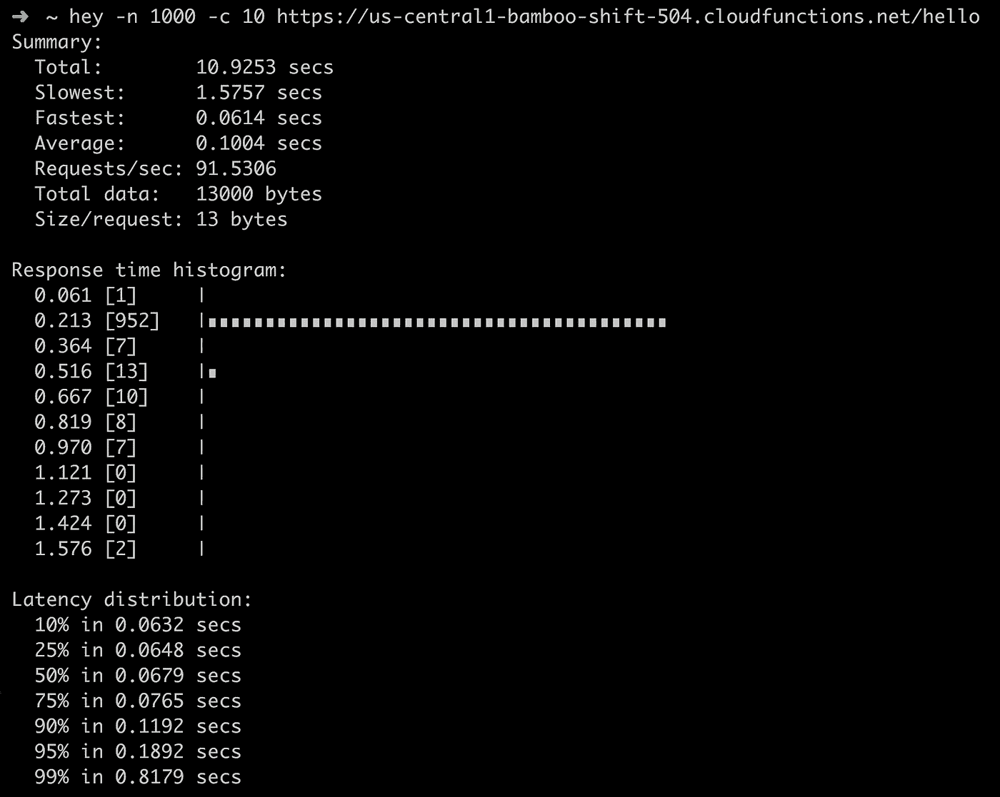

# 面向 Go 的谷歌云功能

> 原文：<https://medium.com/google-cloud/google-cloud-functions-for-go-57e4af9b10da?source=collection_archive---------0----------------------->

【2019 年 1 月，谷歌云功能终于宣布了对 Go 的 beta 支持。查看 [*官方博文*](https://cloud.google.com/blog/products/application-development/cloud-functions-go-1-11-is-now-a-supported-language) *了解更多详情。*

## 你好世界

让我从一个简单的“hello world”开始，向您介绍整个构建+部署体验。GCF 需要一个 http。HandlerFunc 是入口点。创建一个名为“hello”的包，并添加一个简单的处理程序:

```
$ cat hello/fn.go
package helloimport (
 "fmt"
 "net/http"
)func HelloWorld(w http.ResponseWriter, r *http.Request) {
 fmt.Fprintf(w, "Hello, World!")
}
```

为了进行部署，请使用以下命令。它将创建一个名为 hello 的新函数，并将使用 HelloWorld 作为入口点。将要使用的 Go 运行时将是 Go.11。

```
$ gcloud functions deploy hello --entry-point HelloWorld --runtime go111 --trigger-http
Deploying function (may take a while - up to 2 minutes)...
```

如前所述，部署可能需要一段时间。部署完成后，您将能够在终端上看到 HTTP 端点。您还可以在[云控制台](https://console.cloud.google.com/functions/list)查看您的功能。



在控制台上，你可以看到“你好”功能被部署。您可以访问日志和基本指标，如调用次数、执行时间和内存使用情况。

## 属国

如果有外部依赖项，将使用 go.mod 文件来获取依赖项。您也可以在功能模块下出售它们。我引入了 golang.org/x/sync/errgroup 包作为例子。如需更多信息，请参见 [GCF 依赖性指南](https://cloud.google.com/functions/docs/concepts/go-runtime#specifying_dependencies)。

```
$ cd hello
$ go mod init
$ tree
hello
├── fn.go
├── go.mod
...
```

当我再次重新部署函数时，将检索依赖关系。

```
$ gcloud functions deploy hello --entry-point HelloWorld --runtime go111 --trigger-http
Deploying function (may take a while - up to 2 minutes)...
availableMemoryMb: 256
entryPoint: HelloWorld
httpsTrigger:
  url: https://us-central1-bamboo-shift-504.cloudfunctions.net/hello
...
```

功能重新部署在[https://us-central 1-bamboo-shift-504 . cloud functions . net/hello](https://us-central1-bamboo-shift-504.cloudfunctions.net/hello)。你自己看吧。您也可以从命令行调用该函数:

```
$ gcloud functions call hello
executionId: x71xpor7tasd
result: Hello, World!
```

我还从我的笔记本电脑上生成了一些负载到函数中，以便为您提供更真实的响应时间数据。我提出了 1000 个请求，一次 10 个。您可以看到有一些异常值，但大多数呼叫都在 213 毫秒的范围内。



## 代码组织

在 Go 中，我们通过[职责](https://rakyll.org/style-packages/)来组织包。这也非常适合无服务器设计模式——一个功能代表一种责任。我为每个函数创建一个新的模块，从同一个模块中提供特定于函数的其他 API。

主入口点处理程序总是在 **fn.go** 中，这帮助我快速找到主处理程序，就像 main.go 帮助我找到主函数一样。

通用功能位于单独的模块中，在功能包中出售，因为 GCF CLI 一次只上传和部署一个模块。我们正在考虑如何改善这种情况，但是目前一个模块应该包含它所有的依赖项。

下面是一个示例树。程序包配置包含与配置相关的常见功能。它是一个模块，由其他函数(hello 和 user)导入和出售。

```
$ tree
fns
├── config (commonly used module)
│   ├── config.go
│   ├── go.mod
├── hello
│   ├── fn.go
│   ├── go.mod
└── user
    ├── fn.go
    ├── go.mod
```

## 链接处理程序

与其他提供者不同，我们决定使用 go 惯用处理程序 API(func(response writer，*Request))作为主要入口点。这允许你更容易地利用 Go 生态系统中现有的中间件。例如，在下面的例子中，我使用 ochttp 为传入的 http 请求自动创建跟踪。

```
package helloimport (
   "fmt"
   "net/http" "go.opencensus.io/plugin/ochttp"
)func HelloWorld(w http.ResponseWriter, r *http.Request) {
    fn := func(w http.ResponseWriter, r *http.Request) {
        fmt.Fprintln(w, "Hello world")
    }
    traced := &ochttp.Handler{
        Handler: http.HandlerFunc(fn),
    }
    traced.ServeHTTP(w, r)
}
```

对于每个传入请求，都会创建一个传入跟踪范围。如果你注册了一个导出器，你可以上传追踪到任何我们支持的后端，当然包括 Stackdriver 追踪。