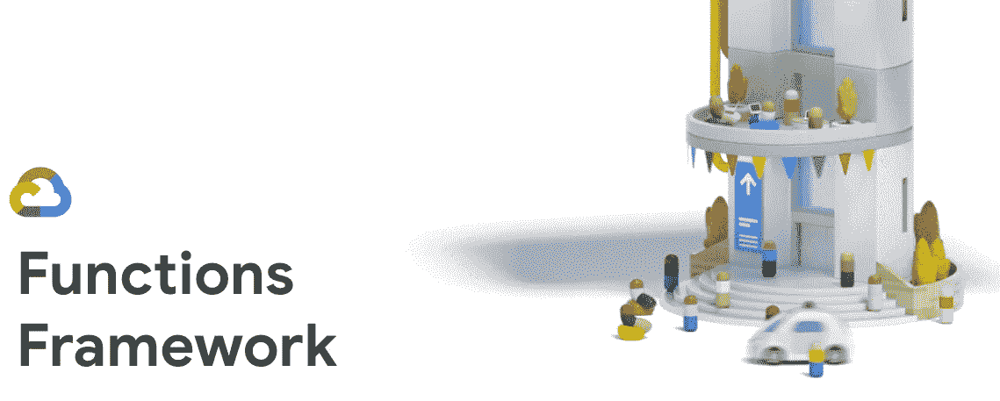
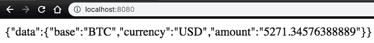
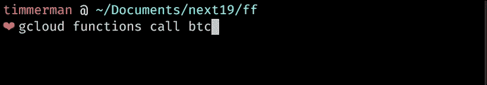
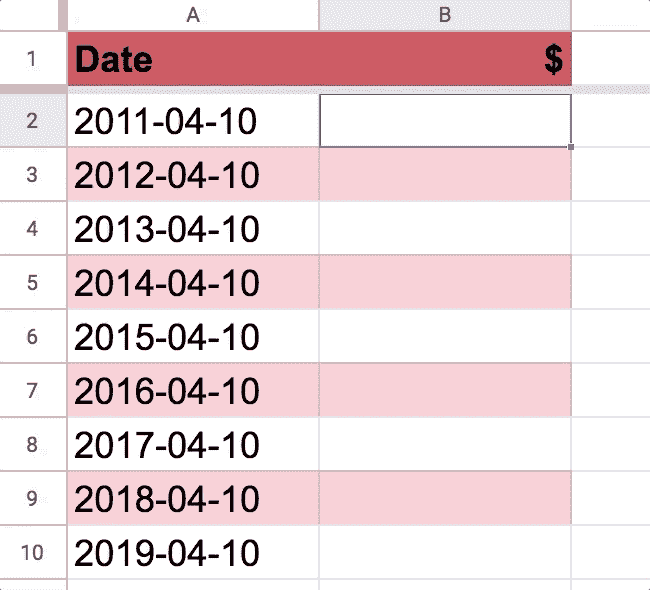

# 谷歌云功能框架

> 原文：<https://medium.com/google-cloud/google-cloud-functions-framework-9fbd899c201c?source=collection_archive---------0----------------------->

C loud Functions 是 Google 云平台上无服务器功能的托管服务。功能可动态扩展，按使用计费，消除了基础设施管理的繁重工作。那么，我为什么要在不同的环境中运行函数呢？

在本文中，我们将使用**函数框架**介绍**函数** **可移植性**的基础知识。我们将向您展示如何通过 gcloud CLI、URL 和 Google Sheets 等应用程序在本地使用 Google Cloud Functions 上的功能。

# 什么是功能框架？

功能框架允许您:

*   启动**本地开发** **服务器**进行快速测试
*   **调用函数**以响应请求
*   自动解组符合 [**云事件**](https://cloudevents.io/) **规格**的事件
*   **在无服务器平台之间可移植**

Google Cloud Functions for Node 10 使用 Functions 框架作为其底层的 *invoker* 模块。

在 [GitHub](https://github.com/GoogleCloudPlatform/functions-framework-nodejs) 和 [npm](http://npmjs.com/@google-cloud/functions-framework) : `@google-cloud/functions-framework`上是开源的

# 3 个演示

下面的演示展示了从本地主机、gcloud CLI、URL 和 Google Sheets 调用云函数。

我们将`COINBASE_TOKEN`设置为环境变量。在这里创建您的密钥[。](https://support.coinbase.com/customer/en/portal/articles/1914910-how-can-i-generate-api-keys-within-coinbase-commerce-)

**代码**

在节点中，导出一个用美元向`api.coinbase.com` BTC 发出请求的函数。我们可以选择提供一个特定的`date`作为 URL 查询参数。

带有' COINBASE _ TOKEN` env 变量的节点 10。

由于函数框架，该函数可以在多种环境中调用:

**本地主机**

启动函数框架服务器

转到本地主机:8080

**gcloud CLI**

**部署的网址**

**谷歌工作表**

你可以用几行应用程序脚本粘合 Google Sheets 的云功能。

在谷歌工作表中，你可以输入`=`，然后自动完成你的功能。

通过 Google Sheets 调用云函数

# 它是如何工作的

当您对节点 10 运行`gcloud functions deploy`时，我们…

1.  将目录上传到文件夹。
2.  用函数框架包装用户代码，这将在容器映像中创建一个 HTTP 服务器。
3.  为将来函数调用存储容器。
4.  根据需要旋转图像的实例并调用函数。

运行任何。跑哪都行。整合任何东西。

我在 Next’19 上介绍了云函数。我推荐以 1.5x 的速度观看。

## 后续步骤

*   在 GitHub 上查看[功能框架](https://github.com/GoogleCloudPlatform/functions-framework-nodejs)
*   阅读我们的[无服务器@ Next’19 博客](https://cloud.google.com/blog/products/serverless/announcing-cloud-run-the-newest-member-of-our-serverless-compute-stack)
*   观看[《云上无服务器》](https://www.youtube.com/watch?v=0ZCcKTlcjgE)