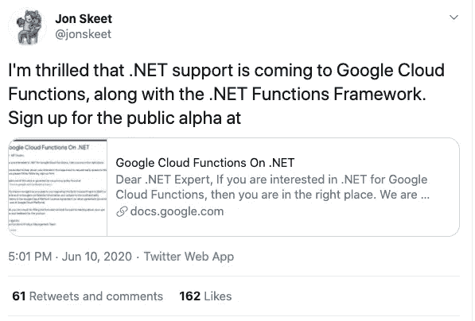
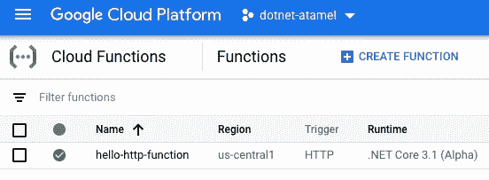

# 谷歌云功能开启。网

> 原文：<https://medium.com/google-cloud/google-cloud-functions-on-net-2f0b9130b22b?source=collection_archive---------3----------------------->

# 。谷歌云功能(Alpha)

我在许多地方演讲。在过去的 3-4 年里，我经常收到的最常见的问题是:什么时候。NET 支持云功能吗？

可惜我一时没有好答案。上个月，随着来自我们 C#团队的[乔恩·斯基特](https://twitter.com/jonskeet)的以下推文，这一切都改变了:



。NET 对云函数的支持正在到来，目前它是公开的 alpha 版本。你需要在这里注册[才能进入。](https://docs.google.com/forms/d/e/1FAIpQLSe7qB5vNrgFtZZ3ZUfIwkbsDMGsA1fXY52GzmGmnhwdReHuOQ/viewform)

在这篇博文中，我想给出。NET 对云功能的支持，试试看效果如何。在这个过程中，我们还将了解支持。NET 对云功能的幕后支持。

我在这里分享的所有代码都已经在我的 GitHub repo 中:[cloud-functions-dotnetcore](https://github.com/meteatamel/cloud-functions-dotnetcore)。

# 为什么选择云功能

在我开始之前。NET 对云函数的支持，一个值得回答的问题是:为什么云函数。网？已经有多种运行方式了。NET 在 Google Cloud 上，那么为什么还要多一个呢？

要回顾当前选项，您可以运行。计算引擎或 Windows 上的. NET 框架。NET 核心容器在 Linux 上的应用引擎(Flex)，Kubernetes 引擎和最近的云运行。云跑一直是我默认选择跑的。NET Core，因为它的快速部署，令人敬畏的 DevEx 和它的无服务器扩展和计费模型。但是，云运行中的部署单元是一个容器。从……通过 Dockerfile 将. NET 代码转换成 Docker 映像通常很简单，但也很重要。确保 docker 文件是优化的和安全的是更多的工作。

有时，您只想编写代码并部署它，而不必担心容器。这就是云功能使您能够做到的。截至目前，云功能也倾向于与不同的谷歌云事件更好地集成。

# 功能框架

[功能框架](https://github.com/GoogleCloudPlatform/functions-framework)试图简化跨不同平台的可移植功能的编写和部署，例如云功能、云运行、GKE 云运行或纯 Knative。它对于本地开发和调试也很有用。支持`HTTP`和`CloudEvent`消费功能。

[职能框架为。NET](https://github.com/GoogleCloudPlatform/functions-framework-dotnet) 对。NET，它是。云函数中的. NET 支持。

# 云函数的模板

的功能框架。NET 自带了一些`dotnet`的模板，方便上手。安装模板是一个简单的命令:

```
dotnet new -i Google.Cloud.Functions.Templates::1.0.0-alpha08
```

您将看到以下新模板:

```
Templates                                              Short Name 
--------------------------------------------------------------------
Google Cloud Functions CloudEvent Function             gcf-event
Google Cloud Functions CloudEvent Function (Untyped)   gcf-untyped-event
Google Cloud Functions HttpFunction                    gcf-http
```

前两个用于`CloudEvent`消费功能，最后一个用于`HTTP`消费功能。接下来我们将探索所有这些。

# HTTP 功能

创建一个`HTTP`消费函数就像:

```
dotnet new gcf-http
```

这将创建一个带有 [Function.cs](https://github.com/meteatamel/cloud-functions-dotnetcore/blob/master/HelloHttpFunction/Function.cs) 文件的新项目:

```
public class Function : IHttpFunction
{
    public async Task HandleAsync(HttpContext context)
    {
        await context.Response.WriteAsync("Hello, Functions Framework.");
    }
}
```

这个函数将处理`HTTP`请求并发回`HTTP`响应。我喜欢 API 的简单性，这是我们不需要担心容器的额外好处。

要部署该函数，您可以使用`dotnet3`运行时和`trigger-http`标志:

```
gcloud functions deploy hello-http-function \
    --runtime dotnet3 \
    --trigger-http \
    --entry-point HelloHttpFunction.Function
```

一两分钟后，您应该会看到部署的功能:



# CloudEvent 函数

的功能框架。开始消费`CloudEvents`网就开始闪亮。该框架不仅在解析`CloudEvent`方面做得很好，而且还试图将`CloudEvent`中的数据解析为强类型。

比如谷歌云存储放出`CloudEvents`。为了消费这些事件，您首先要创建一个`CloudEvent`消费函数:

```
dotnet new gcf-event
```

这创建了一个 [Function.cs](https://github.com/meteatamel/cloud-functions-dotnetcore/tree/master/HelloCloudEventStorageFunction) ，它将一个`CloudEvent`和`CloudEvent`的数据解析成一个`StorageObjectData`对象:

```
public class Function : ICloudEventFunction<StorageObjectData>
{
    public Task HandleAsync(CloudEvent cloudEvent, StorageObjectData data, CancellationToken cancellationToken)
    {
```

这个很有用！要部署该功能，您需要相应地指定`trigger-event`和`trigger-resource`:

```
gcloud functions deploy hello-cloudevent-storage-function \
    --runtime dotnet3 \
    --entry-point HelloCloudEventStorageFunction.Function \
    --trigger-event google.storage.object.finalize \
    --trigger-resource ${BUCKET_NAME} \
    --allow-unauthenticated
```

如果您想使用发布/订阅消息，您可以经历相同的过程，但是将 [Function.cs](https://github.com/meteatamel/cloud-functions-dotnetcore/blob/master/HelloCloudEventPubSubFunction/Function.cs) 中的`StorageObjectData`更改为`MessagePublishedData`，以确保数据被解析为发布/订阅消息:

```
public class Function : ICloudEventFunction<MessagePublishedData>
{
    public Task HandleAsync(CloudEvent cloudEvent, MessagePublishedData data, CancellationToken cancellationToken)
    {
```

在这种情况下，您需要使用`trigger-topic`进行部署:

```
gcloud functions deploy hello-cloudevent-pubsub-function \
    --runtime dotnet3 \
    --entry-point HelloCloudEventPubSubFunction.Function \
    --trigger-topic ${TOPIC_NAME}
```

您可以在[部署](https://github.com/GoogleCloudPlatform/functions-framework-dotnet/blob/master/docs/deployment.md)页面中看到强类型方式支持的触发器的完整列表。

如果您只想监听`CloudEvent`而不解析特定的`data`类型，您可以创建一个非类型化的函数，如下所示:

```
dotnet new gcf-untyped-event
```

这创建了一个带有简单`CloudEvent`签名的 [Function.cs](https://github.com/meteatamel/cloud-functions-dotnetcore/blob/master/HelloCloudEventUntypedFunction/Function.cs) :

```
public class Function : ICloudEventFunction
{
    public Task HandleAsync(CloudEvent cloudEvent, CancellationToken cancellationToken)
    {
```

# 依赖注入

我最后想提的是。NET 对云功能的支持是它方便的依赖注入。

例如，如果您希望将记录器注入到您的函数中，您可以简单地将以下内容添加到您的`Function.cs`中:

```
private readonly ILogger _logger;public Function(ILogger<Function> logger) =>
    _logger = logger;
```

如果需要做更复杂的依赖注入，可以创建一个扩展`FunctionsStartup`的`Startup.cs`类，在`Configure`方法中做额外的注入，如 [Function.cs](https://github.com/GoogleCloudPlatform/functions-framework-dotnet/blob/master/examples/Google.Cloud.Functions.Examples.AdvancedDependencyInjection/Function.cs) 所示:

```
public class Startup : FunctionsStartup
{
    public override void Configure(IFunctionsHostBuilder builder) =>
        builder.Services
            .AddSingleton<IOperationSingleton, Operation>()
            .AddScoped<IOperationScoped, Operation>();
}
```

这结束了我对……的讨论。NET 上的云函数。激动人心的时刻。NET 上的谷歌云肯定！

*   在这里注册公共 alpha [。](https://docs.google.com/forms/d/e/1FAIpQLSe7qB5vNrgFtZZ3ZUfIwkbsDMGsA1fXY52GzmGmnhwdReHuOQ/viewform)
*   点击查看我的代码和指令。
*   问题/评论？在推特上联系我( [@meteatamel](https://twitter.com/meteatamel) )。

*原发布于*[*https://atamel . dev*](https://atamel.dev/posts/2020/07-14_dotnet_on_cloud_functions/)*。*