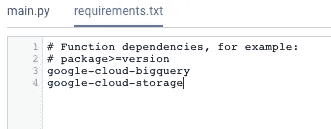
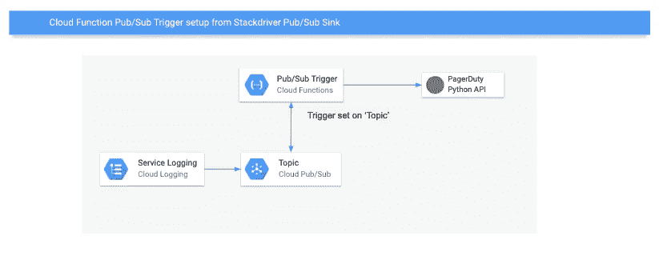
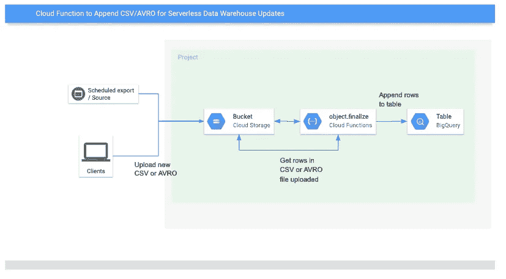
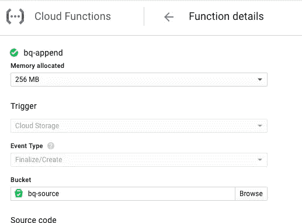

# Google Cloud Functions Python 概述和数据处理示例

> 原文：<https://medium.com/google-cloud/google-cloud-functions-python-overview-and-data-processing-example-b36ebde5f4fd?source=collection_archive---------0----------------------->

## 事件驱动的无服务器功能即服务

# 介绍

无服务器、FaaS(功能即服务)和 Python 是 2019 年任何构建或利用云服务的人的重要知识领域。云功能是一种轻量级的托管服务，您可以使用它来提高使用云的敏捷性。您可能希望为新架构考虑云功能，或者在使用多个云平台服务对现有工作流进行现代化时考虑云功能。

## 本文旨在让您熟悉 Google Cloud Functions，并演示 Cloud Functions Python runtime 的一些实际用法。

云函数是无服务器的，所以你可以运行代码而不用担心管理或扩展服务器。云功能可以很容易地与谷歌云平台(GCP)服务集成，你只需在代码运行时为资源付费。它们由您指定的触发器调用，并等待特定的事件或 HTTP 端点调用。

无服务器并不意味着你把现有的代码分割成函数来获得更低的成本和即时的自动伸缩。采用无服务器方法意味着利用托管服务，并允许您的提供商处理您的服务或应用的基本功能，然后使用云功能在这些服务之间充当粘合剂，以交付商业价值。

云功能支持微服务架构、数据管理管道，并允许您轻松地将 AI 集成到应用程序中。正如本文将进一步展示的那样，它们可以像胶水一样将 Google 云平台中的多个服务粘在一起，以交付一个服务，通过 ML 构建洞察，或者帮助数据流向 BigQuery。

由于云函数的执行时间约为 100 毫秒，因此可以实现近乎实时的流管道。它们应该是快速的代码片段，必要时很容易失败。主要先决条件是您在 node.js 或 Python 方面具有中等水平的技能。在本文中，我们将关注 Python 运行时。

有两种不同类型的云函数:HTTP 函数和后台函数。HTTP 函数由 HTTP 触发端点触发；后台功能由 GCP 服务的事件触发器触发。

**你可以用云函数做什么？**

*   **应用后端任务-** 响应来自云基础设施内部的事件。
    示例:消息发布到云发布/订阅，然后启动二级工作流。
*   **数据处理-** 运行代码以响应数据的变化。
    示例:文件上传到 Google 云存储，然后在 Cloud SQL 中更新元数据存储库。
*   **将人工智能集成到应用程序中-** 集成[谷歌云 ML API](https://cloud.google.com/products/ai/)对图像进行分类，分析视频，将语音转换为文本。
    示例:运行自然语言 API 来检测上传到 Google 云存储的 CSV 中的支持服务台票证摘要的情感。

# 执行环境和依赖性

*   在撰写本文时，云函数 Python 运行时基于 Python 3.7.1。
*   在撰写本文时，云函数服务使用基于 Ubuntu 18.04 的执行环境。
*   您的函数将包含在 main.py 中
*   您的函数可以使用第三方库和依赖项，并且应该包含在函数附带的 requirements.txt 中，每个库一行:

*   当您部署您的功能时，云功能服务使用 pip 下载并安装 requirements.txt 中声明的依赖项。
*   如果您需要使用特定版本的 pip、wheel 或任何标准 Python 包，请确保在 requirements.txt 文件中指定。

# 调用云函数

触发器决定了函数执行的方式和时间。当您部署云功能时，您必须选择一个将调用您的代码的触发器。这些是您将识别并计划随后发生的行动的独特事件。

**事件触发类型**

*   超文本传送协议
*   云发布/订阅
*   [云发布/订阅和云调度](https://cloud.google.com/scheduler/docs/tut-pub-sub)
*   云存储
*   Cloud Firestore(撰写本文时是测试版)
*   Firebase 身份验证(撰写本文时是测试版)
*   Firebase 分析(撰写本文时是测试版)
*   实时数据库(撰写本文时是测试版)
*   远程配置(撰写本文时是测试版)

**其他触发器** 您可以利用 GCP 服务的本地功能发挥创造力，进一步扩展支持发布/订阅的服务或任何提供 webhooks 的服务的触发器。

**从任何支持云发布/订阅的服务中触发**
因为发送到发布/订阅主题的消息可以调用云功能，所以很容易将云功能与其他支持发布/订阅的 Google 服务集成。例如，您可以将 stack driver[Cloud Logging](https://cloud.google.com/logging/docs/export/configure_export_v2)导出到 Cloud Pub/Sub 主题作为接收目的地，一旦消息发布到该 Pub/Sub 主题，您就可以执行某个功能。这对于与一个服务(比如 PagerDuty)集成以保持在关键日志通知之前是很有趣的。

从 GCP 日志事件到页面责任的无服务器通知

[Gmail 推送通知](https://developers.google.com/gmail/api/guides/push)可以配置为在 Gmail 收件箱发生变化时向发布/订阅主题发送消息。您是否使用 Gmail 收件箱来管理发票或部门活动？现在，您可以根据 Gmail 中的事件(收到的邮件)使用云功能启动辅助工作流程。

# 示例—云存储 AVRO/CSV 追加到 BigQuery

我喜欢的数据处理工作流的一个例子是使用云功能来执行无服务器的数据仓库更新。我只能找到由 [阿萨哈兰德](https://medium.com/u/cbc1f8582fd7?source=post_page-----b36ebde5f4fd--------------------------------)在 node.js 中完成的[这个场景，所以在这里用 Python 为你呈现。](/@asajharland/effective-data-loading-with-bigquery-batch-loading-flat-files-bf2fd0ebb325)

*用例*:假设你有一个精通 Python 的数据科学团队在 Jupyter 笔记本或[云数据实验室](https://cloud.google.com/datalab/)中工作。您的组织在 BigQuery 中有一个数据仓库，您正在通过笔记本使用它。您需要新的更新数据，因为您正在处理的样本集是静态的，已经有一段时间没有更新了。通过使用云存储作为您的源，一个介于两者之间的云功能，以及 BigQuery 作为您的目的地，您拥有了一个基本的数据管道，为您的分析和洞察提供新的数据。

使用 [object.finalize](https://cloud.google.com/functions/docs/calling/storage#object_finalize) 触发器每当新的 CSV 或 AVRO 被上传到指定的云存储桶时，云函数就使用 BigQuery API 将行添加到函数代码中的指定表。

下面是该体系结构寻找数据处理管道的方式:

下面是将云存储中的新 CSV 或 AVROs 追加到 BigQuery 表的函数代码:

*   确保将第 1 行中的 UPDATE_DATASET_HERE 和 UPDATE_TABLE_HERE 替换为您希望函数向其中追加行的 BQ 数据集和表名。
*   确保您上传的 CSV 或 AVRO 的第一行作为您的列标题(字段名称),与 BQ 中的目标表相匹配。

现在，通过在源存储桶上设置函数，每当上传新的 CSV 增量时，CSV 中的行将自动追加到您指定的表中。

# 包扎

本文的目标是帮助您理解在 Google 云平台上构建新的现代架构时的无服务器选项，比如云功能。如今，在构建新的应用程序或服务时，有许多托管选项可以为您提供不同类型的灵活性。云功能是粘合代码，可以使您的托管服务支持的应用程序或工作流更高效、更有洞察力。

扎克·坎特在[上发表了一篇关于无服务器的商业案例](https://techcrunch.com/2018/12/15/the-business-case-for-serverless/)的精彩文章，这要归功于[。这篇文章中使用的一些概念和描述改编自他的文章。](https://medium.com/u/514692b11743?source=post_page-----b36ebde5f4fd--------------------------------)