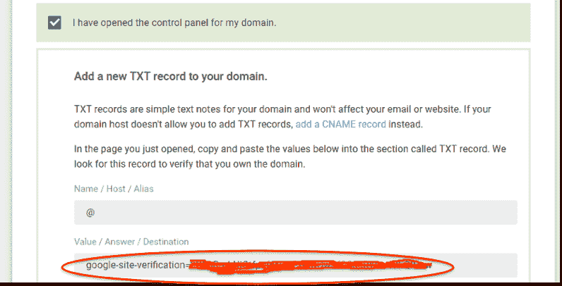

# Google Cloud 身份注册

> 原文：<https://medium.com/google-cloud/google-cloud-identity-sign-up-7c7744b7454f?source=collection_archive---------3----------------------->

## 概观

# 概观

参见[文档](https://support.google.com/cloudidentity/answer/7389973?hl=en&ref_topic=7555414)

# 签约雇用

有两条路可以走:

1.  [从谷歌云控制台注册](/@fargyle/google-cloud-identity-sign-up-9d97b7ae7bc1):

*   需要一个 GCP 项目和用于引导的计费帐户。
*   需要非托管(如 Gmail)谷歌身份
*   初始注册向导中的三个屏幕。
*   不需要基于电话的登录验证。

2.[直接进入基于网络的云身份注册向导](/@fargyle/google-cloud-identity-sign-up-fbb684d471cf)

*   引导不需要 GCP 项目和计费帐户
*   需要通过座机或手机进行登录验证
*   初始注册向导中的更多屏幕

# 验证域所有权

这将带您通过域验证；单击该链接，使用创建您的域时使用的身份或在域共享下添加的身份登录到您的域，然后在向导选项卡中单击您已成功登录，继续下一步。

如果其他人负责管理域名注册记录，只需选中此框即可获得他们将输入到 TXT 记录中的域名验证字符串。如果完成这一步需要一些时间，您可以从 admin.google.com 屏幕顶部的提示返回到验证向导。

选择您已经打开控制面板，继续下一步的指示:添加一个 TXT 记录

对于 Google domains，转到 Custom Resource Records 部分，从下拉列表中选择 TXT，复制/粘贴上面圈出的整个字符串，然后选择 Add

选择您已经保存了 TXT 记录以继续向导中的下一步，并选择验证域

如果验证向导在您的域注册管理机构输入所需的验证信息时被中断，请转到 admin.google.com 屏幕，并按照屏幕顶部的验证提示返回向导。

如果 TXT 记录更新尚未传播，您可能必须重试；验证完成后，您会看到一个确认对话框。

此时，您不需要创建用户，但是您需要单击按钮来继续向导中的下一步

选择您已经完成添加用户，然后选择下一步继续向导中的操作

# 分配用户

此时您不需要创建用户(您也可以打开[管理控制台](http://admin.google.com)来添加用户，从 CSV 加载用户，或者配置供应)。

# 确认云平台组织创建

这将创建与您的域相关联的 Google Cloud Platform 组织，并在 Google Cloud 控制台中进行最终确认

# 验证许可证

转到[管理控制台计费选项卡](https://admin.google.com/AdminHome?fral=1#DomainSettings/notab=1&subtab=subscriptions)查看免费身份订阅

初始配额为 50 个；如[所述，您可以在此](https://support.google.com/cloudidentity/answer/7295541)在线申请加薪。

# 分配一个 Google 云平台计费帐户(可选)

如果你将 Google Cloud Identity 与 Google Cloud Platform 结合使用，你会希望根据你的使用情况，遵循下面描述的两个过程中的一个；不要两者都做。

## 创建新的账单账户

按照流程记录下来[这里](https://cloud.google.com/resource-manager/docs/quickstart-organizations#create_a_billing_account)。

## 从另一个组织关联现有的开单帐户

在某些情况下，您可能希望[在多个组织中使用同一个计费账户](/@fargyle/google-cloud-platform-cross-org-billing-41c5db8fefa6)；例如，SaaS 产品的多租户子域。

# 下一步是什么

如这里所述[在线申请额外许可证。](https://support.google.com/cloudidentity/answer/7295541)