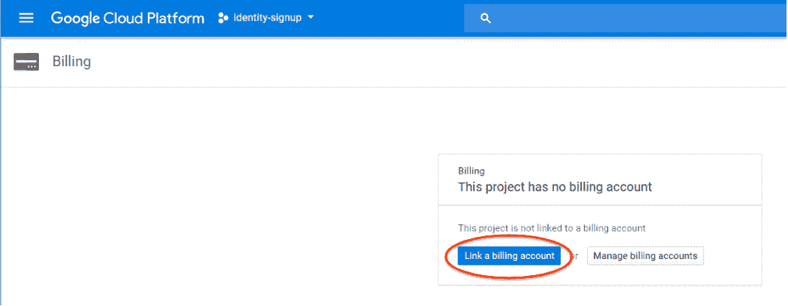
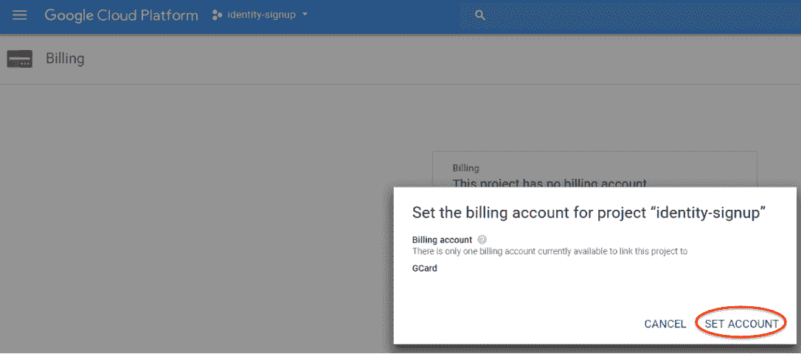
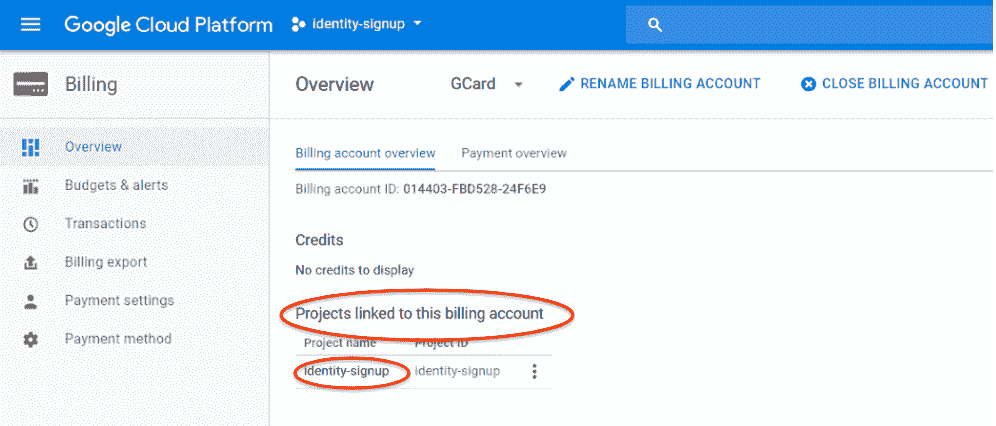
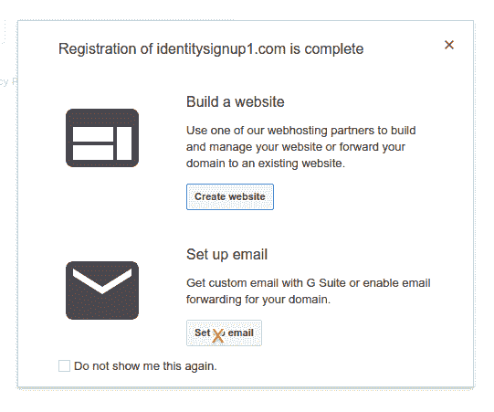
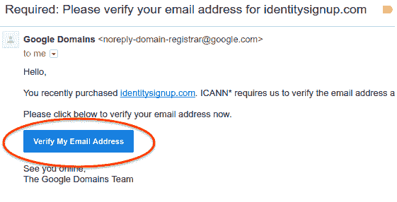
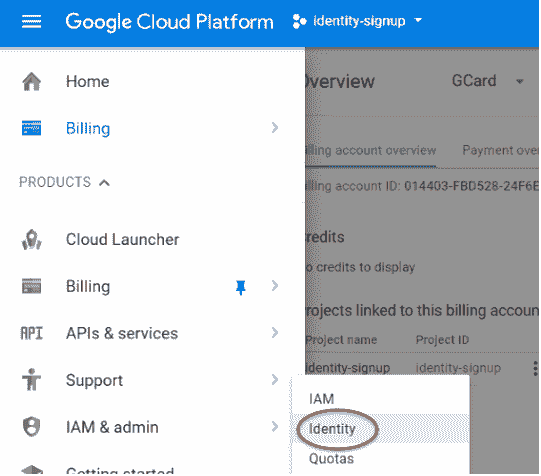
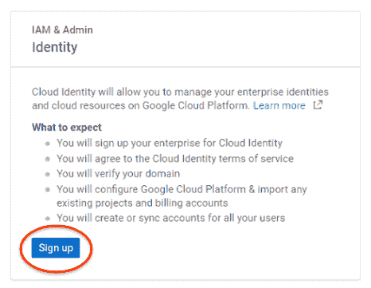

# Google Cloud 身份注册

> 原文：<https://medium.com/google-cloud/google-cloud-identity-sign-up-9d97b7ae7bc1?source=collection_archive---------4----------------------->

## 通过谷歌云控制台

如[概述](/@fargyle/google-cloud-identity-sign-up-7c7744b7454f)中所述，有两条途径可以注册 Google Cloud Identity 这描述了通过谷歌云控制台注册。

# 先决条件

## 未管理的 Google 身份

身份需要是不受管理的(如 Gmail)，即。尚未与 GCP 组织关联，能够创建尚未与组织关联的新项目。

*   这是因为在创建组织后创建的所有项目都自动属于该组织。

## 该身份所拥有的 GCP 项目

(稍后您将在设置中将它与您的云身份组织相关联)

## 与 GCP 项目关联的开单帐户

*   [创建计费账户](https://console.cloud.google.com/billing)(试用不工作)
*   用于创建组织的初始项目的开单帐户专门用于引导，而不用于为创建的组织内的项目或资源开单。
*   如果您仍然希望使用现有的付费账户，您应该能够遵循此处[描述的流程](/@fargyle/google-cloud-platform-cross-org-billing-41c5db8fefa6)。
*   将开单帐户与项目相关联

*   然后，您将看到这个确认屏幕；这里不需要更多的东西

## 领域

注册一个域名(如[谷歌域名](https://domains.google/#/)；需要 Google 身份(可以是 gmail)才能启动)

对于谷歌域名

*   **注册域时不要添加 GSuite 用户**:云身份注册向导将失败。
*   注册 G Suite 通过 Google Domains 建立了间接的业务关系，因此向导无法与 Google Cloud 建立直接的业务关系来获得云身份许可。

*   系统将提示您提供电子邮件地址
*   这可以是任何预先存在的地址；您只需要能够从您使用 GCP 项目所有者的同一个浏览器会话中使用它
*   转到您的电子邮件并验证您的电子邮件地址

# 注册云身份

*   选择[身份菜单项](https://console.cloud.google.com/iam-admin/cloudidentity)；只有当您拥有付费帐户(试用版无效)并且您的项目尚未与域关联时，它才可用。如果您没有看到此选项，您正在使用的身份可能是一个[托管身份](https://docs.google.com/document/d/1GYhpb5ISuwQZgkx9sNaLEY_C7flhJPU9C2IRsv8ZqYU/edit#heading=h.7v905jb7e62z)。

*   确认对话框将提供后续步骤的概述；选择注册

*   这将带你通过一个简化的注册向导

# 下一步是什么

完成[概述文章](/@fargyle/google-cloud-identity-sign-up-7c7744b7454f)中的以下步骤:

*   验证域所有权
*   分配用户
*   确认组织创建
*   验证许可证
*   分配计费帐户