# Google Cloud 身份注册

> 原文：<https://medium.com/google-cloud/google-cloud-identity-sign-up-fbb684d471cf?source=collection_archive---------2----------------------->

## 通过身份注册向导

如[概述](/@fargyle/google-cloud-identity-sign-up-7c7744b7454f)中所述，有两条途径可以注册 Google Cloud Identity 这描述了通过身份注册向导注册。

# 先决条件

## 座机还是手机

此过程需要通过座机或手机进行登录验证。

## 领域

注册一个域名(如[谷歌域名](https://domains.google/#/)；需要 Google 身份(可以是 gmail)才能启动)

对于谷歌域名

*   **注册域名时不要添加 GSuite 用户**:云身份注册向导会失败。
*   注册 G Suite 通过 Google Domains 建立了间接的业务关系，因此向导无法与 Google Cloud 建立直接的业务关系来获得云身份许可。

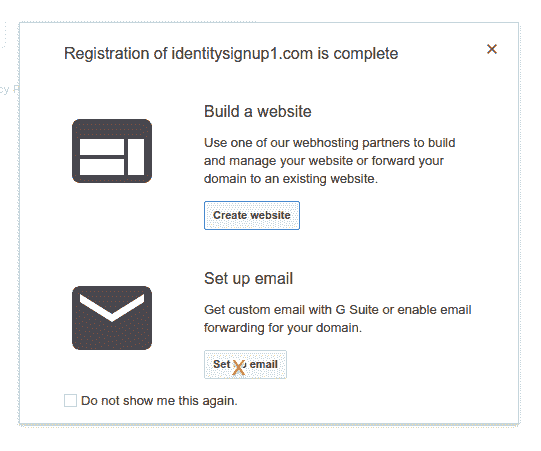

*   系统将提示您提供电子邮件地址
*   这可以是任何预先存在的地址；您只需要能够从您使用 GCP 项目所有者的同一个浏览器会话中使用它
*   转到您的电子邮件并验证您的电子邮件地址

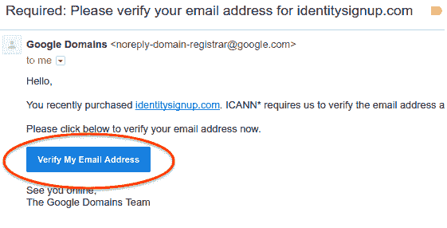

# 注册云身份

*   转到[注册向导](https://gsuite.google.com/signup/gcpidentity)

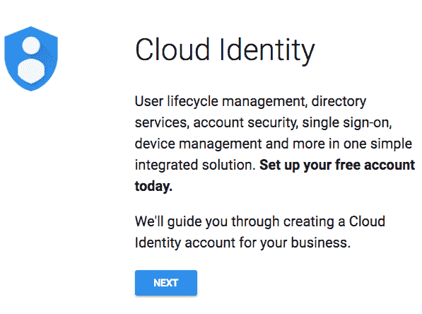

*   提供有关您的企业和位置的信息

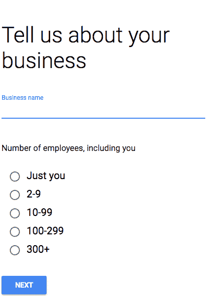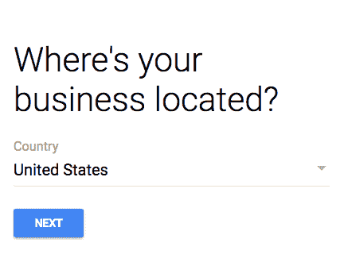

*   提供您的电子邮件地址；这可以是任何预先存在的地址；这是专门用来联系的

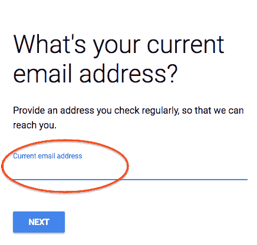

*   提供现有域名并确认；这将用于域验证。

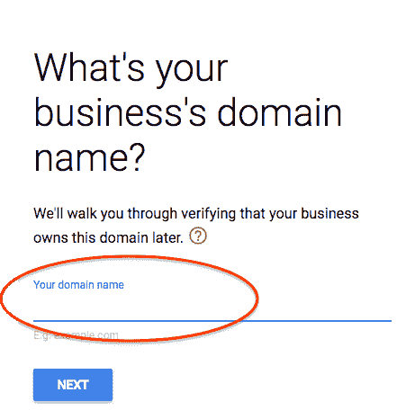

*   提供您要用于管理您的云身份域的名称；这是与您的帐户 id 相关的严格描述性信息

*   提供您要用于管理您的云身份域的 id 和密码，例如 admin，然后提交。

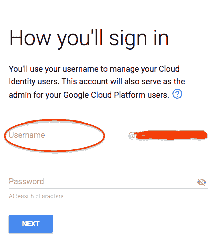

*   确认你不是机器人，同意条款和条件，并创建你的帐户

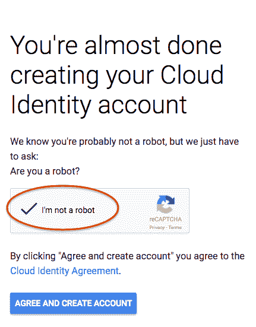

*   转到设置

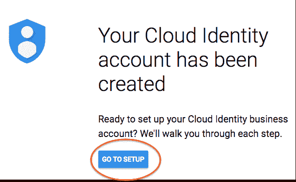

*   登录

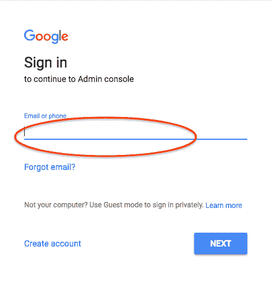

# 下一步是什么

完成[概述文章](/@fargyle/google-cloud-identity-sign-up-7c7744b7454f)中的以下步骤:

*   验证域所有权
*   分配用户
*   确认组织创建
*   验证许可证
*   分配计费帐户