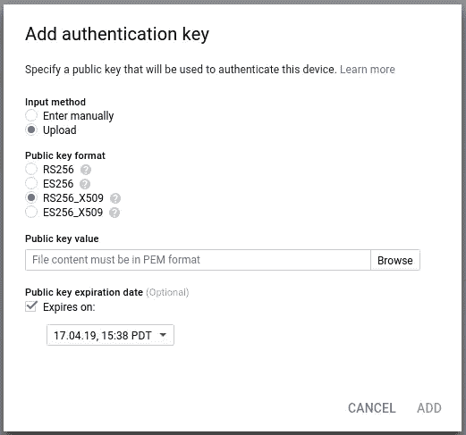

# 谷歌云物联网核心& Golang

> 原文：<https://medium.com/google-cloud/google-cloud-iot-core-golang-b130f65951ba?source=collection_archive---------0----------------------->

> **更新 2018–04–19:**mosquito 现正在 Omegas2 上工作。更新见本文末尾。

我有 2x 洋葱 Omega2s 三个，如果我能说服我的朋友埃里克把他那只快要落灰的捐出去。

> **更新 2018–04–18**:谢谢 Eric…我有 3 个洋葱 Omega2s…

昨天回顾欧米茄的开发者网站，我注意到[谷歌云平台](https://cloud.google.com)不在为这些设备记录的[云平台](https://docs.onion.io/omega2-docs/connecting-to-cloud-platforms.html)列表中(当然它们都工作)。

这篇文章试图通过提供将 Omega running [MQTT](http://mqtt.org/) 连接到谷歌云平台[物联网核心](https://cloud.google.com/iot-core/)的简单过程来解决这一缺点。毕竟，一致和安全地使用像 MQTT 这样的平台的一个优点是，所有好的云都集成了它([链接](https://cloud.google.com/iot/docs/how-tos/mqtt-bridge))。

## 设置

请遵循谷歌在[创建注册表和设备](https://cloud.google.com/iot/docs/how-tos/devices)下的指导。我的 Omegas 保留了它们最初的名称形式`omega-XXXX`，因此我将它们用作云 IoT 设备 id。

假设:

```
PROJECT=[[YOUR-PROJECT-ID]]
REGION=[[YOUR-REGION]]             # us-central1
REGISTRY=[[YOUR-REGISTRY-ID]]      # This is the short-from
DEVICE=[[YOUR-DEVICE-ID]]          # mine are omega-XXXX
TELEMETRY=[[YOUR-TELEMETRY-TOPIC]]
STATE=[[YOUR-STATE-TOPIC]]WORK_DIR=[[YOUR-WORKING-DIRECTORY]]
```

我为我的每台设备创建了一个自签名证书，并以设备命名。在这个过程中，我不清楚谷歌的文档，但是对于 RS256，你会想要这个变体([链接](https://cloud.google.com/iot/docs/how-tos/credentials/keys#generating_an_rs256_key)):

```
mkdir ${WORK_DIR}/certsopenssl req -x509 -nodes -newkey rsa:2048 \
-keyout ${WORK_DIR}/certs/${DEVICE}.key.pem \
-out ${DEVICE}.crt.pem \
-days 365 \
-subj "/CN=unused"
```

当您在云物联网核心中创建设备时，您应该选择`RS256_X509`密钥格式:



选择“RS256_X509”

> **NB** 当你运行 MQTT 客户端代码时，如果你收到一个错误`Unacceptable protocol version`很可能你的错误就在这一步。

云物联网核心用[云发布/订阅](https://cloud.google.com/pubsub)支持 MQTT。作为设置的一部分，您应该已经创建了`telemetry`(数据)和`config`(云发布/订阅)主题。

发送到没有订阅的 Pub/Sub 主题的消息——就像没有人听到的森林中倒下的树——不会被听到，因为它们被丢弃了。因此，请为`telemetry`主题创建一个订阅，以便当我们向 MQTT 发布消息时，这些消息在发送到 Cloud Pub/Sub 时不会被简单地丢弃:

```
SUB=[[YOUR-SUB-NAME]]
gcloud pubsub subscriptions create ${SUB} \
--topic=${TELEMETRY} \
--project=${PROJECT}
```

## 戈朗

谷歌的云物联网文档不包括 Golang 样本:-(

这对我来说很重要，但是通过使用来自优秀的 Golang [实现](https://github.com/eclipse/paho.mqtt.golang)的例子，来自 [Eclipse Paho 项目](https://www.eclipse.org/paho/)的例子，观察 Google 的 Python 和 Java 是如何工作的，以及——不可否认的——一些试错，我让我的代码工作了。

…然后才发现这个问题( [#267](https://github.com/GoogleCloudPlatform/golang-samples/issues/267) )和`take-cheeze`的代码。我没有试过这个开发者的代码，所以不能证明它。

这是我的:

这将受益于一系列的重构，但是出于演示的目的，我希望你能接受我的懒惰。这个代码是有效的。我最初包含了泛美卫生组织 TLS 样本中的一个部分，看起来是多余的，我删除了，但是…授权代码…只是唉。

对我来说，真正的挑战是让 MQTT auth 工作。云物联网使用 JWT 作为密码值，而不是使用设备的私钥进行身份验证，JWT 需要声明并由私钥签名。感谢 [troyk](https://gist.github.com/troyk) 提供的这个样本，它给了我很大的帮助:

[https://gist . github . com/troyk/3d cf 2c 39 b 38 a4 c21 a0e 63 D8 c8 aa 34123](https://gist.github.com/troyk/3dcf2c39b38a4c21a0e63d8c8aa34123)

好了，注册表和设备创建完毕，证书添加完毕，样本代码在手。在我们继续之前，我们需要获取 Google 的 CA 根证书，请确保这些证书在`${WORK_DIR}`中生效，或者在下一步运行`main.go`时修改参考:

```
wget [https://pki.google.com/roots.pem](https://pki.google.com/roots.pem)
```

然后:

```
PROJECT=[[YOUR-PROJECT-ID]]
REGION=[[YOUR-REGION]]
REGISTRY=[[YOUR-REGISTRY-ID]]
DEVICE=[[YOUR-DEVICE-ID]]go run main.go \
--device=${DEVICE} \
--project=${PROJECT} \
--registry=${REGISTRY} \
--region=${REGION} \
--ca_certs=./roots.pem \
--private_key=${WORK_DIR}/certs/${DEVICE}.key.pem
```

一切都好…

```
2018/04/17 16:41:24 [main] Entered
2018/04/17 16:41:24 [main] Flags
2018/04/17 16:41:24 [main] Loading Google's roots
2018/04/17 16:41:24 [main] Creating TLS Config
2018/04/17 16:41:24 [main] Creating MQTT Client Options
2018/04/17 16:41:24 [main] Broker 'ssl://mqtt.googleapis.com:8883'
2018/04/17 16:41:24 [main] Load Private Key
2018/04/17 16:41:24 [main] Parse Private Key
2018/04/17 16:41:24 [main] Sign String
2018/04/17 16:41:24 [main] MQTT Client Connecting
2018/04/17 16:41:24 [main] Creating Subscription
2018/04/17 16:41:24 [main] Publishing Messages
2018/04/17 16:41:24 [main] Publishing Message #0
2018/04/17 16:41:24 [main] Publishing Message #1
2018/04/17 16:41:24 [main] Publishing Message #2
2018/04/17 16:41:24 [main] Publishing Message #3
2018/04/17 16:41:24 [main] Publishing Message #4
2018/04/17 16:41:24 [main] Publishing Message #5
2018/04/17 16:41:24 [main] Publishing Message #6
2018/04/17 16:41:24 [main] Publishing Message #7
2018/04/17 16:41:24 [main] Publishing Message #8
2018/04/17 16:41:24 [main] Publishing Message #9
2018/04/17 16:41:24 [main] MQTT Client Disconnecting
2018/04/17 16:41:24 [main] Exited
```

并且，因为您创建了云发布/订阅`telemetry`主题的订阅。)收到这些消息后，让我们查询我们的订阅:

```
SUB_FULLNAME=projects/${PROJECT}/subscriptions/${SUB}gcloud alpha pubsub subscriptions pull ${SUB_FULLNAME} \
--project=${PROJECT} \
--limit=100 \
--format=json \
| jq '.[].message | {message: .messageId, published: .publishTime}'
{
  "message": "75227281854397",
  "published": "2018-04-17T23:41:24.861Z"
}
{
  "message": "75223205524150",
  "published": "2018-04-17T23:41:24.861Z"
}
{
  "message": "75213539702562",
  "published": "2018-04-17T23:25:10.488Z"
}
{
  "message": "75213538986457",
  "published": "2018-04-17T23:19:49.043Z"
}
{
  "message": "75207087277457",
  "published": "2018-04-17T23:11:33.648Z"
}
{
  "message": "75207142600447",
  "published": "2018-04-17T23:11:27.685Z"
}
```

**注意**您的数据会有所不同，但是您应该会收到一些(如果您多次拉取，不一定是 10 个)消息，这些消息具有与您运行代码时相对应的唯一的`message`id 和`published`时间(UTC)。

下一步是为 Omega2 编译 Golang:

```
GOOS=linux \
GOARCH=mipsle \
go build -a -installsuffix cgo -o cloudiot-golang-mqtt
```

使用设备的(！)ssh 密钥或您的首选用户名|密码:

```
BIN=./cloudiot-golang-mqtt
GOO=./roots.pem
KEY=${WORK_DIR}/certs/${DEVICE}.key.pemfor FILE in ${BIN} ${GOO} ${KEY}
do
  scp -i ~/.ssh/[[DEVICE-SSH-KEY]] \
    ${FILE} \
    root@${DEVICE}.local:/
done
```

然后，在进入机器并对新位置和二进制文件名称做了一些小的改动之后:

```
PROJECT=[[YOUR-PROJECT-ID]]
REGION=[[YOUR-REGION]]
REGISTRY=[[YOUR-REGISTRY-ID]]
DEVICE=[[YOUR-DEVICE-ID]]./cloudiot-golang-mqtt \
--device=${DEVICE} \
--project=${PROJECT} \
--registry=${REGISTRY} \
--region=${REGION} \
--ca_certs=./roots.pem \
--private_key=./${DEVICE}.key.pem
```

应该(！)工作……你的作者承认还没有尝试过这个…明天我在欧米茄上尝试过之后会更新这个。

**更新**:有效。太好了！

```
2018/04/18 04:08:23 [main] Entered
2018/04/18 04:08:23 [main] Flags
2018/04/18 04:08:23 [main] Loading Google's roots
2018/04/18 04:08:23 [main] Creating TLS Config
2018/04/18 04:08:23 [main] Creating MQTT Client Options
2018/04/18 04:08:23 [main] Broker 'ssl://mqtt.googleapis.com:8883'
2018/04/18 04:08:23 [main] Load Private Key
2018/04/18 04:08:23 [main] Parse Private Key
2018/04/18 04:08:23 [main] Sign String
2018/04/18 04:08:24 [main] MQTT Client Connecting
2018/04/18 04:08:25 [main] Creating Subscription
2018/04/18 04:08:25 [main] Publishing Messages
2018/04/18 04:08:25 [main] Publishing Message #0
2018/04/18 04:08:25 [main] Publishing Message #1
2018/04/18 04:08:25 [main] Publishing Message #2
2018/04/18 04:08:25 [main] Publishing Message #3
2018/04/18 04:08:25 [main] Publishing Message #4
2018/04/18 04:08:25 [main] Publishing Message #5
2018/04/18 04:08:25 [main] Publishing Message #6
2018/04/18 04:08:25 [main] Publishing Message #7
2018/04/18 04:08:25 [main] Publishing Message #8
2018/04/18 04:08:25 [main] Publishing Message #9
2018/04/18 04:08:25 [main] MQTT Client Disconnecting
2018/04/18 04:08:25 [main] Done
```

## 洋葱的 awsiot_setup.sh

> **更新 2018–04–19:**更新解决方案见帖子末尾。我尝试使用 MQTT 代理就是一个缺陷，解决方案只使用了`mosquitto_pub`和`mosquitto_sub`。请忽略这里的 bash 脚本，但我们将继续使用 Golang `makejwt`。

[O](https://raw.githubusercontent.com/OnionIoT/Onion-Scripts/master/awsiot_setup.sh) nion 提供了一个“单命令 AWS 物联网设置”[脚本](https://raw.githubusercontent.com/OnionIoT/Onion-Scripts/master/awsiot_setup.sh)，它将有助于转换到 GCP。该脚本将我们之前在 Golang 代码中使用的值作为参数，安装各种 Mosquitto 组件，并生成一个包含主题引用的`mosquitto.conf`文件。

这个脚本给我们带来的挑战是，AWS 使用 X509 证书认证，而 GCP 要求用户名|密码使用从设备的私钥和时间戳声明导出的 JWT 作为密码。

因为我们在 Golang 中已经有了这个功能，所以将它重新用于 bash 脚本是有意义的。

一项正在进行的工作！

gcpiot_setup.sh:

好吧，这可能真的有效！:-)我尝试使用 OpenWRT 容器在我的 Debian 工作站上运行，但是遇到了挑战(我做错了什么？)安装`mosquitto-ssl`。我切换到一个 Ubuntu 容器，它看起来工作正常，所以我有理由相信脚本工作正常。

我重新设计了生成 jwt 的 Golang 代码，以便在 bash 脚本中使用这一功能。所以，你需要:

像前面一样为 Omega2 设备构建这个:

```
GOOS=linux \
GOARCH=mipsle \
go build -a -installsuffix cgo -o makejwt
```

并像复制其他文件一样将其复制到设备:

```
BIN=./makejwt
KEY=${WORK_DIR}/certs/${DEVICE}.key.pemfor FILE in ${BIN} ${GOO} ${KEY}
do
  scp -i ~/.ssh/[[DEVICE-SSH-KEY]] \
    ${FILE} \
    root@${DEVICE}.local:/
done
```

> **NB**bash 脚本获取 Google 的 CA 根证书，这样你就不需要把它们复制到设备上了。
> 
> **NB**bash 脚本会为您执行`makejwt`命令，因此您不需要运行这个命令，但是如果您想要确认它是否工作:

```
./makejwt \
--duration=24 \
--project=[[YOUR-PROJECT-ID]] \
--private_key=/${DEVICE}.key.pem
```

在设备上创建脚本，从你的工作站复制或者从上面的要点复制。您将需要`chmod +x gcpiot_setup.sh`以便可以执行它。执行它并响应提示。您应该会看到类似于以下内容的输出:

```
Getting Google's CA Root Certificate
--2018-04-18 16:50:53--  [https://pki.google.com/roots.pem](https://pki.google.com/roots.pem)
Backing up existing mosquitto.conf⟶moquitto.conf.180418165053.bak
Creating JWT
2018/04/18 16:50:53 [main] Entered
2018/04/18 16:50:53 [main] Parse Flags
2018/04/18 16:50:53 [main] Load Private Key
2018/04/18 16:50:53 [main] Parse Private Key
2018/04/18 16:50:53 [main] Sign String
2018/04/18 16:50:53 [main] Exited
Generating Mosquitto new config for Cloud IoT MQTT Bridge
Restarting Mosquitto
 * Restarting network daemon: mosquitto
```

如果一切顺利，您应该能够:

```
service mosquitto status
 * mosquitto is running
```

而且，您应该能够:

```
DEVICE=[[YOUR-DEVICE-ID]]mosquitto_pub \
--topic \/devices/${DEVICE}/events \
--message '{"test": "Hello Henry!"}' \
--qos 1
```

这个不行:-(

我会感谢一些 MQTT 大师。(本地)MQTT 桥报告套接字错误。`projects/...`云发布/订阅主题名称显示正确。

```
mosquitto version 1.4.8 (build date Thu, 01 Mar 2018 09:34:49 -0500) starting
Config loaded from /etc/mosquitto/mosquitto.conf.
Opening ipv4 listen socket on port 1883.
Opening ipv6 listen socket on port 1883.
Bridge local.projects/$PROJECT/locations/$REGION/registries/$REGISTRY/devices/$DEVICE doing local SUBSCRIBE on topic \/devices/$DEVICE/events
1524082272: Connecting bridge bridge-to-gcp (mqtt.googleapis.com:8883)
1524082272: Bridge projects/$PROJECT/locations/$REGION/registries/$REGISTRY/devices/$DEVICE sending CONNECT
1524082273: Socket error on client local.projects/$PROJECT/locations/$REGION/registries/$REGISTRY/devices/$DEVICE, disconnecting.
1524082287: New connection from 127.0.0.1 on port 1883.
```

我做错了什么？

我很有信心`makejwt`能够工作，因为它与我在运行 Golang 客户端时能够显示的代码是相同的。错误出现在我对本地桥和远程桥之间的主题映射的配置中。

这肯定是在`mosquitto.conf`中的东西，因为，如果我从新的 Ubuntu 容器开始，下面的工作:

```
mosquitto_pub \
--host mqtt.googleapis.com \
--port 8883 \
--id ${LONG_REGISTRY}/devices/${DEVICE} \
--username unused \
--pw ${PASSWORD} \
--cafile /roots.pem \
--tls-version tlsv1.2 \
--protocol-version mqttv311 \
--debug \
--topic ${LONG_REGISTRY}/devices/${DEVICE}/events \
--message "$(date +"%y%m%d%H%M%S") Hello Henry!"
```

## 结论

JWT 和编写代码，munges 证书和密钥… booh！

Golang，MQTT，Google Cloud IoT，Omegas …耶！希望如此！！

**更新:正在工作！！**

感谢我的同事 Calum 让我走上了工作道路。Google Cloud IoT 不支持分经纪人模式。因此，在 Omega2s 上，我们不需要 MQTT 代理服务。相反，我们将使用`mosquitto_pub`和`mosquitto_sub`。

和以前一样，我们需要:

*   Golang `makejwt`双星
*   `roots.pem`
*   私人密钥

从您的主机上，将这些文件复制到 Omega2:

```
BIN=./makejwt
GOO=./roots.pem
KEY=${WORK_DIR}/certs/${DEVICE}.key.pem
for FILE in ${BIN} ${GOO} ${KEY}
do
  scp -i ~/.ssh/[[DEVICE-SSH-KEY]] \
    ${FILE} \
    root@${DEVICE}.local:/
done
```

然后，在 Omega2 上运行以下脚本来配置环境:

这应该会向 Google Cloud IoT 发布一条消息(如果您愿意，可以重复`mosquitto_pub`)。您可以通过使用以下命令检查遥测云发布/订阅主题上的订阅来确认这一点:

```
LONG_SUB=projects/${PROJECT}/subscriptions/${SUB}gcloud alpha pubsub subscriptions pull ${LONG_SUB} \
--project=${PROJECT} \
--limit=100 \
--format=json
[
  {
    "ackId": "QV5AEkw-...",
    "message": {
      "attributes": {
        "deviceId": "${DEVICE}",
        "deviceNumId": "1234567890123456",
        "deviceRegistryId": "${REGISTRY}",
        "deviceRegistryLocation": "${REGION}",
        "projectId": "${PROJECT}",
        "subFolder": ""
      },
      "data": "SGVsbG8gSGVucnkh",
      "messageId": "76695601755269",
      "publishTime": "2018-04-20T03:30:27.780Z"
    }
  }
]
```

并且，您可以尝试使用`mosquitto_sub`阻塞订阅调用，并订阅`/devices/${DEVICE}/config`上的 MQTT 主题:

```
mosquitto_sub \
--host mqtt.googleapis.com \
--port 8883 \
--id ${LONG_REGISTRY}/devices/${DEVICE} \
--username unused \
--pw ${PASSWORD} \
--cafile /roots.pem \
--tls-version tlsv1.2 \
--protocol-version mqttv311 \
--debug \
--qos 1 \
--topic /devices/${DEVICE}/config
```

在此命令等待期间，返回 Google Cloud 控制台，从“设备详细信息”中选择“更新配置”，然后向您的设备发送一些文本。或者:

```
gcloud iot devices configs update \
--project=${PROJECT} \
--region=${REGION} \
--registry=${REGISTRY} \
--device=${DEVICE} \
--config-data="Testing Henry!"
```

如果一切顺利，您应该会在 Omega2 的外壳上看到类似的内容:

```
Client projects/${PROJECT}/locations/${REGION}/registries/${REGISTRY}/devices/${DEVICE} sending PUBACK (Mid: 4)
Testing Henry!
```