# 谷歌云负载平衡器设置调整和观察

> 原文：<https://medium.com/google-cloud/google-cloud-load-balancer-setup-tweaking-and-observations-c12d704e6d52?source=collection_archive---------0----------------------->

## 概述和测试当今最强大的云负载平衡器

谷歌云负载平衡器(GCLB)是一个软件定义的全球分布式负载平衡服务。它使 GCP 用户能够在世界各地分发应用程序，并以极少的配置和成本扩展和缩减计算。它允许每秒 0 到 100 万个请求(rps ),没有预热。具有自动扩展功能的全球任播(单个 IP)的起价为 0.025 美元/小时或 0.6 美元/天或 18 美元/月。这是一项低成本且功能强大的技术，现在任何人都可以免费测试。

在这篇文章中，我将测试和演示 https://cloud.google.com/load-balancing/的[上突出显示的一些产品特性](https://cloud.google.com/load-balancing/)

# **概述和设置**

GCP 负载平衡器服务有几种部署类型。
全局外部:1。HTTP(S) —仅公共、单区域或多区域
2。SSL 代理、TCP 代理—仅公共、单区域或多区域
区域外部:3 .网络—公共、TCP/UDP、单区域
区域内部:4。网络—仅限内部，TCP/UDP。可以与#1 HTTP GCLB 结合使用。

在本文中，我们将测试#1 HTTP 公共负载平衡。

借助谷歌庞大网络的力量，GCLB 可以帮助改善最终用户的延迟。查看本文[此处](https://cloud.google.com/compute/docs/load-balancing/optimize-app-latency)了解更多测量和比较不同 GCLB 部署类型的延迟的详细信息。

> 健康检查、后端和前端是 GCLB 的核心要素。如果您希望快速设置负载平衡，请关注这些。

**健康检查**
你应该了解两种健康检查。负载平衡器需要#1，而#2 是额外的，以确保实例组的健康(自动修复)。
1。由负载平衡器使用，确保请求只发送到启动并运行的实例
2。由实例组用来重新创建按照您设置的标准不正常的实例。例如:HTTP 健康检查端口 80；如果 web 服务器失败，实例将被终止并重新创建。

运行状况检查设置在 UI 的计算引擎中，因为它们在 GCP 的多个地方使用。您也可以在没有负载平衡器的情况下对实例组运行健康检查。如果运行状况检查发现实例不正常，它将终止并重新创建。

GCLB 将为您管理实例运行状况，实例组将管理自动伸缩，因此请确保您已经根据自己的要求进行了配置和调整。你可以保持他们的基本；HTTP 端口 80，如果 web 服务器或实例失败，实例组将终止并重新创建一个新的。

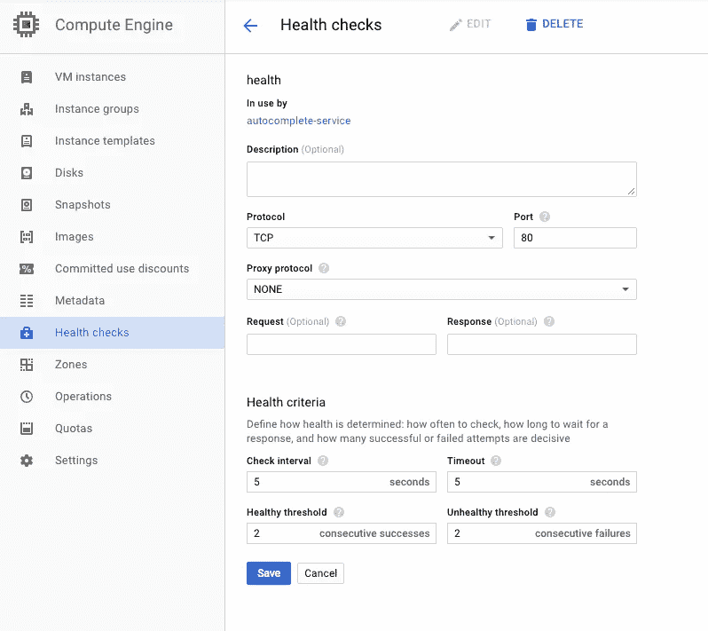

基本运行状况检查，确保 web 服务器启动并对实例做出响应

**后端服务** 这些是将传入流量导向实例组的服务。单个负载平衡器的后端服务可以包含许多后端或桶。您可以将一个后端服务分配给多个实例组。每个后端实际上是一个到实例组的链接，您希望在这些实例组之间分配流量。

假设您计划在 HTTP(S)负载平衡器后面设置 3 个实例组(美国、EMEA、亚洲),它们配置了 1 个后端服务。下面是后端服务使用我们之前创建的 health TCP health check 配置了 3 个实例组(后端)的样子。

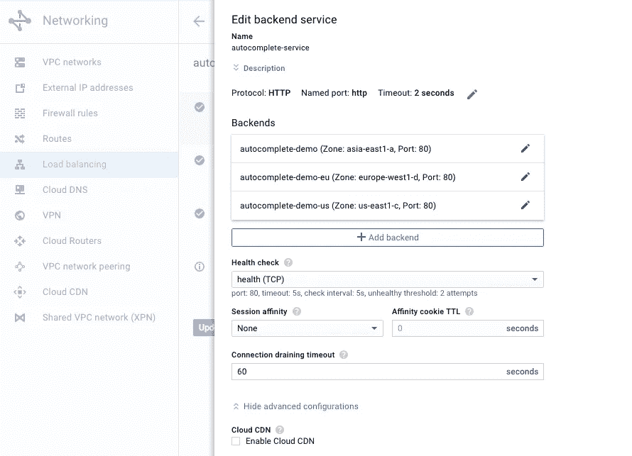

负载平衡器编辑后端服务

**主机和路径规则**
这是你可以发送子域或者不同主机到不同后端的地方。例如，如果我有 eu.mydomain.com，我可以将这些请求直接发送到我的 autocomplete-demo-eu 实例组。主机和路径规则会自动配置为*发送到您创建的后端服务，因此如果您正在进行基本的 http 负载平衡，就不必担心配置这些规则。

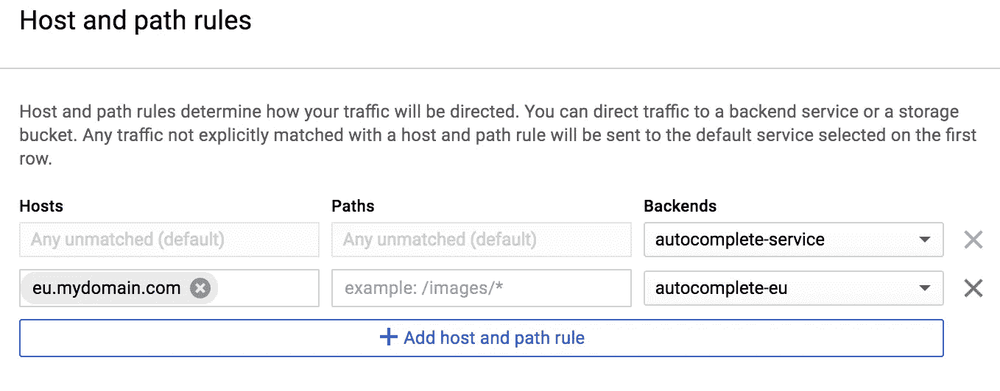

**前端** 前端就是你的虚拟 IP (VIP)或者在 GCP 叫做 anycast IP。一个前端可以服务多个区域(后端)。在大多数情况下，您会想要一个静态或保留的 IP，而不是默认的临时 IP。这样，您可以轻松地将云 DNS 区域文件上的 a 记录指向您的负载平衡器 IP。

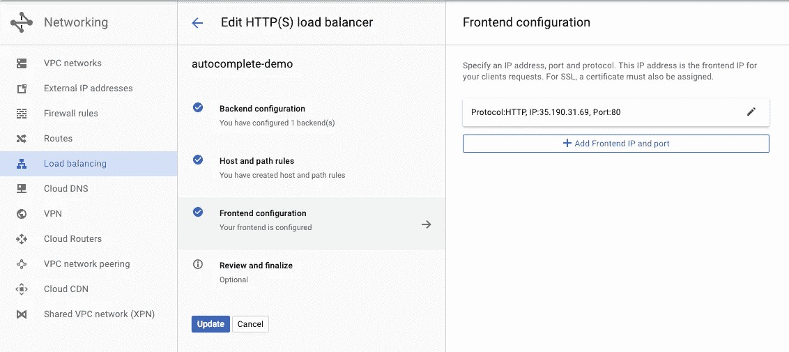

负载平衡器前端配置

这就是 GCP 负载均衡器的配置。简单吧。在几分钟内检查并更新配置后，您将有流量通过前端到达您的实例组。

# 调整 GCLB

**运行状况检查** 在将运行状况检查添加到实例组之后，门户提供⚠️建议。提供的警告是，您可能希望增加检查间隔和不健康阈值，如下所示。这有助于您减少服务在高负载下可能出现的误报数量。如果您刚刚开始，请考虑将检查间隔从 2s 更改为 10s，将不健康阈值从 2 次尝试更改为 6 次尝试。

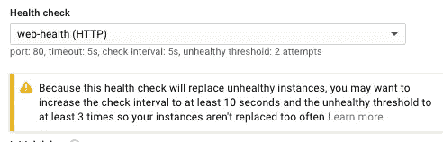

默认运行状况检查值警告

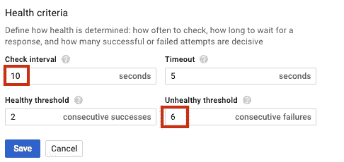

听听门户网站的建议！

**初始延迟** 这是实例组配置中的一项设置，用于指定实例被替换后再次运行健康检查的延迟时间。默认值为 300 秒，即 5 分钟。希望您的实例足够轻，可以在 1 分钟左右启动。如果您认为在通过实例组自动缩放操作进行初始引导后，您的应用程序可能需要更多的时间来联机，那么增加初始延迟。

**路由** 传入的客户端请求被发送到离用户最近的区域，假设该区域有容量。如果多个区域配置了后端，流量将分布在每个区域中。请查看以下我的行为观察，了解更多详情。在区域内，请求通过循环调度来分发。您可以通过配置关联性来覆盖区域中的循环调度。

典型地，LB 将把新的请求路由到任何实例，并且来自一个连接的流量将路由到相同的实例。假设您想要设置粘性，以确保来自一个客户端的所有连接都指向同一个实例。配置与客户端 IP 的会话相似性。也可以通过 cookie 设置。GCLB 在第一个客户端请求时发送一个 cookie，以后带有该 cookie 的传入请求将被发送到同一个实例。

**回扩实例或维护
或**容易，只需删除一个实例组的实例数。GCE 使该组中的所有实例脱机，并且不再向您收费。现在，您可以缩减规模或执行维护，也许可以将一个实例模板更改为某个地区的新版本软件。通过从负载平衡器后端删除实例组，使某个区域停止服务，以执行维护、测试或升级软件。然后重新添加该组，并在其他地区推行更改。

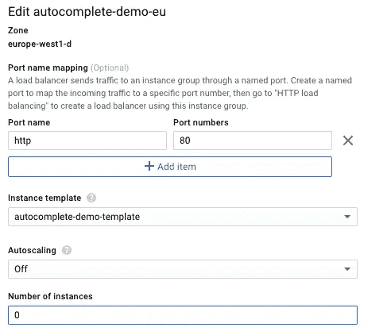

通过将实例数量降至 0，我的 europe-west1 实例组很快停止服务。

**最小规模
对于 LB 来说，获取新的实例信息会有一点延迟，所以运行一个至少有 2 个实例的 1 个实例组的后端可能不是一个好主意。多个实例组应该可以包含 1-2 个实例，只需注意并测试 GCLB 在拾取添加到组中的新实例时的轻微延迟。如果需要运行少量实例，调整初始延迟阈值。**

**IPv6 支持** 您可以将 IPv6 Ip 连接到 GCLB，并拥有与 IPv4 相同的全球路由类型。一种策略是为 GCLB 配置一个 IPv6 地址来处理所有 IPv6 流量。只需使用 IPv6 地址创建一个额外的转发规则。然后，您可以将 IPv6 和 IPv4 与同一个负载平衡器和后端实例相关联。更多关于 IPv6 支持的信息请点击这里。

# 观察

GCLB 是一项托管服务，旨在为您做出关于路由和流量整形的智能决策。下面是一些针对基本 http 负载平衡观察到的特定服务行为。

我使用 Apache Bench 从美国和欧盟实例进行连接测试。Apache Bench (ab)包含在 apache2 包中。更多关于 Apache Bench 测试的信息请点击这里。

**基于位置的路由和流量负载分布** 第一个测试是从 ab-tester 美国实例发送 10，000 个请求，并发 100 个，GCLB 直接路由到我的 us-east1 实例组。所以 GCLB 路由在✔️.很管用

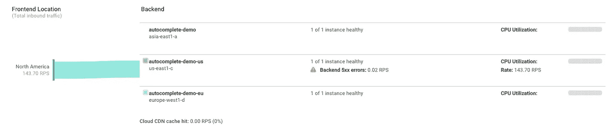

去往美国实例组的美国东部 Apache Bench tester 实例流量

这次，将来自欧盟 ab 测试人员的请求从 10，000 个增加到 100，000 个，最初路由到 europe-west1 实例组(蓝色)，然后分布到所有 3 个实例组以更好地处理负载。与此同时，我在欧盟的实例组扩展到 7 个实例，以接受大部分流量。具有最小配置和无缝自动扩展的智能负载平衡在✔️.非常有效

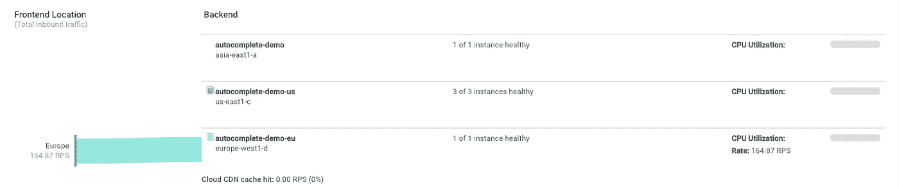

欧盟 Apache bench tester 实例将转到欧盟实例组

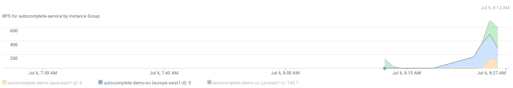

来自一个 EU 实例的 100，000 个请求最初流向我的 Europe 实例组(蓝色),随着请求的增加，峰值分布在所有 3 个可用的实例组中。

大约 30 分钟后，100，000 个查询的高峰过去了，实例组开始稳定下来并适度地缩减。

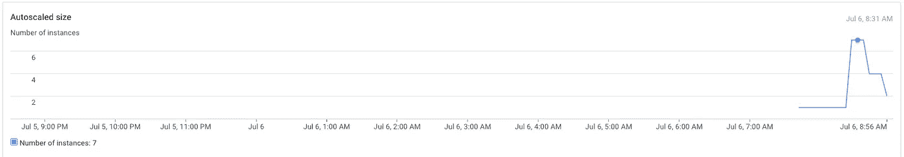

在流量高峰时，EU 实例组为 7 个实例

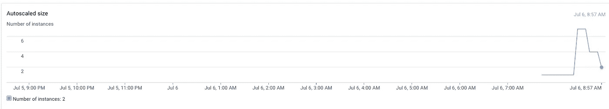

事件发生后，欧盟实例小组缩小了规模

利用智能自动扩展✔️.扩展和缩减资源

我打算对 GCLB 进行高达 100 万 rps 的压力测试，只是为了亲眼看看它的表现。在对超过 500，000 个 rps 实例做了更多测试后，我发现同样的行为得到了证实:跨区域的流量的完美路由和平衡。我很快就获得了对这项服务的信任，并为自己节省了测试成本。通过信任平台省了钱。✔️

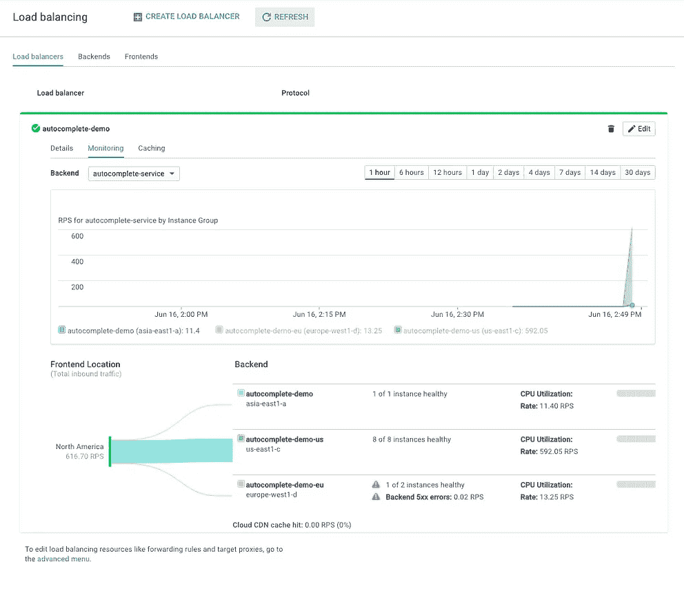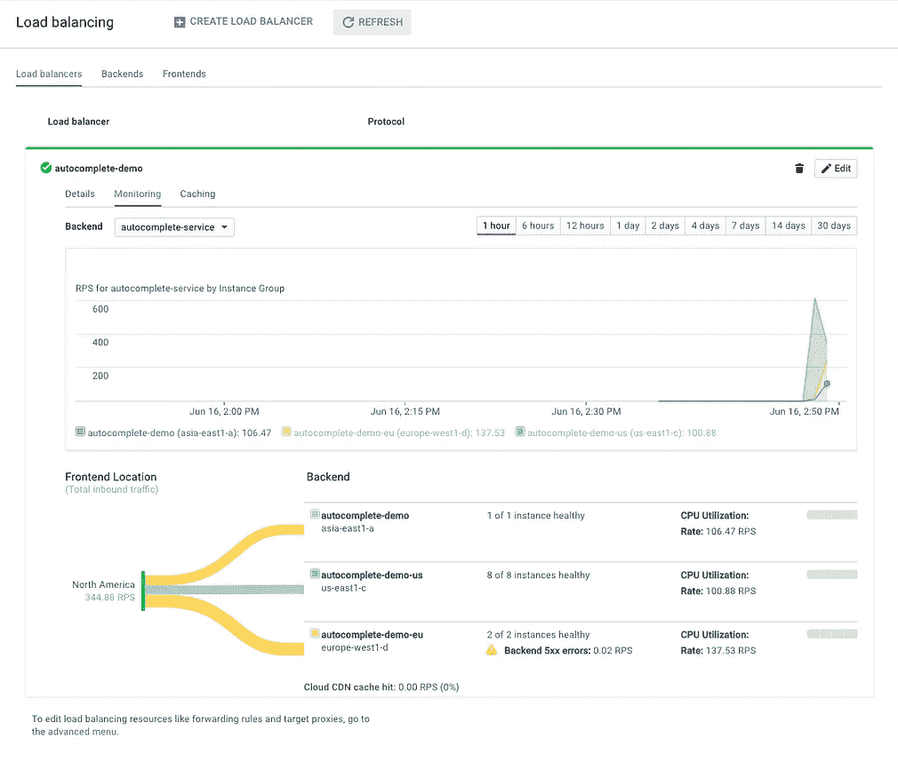

使用 Apache Bench 和 GCLB 进行更多负载测试

FWIW，这里是 HTTP 负载平衡示例的图表，显示了本文中涉及的一些元素以及每个元素所在的位置。

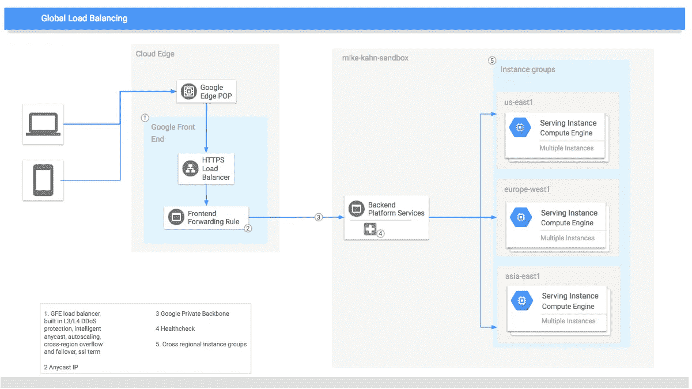

这篇文章描述了 GCLB 系统的高级别

如果你想了解更多关于 GCLB 的信息，请点击这里查看 Prajakta Joshi 总理为 GCP 网络团队举办的 Google Cloud Next’17 会议。她非常出色地详细解释了服务的背景和特点。

特别感谢 Prajakta 和 Jens 对本文的反馈。

感谢阅读，并与 GCP 玩得开心！