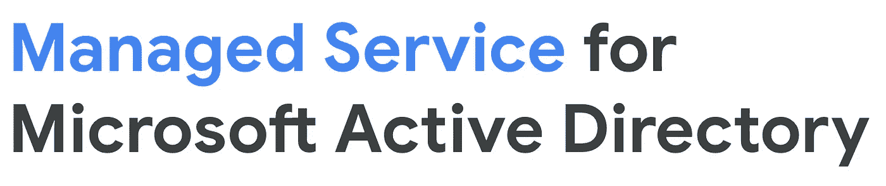
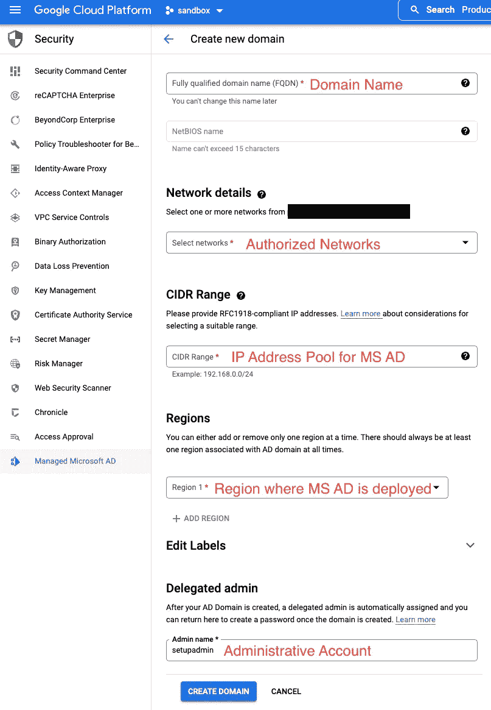
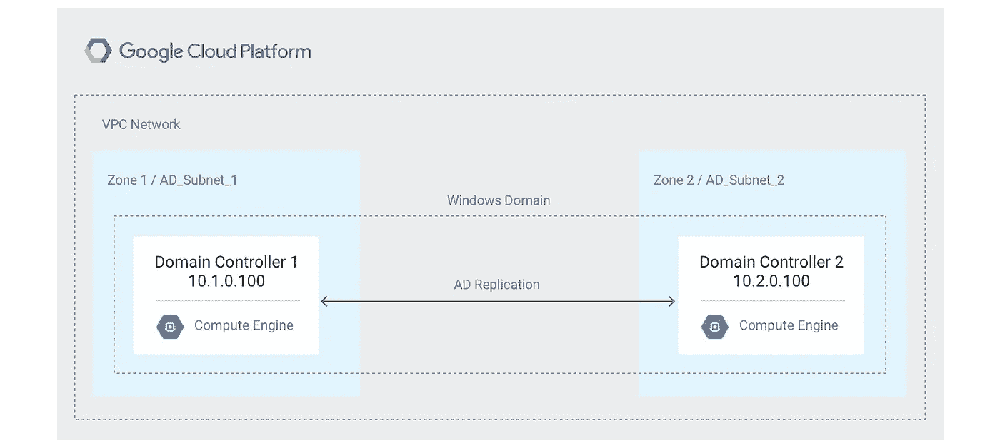
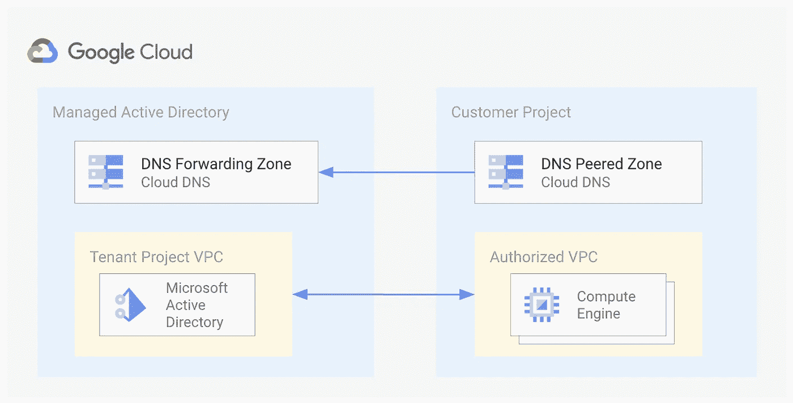
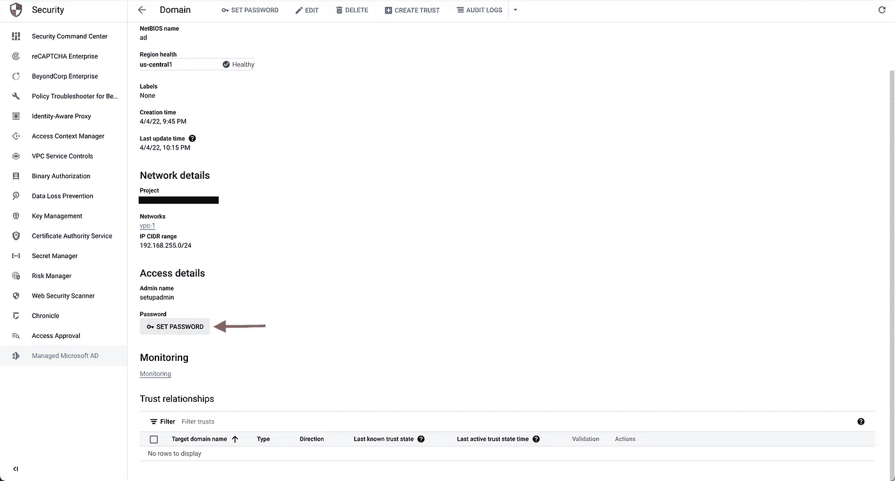
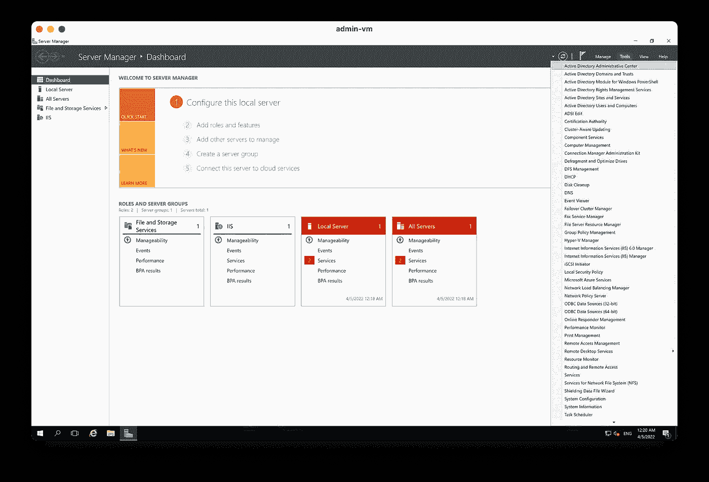
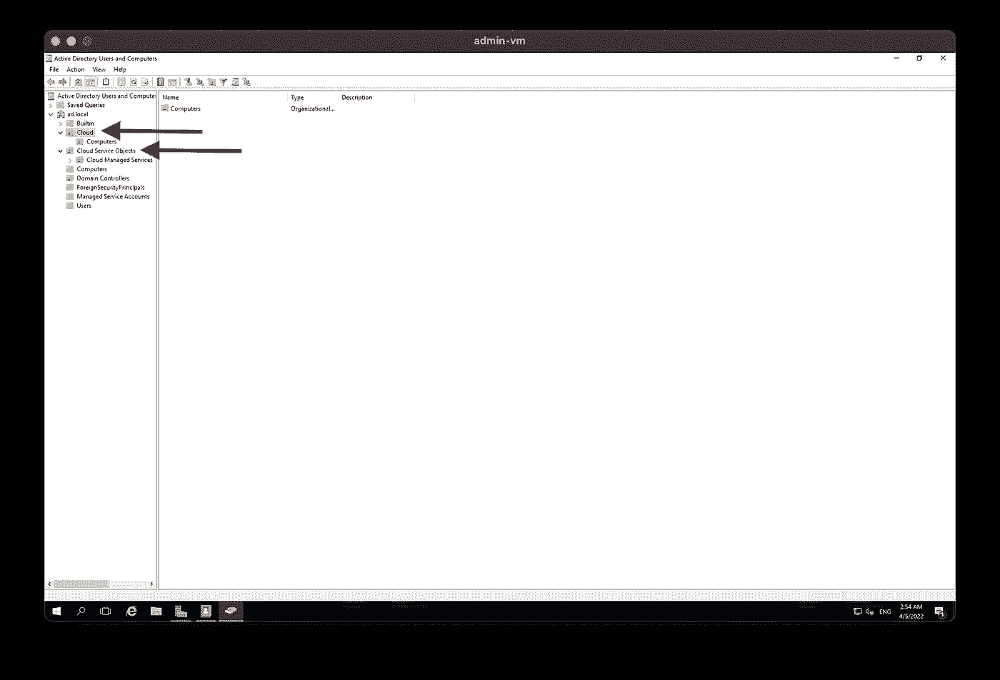

# 谷歌云:托管微软活动目录

> 原文：<https://medium.com/google-cloud/google-cloud-managed-microsoft-active-directory-d40e3cdfbba9?source=collection_archive---------0----------------------->



[托管微软活动目录](https://cloud.google.com/managed-microsoft-ad/docs/overview) (MS AD)是谷歌云平台(GCP)上的一款完全托管的活动目录软件即服务。像许多托管服务一样，MS AD 减少了自己运行服务的管理开销。设置很容易，因为你只需要五个输入。



好处:

*   局部性。靠近您在 GCP 的 Microsoft 工作负载的 Active Directory。
*   安全。[托管广告不暴露于互联网](https://cloud.google.com/managed-microsoft-ad/docs/hardening)。所有通信都是通过授权网络的私有 IP 进行的。
*   地理多样性。多个控制器可以部署在不同的区域。

基本拓扑镜像 GCPs [容错微软活动目录环境](https://cloud.google.com/architecture/deploy-fault-tolerant-active-directory-environment#architecture)。为了实现高可用性，在一个区域内的不同区域中总会部署两个域控制器。可以在其他区域部署额外的控制器，以实现多区域可用性。每个域支持多达四个[支持的区域](https://cloud.google.com/managed-microsoft-ad/docs/add-remove-regions#regions)。

[](https://cloud.google.com/architecture/images/fault-tolerant-ad-overview.png)

最小 GCP 容错 Microsoft Active Directory 体系结构

创建 MS AD 实例时，还会创建一个 [DNS 转发区域](https://cloud.google.com/dns/docs/zones/zones-overview#forwarding_zones)，这是一种特殊类型的[专用区域](https://cloud.google.com/dns/docs/best-practices)，其中的 DNS 记录仅在您的组织内部可见，并且在授权的 VPC 和 MS AD VPC 之间建立 DNS 对等。从您指定的 IP 地址池中为控制器分配动态专用 IP 地址。这些 IP 地址对您不可见，因此您使用控制器的完全限定域名而不是 IP 地址进行连接。

[](https://cloud.google.com/managed-microsoft-ad/docs/seamless-dns)

托管活动目录和项目之间的 VPC 和 DNS 对等

# 部署

Google 提供了一个 [Codelabs](https://codelabs.developers.google.com/codelabs/cloud-managed-ad) 供你试验。下面是该过程的总结和变化。这些步骤假定已经为您的工作负载创建了 VPC 和子网。

1.  启用 DNS 和托管身份 API。

```
gcloud services enable dns.googleapis.com
gcloud services enable managedidentities.googleapis.com
```

2.创建域控制器。指定将部署控制器的区域以及可以访问 MS AD 的授权 VPC(网络)。保留的 IP 范围是您选择的私有/24 IP 地址空间( [RFC 1918](https://datatracker.ietf.org/doc/html/rfc1918) )，并且在 AD 域中应该是唯一的。由于域控制器位于专用的 VPC 中，并使用 [VPC 对等](https://cloud.google.com/vpc/docs/vpc-peering)连接到其他 VPC，如果存在重叠子网，对等将不会建立。一个建议是 [192.168.255.0/24](https://cloud.google.com/managed-microsoft-ad/docs/selecting-ip-address-ranges) ，因为这是一个不常用的有效范围。

```
export PROJECT_ID=$(gcloud config get-value project)
export PROJECT_NUMBER=$(gcloud projects describe ${PROJECT_ID} \
    --format="value(projectNumber)")
export DOMAIN_NAME="ad.local"
export IP_RANGE="192.168.255.0/24"
export REGION="us-central1"
export VPC="vpc-1"gcloud active-directory domains create $DOMAIN_NAME \
--reserved-ip-range=$IP_RANGE \
--region=$REGION \
--authorized-networks=projects/$PROJECT_ID/global/networks/$VPC
```

验证部署状态。部署可能需要 60 分钟才能完成。

```
gcloud active-directory domains describe $DOMAIN_NAME
```

3.MS AD 域的默认用户名是“ [setupadmin](https://cloud.google.com/managed-microsoft-ad/docs/how-to-use-delegated-admin) ”。为 MS AD 设置密码。如果使用 GCP 控制台设置密码，密码只会出现一次，因此请注意。否则，您必须重新设置。

```
#Set MS AD password using the gcloud command
gcloud active-directory domains reset-managed-identities-admin-password $DOMAIN_NAME
```



使用 GCP 控制台设置 MS AD 密码

4.要管理您的 MS AD，请使用受[支持的 Windows 版本](https://cloud.google.com/managed-microsoft-ad/docs/os-versions#windows-domain-join)创建一个 Windows 虚拟机，作为管理虚拟机。因为不能直接访问 MS AD，所以您需要管理虚拟机充当客户端。此外，创建防火墙规则以允许 RDP 连接。最后，设置 windows 虚拟机密码。虚拟机可能需要 10 分钟才能就绪。

```
export REGION="us-central1"
export ZONE="us-central1-a"
export VPC="vpc-1"
export SUBNET="subnet-1"
export VM_NAME="admin-vm"#Create Windows VM
gcloud compute instances create $VM_NAME \
--zone=$ZONE \
--machine-type=n1-standard-2 \
--subnet=$SUBNET \
--network-tier=PREMIUM \
--scopes=https://www.googleapis.com/auth/cloud-platform \
--image=windows-server-2016-dc-v20181009 \
--image-project=windows-cloud \
--boot-disk-size=50GB \
--boot-disk-type=pd-standard#Create FW rule to allow RDP
gcloud compute firewall-rules create allow-rdp --network=$VPC --allow tcp:3389#Set Windows VM password
gcloud compute reset-windows-password --user=user1 $VM_NAME
```

5.使用 [RDP](https://cloud.google.com/compute/docs/instances/connecting-to-windows) 连接到管理 Windows 虚拟机。在我们的示例中，我们的 Windows 管理虚拟机是运行[服务器管理器](https://docs.microsoft.com/en-us/windows-server/administration/server-manager/server-manager)的 Windows 2016 服务器。你可以按照这个指南在 Windows 2016 上安装 RSAT:[安装远程服务器管理工具](https://www.hammer-software.com/how-to-install-remote-server-administration-tools-rsat-on-windows-server-2016/)[【RSAT】](https://docs.microsoft.com/en-us/troubleshoot/windows-server/system-management-components/remote-server-administration-tools)。在其他 Windows 版本上，RSAT 安装可能会有所不同。

提示:如果您不想使用 Windows GUI 安装，可以在 Windows Powershell(管理模式)中使用以下 cmdlet 来安装 RSAT，该 cmdlet 适用于 Windows Server 2016。

完成后，您应该在“工具”菜单下看到 Active Directory 工具。

```
Install-WindowsFeature -Name "RSAT-AD-Tools" -IncludeAllSubFeature -IncludeManagementTools -Confirm
```



安装在 Windows 服务器管理器中的 Active Directory 工具

6.[使用委派管理员帐户“setupadmin”和您生成的 MS AD 密码将管理虚拟机添加到域](https://docs.microsoft.com/en-us/windows-server/identity/ad-fs/deployment/join-a-computer-to-a-domain)。重新启动虚拟机以加入域。使用 delegated administrator 帐户再次登录，并使用您安装的 [AD 工具](https://cloud.google.com/managed-microsoft-ad/docs/how-to-use-delegated-admin#using_active_directory_domain_services_tools)来连接和管理 MS AD。谷歌计算引擎(GCE)虚拟机被预先配置为使用云 DNS，并且在授权的 VPC 和 MS AD VPC 之间建立 DNS 对等。因此，**虚拟机无需任何客户端配置即可发现 MS AD，**这是一个很好的运营优势。

托管微软 AD 提供[两个组织单元(ou)](https://cloud.google.com/managed-microsoft-ad/docs/manage-active-directory-objects):云和云服务对象。云是在您的托管 Microsoft AD 域中创建的，用于托管您的所有 AD 对象。您被授予对云 ou 的完全管理访问权限，并且只能更新云服务对象 OU 的某些属性。使用云 OU 创建用户、组、计算机或进一步的子 OU。



部署 MS AD 后，您可以考虑其他设计选项，如混合部署。额外的指南和注意事项列在进一步阅读部分。

## 进一步观察

谷歌云管理微软活动目录

```
**Further Reading**[Google Blog: Managed Service for Microsoft Active Directory is GA](https://cloud.google.com/blog/products/identity-security/managed-service-for-microsoft-active-directory-is-ga)
[CodeLabs: Cloud Managed Active Directory](https://codelabs.developers.google.com/codelabs/cloud-managed-ad)
[Google Cloud: MS AD Documentation](https://cloud.google.com/managed-microsoft-ad/docs)
[Microsoft: Active Directory Domain Services Documentation](https://docs.microsoft.com/en-us/windows-server/identity/ad-ds/active-directory-domain-services)
[Google Cloud: Managed Active Directory FAQ](https://cloud.google.com/managed-microsoft-ad/docs/faq)
[SADA Blog: Using GCP Managed Active Directory to Simplify Domain Authentication](/sada-engineering/using-gcp-managed-active-directory-to-simplify-domain-authentication-4d8b4a12985b)
[Google Cloud: Managed Microsoft AD Best Practices](https://cloud.google.com/managed-microsoft-ad/docs/best-practices)
[Google Cloud: Automatically created AD objects](https://cloud.google.com/managed-microsoft-ad/docs/objects)
[Google Cloud: Troubleshooting Managed Microsoft AD](https://cloud.google.com/managed-microsoft-ad/docs/troubleshooting)
[Google Cloud: Patterns for using Active Directory in a hybrid environment](https://cloud.google.com/architecture/patterns-for-using-active-directory-in-a-hybrid-environment)
[Google Cloud: Configuring Active Directory for VMs to automatically join a domain](https://cloud.google.com/architecture/configuring-active-directory-for-vms-to-automatically-join-the-domain)
```