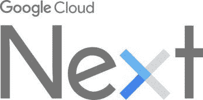

# Google Cloud Next’17

> 原文：<https://medium.com/google-cloud/google-cloud-next17-mete-atamel-on-wordpress-com-2a9b5b990c2d?source=collection_archive---------0----------------------->

在我之前的[帖子](https://meteatamel.wordpress.com/2017/01/17/one-year-on/)中，我承诺在接下来的几个月里谈论一些我正在参加或演讲的好会议。我最兴奋的会议之一是[Google Cloud Next’17:](https://cloudnext.withgoogle.com/)Google 的主要云会议将于 3 月 8 日至 10 日在三藩市举行。

去年，我以诺格勒的身份参加了那次会议。有很多开发者和很棒的技术含量。今年的[日程](https://cloudnext.withgoogle.com/schedule)刚刚公布，看起来更加令人兴奋，尤其是如果你是. NET 开发者的话！

第一个，不要脸的塞。我将在 Next’17 发表演讲，我的主题是[用谷歌云将你的 ASP.NET 应用提升到一个新的水平](https://cloudnext.withgoogle.com/schedule#target=take-your-asp-net-apps-to-the-next-level-with-google-cloud-49e51294-fb2f-4b21-ae0f-3a2aa36e5d2f)。我将谈论如何将现有的[ASP.NET](https://www.asp.net/)应用程序迁移到谷歌云，以及在谷歌云上运行你的 ASP.NET 应用程序会带来什么样的好处。这应该是一个信息丰富和有趣的谈话。NET 开发人员。

我也对[跑步感到兴奋。由乔恩·斯基特](https://cloudnext.withgoogle.com/schedule#target=running-net-and-containers-in-google-cloud-platform-8c00f315-02d2-4159-b82f-72eb4a9501c5)[和克里斯·史密斯](https://twitter.com/jonskeet)[主持的谷歌云平台](https://twitter.com/aChrisSmith)会议。本次会议将讨论如何将[ASP.NET 核心](https://www.asp.net/core)应用程序部署到应用程序引擎，并将 [Kubernetes](https://kubernetes.io/) 部署到容器引擎。ASP.NET 核心和 Kubernetes 在开发界都非常受欢迎，我很高兴谷歌云在很大程度上支持 Kubernetes 上的 ASP.NET 核心应用程序。

你可能不知道，但你可以在谷歌云上运行 Windows Server 和 Microsoft SQL Server，在 2017 年的下一届会议上，这两个平台都将推出。[在谷歌计算引擎上部署基于 Windows 的基础设施](https://cloudnext.withgoogle.com/schedule#target=deploying-windows-based-infrastructure-on-google-compute-engine-fc09d40a-153e-478d-a386-10ba809889ce)和[在谷歌计算引擎上部署微软 SQL Server](https://cloudnext.withgoogle.com/schedule#target=running-microsoft-sql-server-on-google-compute-engine-5160cb16-2359-4b4e-9d96-a678d9d12df5)应该都是了解所有细节的有趣会议。

除了那些伟大的窗户和。NET 会话、无服务器架构(云功能)会话、机器学习、数据流大数据处理听起来都很有趣。更不用说，在 Next 我们将会有大量的[代码实验室](https://codelabs.developers.google.com/?cat=Cloud)供人们亲身体验谷歌云。

作为一名. NET 开发人员，我有很多理由对下一个 2017 年感到兴奋。希望能在那里看到你们中的一些人！

*原载于 2017 年 1 月 19 日*[*meteatamel.wordpress.com*](https://meteatamel.wordpress.com/2017/01/19/google-cloud-next17/)*。*