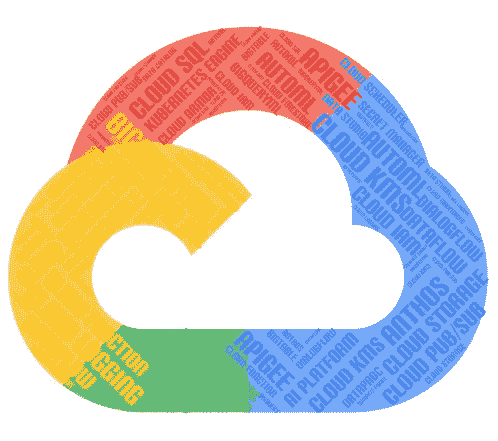
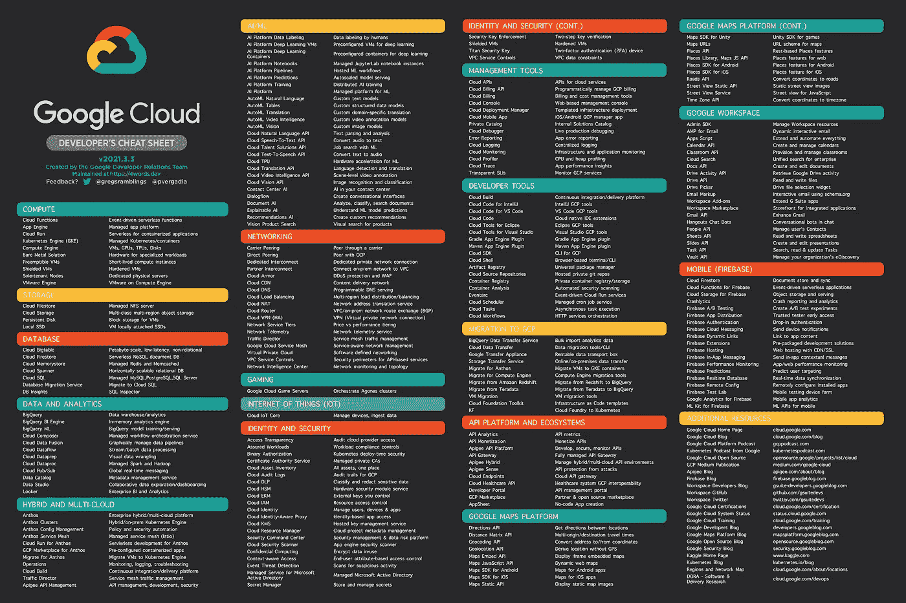

# 谷歌云平台——下一代云技术栈

> 原文：<https://medium.com/google-cloud/google-cloud-platform-a-nextgen-cloud-tech-stack-6de05939e42a?source=collection_archive---------0----------------------->

来源:[自己](/@prabhukkarthi-stb/about)

今天的谷歌云平台(GCP)不仅仅是作为市场上的其他云平台之一而迅速发展的！

**它是谷歌世界级顶尖、广泛使用的全球产品**的象征，如搜索引擎、YouTube、Gmail 等。，它使用了自己开发的内部技术和高端先进功能，这种技术已经试验了十多年。谷歌以 GCP 的名义开始向公众提供这些内部技术，最近还进入了云市场，但带来了许多你永远无法想象的先进功能！

迄今为止，大约 **228+ GCP 服务/谷歌 API**是谷歌提供的 GCP 技术栈的一部分！！！新的服务也正在出现。

来源:[谷歌开发者关系团队](https://raw.githubusercontent.com/gregsramblings/google-cloud-4-words/master/DarkPoster-lowres.png)

# 谷歌大查询

在各种可用的 GCP 服务中，最独特的服务是 Google BigQuery，它被认为是市场上正在发展的下一代数据仓库巨头。让我们看看 Google BigQuery 的特点，它是如何证明上述认证的。

Google BigQuery 是一个基于云的分析数据仓库解决方案，提供以下高级功能:

## 无服务器服务

要使用 BigQuery，不需要购买或安装任何存储服务器来启用 BigQuery。这是一种无服务器架构，在存储和计算能力的分配方面完全由 GCP 管理。唯一的用户活动是激活 BigQuery API，如果它是要用 BigQuery 启动的现有 GCP 项目。对于新项目，它是自动激活的。

## 自动扩展功能

BigQuery 能够在存储和计算方面扩展 Pb 级内存。根据入站数据量，BigQuery 自动分配必要的存储，并根据处理的数据量，将计算能力分配为插槽(即 CPU)。

## 无运营开销

软件补丁升级、陈旧数据存储清理等操作活动不会出现操作停机。所有操作活动都将由 BigQuery 执行，不会影响当时正在执行的工作负载。

## 高可用性

BigQuery 将存储在 COLOSSUS 中的数据复制到其他区域数据中心，这样即使主数据中心完全崩溃，其他数据中心也可以充当故障转移副本，为客户端请求提供服务，而不会造成任何中断。

## 现收现付模式

谷歌坚持 ***即付即付模式*** 的定价策略，即你将不得不为你使用的东西付费。基本遵循秒级定价。对于 BigQuery 定价，存储和处理是分开处理的。存储将根据存储的数据量收费，计算将根据处理的数据量收费。与其他供应商定价策略相比，这种模式更加以客户为中心，因为它避免了最终为未使用的资源付费，因为资源已经被采购。

## 批量摄入

BigQuery 允许批量摄取，批量摄取可以自由地将数据带入 BigQuery。这可以使用 SQL 查询或 BQ CLI 命令来完成，使客户端执行迁移活动或加载每日增量批处理数据以进行分析变得更加经济。在这种情况下，费用仅适用于存储和处理。

## 流式摄取

BigQuery 允许流接收，它支持以流的方式向 BigQuery 提供数据，但需要付费。这可以通过 BigQuery API 来完成，也可以通过其他场景来完成，例如数据可以通过数据流管道从发布/订阅流向作为数据接收器的 BigQuery。流式插入支持实时数据处理和 ML 预测。在这种情况下，流媒体、存储和处理都要收费。

## 数据传输

BigQuery 支持从云存储、YouTube 等各种来源，甚至从亚马逊 S3、Terradata、redshift 等其他云资源向 BigQuery 传输数据。，按计划进行。它还支持由于数据迁移中的任何中断或间隙而导致的数据回填。

## 电容器——自我优化存储技术

BigQuery 优化了存储技术——电容器，这是一种列格式，是一种基于传入数据进行调整的自我优化功能，有助于将数据存储在压缩的分发文件系统 COLOSSUS 中。它遵循各种编码技术以及加密过程来实现这一点。电容器将被调整到新的数据，并将继续更新存储机制，并相应地调整存储在巨像中的数据。

## 结构和数组

利用 BigQuery 存储技术，它引入了特殊类型的数据类型，即结构和数组。结构是嵌套在主表中的容器或表，与其他传统数据仓库相比，它可以避免连接以获得更好的性能。数组是存储数组中列值的重复字段，有助于优化存储以防止静态列值重复。使用 UNNEST 查询，我们可以取消表的嵌套并检索数据。

## 地理数据

BigQuery 支持地理位置数据，并提供各种地理功能来执行各种操作，甚至有一个名为 *Geography* 的数据类型来存储它。

## 预定查询

BigQuery 有自己的调度器，用于调度 BigQuery 中的查询和工作负载。支持标准 SQL，最低调度频率为 15 分钟。

## 联邦查询

BigQuery 允许可能具有外部源的联合查询，即允许在 BigQuery 外部执行请求，无论它可以是云存储还是传统数据库，也可以通过 EXTERNAL_QUERY 函数建立连接。

## 脚本

像其他传统的数据仓库一样，BigQuery 也支持用户定义函数(UDF)和过程等脚本。UDF 可以用 SQL 或 Javascript 编写，它获取输入并执行一些操作，然后返回输出。它可以是暂时的，也可以是持久的。过程是包含各种 SQL 脚本的容器，包括顺序运行的 DML。程序总是持久的。

## 用于报告的 BI 引擎

报告工具，如 Data Studio、Looker、Tableau 等。，可以通过称为 BI 引擎的特殊报告功能在 BigQuery 中查询其数据源，BI 引擎在几秒钟内执行查询，并使用内存存储提供结果。要使用此功能，您必须预先定义可充电的内存存储。

## 查询缓存

BigQuery 将查询输出写入缓存表。此结果将在 24 小时内可用，如果在此时间范围内再次执行请求，那么如果结果满足某些条件(如执行精确的查询文本、实际表中的数据不应在此期间更新等),则从缓存表中检索结果，而不收取处理费用。，这有助于避免相同结果集的计算费用。

## 安全访问控制

BigQuery 支持从高级到超低级别的高度安全的访问控制。它支持组织、文件夹、项目、数据集、表，并且最近开始支持非常低级的列和行安全性。对于列级和行级访问控制，即使拥有更高级别权限的用户也总是需要特殊权限才能访问它们。

## 大查询 ML

BigQuery 是唯一的数据仓库，它提供在数据仓库内构建机器学习(ML)模式和训练，而不是切换到单独的 ML 功能。模型在数据实际存储的位置进行训练，从而消除了数据传输和延迟。BigQuery 目前支持基本的 ML 模型，并提供用户友好的 SQL 来在几个小时内构建模型。

## BigQuery Omni

关键的标志是支持混合云模型的 BigQuery Omni。利用计算和存储之间的分离，它可以分析驻留在 AWS、AZURE 等其他云平台上的数据，而无需借助 Anthos 进行数据传输。这种方法只会产生处理成本，从而打开了多云解决方案的大门！

## 木星网络

Google 的主干——Jupiter——一个千兆比特的网络能力，使得 BigQuery 成为一个独特的数据仓库。由于其 Pb 级规模，无论是 GCP 服务还是混合云服务之间的数据传输和检索速度都超出了任何人的想象，这是对其他云平台的重大改进！

## BigQuery 预订

BigQuery 预订有助于转换定价策略。默认情况下，定价方法是按需定价。该特征有助于客户在统一费率的基础上转换购买插槽，这有助于他们的计费被预测或将保持在相同的预期价格。有时，他们可能会在两种定价模式之间切换，并根据需要灵活地将它们仅应用于特定的项目或工作负载。

## 管理资源图表

BigQuery 提供了一个新的监视功能——管理员的管理资源图表包括特定窗口期间在不同级别(如组织、文件夹、子文件夹、项目、用户或作业级别)的插槽使用情况、作业并发性和作业性能。通常，云日志记录/监控仅支持在云控制台中可视化项目级统计数据。这个特性现在消除了这些障碍，并提供了一个整体视图，特别是对于 BigQuery 管理员来说，可以经济地规划未来。显示的统计数据是实时的，它可以存储 14 天的历史。只有当客户是 BigQuery 预订用户时，此功能才被激活。

## 结论

正如我们所看到的，BigQuery 的一些高级功能旨在提供经济高效的解决方案。在每一个功能中，谷歌都精心计划并合理地确定了哪些价格可以经济地给出，哪些价格可以很贵。总的来说，BigQuery 是一个高性价比的数据仓库，具有其他云没有想到的各种高级功能，并且一直在发展，特别是 BigQuery Omni，支持混合云与 Jupiter 高级网络的 ML 被证明是下一代数据仓库。这个独特的 Google BigQuery 服务是 GCP 平台力量的证明！

在我看来，虽然市场目前正朝着混合云解决方案发展，但随着这些进步和现代化，GCP 正在变得越来越强大，以超越市场，并将在不久的将来主导大部分云业务！

熟练的 GCP 工程师在市场上至少需要几十年！

## 参考

 [## BigQuery 文档|谷歌云

### 将数据仓库迁移到 BigQuery 了解迁移内部数据的模式和建议…

cloud.google.com](https://cloud.google.com/bigquery/docs)