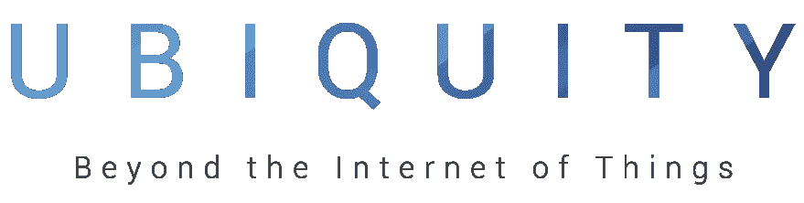

# 2016 年普适开发峰会上的谷歌云平台

> 原文：<https://medium.com/google-cloud/google-cloud-platform-at-ubiquity-dev-summit-2016-ffe0943812b9?source=collection_archive---------0----------------------->

开发者拥护者正忙着构建令人敬畏的演示，以在[普适开发峰会](https://ubiquity.withgoogle.com/)上展示！如果你错过了，这里有四个很好的演讲，向你展示如何构建物联网设备来利用云的力量。

快速构建:GCP 云旋转的形成——[布雷特·麦高恩](https://twitter.com/bretmcg)

使用容器和 gRPC 的实时物联网— [马克·曼德尔](https://twitter.com/Neurotic)

为云服务构建物理可视化— [布莱恩·多尔西](https://twitter.com/briandorsey)

使用 Node.js 和 Firebase 构建物联网原型— [Jenny Tong](https://twitter.com/MimmingCodes)

Julia Ferraioli 与 Glowforge 的创始人兼首席执行官 Dan Shapiro 讨论了他的公司、众筹、初创企业等问题。

朱莉娅·费拉奥利与格洛福特公司首席执行官丹·夏皮罗的炉边谈话

Amy Unruh 领导了一个代码实验室“在云端处理和分析实时事件流”。[设置指令](https://gist.github.com/amygdala/7c324a6c7a93467881cd)和[实验室](http://j.mp/ubiquity-workshop-doc)本身都在线。