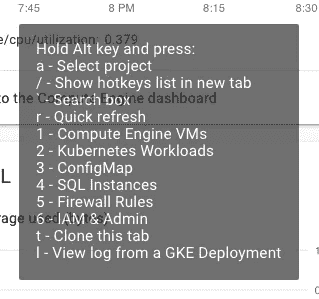

# 谷歌云平台控制台快捷方式

> 原文：<https://medium.com/google-cloud/google-cloud-platform-console-shortcuts-4a6bacb7230f?source=collection_archive---------2----------------------->

处理多个(> 20 个)项目时，通过点击这里和那里在部分和项目之间切换来浏览 GCP 控制台是非常耗时的。

没有看到可用的键盘热键，所以我开发了一个小的[Tampermonkey](http://tampermonkey.net/)[userscript](https://openuserjs.org/scripts/nchicong/GCP_Console_Shortcuts)来避免点击&等待。以下是我根据我的团队的常用情况整理的一些热键。

 [## 关于| GCP 控制台快捷方式|用户脚本| OpenUserJS

### 谷歌云平台控制台快捷方式

openuserjs.org](https://openuserjs.org/scripts/nchicong/GCP_Console_Shortcuts) 

最常用的快捷方式

你一天点击这个搜索框多少次？为什么不是键盘热键

你可以编辑脚本来定制热键以满足你的需要，方法是进入 Chrome 中的 TamperMonkey 扩展的仪表板/选项。

希望有所帮助！

非常欢迎反馈和合作者。