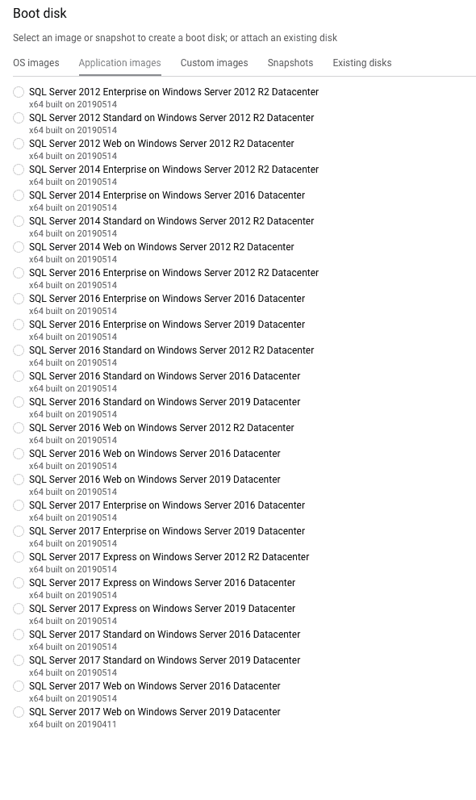
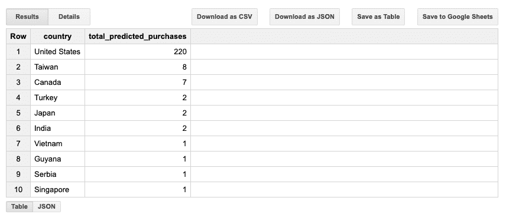
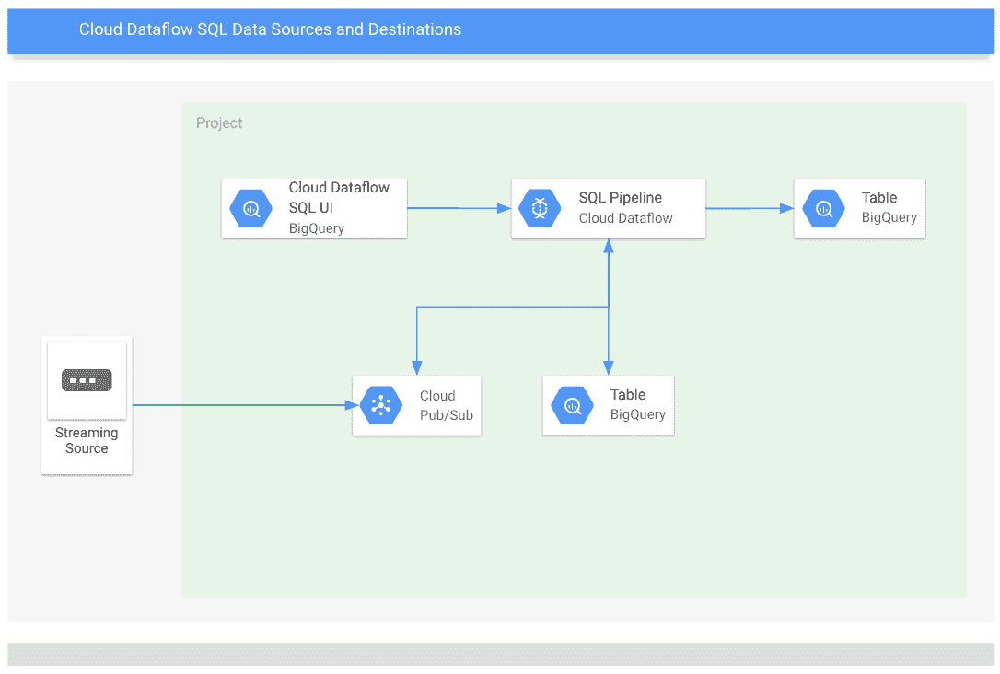

# 面向 SQL 从业者的谷歌云平台

> 原文：<https://medium.com/google-cloud/google-cloud-platform-for-sql-practitioners-2b2e4507535e?source=collection_archive---------3----------------------->


图片借用自[谷歌云平台博客](https://cloud.google.com/blog/products/databases/google-cloud-databases-named-a-leader-in-the-forrester-wave-database-as-a-service-q2-2019)

本文的目的是概述谷歌云平台(GCP)中的 SQL 特性。本文面向当前使用 SQL 并希望了解当前在 Google 云平台上使用 SQL 技能的选项的任何人。

# Windows Server 上的 MS SQL Server

如果你想在 GCP 上运行 MS SQL Server，你有几个选择，IaaS BYOL、IaaS 和完全托管。在 GCP 的 Windows Server 上运行 MSSQL Server 有几个好处:

*   [最快的实例启动时间](https://cloud.google.com/blog/products/gcp/three-steps-to-compute-engine-startup-time-bliss-google-cloud-performance-atlas?m=1)
*   [快速高性能全球网络](https://cloud.google.com/products/networking/)
*   快速磁盘吞吐性能—固态硬盘持久磁盘(高 IOPS)
*   本地连接的 SSD 上的 Tempdb 和 windows 分页文件(最高 IOPS)
*   自定义实例大小

## 自带执照(IaaS BYOL)

如果您的组织有限制物理硬件使用的许可要求或服务提供商许可协议(SPLA)，您可以使用[谷歌计算引擎(GCE)的单一租户节点](https://cloud.google.com/compute/docs/instances/windows/bring-your-own-license/bringing-your-own-license-sole-tenant-nodes)。这些实例允许您将自定义映像导入 GCE，使用它来启动一个实例，并启用就地重启，以便 VM 在同一物理服务器上重启。通过使用单一租户节点，您可以确保虚拟机运行在完全专用于您的硬件上，同时限制物理核心的使用。为了证明您的服务器用于报告堆栈，驱动程序监控允许[确定用于报告和导出服务器 id 的服务器使用](https://cloud.google.com/compute/docs/instances/windows/bring-your-own-license/determining-server-usage)。[关于使用现有微软应用许可的更多信息](https://cloud.google.com/compute/docs/instances/windows/ms-licensing)。

## 按实例成本支付许可费(IaaS)

如果您没有物理硬件许可证要求，您可以用您的实例成本支付 Google 云平台上的 [SQL Server。这是在 GCP 上开始使用 SQL Server 的最简单的方法，不需要前期成本和按秒计费。这是一个灵活的许可选项，允许您像购买云基础架构一样购买许可，按需购买，按需付费。](https://cloud.google.com/sql-server/)



谷歌云平台上的 SQL Server 映像(2019 年 6 月)

## 针对 SQL Server 的云 SQL(完全托管)

如果您希望在一个完全托管的服务中运行 SQL server，其中提供商负责为您管理实例, [Cloud SQL for SQL Server](https://cloud.google.com/sql/) 正在发布，并且在撰写本文时处于 alpha 阶段。云 SQL 负责备份、复制、修补和更新，并具有读取副本以进行横向扩展等功能。云 SQL 有 10TB 的存储限制，因此如果您需要超过 10TB，您需要考虑其他选项(或者清理您的数据库:)。

更多关于谷歌云平台上的 SQL server[点击这里](https://cloud.google.com/sql-server/)。

# 使用 SQL 的数据仓库和处理

我们之前讨论了 SQL 的 MSSQL server 关系事务处理用例。现在，我们将介绍在 GCP 上使用 SQL 进行分析处理。

Bigquery 是一个非常强大的无服务器、高度可扩展的数据仓库，内置在 Google 云平台上的内存 BI 引擎和机器学习。BigQuery 的理念是专注于分析，而不是基础设施。

企业使用 BigQuery 来获得洞察力，并对千兆字节到千兆字节的数据运行极快的 SQL 查询。要了解关于 BigQuery 的更多信息，请查看产品页面[这里](https://cloud.google.com/bigquery/)。在本文的剩余部分，我们将介绍一些 SQL 从业者可能感兴趣的 BigQuery 的更具体的特性。

## BigQuery 标准 SQL

如果您是一名经验丰富的 SQL 管理员，您可以使用您的 SQL 经验来操作 BigQuery。BigQuery 有一个名为[标准 SQL](https://cloud.google.com/bigquery/docs/reference/standard-sql/) 的模式，它符合 SQL 2011 标准，支持嵌套和重复数据，允许用户定义函数和 DML。

如果您是 SQL 管理员，您可以在 BigQuery 中使用 SQL 查询进行数据转换、分析，甚至是机器学习。

MS SQL Server 和标准 SQL 的语法和功能非常相似，在大多数情况下，您将在查询中更改函数或数据类型，如[DATEADD](https://www.w3schools.com/sql/func_sqlserver_dateadd.asp)vs[DATE _ ADD](https://www.w3schools.com/sql/func_mysql_date_add.asp)。

Sqllines.com 有很好的 SQL Server 向 MySQL 迁移参考资源[这里](http://www.sqlines.com/sql-server-to-mysql)。

SQL server:

```
WHEN (PurchaseDate < DATEADD(MM,+1,GETDATE()) AND (PERIOD_DATE__A >= DATEADD(MM,+1,GETDATE()) OR A.PERIOD_DATE__A IS NULL))
```

SQL 标准:

```
WHEN (DATE(PurchaseDate) < DATE_ADD(Current_Date, Interval 1 month) AND ( a.PERIOD_DATE__A >= CAST(DATE_ADD(current_date, Interval 1 month) AS string) OR a.PERIOD_DATE__A = ‘’) )
```

更多关于标准 SQL 参考资料[请点击](https://cloud.google.com/bigquery/docs/reference/standard-sql/)。

## 大查询机器学习

[BigQuery ML (BQML)](https://cloud.google.com/bigquery-ml/docs/bigqueryml-intro) 使用户能够使用标准 SQL 查询在 BigQuery 中创建和执行机器学习(ML)模型。BQML 使得数据分析团队可以访问 ML，并使 SQL 从业者能够使用现有的技能构建模型。

大型数据集上的 ML 通常需要 python 经验和 ML 框架知识。在组织中，这些要求仅限于一小部分个人，在许多情况下，组织的现有数据团队还不具备这些技能。这些组织中有许多数据分析师了解他们公司的数据，但他们的机器学习和编程技能有限或缺乏。

分析师可以使用 BigQuery ML 在 BigQuery 中构建和评估 ML 模型。分析师不再需要将少量数据导出到电子表格或其他应用程序中，或者等待数据科学团队提供有限的资源。

那么 SQL 从业者可以在 BigQuery 中完成什么类型的洞察和机器学习呢？为了开始理解 BigQuery ML，可以使用来自多个 BigQuery 数据集数据来训练和预测模型。

BigQuery ML 支持的机器学习模型类型:

*   用于预测的线性回归。例如，未来某一天某一商品的销售额。
*   用于分类的二元逻辑回归。例如，确定客户是否会购买。
*   分类的多类逻辑回归。例如，预测输入的低值、中值或高值。
*   用于数据分割的 k-均值聚类。例如，识别客户群。

有了模型(数据集)并运行了 [ML 之后。评估](https://cloud.google.com/bigquery-ml/docs/reference/standard-sql/bigqueryml-syntax-evaluate)函数查询，您可以使用您的模型使用 [ML 来预测结果。预测](https://cloud.google.com/bigquery-ml/docs/reference/standard-sql/bigqueryml-syntax-predict)功能。

示例查询:

```
#standardSQL
SELECT
 country,
 SUM(predicted_label) as total_predicted_purchases
FROM
 ML.PREDICT(MODEL `bqml_tutorial.sample_model`, (
SELECT
 IFNULL(device.operatingSystem, “”) AS os,
 device.isMobile AS is_mobile,
 IFNULL(totals.pageviews, 0) AS pageviews,
 IFNULL(geoNetwork.country, “”) AS country
FROM
 `bigquery-public-data.google_analytics_sample.ga_sessions_*`
WHERE
 _TABLE_SUFFIX BETWEEN ‘20170701’ AND ‘20170801’))
GROUP BY country
ORDER BY total_predicted_purchases DESC
LIMIT 10
```

结果:



这是基于谷歌分析数据的预测购买总量。

更多关于 BigQuery ML [的信息，请点击这里](https://cloud.google.com/bigquery-ml/docs/bigqueryml-intro)。

## 云数据流 SQL

[云数据流 SQL](https://cloud.google.com/dataflow/docs/guides/sql/dataflow-sql-intro) 允许您使用 SQL 查询在 BigQuery UI 中开发和运行云数据流作业。数据流 SQL 使用 [Beam SQL](https://beam.apache.org/documentation/dsls/sql/overview/) ，这对 SQL 从业者来说很重要，因为以前你只能用 Java、Python 或 Go 语言编写 Apache Beam 或数据流管道。这个功能为 SQL 从业者开辟了一个全新的数据处理领域。

你能用它做什么:

1.  从 SQL 中的 BigQuery UI 开发和运行流管道
2.  将流(来自云发布订阅)与快照数据集(大查询表)连接
3.  将结果写入用于分析和仪表板的 BigQuery 表中



目前，您只能从 PubSub 主题或 BigQuery 表中读取数据，并向 BigQuery 表中写入数据，但是我确信将来会启用更多的数据源和目的地。

云数据流 SQL 的一些可能用例

*   通过 PubSub 将 AppEngine 中的应用程序事件与 BigQuery 中的其他监控系统数据集结合起来，以获得更丰富的系统洞察力
*   将 [Google Analytics 实时报告 API](https://developers.google.com/analytics/devguides/reporting/realtime/v3/) 与营销分析 BigQuery 中的 CRM 或销售表数据相结合

如果你对 SSIS 有经验，并且正在寻找一个基于 UI 的 ETL 服务，也可以考虑[云数据融合](https://cloud.google.com/data-fusion/)。虽然目前它不包括 SQL 功能，但它是一个免费的 GCP 本地 ETL 管道服务。

本文旨在概述 GCP 的一些 SQL 选项，展示 SQL 在 Google Cloud 上是如何以多种方式得到支持的。最后，本周[谷歌云数据库提名了 Forrester Wave 数据库即服务的领导者，Q2 2019](https://cloud.google.com/blog/products/databases/google-cloud-databases-named-a-leader-in-the-forrester-wave-database-as-a-service-q2-2019) 。

我希望这篇文章有助于展示 SQL 从业者可以在 Google 云平台上尝试的一些选项！