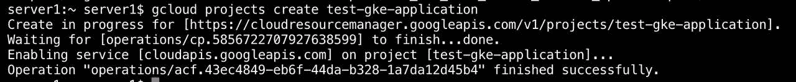

# GCP:谷歌 Kubernetes 引擎-入门指南

> 原文：<https://medium.com/google-cloud/google-cloud-platform-gke-and-kubernetes-deploying-that-app-1c5494a7d711?source=collection_archive---------3----------------------->


谷歌云平台是谷歌的荣耀云服务，是为了给 AWS 和 Azure 一个机会。谷歌的角度是让我们品尝他们内部使用的堆栈。像 AWS 一样，它的战略似乎是用产品和服务压倒我们，现在有 100 多种产品，而且还在增加。这里值得一提的包括:应用引擎(PaaS)，云功能(FaaS)，谷歌 Kubernetes 引擎(CaaS)，谷歌计算引擎(IaaS)等等。

另一方面，Kubernetes 是谷歌最好的东西之一。它代表了容器领域多年的迭代，以大规模生产实际可行的东西，并提供给大众。我认为大众喜欢它。从 Docker Swarm 开始，它已经成为首选的容器管理工具。这很讽刺，因为几乎每个人都用它来管理 Docker 容器。总之，他们比 Docker 更好地管理 Docker 容器。最重要的是，Kubernetes 还支持其他容器运行时——比如[容器 id](https://containerd.io/)和 [Rkt](https://coreos.com/rkt/) ，所有这些都使它成为一个伟大的产品。

然而，尽管 Kubernetes 有其辉煌的一面，但操作起来却是一种危险。设计有几个移动的部分，所有这些都给管理带来了挑战。为此，谷歌推出了谷歌 Kubernetes 引擎(GKE)，这基本上是他们的“容器即服务”平台。这里的逻辑很简单，为什么要购买一台虚拟机，花费数不清的时间安装和设置 Kubernetes，然后需要一群工程师来管理它呢？当你可以让 Google 管理你的 Kubernetes 集群，而你只需要担心你的应用程序。听起来像一个公平的前提，因为他们是这里的专家。这有很多好处。google 工程师的企业级支持，跨区域的高可用性，无需购买虚拟机并跨区域分发它们，以及 cos，集成到常用的 Google 产品套件中，我指的是用于身份管理、存储服务等的 IAM。就像我说的，公平的前提。

所以，让我们看看它是否值得大肆宣传！

**你需要以下的**:

1.  [谷歌云账号](https://cloud.google.com)——顺便问一下，你已经在玩积分游戏了吗？没有吗？还没有？真的吗？哦，我知道，我知道——你不喜欢免费的东西。抱歉，我问了，我道歉！(*谷歌提供价值 300 美元的 365 天订阅信用…..我只是说*
2.  我假设你已经学完了这一部分，准备开始了。如果没有，在这里检查我的安装。
3.  `kubectl` -又来了....我做了更多的假设....不然的话...你知道该怎么做(这里安装)

太好了！！让我们开始…

首先创建一个项目

```
gcloud projects create test-gke-application
```



配置您的区域。点击[此处](https://cloud.google.com/compute/docs/regions-zones/)查看适合您的区域列表。我会选择美国中央电视台。

```
gcloud config set compute/zone us-central1-a
```


太好了，现在让我们把这东西兜一圈！

让我们从建立 Kubernetes 集群的漫长过程开始

```
gcloud container clusters create gke-test-app
```


事实上，女士们先生们，就是这样！这就是打包到一行代码中的整个过程。如果你认为这是一个骗局，检查你的门户网站。


印象深刻吧！

旁注，如果您发现自己盯着这个错误

> *错误:(g cloud . container . clusters . create)response ERROR:code = 403，message=Kubernetes 引擎 API 没有为此项目启用。请确保在谷歌云控制台中启用，然后重试*

请确保您启用了 GKE 服务的计费功能。转到`Kubernetes Engine -> Clusters`并在您的门户网站上启用计费。如果你使用的是付费层，很可能意味着你没有付费( ***尴尬停顿*** )。

当然，从一端到另一端需要摇摆不定，显然这种默认部署并不是万能的。

因此，有一些选项可以传递给容器`clusters create`命令。当前的默认部署配备了一个 **3 节点集群，总共 3 个虚拟 CPU，11.25GB 内存和 n1 个标准 1 实例**。

显然，所有这些都是可以改变的。我们以后再讨论！

您可以查看集群的 3 个工作虚拟机。

```
gcloud compute instances list
```


接下来，让我们确保`kubectl`可以顺利到达您的集群。

```
kubectl cluster-info
```


所以，现在我们尝试部署一项服务。我们将尝试从 google 的存储库中部署一个示例应用程序。

好了，我们开始吧！

```
kubectl create deployment hello-web --image=gcr.io/google-samples/hello-app:2.0
```


这里显示部署现在已经开始


现在让我们将端口 8080 暴露给互联网流量，当然是使用负载平衡器。

```
kubectl expose deployment hello-web --type=LoadBalancer --port 80 --target-port 8080
```


这是已经运行的服务


就这么简单。只需几个命令，你的服务就完成了。


厉害！

这还不是全部。你总是可以用更多的显著特征来推进信封。例如，您现在可以为此部署设置扩展策略，并在集群中拥有 5 个、10 个、20 个甚至 30 个副本，设置最小和最大数量。在此基础上，您还可以将 CPU 利用率限制在某个百分比以下，比如 80%。所有这些都在一个命令中完成！

简单对！就这样，您的简单应用程序已经投入生产，不费吹灰之力。

运行 GKE 就是它承诺的开箱即用的简单性。可以说，这可能是目前运行 Kubernetes 堆栈最简单的方法！