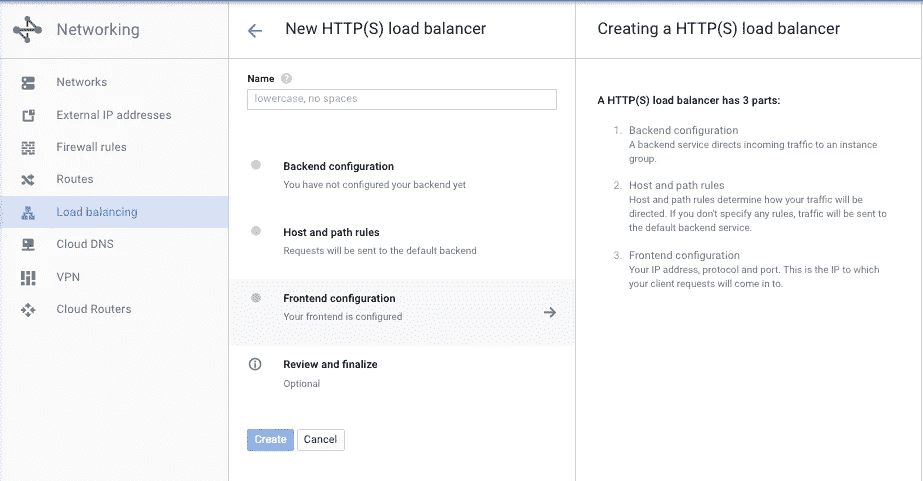
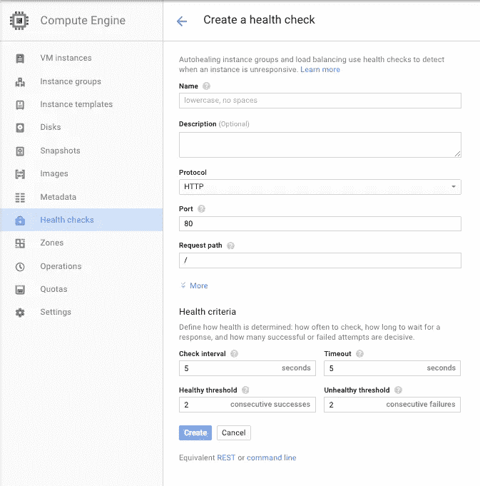
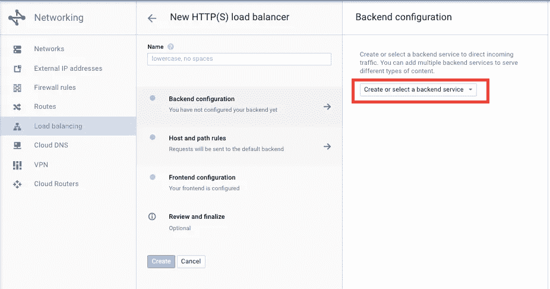
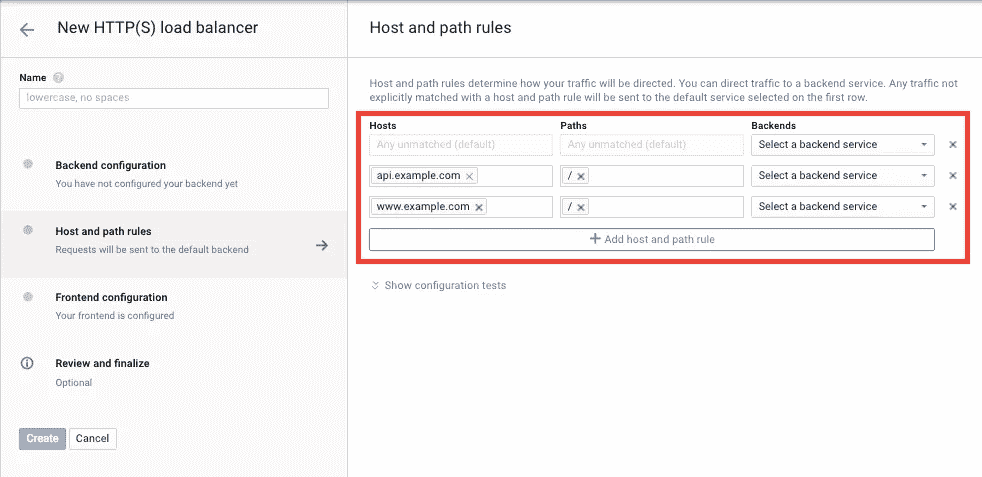
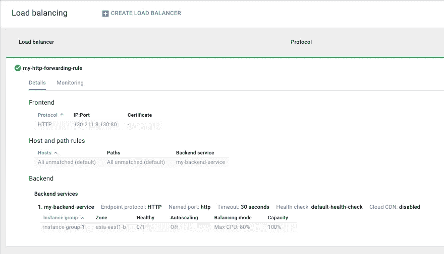
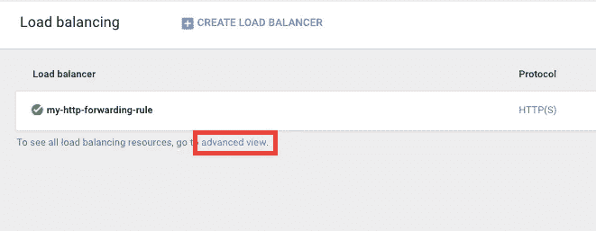

# Google 云平台 HTTP 负载平衡器通过 CLI 解释

> 原文：<https://medium.com/google-cloud/google-cloud-platform-http-load-balancers-explained-via-the-cli-4f4d61805297?source=collection_archive---------0----------------------->

> 这是从[我的博客](https://www.ianlewis.org/en/google-cloud-platform-http-load-balancers-explaine)交叉发布的帖子。

谷歌云平台负载平衡器是基于谷歌为我们的应用开发的技术。有两种类型的负载平衡器，网络(L3)负载平衡器和 HTTP (L7)负载平衡器。HTTP 负载平衡器是全局的，因此同一个 IP 可以在世界上的任何地方使用，但仍然支持非常高的可伸缩性，无需预热。

在开发人员控制台中设置 HTTP 负载平衡器相当简单。您可以在控制台的网络部分创建一个，并创建一个负载平衡器。一旦您开始创建一个 HTTP 负载平衡器，您会看到一个类似这样的页面:



每个部分都设计得很好，允许您一次性创建负载平衡器。但是这里有许多正在被创建的对象，其中许多只是模糊地映射到 UI。通过 Google Cloud CLI 进行设置可能有点令人生畏。

[HTTP 负载平衡器文档](https://cloud.google.com/compute/docs/load-balancing/http/)提供了一些有用的信息和图表，有助于理解它是如何工作的。但是当我想通过 CLI 设置负载平衡器时，我发现这里的图表有点过于简单。我需要知道更多关于所有部件的信息，所以我画了这张图。

让我们一步一步地了解如何通过 CLI 创建负载平衡器。在我们这样做的时候，我会试着指出我们正在创建的每个对象在云控制台中的对应关系，这样您就知道以后在哪里可以找到它们。

# 健康检查

由于大多数对象相互依赖，我们需要从“后端”到“前端”,从健康检查和后端服务开始，到转发规则结束。运行状况检查对象不依赖于任何其他对象，因此我们可以先创建它。尽管我们在这里创建了对象，但是只有在我们将它附加到后端服务之后，它才真正变得活跃。

```
gcloud compute http-health-checks create my-healthcheck --host <a href="http://www.example.com">www.example.com</a> --port 80 --request-path=/healthz
```

这里我们创建一个健康检查，它将通过/healthz URL 上的端口 80 连接到我们的应用程序。请注意，创建运行状况检查只是告诉进一步的配置要检查的端口和路径，而不是实际发送运行状况检查。host 参数实际上并不用作要连接的主机，而只是用来设置主机头。一些应用程序检查这个标题，所以我们希望他们能够返回一个成功的状态。运行状况检查的实例稍后由后端服务指定。

健康检查在多个地方使用，因此它们位于云控制台 UI 的计算引擎部分之下。此处列出的运行状况检查与 CLI 中的 http-health-checks 和 https-health-checks 相对应。



# 后端服务

接下来，我们将创建一个后端服务。后端服务对象定义了实际服务请求的后端虚拟机。后端服务包含许多后端。每个后端本质上是一个到实例组的链接，但是附加了一些其他选项，比如使用哪个端口号和负载平衡模式。设置端口的首选方式是通过实例组上的命名端口。您可以使用以下命令为端口 80 设置一个名为 http-port 的命名端口。我假设您已经设置了一个名为 my-instance-group 的实例组。您可以在这里找到关于创建托管实例组[的更多信息。](https://cloud.google.com/compute/docs/instance-groups/)

```
gcloud compute instance-groups set-named-ports my-instance-group --named-ports http-port:80
```

接下来，您可以创建后端服务:

```
gcloud compute backend-services create my-http-backend-service --http-health-checks my-healthcheck --port-name http-port --protocol HTTP
```

既然我们已经将健康检查附加到了后端服务，它将连接到后端服务指定的实例来进行健康检查。

UI 在 UI 的“后端配置”部分显示后端服务。



接下来，我们必须创建一个后端。后端指定要向其发送流量的实例组，以及如何在可用实例之间平衡负载。您可以创建多个后端，通常为每个实例组创建一个后端。你可以用这个来做[跨区域负载均衡，比如](https://cloud.google.com/compute/docs/load-balancing/http/cross-region-example)。

```
gcloud compute backend-services add-backend my-http-backend-service --instance-group my-instance-group --balancing-mode RATE --max-rate-per-instance 10
```

这将建立一个后端，向我的实例组发送流量，并使用请求率作为一种负载平衡的方式。我将它设置为每个实例每秒最多获得 10 个请求，但是您也可以根据您的需要设置它来使用 CPU 利用率。

在 UI 中，后端是后端服务表单的一部分。您可以向后端服务添加任意数量的后端，就像在 CLI 中一样。


# Url 映射

Url 映射用于将主机和 URL 映射到后端服务。url 映射包含两种类型的对象，主机规则和路径匹配器。每个主机规则可以有多个路径匹配器。每个请求都与主机规则进行匹配，然后与匹配的主机规则的路径匹配器进行匹配。当创建一个 url-maps 对象时，您指定当没有主机规则匹配时使用的默认后端服务。

```
gcloud compute url-maps create my-url-map --default-service my-http-backend-service
```

如果你只有一个后端服务，那么这一个命令通常就足够了，因为所有的流量都可以通过默认服务发送。然而，如果你有多个后端，你可以设置基于主机或网址。一个主机规则可以有多个路径匹配器，但主机规则必须至少有一个路径匹配器，因此我们同时创建路径匹配器和主机规则。

```
gcloud compute url-maps add-path-matcher my-url-map --path-matcher-name my-www-path-matcher --new-hosts <a href="http://www.example.com">www.example.com</a> --default-service my-http-backend-service
```

您还可以指定不同主机的请求也转到单独的后端服务。

```
gcloud compute url-maps add-path-matcher my-url-map --path-matcher-name my-api-path-matcher --new-hosts api.example.com --default-service my-api-backend-service
```

像 url-maps 本身一样，如果主机规则匹配，但没有路径规则匹配，您可以指定一个默认服务。您还可以根据路径指定要使用的不同后端服务。

```
gcloud compute url-maps add-path-matcher my-url-map --path-matcher-name my-path-matcher --new-hosts <a href="http://www.example.com">www.example.com</a> --path-rules=”/api=my-api-backend-service,/other=my-other-backend-service” --default-service my-http-backend-service
```

在 UI 中，URL 映射、主机规则和路径匹配器在“主机和路径规则”部分指定。



第一行包含当请求不匹配主机规则/路径匹配器组合时使用的默认服务。其他行包含主机规则/路径匹配器。

# 目标代理

目标 HTTP 代理和目标 HTTPS 代理是将一个或多个转发规则连接到 URL 映射的对象。

目标代理会终止与用户的连接，因此您可以在使用 HTTPS 时指定要使用的 SSL 证书。SSL 证书是这样创建的:

```
gcloud compute ssl-certificates create my-cert --certificate /path/to/cert.pm --private-key /path/to/key.pm
```

然后，您可以使用该证书创建 HTTPS 代理。

```
gcloud compute target-https-proxies create my-https-proxy --url-map my-url-map --ssl-certificate my-ssl-certificate
```

您仍然需要创建一个，但是在这一点上，我觉得目标代理使事情变得更加复杂，因为对于 HTTP 负载平衡器，您几乎总是为每个目标代理使用一个转发规则。

# 转发规则

转发规则是我们需要创建的最终目标。这些是您实际计费的对象。转发规则将负载平衡器的 IP 地址映射到将处理请求的目标代理。首先，我们需要创建我们的 IP 地址。我们将需要一个全球性的，而不是地区性的，IP 地址为我们的 HTTP 负载平衡器。

```
gcloud compute addresses create my-address --global
```

然后我们可以创建我们的转发规则。请注意，我们需要输入我们刚刚创建的实际 IP 地址，而不是 IP 地址名称。也不是说您只能将单个端口作为—端口范围选项，我们需要添加—全局选项。

```
gcloud compute forwarding-rules create my-https-forwarding-rule --global --address 123.123.123.123 --ip-protocol TCP --port-range 443 --target-https-proxy my-https-proxy
```

许多应用程序希望将访问 http://www.example.com/的用户重定向到 https://www.example.com/的 T2。这是一个非常常见的用例，但负载平衡器不支持它。您需要为 HTTP 创建一个完全独立的目标 HTTP 代理和转发规则。实际上，您需要两个负载平衡器来处理流量，然后在您的应用程序中重定向用户。

注意，我们为 HTTP 转发规则输入了相同的 IP 地址。这使得我们可以监听我们 IP 地址的端口 80 和端口 443。

```
gcloud compute target-http-proxies create my-http-proxy --url-map my-url-map gcloud compute forwarding-rules create my-http-forwarding-rule --global --address 123.123.123.123 --port-range 80 --target-http-proxy my-http-proxy
```

现在您已经创建了一个转发规则，它将显示在开发人员控制台的“负载平衡”部分。



# 高级视图

还有一个“高级视图”，允许您以更接近 CLI 的格式查看对象。每个主要对象都有选项卡，还有几个网络负载平衡器选项卡。



考虑到如何在 UI 中创建，组成 HTTP(S)负载平衡器的对象以及在 GCP 上设置它所需运行的命令并不十分明显。但希望这篇文章能揭示出它们是如何结合在一起的。一定要查看一下 [HTTP 负载平衡器文档](https://cloud.google.com/compute/docs/load-balancing/http/)，它有更多的信息和指南，比如如何进行一些更复杂的设置，比如[跨区域负载平衡](https://cloud.google.com/compute/docs/load-balancing/http/cross-region-example)和[基于内容的负载平衡](https://cloud.google.com/compute/docs/load-balancing/http/content-based-example)。