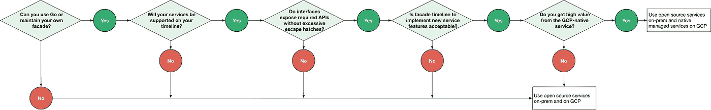

# Anthos:可移植的谷歌云平台混合管理

> 原文：<https://medium.com/google-cloud/google-cloud-platform-hybrid-management-4680c9fdf938?source=collection_archive---------0----------------------->

## 把云带回地球

混合是一个有点超载的术语；在本文中，混合管理是指以相同的方式使用相同的工具管理位于本地(本地可能包括托管服务提供商)和云中的应用程序和基础架构；它不是指将内部网络边界扩展到云，或者在内部和云之间分发应用程序的组件。

有几个原因使得一些企业也希望在其他地方运行 Google 基础设施；他们可能是…

*   位于数据主权要求严格的国家，并且谷歌云平台没有数据中心；随着谷歌云平台的全球足迹不断扩大( [18 个地区，并且还在继续](https://cloud.google.com/about/locations/))，这种情况变得越来越罕见。
*   在互联网连接不良的地区运行他们的一些软件，这不适合高带宽数据传输，并且可能不总是可用的。
*   在谷歌云平台上构建 SaaS 解决方案，并拥有属于上述类别的主要客户。

去年，谷歌云[宣布了云服务平台](https://cloud.google.com/blog/products/gcp/cloud-services-platform-bringing-the-best-of-the-cloud-to-you)，现在[更名为 Anthos](https://cloud.google.com/blog/topics/hybrid-cloud/new-platform-for-managing-applications-in-todays-multi-cloud-world) ，这是一个集成的云服务家族，让您可以提高速度和可靠性，改善安全性和治理，构建一次即可在 GCP 和内部环境的任何地方运行。三月宣布正式上市[，包括:](https://cloud.google.com/blog/topics/hybrid-cloud/new-platform-for-managing-applications-in-todays-multi-cloud-world)

*   混合计算: [GKE 本地](https://cloud.google.com/gke-on-prem/)多集群管理
*   策略执行: [Anthos 配置管理](https://cloud.google.com/anthos-config-management/)，控制 [Kubernetes](https://cloud.google.com/kubernetes/) 工作负载
*   服务网格:开放源代码中的 Istio 1.0 的可用性，Istio 和服务管理，以及 Istio 的 Apigee API 管理。
*   Ops 工具:堆栈驱动程序服务监控
*   无服务器计算:GKE 无服务器插件和开源无服务器框架
*   开发者工具:[云构建](https://cloud.google.com/cloud-build)，一个完全托管的 CI/CD 平台

这使得 Chris Ciborowski [所称的](https://www.nebulaworks.com/blog/2015/12/15/2016-the-year-of-gifee/)GIFEE 或“其他所有人的谷歌基础设施”的实施变得更加简单，并实现了许多世界的最佳状态:在基于云的控制平面管理的内部开源基础设施堆栈上运行的本地数据平面，可移植到云，并得到谷歌的支持，谷歌已经在十多年的生产中大规模运行容器化工作负载。测试版[在 VMware](https://www.nextplatform.com/2019/02/20/google-wants-cloud-services-platform-to-borg-your-datacenter/) 上运行，因为它提供了一个通用的本地平台。

然而，正如 Miles Ward 指出的那样，混合管理不仅仅是基础设施:应用程序需要消息和数据服务。Miles 扩展了 GIFEE 以解决应用程序组件架构，描述了主要的开源生态系统，该生态系统提供本地应用程序堆栈(如 HBase、Druid/Drill)以及专有组件，如负载平衡器和文件系统。

# 内部托管服务

云的一个重要好处是，你可以像使用工具一样使用它:它是一个完全托管的服务，你只需插入即可。

复制这种内部部署是一项挑战；有几种方法可以在内部提供类似的体验；哪种服务适合您可能取决于您现有的供应商关系，以及您的应用程序需要多少/哪些服务。

## 特定服务支持

许多开源的 GCP 等价物都有企业订阅:

*   文档存储:[MongoDB Enterprise Advanced](https://www.mongodb.com/products/mongodb-enterprise-advanced)
*   宽列商店:[数据税务卡桑德拉](https://www.datastax.com/wp-content/uploads/resources/datasheets/DataStax-DS-Introducing-DataStax-Distribution-of-Apache-Cassandra.pdf)
*   消息传递:[融合企业订阅](https://www.confluent.io/subscription/) (Kafka)
*   OLAP: [暗示德鲁伊](https://imply.io/imply-vs-druid)和 [MapR 托管服务](https://mapr.com/services/)

## 托管服务平台

诸如 [Nutanix](https://www.nutanix.com/products/acropolis/object-storage-service/) 和 [Stratoscale](https://www.stratoscale.com/products/chorus/) 之类的供应商通过完全托管的堆栈将云方法带到本地，这些堆栈提供诸如对象存储、NoSQL、PostgreSQL、MySQL 和 MapReduce 之类的服务。

因为 GKE 内部部署非常新，所以现在这些堆栈使用供应商的管理工具与您的 GKE 内部部署应用程序堆栈分开管理；从概念上(实际上在某些情况下)你可以把它们想象成电器。

## 全球系统集成商和托管服务提供商

像[埃森哲](https://www.accenture.com/us-en/service-google-cloud-based-solutions)、[凯捷](https://www.capgemini.com/partner/google-cloud/)和[德勤](https://www2.deloitte.com/us/en/pages/about-deloitte/solutions/google-cloud.html)这样的全球系统集成商非常擅长管理客户的内部工作负载。

全球系统集成商与区域托管服务提供商合作可能是 SaaS 提供商向其客户提供托管服务体验的最佳选择。

## “私有云”

虽然这不是本文的重点，但也值得一提:一些客户在有国家防火墙的国家有这种需求，或者对于只能由该国国民管理的工作负载有这种需求(例如，要求“FedRAMP high”合规性的工作负载)。

像[思科容器平台](https://blogs.cisco.com/cloud/ciscocontainerplatform)这样的产品可以解决这个问题的基础设施部分。

# 轻便

如果您希望能够在云和本地运行相同的应用程序，您需要可移植性。为了实现应用程序可移植性的承诺，您希望一次构建您的应用程序，并使用相同的工具在任何地方运行它们。

Anthos 有助于解决基础设施和政策的可移植性；还有几个其他的关键方面:API 和工具的可移植性。

## API 可移植性

应用程序 API 的可移植性是开发人员首先想到的。一次编写/随处运行。有两种方法可以解决这个问题:

1.  在云提供商和内部使用通用服务。在一个维度上，这是一种退化的情况，解决方案与您只是在内部运行是一样的。Google 等云提供商通过其市场(例如 [Google Cloud Marketplace](https://cloud.google.com/marketplace/) )为 MongoDB/Cassandra 等数据存储/数据库和 RabbitMQ/Kafka 等消息服务提供不同级别的管理，并且有一个完善的内部生态系统。这种方法为您的应用程序提供了对所有服务特性的完全访问；缺点是，即使在云中，您也需要利用服务供应商的托管服务产品，或者自己管理扩展、高可用性和灾难恢复。
2.  在云中使用托管云服务，在内部使用开源服务。这为您提供了云提供商服务的全部功能；在谷歌云平台的完全托管服务的情况下，这包括伸缩性、高可用性和灾难恢复作为结构的一部分；这是很难复制的。缺点是您的应用程序需要与云中和内部的不同 API 对话。幸运的是，这是可以解决的:从概念上来说，这是 [Java 的一次编写，随处运行](https://en.wikipedia.org/wiki/Write_once,_run_anywhere)承诺的扩展，几十年前[企业 Java Beans 和 Spring Framework 解决了这个承诺](https://en.wikipedia.org/wiki/Spring_Framework)，今天 [Go Cloud 开发工具包](https://gocloud.dev/)也解决了这个承诺。

您需要根据您的首选开发语言、时间表、应用程序使用服务 API 的复杂性以及云中完全托管服务的相对价值来确定正确的方法。

示例决策树

**Go 云开发套件**

[Go 云开发套件](https://gocloud.dev/) (Go CDK)允许 Go 应用开发人员在云提供商和内部无缝部署云应用。它通过为存储和数据库等常见用例提供稳定、惯用的接口来做到这一点；它支持针对边缘情况的[特定于提供者的转义](https://godoc.org/gocloud.dev)，以避免最小公分母陷阱。

今天，它提供了以下接口和实现:

[Blob 存储](https://github.com/google/go-cloud/tree/master/blob)

*   内存中
*   文件系统
*   谷歌云存储
*   Azure Storage 的 BlockBlob，以及 OpenBucket
*   AWS S3

[Postgres](https://github.com/google/go-cloud/tree/master/postgres)

*   谷歌云 SQL
*   AWS RDS PostgreSQL

[MySQL](https://github.com/google/go-cloud/tree/master/mysql)

*   谷歌云 SQL
*   AWS RDS MySQL

[Pub-sub](https://github.com/google/go-cloud/tree/master/pubsub)

*   内存中
*   兔子 q
*   谷歌云发布/订阅
*   Azure 服务总线主题和订阅
*   AWS SNS(简单通知服务)和 SQS(简单排队服务)

一些接口和实现仍然缺失，但该项目自去年夏天启动以来一直在定期添加新的接口和实现:Firestore、MongoDB 和 DynamoDB 在路线图上、[和 Kafka](https://github.com/google/go-cloud/issues/732) 。

此外，[Kafka 的发布/订阅仿真器](https://github.com/GoogleCloudPlatform/kafka-pubsub-emulator)实现了一个 gRPC 服务器，它满足了 Cloud Pub/Sub API，作为现有 Kafka 集群配置之上的仿真层；这是一个基于 Java 的 Docker 或 Kubernetes 发行版。

## 工具便携性

另一个可移植性方面是如何提供和管理应用程序所依赖的服务。过去，你会使用一套工具(例如 [gCloud](https://cloud.google.com/sdk/gcloud/) )来管理谷歌云平台托管服务，而使用另一套(通常是多套)工具来管理内部开源应用数据和消息服务。

Kubernetes 的[自定义资源定义](https://kubernetes.io/docs/concepts/extend-kubernetes/api-extension/custom-resources/#customresourcedefinitions) (CRDs)为外部数据存储/数据库(例如 CloudSQL 实例)和消息服务的[供应/管理提供了一致的、声明性的资源管理外观。开发人员可以创建自定义资源定义，为新资源定义配置模式，并创建实现资源行为的控制器。Kubernetes API 服务器机器可以管理作为服务端点的新资源，而不需要任何修改，因此它们可以被 kubectl 应用，等等。](https://github.com/kubernetes/sample-controller#use-cases)

[操作符模式](https://kubernetes.io/docs/concepts/extend-kubernetes/api-extension/custom-resources/#custom-controllers)将定制资源与定制控制器结合起来，以提供真正的声明式 API。这允许您声明或指定所需的资源状态，并尝试使 Kubernetes 对象的当前状态与所需状态保持同步。您可以使用定制控制器将特定应用程序的领域知识编码到 Kubernetes API 的扩展中。

请注意，运营商扩展到的服务比您想象的要多；直觉上，人们倾向于认为像谷歌云存储这样的服务是完全托管的服务，因此大概不需要供应/管理。然而，[Go CDK 并没有提供创建一个新的 bucket](https://github.com/google/go-cloud/blob/c18b5cbfae34a664908ddaec7bc616a2b15dac52/internal/docs/design.md#developers-and-operators) 的方法，把它归类为一个运营任务，所以你需要一个 Google 云存储的运营商来使用 Kubernetes 模型来管理它。

随着时间的推移，云提供商和开源供应商可能会为他们的资源提供运营商，从而实现跨云和内部的一致声明式资源供应。例如，…

*   [MongoDB 企业 Kubernetes 运营商](https://docs.opsmanager.mongodb.com/current/tutorial/install-k8s-operator/)
*   [卡珊德拉算子](https://opensource.com/article/18/9/cassandra-operator-kubernetes)
*   [合流算子](https://www.confluent.io/confluent-operator/)(卡夫卡)

# 下一步是什么

阅读以下内容，了解本文中描述的概念和解决方案组件的更多信息:

*   [GIFEE——面向所有人的谷歌基础设施](https://www.nebulaworks.com/blog/2015/12/15/2016-the-year-of-gifee/)
*   [如果你能在任何地方都跑同样的路会怎么样？](https://cloud.google.com/blog/products/gcp/how-to-escape-lock-in-with-a-multi-cloud-stack26?hl=be)
*   [Urs Hoelzle 对云服务平台的愿景](https://www.nextplatform.com/2019/02/20/google-wants-cloud-services-platform-to-borg-your-datacenter/)
*   [应用现代化以及基础设施服务和团队的分离](http://services.google.com/fh/files/blogs/csp_white_paper.pdf)
*   [谷歌云服务平台公告](https://cloud.google.com/blog/products/gcp/cloud-services-platform-bringing-the-best-of-the-cloud-to-you)
*   [Anthos 概述](https://cloud.google.com/anthos/)
*   [Anthos 配置管理](https://cloud.google.com/anthos-config-management/)
*   [Kubernetes 自定义资源定义](https://kubernetes.io/docs/concepts/extend-kubernetes/api-extension/custom-resources/#customresourcedefinitions)
*   [Go 云开发套件](https://gocloud.dev/)；[设计决策](https://github.com/google/go-cloud/blob/c18b5cbfae34a664908ddaec7bc616a2b15dac52/internal/docs/design.md)
*   [Kafka 的发布/订阅仿真器](https://github.com/GoogleCloudPlatform/kafka-pubsub-emulator)

阅读以下内容，了解关于本文中提到的第三方提供商的更多信息:

*   [思科容器平台](https://blogs.cisco.com/cloud/ciscocontainerplatform)
*   [思科数据中心技术集成](https://cloud.google.com/blog/topics/partners/google-cloud-partners-with-cisco-on-hybrid-cloud-next19)
*   [Nutanix Acropolis 对象存储服务](https://www.nutanix.com/products/acropolis/object-storage-service/)
*   Stratoscale Symphony 开源服务
*   [MongoDB 企业进阶](https://www.mongodb.com/products/mongodb-enterprise-advanced)； [Kubernetes 操作员](https://docs.opsmanager.mongodb.com/current/tutorial/install-k8s-operator/)
*   [数据税务卡珊德拉](https://www.datastax.com/wp-content/uploads/resources/datasheets/DataStax-DS-Introducing-DataStax-Distribution-of-Apache-Cassandra.pdf)； [Kubernetes 操作员](https://opensource.com/article/18/9/cassandra-operator-kubernetes)
*   [合流企业认购](https://www.confluent.io/subscription/)； [Kubernetes 算子](https://www.confluent.io/confluent-operator/)(卡夫卡)
*   [暗示德鲁伊](https://imply.io/imply-vs-druid)
*   [MapR 托管服务](https://mapr.com/services/)(阿帕奇演习)

# 承认

非常感谢 Zach Casper 的评论和反馈。