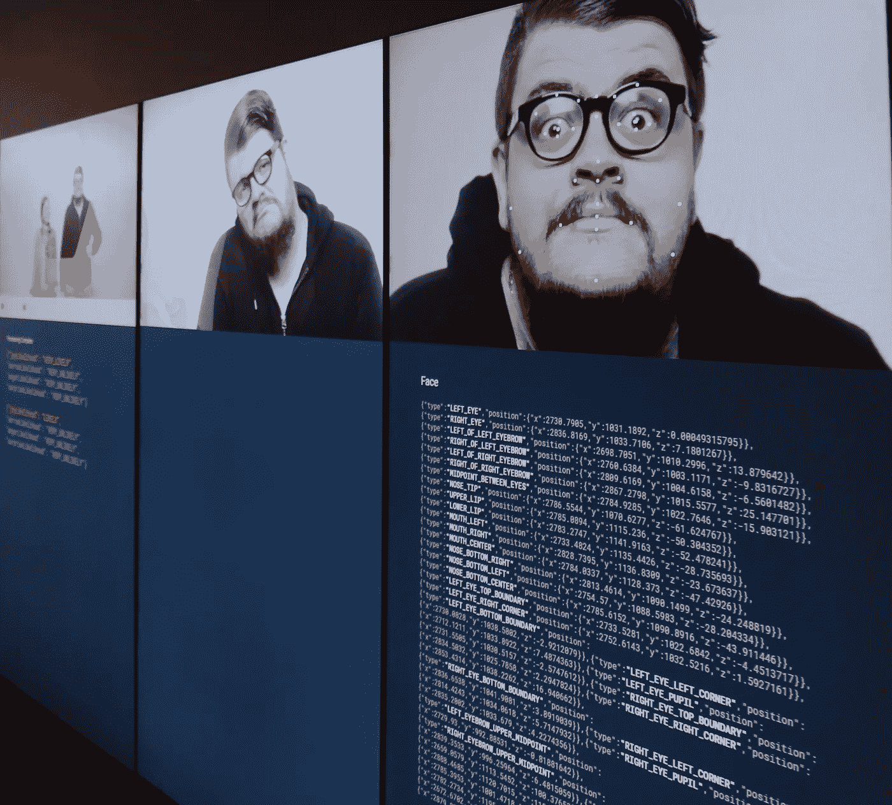

# 2016 年 4 月谷歌云平台新闻综述

> 原文：<https://medium.com/google-cloud/google-cloud-platform-news-roundup-for-april-2016-f92d9c32e2ae?source=collection_archive---------1----------------------->

尽管夹在 3 月份的 NEXT 和 5 月份的 I/O 之间，4 月份还是带来了新鲜有趣的 GCP 教程、云讨论和几个平台公告。尽情享受吧！

来自 2016 年 GCP emotobooth 的输出(关注@gcpemotobooth 了解更多)

## 本月特色

*   [云视觉 API](https://cloud.google.com/vision/) 正式发布！使用它从图像中获得洞察力，分析情感，提取文本(以及其他功能)。
*   谷歌研究[宣布在 TensorFlow 0.8](http://googleresearch.blogspot.com/2016/04/announcing-tensorflow-08-now-with.html) 中提供分布式计算支持，由 [gRPC](http://www.grpc.io/) 和 [Docker](https://www.docker.com/) 提供支持，这使得将训练时间从数周减少到数小时成为可能。
*   [Mark Litwintschik](https://twitter.com/marklit82) 使用 10 亿次打车的开放数据集对几种云服务进行了基准测试，包括 [BigQuery](http://tech.marksblogg.com/billion-nyc-taxi-rides-bigquery.html) 和 [Dataproc](http://tech.marksblogg.com/faster-queries-google-cloud-dataproc.html) 。
*   谷歌云平台为多项云服务的合规承诺增加了两个新证书，分别是针对云安全的 [ISO27017](https://cloud.google.com/files/ISO27017_Digital_2016.pdf) 和针对隐私的 [ISO27018](https://cloud.google.com/files/ISO27018_Digital_2016.pdf) 。
*   [Terry Ryan](http://terrenceryan.com/blog/index.php/autoresizing-persistent-disks-in-compute-engine/) 展示了计算引擎如何以内部部署解决方案可望而不可及的方式实现自动扩展；他编写了一个脚本来跟踪持续的磁盘使用情况，并在使用情况超过设定的阈值时自动调整大小！

## 教程

*   [将应用引擎标准迁移到云 SQL v2](http://terrenceryan.com/blog/index.php/migrating-app-engine-standard-to-cloud-sql-v2/) 由[特里·瑞安](https://twitter.com/tpryan)
*   [在 Kubernetes 上使用带有 Twilio 消息的云视觉 API](http://amygdala.github.io/ml/2016/04/22/vision-api.html)作者 [Amy Unruh](https://twitter.com/amygdala)
*   [在云 SQL 数据库之间迁移](http://terrenceryan.com/blog/index.php/migrating-between-cloud-sql-databases/)由[特里·瑞恩](https://twitter.com/tpryan)
*   [Ian Lewis](https://www.ianlewis.org/en/google-cloud-platform-http-load-balancers-explaine)[通过 CLI](https://twitter.com/IanMLewis) 讲解 Google 云平台 HTTP 负载平衡器
*   [通过](https://cloud.google.com/blog/big-data/2016/04/scheduling-dataflow-pipelines-using-app-engine-cron-service-or-cloud-functions)[meter Atamel](https://twitter.com/meteatamel)使用 App Engine Cron 服务或云功能调度数据流管道
*   [BigShift:由](https://github.com/iconara/bigshift) [Theo Hultberg](https://twitter.com/iconara) 开发的将表从 Redshift 移动到 BigQuery 的工具
*   [Tensorflow 游乐场:玩神经网络](http://playground.tensorflow.org/)作者[丹尼尔·斯米尔科夫](https://twitter.com/dsmilkov)和[山·卡特](https://twitter.com/shancarter)
*   [上传猫咪图片 w/ Sinatra 和谷歌云存储](http://www.thagomizer.com/blog/2016/04/12/file-uploads-with-sinatra.html)由[艾捷拉哈默利](https://twitter.com/thagomizer_rb)
*   [通过 Golang 使用谷歌云视觉 API](/google-cloud/using-google-cloud-vision-api-with-golang-830e70323de7#.rufcq1ha0)由 [Satish Talim](https://twitter.com/IndianGuru)
*   [由](/google-cloud/uploading-resizing-and-serving-images-with-google-cloud-platform-ca9631a2c556#.vrpf10zgg) [Lipis](https://twitter.com/Lipis) 用谷歌云平台上传、调整大小和提供图片
*   Graham Smith 的 [Android 推送通知— GCM 和 RxJava](/google-cloud/android-push-notifications-gcm-and-rxjava-bc3356e91ea5#.5pfp5ortb)
*   [CodinGame:深度学习——tensor flow](https://www.codingame.com/games/machine-learning)

## **有趣的文章**

*   [Inside Capacitor，BigQuery 的下一代柱状存储格式](https://cloud.google.com/blog/big-data/2016/04/inside-capacitor-bigquerys-next-generation-columnar-storage-format)作者 Mosha Pasumansky
*   [来自谷歌应用引擎 SRE 关于如何满足每天超过 1000 亿次请求的经验](https://cloudplatform.googleblog.com/2016/04/lessons-from-a-Google-App-Engine-SRE-on-how-to-serve-over-100-billion-requests-per-day.html)作者:乔·梅特兰
*   [金融服务公司利用 Google Cloud Bigtable 每小时处理 250 亿个股票市场事件](https://cloudplatform.googleblog.com/2016/03/financial-services-firm-processes-25-billion-stock-market-events-per-hour-with-Google-Cloud-Bigtable.html)作者 [Misha Brukman](https://twitter.com/MishaBrukman)
*   [深度思维转向张量流](http://googleresearch.blogspot.com/2016/04/deepmind-moves-to-tensorflow.html)作者 Koray Kavukcuoglu
*   [云 SQL v1 vs v2](http://terrenceryan.com/blog/index.php/cloud-sql-v1-vs-v2/) 作者[特里瑞安](https://twitter.com/tpryan)
*   [Scott Van Woudenberg](https://cloudplatform.googleblog.com/2016/04/lessons-learned-from-a-year-of-using-live-migration-in-production-on-Google-Cloud.html)在 Google Cloud 上使用实时迁移一年的经验教训
*   [托管服务杀死了 DevOps](http://techcrunch.com/2016/04/07/devops-is-dead-long-live-devops/) 由[安德烈·阿克塞尔罗德](https://twitter.com/chelya)
*   [由](/@nzoschke/docker-for-mac-beta-review-b91692289eb5#.o5ywmhb4o)[诺亚·佐施克](https://twitter.com/nzoschke)撰写的 Mac Beta 版评论
*   [阿帕奇梁想成为大数据的超级 API](http://www.infoworld.com/article/3056172/application-development/apache-beam-wants-to-be-uber-api-for-big-data.html)由[伊恩指针](https://twitter.com/carsondial)
*   [围棋六年最佳实践，在](http://peter.bourgon.org/go-best-practices-2016/)由[彼得·波尔根](https://twitter.com/peterbourgon)

## **看和听**

*   [Kubernetes、Docker 和与 Kelsey Hightower 合作的分布式操作系统](http://softwareengineeringdaily.com/2016/05/01/kubernetes-docker-distributed-operating-system-kelsey-hightower/)和与 Brendan Burns 合作的[谷歌容器管理](http://softwareengineeringdaily.com/2016/04/19/googles-container-management-brendan-burns/)在软件工程每日播客上
*   Cloud Minute 系列的新内容:[创建 HTTP 负载平衡器](https://www.youtube.com/watch?v=_o1d62KT-yo)，[在线调整连接到您的 Linux VM 的持久磁盘的大小](https://www.youtube.com/watch?v=ZjuB9AxlEKI)，以及[创建和使用服务帐户](https://www.youtube.com/watch?v=tSnzoW4RlaQ)
*   新的[谷歌云平台播客](http://www.gcppodcast.com)剧集:[安迪·奥克斯菲尔德](https://www.gcppodcast.com/post/episode-23-humble-bundle-with-andy-oxfeld/)的谦逊捆绑[王瑞](https://www.gcppodcast.com/post/episode-22-iam-with-rae-wang/)的 IAM、[来自 GCP Next 的精彩演示](https://www.gcppodcast.com/post/episode-21-amazing-demos-from-gcpnext-with-instrument/)以及贾斯汀·贝克威思的 [Node.js](https://www.gcppodcast.com/post/episode-20-nodejs-with-justin-beckwith/)

## **谷歌云平台有什么新功能？**

*   [增强的谷歌计算引擎持久磁盘=更好的 Kubernetes 和 Docker 支持](https://cloudplatform.googleblog.com/2016/04/enhanced-persistent-disks-for-Google-Compute-Engine-better-Kubernetes-and-Docker-support.html)
*   [Google Cloud 和 Autodesk 将媒体渲染效率提高了 10 倍](https://cloudplatform.googleblog.com/2016/04/Google-Cloud-and-Autodesk-enable-10x-improvement-in-media-rendering-efficiency.html?m=1)(包括 Cloud Vision API 正式发布，Cloud CDN 升级为 Beta 版)
*   [谷歌消费者调查 API 允许你向任何手机或网络应用添加调查](https://cloudplatform.googleblog.com/2016/04/Google-Consumer-Surveys-API-lets-you-add-a-survey-to-any-mobile-or-web-app.html)
*   [推出新的谷歌云负载平衡用户界面](https://cloudplatform.googleblog.com/2016/04/introducing-the-new-Google-Cloud-Load-Balancing-UI.html)
*   [使用 Stackdriver 错误报告监控应用程序错误](https://cloudplatform.googleblog.com/2016/04/monitor-your-application-errors-with-Stackdriver-Error-Reporting.html)
*   [谷歌云数据存储获得更快的跨平台 API](https://cloudplatform.googleblog.com/2016/04/Google-Cloud-Datastore-gets-faster-cross-platform-API.html)
*   [谷歌云视觉 API 风格检测简介](https://cloudplatform.googleblog.com/2016/04/introducing-Style-Detection-for-Google-Cloud-Vision-API.html)

## **查找更多内容**

您可以随时在 Twitter ( [@googlecloud](https://twitter.com/googlecloud) )、 [Medium](https://medium.com/google-cloud) 、 [Flipboard Magazine](https://flipboard.com/@googlecloud/google-cloud-platform-lfoqja31y) )上实时关注我们！

如果你创建与谷歌云平台相关的在线内容，我们很乐意看到。请用这张表格【http://bit.ly/gcp-content】()寄给我们。