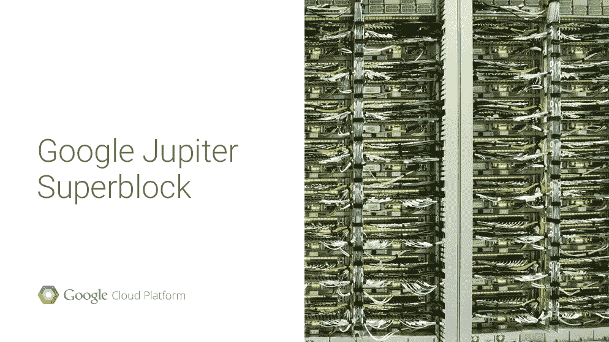

# 2015 年 8 月谷歌云平台新闻综述

> 原文：<https://medium.com/google-cloud/google-cloud-platform-news-roundup-for-august-2015-13032ccc0f3d?source=collection_archive---------5----------------------->

我希望每个人都有一个愉快的周末！这里有一个在过去的一个月里你可能错过了什么的快速快照。有五个产品的正式发布，以及一堆来自云开发者倡导者的新的有用的文章！

## 正式发布

*   [**谷歌容器引擎**](http://googlecloudplatform.blogspot.fr/2015/08/Google-Container-Engine-is-Generally-Available.html) —来自谷歌云平台的托管 Kubernetes 集群，以 99.5% SLA 为后盾。
*   [**谷歌计算引擎自动缩放器**](http://googlecloudplatform.blogspot.com/2015/09/Announcing-General-Availability-of-Google-Compute-Engine-Autoscaler-and-32-core-VMs.html) —根据负载情况动态缩放实例数量。
*   [**谷歌计算引擎上的 32 核虚拟机**](http://googlecloudplatform.blogspot.com/2015/09/Announcing-General-Availability-of-Google-Compute-Engine-Autoscaler-and-32-core-VMs.html)—Greg Wilson([@ gregsramblings](http://twitter.com/gregsramblings))和我用一个 32 核的 VM 计算了[1000 亿位数的圆周率](https://twitter.com/gregsramblings/status/576783110899027969)，随后，[2500 亿位数](https://twitter.com/saturnism/status/577152550283120640)。
*   [**Google Cloud Pub/Sub**](http://googlecloudplatform.blogspot.com/2015/08/Announcing-General-Availability-of-Google-Cloud-Dataflow-and-Cloud-Pub-Sub.html)—满足您系统集成需求的可管理、可扩展的消息基础设施。
*   [**谷歌云数据流**](http://googlecloudplatform.blogspot.com/2015/08/Announcing-General-Availability-of-Google-Cloud-Dataflow-and-Cloud-Pub-Sub.html) —不再自定义地图/减少工作。使用云数据流 API 编写您的数据处理管道，并在托管环境中运行它。

八月份发布了很多 GA 产品！

## 精彩的文章和视频

Julia Ferraioli([@ Julia Ferraioli](https://twitter.com/juliaferraioli))发表了一系列关于用 Docker 在谷歌计算引擎上运行《我的世界》服务器的文章:

*   [用 Docker 在谷歌计算引擎上运行《我的世界》服务器](http://www.blog.juliaferraioli.com/2015/06/running-minecraft-server-on-google.html)
*   [拯救世界:通过集装箱化的《我的世界》服务器使用持久存储](http://www.blog.juliaferraioli.com/2015/07/saving-world-using-persistent-storage.html)
*   [《我的世界》，码头工人，计算机工程师:一个插曲](http://www.blog.juliaferraioli.com/2015/08/minecraft-docker-compute-engine.html)

即使你不玩《我的世界》，你也可以学到很多关于谷歌计算引擎和 Docker 的知识！跟随她获得系列大结局。

费利佩·霍法([@费利佩·霍法](http://twitter.com/felipehoffa))发布了一个名为[开放数据释放:纽约出租车数据集](https://www.youtube.com/watch?v=djkJq27cOEE)的视频。我住在纽约市，所以看这个节目对我来说特别有趣！它的特点是黑客使用 BigQuery 剖析出租车数据。一个小组找出了票房最高的消防栓的位置。我只是希望有人想出如何解决换班问题。费利佩喜欢 big query——看看他在 Reddit[上的热门帖子。](https://www.reddit.com/user/fhoffa/submitted/?sort=top)

谷歌云平台新手？查看 Sandeep Dinesh([@ sandeedinesh](https://twitter.com/SandeepDinesh))关于[开始使用谷歌云平台](https://cloudwebinars.withgoogle.com/live/getting-started-with-gcp/watch)的网络研讨会。这个视频非常受欢迎——我甚至在印度尼西亚和马来西亚的谷歌云平台社区活动的大屏幕上看到了它的播放！

有时间吗？从艾捷拉·哈默利( [@thagomizer_rb](https://twitter.com/thagomizer_rb) )、保罗·纽森([@纽森 _ 尼布尔斯](http://twitter.com/newsons_nybbles))和桑迪普·迪内什那里了解一些关于谷歌云平台的有用信息。他们发布了几个一分钟的教程视频，被称为[云分钟系列](https://www.youtube.com/playlist?list=PLIivdWyY5sqIij_cgINUHZDMnGjVx3rxi)。检查并保存[播放列表](https://www.youtube.com/playlist?list=PLIivdWyY5sqIij_cgINUHZDMnGjVx3rxi)。

 [## 使用 Go 和 Google App Engine 配置您的 GOPATH

### 当我开始使用 Google App Engine 和 Go 时，我不确定如何在开发时最好地配置我的 GOPATH

www.compoundtheory.com](http://www.compoundtheory.com/configuring-your-gopath-with-go-and-google-app-engine/) 

如果你使用 Go——看看用 Go 和 Google App Engine 编写服务器端软件有多简单。向马克·曼德尔([@神经质](http://twitter.com/Neurotic))学习[技巧和诀窍以及如何建立你的环境](http://www.compoundtheory.com/configuring-your-gopath-with-go-and-google-app-engine/)。这是一篇史诗般的文章。

想知道 Kubernetes 名称空间是什么以及可以用来做什么吗？伊恩·路易斯([@伊恩·路易斯](http://twitter.com/IanMLewis))在他的文章[中解释了这一切。](https://www.ianlewis.org/en/using-kubernetes-namespaces-manage-environments)

看看谷歌的数据中心网络[和我们如何实现每秒 1pb 的总带宽。还有](http://googlecloudplatform.blogspot.com/2015/06/A-Look-Inside-Googles-Data-Center-Networks.html)[另一个贴更多照片](http://googlecloudplatform.blogspot.com/2015/08/a-visual-look-at-googles-innovation-in.html)。太令人兴奋了。[高可扩展性](http://highscalability.com/blog/2015/8/10/how-google-invented-an-amazing-datacenter-network-only-they.html)也跟进了更多细节。

## 媒体上的其他文章

您可能已经在我们的[媒体出版物](https://medium.com/google-cloud)上看到了其中的一些文章，但是 ICYMI:

 [## 如何通过 VPN 连接谷歌云平台网络

### 当多个团队在一个软件开发项目上工作时，拥有多个谷歌云平台是有意义的…

medium.com](/p/622e47d510ba)  [## 使用 Kubernetes 在 Google 云平台上运行平均堆栈

### 在我最近的一篇文章中，我谈到了用 Docker 容器运行一个普通的堆栈。

medium.com](/p/149ca81c2b5d)  [## 使用 Docker 轻松开发绑定

### 避免在您的机器上安装依赖项

medium.com](/p/1172deefd171)  [## 我的慢速互联网 vs Docker

### 我在纽约工作，住在一个微型工作室里。公寓提供 Wi-Fi，但不幸的是，它有一个非常低的…

medium.com](/p/7678ae1cae72)  [## 利用 RasPi 和 Google BigQuery 构建世界上最大的物联网

### 这是我用拉斯皮建造的气象站。我的周末只花了几个小时就建成了这个，但是它已经…

medium.com](/p/169b332d02b1) 

## 查找更多内容

喜欢这些文章？在 Twitter ( [@googlecloud](https://twitter.com/googlecloud) )、 [Medium](https://medium.com/google-cloud) 、 [Flipboard 杂志](https://flipboard.com/@googlecloud/google-cloud-platform-lfoqja31y)上关注我们！