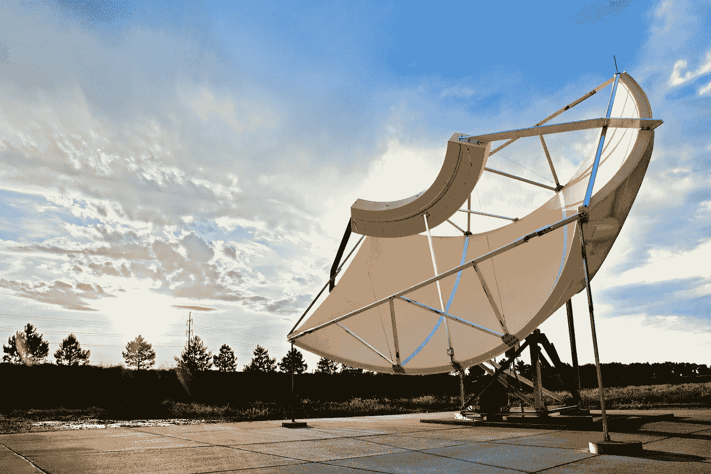

# 2015 年 12 月谷歌云平台新闻综述

> 原文：<https://medium.com/google-cloud/google-cloud-platform-news-roundup-for-december-2015-2c512fc1d60a?source=collection_archive---------1----------------------->

如果假日聚会、机场安检线和电影首映式限制了你的新闻阅读风格，也不要担心。这里是我们最喜欢的教程、文章和平台更新，让你跟上时代的步伐！

## **教程**

*   [通过应用引擎和 MongoLab 在谷歌云平台上运行平均堆栈](/google-cloud/running-a-mean-stack-on-google-cloud-platform-with-app-engine-and-mongolab-4bbd2040ea75#.wfqhgi6rh)
*   [在 OS X 与 Docker 和 Johnny-Five 一起为 Arduino 开发](/google-cloud/developing-for-arduino-with-docker-and-johnny-five-on-osx-cc6813ae6e9d#.63kv45obn)
*   使用 Google Cloud Shell 构建和测试 Docker 容器
*   [根据谷歌云平台解决方案文档，使用 Firebase 和谷歌云平台为您的移动应用构建后端](https://cloud.google.com/solutions/mobile/mobile-app-backend-on-cloud-platform)
*   [罗明·伊拉尼的 Firebase 物联网教程](http://rominirani.com/2015/03/09/firebase-iot-tutorial/)
*   [Igor Artamonov 在应用引擎上设置“让我们加密”SSL](http://igorartamonov.com/2015/12/lets-encrypt-ssl-google-appengine/)
*   [在应用引擎上为 PHP 简化云数据存储](https://gae-php-tips.appspot.com/2015/12/19/making-cloud-datastore-easy-for-php-on-app-engine/)作者 Tom Walder

## **开源和谷歌云平台**

*   [为什么我们选择 Kubernetes 而不是 ECS](https://railsadventures.wordpress.com/2015/12/06/why-we-chose-kubernetes-over-ecs/) 作者 Erez Rabih
*   Kubernetes 小抄
*   [Puppet Labs 从新的堆栈中自动化 Kubernetes for DevOps](http://thenewstack.io/puppet-labs-automates-kubernetes-accessibility-admins/)
*   [如何用 TensorFlow 对图像进行分类](http://googleresearch.blogspot.com/2015/12/how-to-classify-images-with-tensorflow.html)Pete Warden
*   [深度学习概述:核心概念](http://devblogs.nvidia.com/parallelforall/deep-learning-nutshell-core-concepts/)和[深度学习概述:历史和培训](http://devblogs.nvidia.com/parallelforall/deep-learning-nutshell-history-training/)作者 Tim Dettmers
*   [通过宿主语言加载张量流图](/jim-fleming/loading-tensorflow-graphs-via-host-languages-be10fd81876f#.wouhuvhri)
*   [GitHub 上的可视化深度学习调试器，通过断点和可解析可视化扩展 TensorFlow】作者 Eric Jang](https://github.com/ericjang/tdb)

## **看和听**

*   [云视觉 API](https://www.youtube.com/watch?v=lOD6SJd9kgQ&feature=youtu.be&t=5m38s) 来自开发者秀
*   [feli PE Hoffa 和 Alexandre Passant 博士的 BigQuery 音乐推荐](https://www.youtube.com/watch?v=Xs0ds2eWwXk)
*   [开源版本(包括 TensorFlow)](http://www.thetalkingmachines.com/blog/2015/11/22/open-source-releases-and-the-end-of-season-one) 来自 Talking Machines 播客
*   [来自软件工程每日播客的 Greg Corrado 的 TensorFlow】](http://softwareengineeringdaily.com/2015/12/15/tensorflow-with-greg-corrado/)
*   [深度学习从 Deep Learning 简化而来的](https://www.youtube.com/watch?v=b99UVkWzYTQ)。电视

## **谷歌云平台有什么新功能？**

*   [Cloud Vision API](http://googlecloudplatform.blogspot.com/2015/12/Google-Cloud-Vision-API-changes-the-way-applications-understand-images.html) ，目前在有限的预览中，使您的应用程序能够看到和理解图像。
*   通过我们的[面向 AWS 专业人员的 Google 云平台白皮书](https://cloud.google.com/docs/google-cloud-platform-for-aws-professionals)，将您现有的 Amazon Web Services 知识应用到 Google 云平台。
*   [GCP 2016 年将于 3 月在三藩市举行](http://googlecloudplatform.blogspot.com/2015/12/announcing-NEXT-2016-join-us-for-whats-next-for-cloud.html)，今年我们将在 1 月 15 日前公开征集演讲者。
*   [Google Cloud Monitoring for Container Engine](http://googlecloudplatform.blogspot.com/2015/12/monitoring-Container-Engine-with-Google-Cloud-Monitoring.html)显示所有级别的应用和服务指标:容器、pod 和集群。
*   [谷歌云审计日志](http://googlecloudplatform.blogspot.com/2015/12/cloud-audit-logs-to-help-you-with-audit.html)、 [i](http://googlecloudplatform.blogspot.com/2015/12/cloud-audit-logs-to-help-you-with-audit.html) n beta for App Engine 和 BigQuery，追踪你的谷歌云平台项目中管理员的行动。
*   Google Cloud Shell 将在 2016 年免费使用——试试吧！！
*   [BigQuery 自定义配额](http://googlecloudplatform.blogspot.com/2015/12/BigQuery-cost-controls-now-let-you-set-a-daily-maximum-for-query-costs.html)让您能够设置每日最大限额并控制成本。
*   [第二代谷歌云 SQL](http://googlecloudplatform.blogspot.com/2015/12/the-next-generation-of-managed-MySQL-offerings-on-Cloud-SQL.html) ，现在处于测试阶段，提供了更好的性能和可伸缩性——比以前快了 7 倍多。
*   [PerfKit Benchmarker (PKB) 1.0 版本](http://googlecloudplatform.blogspot.com/2015/12/measuring-cloud-performance-just-got-easier-and-better.html)帮助您衡量九家云提供商的云性能。
*   [Python 的云调试器，](http://googlecloudplatform.blogspot.com/2015/12/production-troubleshooting-with-Cloud-Debugger-now-available-for-Python.html)现在处于测试阶段，允许您实时调试正在运行的 Python 服务。
*   [控制台中的“计算引擎配额”页面有一个新界面](http://googlecloudplatform.blogspot.com/2015/12/improved-Compute-Engine-Quota-experience.html)，可以更轻松地查看消耗水平和请求更多配额。
*   [Tableau 可以直接连接 Google Cloud SQL](https://www.tableau.com/about/blog/2015/12/announcing-google-cloud-sql-47546) —对 Tableau 用户来说是个好消息！

## **查找更多内容**

您可以随时在 Twitter ( [@googlecloud](https://twitter.com/googlecloud) )、 [Medium](https://medium.com/google-cloud) 、 [Flipboard 杂志](https://flipboard.com/@googlecloud/google-cloud-platform-lfoqja31y)上实时关注我们！

如果你制作与谷歌云平台相关的在线内容，我们很乐意看到。请使用[这种形式](https://docs.google.com/a/google.com/forms/d/1nnpzeAib8ioZtkw1SFcsEOv0P0Ex-jdHvP4RVmiL3mo/viewform)([http://bit.ly/gcp-content](http://bit.ly/gcp-content))发送给我们。