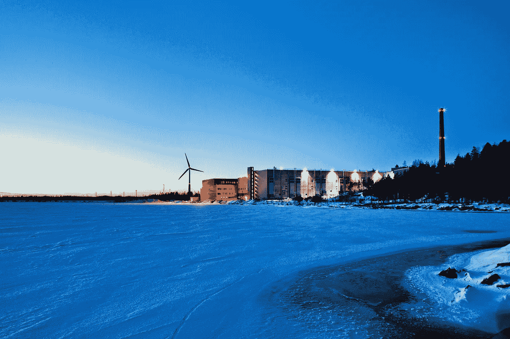

# 2016 年 1 月谷歌云平台新闻综述

> 原文：<https://medium.com/google-cloud/google-cloud-platform-news-roundup-for-january-2016-e9ceb37a958f?source=collection_archive---------0----------------------->

我们回来分享我们最喜欢的教程、视频和每月平台更新！

芬兰哈米娜

## 教程

*   [构建移动游戏分析平台](http://googlecloudplatform.blogspot.com/2016/01/build-a-mobile-gaming-analytics-platform.html)oy vind Roti
*   [Google Cloud SDK 团队推出的 Google Cloud CLI 的五大功能](http://googlecloudplatform.blogspot.com/2016/01/top-5-power-features-of-google-cloud-cli.html)
*   [uda city 的 Android](https://www.udacity.com/course/firebase-essentials-for-android--ud009)Firebase Essentials
*   Alex Van Boxel 通过 Python 日志处理程序进行云日志记录
*   [将解析服务器部署到谷歌应用引擎](/google-cloud/deploying-parse-server-to-google-app-engine-6bc0b7451d50#.2mzgorsy8)
*   [使用谷歌云 SQL](/google-cloud/using-google-cloud-sql-e3e4c123a89f#.rck25dmz6) 作者亚历山大·福尔克
*   [data proc——Demi Ben-Ari 拍摄的《GCP 星火群像》](/google-cloud/dataproc-spark-cluster-on-gcp-in-minutes-3843b8d8c5f8#.534nsmu93)
*   [谷歌云平台上的服务发现和配置](/google-cloud/service-discovery-and-configuration-on-google-cloud-platform-spoiler-it-s-built-in-c741eef6fec2#.j2c3223u2)作者 Sandeep Dinesh
*   [使用谷歌应用引擎和 Raspberry Pi Zero 的实时传感器仪表盘](http://omerio.com/2016/01/16/real-time-sensor-dashboard-using-google-app-engine-and-raspberry-pi-zero/)由 Omer Dawelbeit 开发

## **开源和谷歌云平台**

*   [数据流和开源 Frances Perry 和 James Malone 关于加入 Apache 孵化器](http://googlecloudplatform.blogspot.com/2016/01/Dataflow-and-open-source-proposal-to-join-the-Apache-Incubator.html)的提案
*   Cedric Lamoriniere 的《如何在 Kubernetes 中使用 Glow》
*   Ioannis Canellos 为 Jenkins 开发的 Kubernetes 工作流插件

## 看和听

*   约翰·威尔克斯在软件工程广播中谈到了博格和库本内特
*   [YouTube 上无处不在的开发者峰会上的谷歌云平台](/google-cloud/google-cloud-platform-at-ubiquity-dev-summit-2016-ffe0943812b9#.c0xvmbi5h)
*   [Cloud Minute:在 YouTube 上从 Rails](https://www.youtube.com/watch?v=olPk_uHgRyw&feature=youtu.be) 上传一张照片到云存储

## **谷歌云平台有什么新功能？**

*   [又一个大数据博客，2016 年？真的吗？为什么？](http://googlecloudplatform.blogspot.com/2016/02/another-Big-Data-blog-in-2016-really-why.html)
*   [AlphaGo:利用机器学习掌握围棋古棋](https://googleblog.blogspot.com/2016/01/alphago-machine-learning-game-go.html)
*   [GCP 下一个 2016:一个幕后的潜行高峰](http://googlecloudplatform.blogspot.com/2016/02/GCP-NEXT-2016-a-sneak-peak-behind-the-scenes.html)
*   [计算引擎现在每台虚拟机配备 3 TB 高速本地固态硬盘和 64 TB 永久磁盘](http://googlecloudplatform.blogspot.com/2016/02/Compute-Engine-now-with-3-TB-of-high-speed-Local-SSD-and-64-TB-of-Persistent-Disk-per-VM.html)
*   [Cloud9 IDE 现支持谷歌云平台](http://googlecloudplatform.blogspot.com/2016/01/Cloud9-IDE-now-supports-Google-Cloud-Platform.html)
*   [Google 和 Red Hat 整合了 OpenShift Dedicated 和 Google Cloud Platform，使采用容器变得更加容易](http://googlecloudplatform.blogspot.com/2016/01/google-and-red-hat-integrate-openshift-dedicated.html)

## 查找更多内容

您可以随时在 Twitter ( [@googlecloud](https://twitter.com/googlecloud) )、 [Medium](https://medium.com/google-cloud) 、 [Flipboard Magazine](https://flipboard.com/@googlecloud/google-cloud-platform-lfoqja31y) 上实时关注我们！

如果你创建与谷歌云平台相关的在线内容，我们很乐意看到。请用这张表格([http://bit.ly/gcp-content](http://bit.ly/gcp-content))寄给我们。