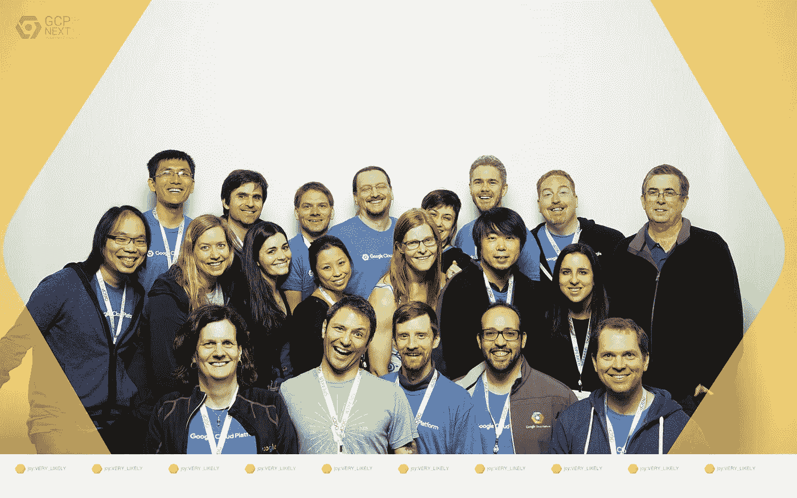

# 2016 年 3 月谷歌云平台新闻综述

> 原文：<https://medium.com/google-cloud/google-cloud-platform-news-roundup-for-march-2016-3a5b7098064?source=collection_archive---------1----------------------->

好了，朋友们，接下来我们从 GCP 回来。很高兴看到你们这么多人并和他们交谈！如果你不在那里，这个综述将帮助你赶上。它还将回顾一些你不应该错过的 3 月份的精彩博客和视频内容。

joy:很有可能是 2016 年在 GCP 体验@GCPemotobooth 的开发者权益团队的一部分

## 本月特色

*   GCP 接下来在三藩市召集了 2500 名与会者，会议结束后不久，我们在谷歌云平台 YouTube 频道上发布了[所有主题演讲和跟踪会议的录音](https://www.youtube.com/user/googlecloudplatform/playlists?shelf_id=10&sort=dd&view=50)。
*   Kubernetes 博客[发布了一系列深入的帖子，涵盖了 Kubernetes 1.2](http://blog.kubernetes.io/2016/03/five-days-of-kubernetes-12.html) 的新功能，包括扩展到 1000 个节点、使用 ubernetes 管理多区域集群、运行 Spark 集群以及管理部署。
*   谷歌云宣布了新的[云机器学习管理平台](https://cloudplatform.googleblog.com/2016/03/Google-takes-Cloud-Machine-Learning-service-mainstream.html)用于训练你自己的 TensorFlow 模型，并发布了最新的预训练模型[云语音 API](https://cloud.google.com/speech/) 。
*   除了[加入 Node.js 基金会](https://nodejs.org/en/blog/announcements/welcome-google/)之外，谷歌云平台宣布[node . js 运行时将在谷歌应用引擎](https://cloudplatform.googleblog.com/2016/03/Node.js-on-Google-App-Engine-goes-beta.html)上进入测试版。
*   [云开发者倡导者团队](https://twitter.com/googlecloud/lists/developer-advocates/members)使用谷歌计算引擎[计算和搜索 5000 亿位数的圆周率](https://cloudplatform.googleblog.com/2016/03/calculating-and-searching-500-billion-digits-of-Pi.html)。

## 教程

*   [通过](/google-cloud/deploying-django-postgres-and-redis-containers-to-kubernetes-part-2-b287f7970a33#.rp99bgmt5) [Bill Prin](https://twitter.com/waprin_io) 将 Django、Postgres 和 Redis 容器部署到 Kubernetes Part 2
*   [在谷歌云平台上构建松散集成的三种方式](https://cloudplatform.googleblog.com/2016/03/three-ways-to-build-Slack-integrations-on-Google-Cloud-Platform.html)作者[蒂姆·斯瓦斯特](https://twitter.com/timswast)
*   [在谷歌云平台上开始使用 Red Hat open shift](https://cloudplatform.googleblog.com/2016/03/getting-started-with-Red-Hat-OpenShift-on-Google-Cloud-Platform.html)
*   [亚历克斯·普拉加鲁](http://blog.gorgias.io/deploying-flask-celery-with-docker-and-kubernetes/)[制作的烧瓶和芹菜配 Kubernetes](https://twitter.com/humanfromearth)
*   [可扩展且有弹性的 Django 与 Kubernetes](https://harishnarayanan.org/writing/kubernetes-django/) 作者 [Harish Narayanan](https://twitter.com/copingbear)
*   [辛纳特拉在谷歌容器引擎上](http://www.thagomizer.com/blog/2016/03/24/sinatra-on-gke.html)由[艾捷拉·哈默利](https://twitter.com/thagomizer_rb)
*   [使用 JavaScript 的云视觉 API](http://terrenceryan.com/blog/index.php/working-with-cloud-vision-api-from-javascript/)和[使用 PHP 的云视觉 API](http://terrenceryan.com/blog/index.php/working-with-cloud-vision-api-from-php/)作者 [Terry Ryan](https://twitter.com/tpryan)
*   [Graham Polley](http://blog.shinetech.com/2016/03/30/creating-a-serverless-etl-nirvana-using-google-bigquery/)[使用 Google BigQuery](https://twitter.com/polleyg) 创建一个无服务器的 ETL 天堂
*   [绕谷歌云平台一圈，照片寻宝游戏](/google-cloud/one-lap-around-google-cloud-platform-with-photo-scavenger-hunt-ca0487b620d3#.xsm9dthro)由[布拉德·艾布拉姆斯](https://twitter.com/brada)

## **有趣的文章**

*   [Spotify 的活动交付——云之路(第三部分)](https://labs.spotify.com/2016/03/10/spotifys-event-delivery-the-road-to-the-cloud-part-iii/)伊戈尔·马拉维奇
*   [Google 分享数据中心安全和设计最佳实践](https://cloudplatform.googleblog.com/2016/03/Google-shares-data-center-security-and-design-best-practices.html)作者 Joe Kava
*   [谷歌分享软件网络负载平衡器设计为 GCP 网络提供动力](https://cloudplatform.googleblog.com/2016/03/Google-shares-software-network-load-balancer-design-powering-GCP-networking.html)作者[丹尼尔·e·艾森巴德](https://twitter.com/eisenbud)和[保罗·纽森](https://twitter.com/newsons_nybbles)
*   [蒂莫西·普里克特·摩根](http://www.nextplatform.com/2016/03/22/decade-container-control-google/)[在谷歌](https://twitter.com/TDaytonPM)掌控容器十年
*   [谷歌云认证:准备和先决条件](http://cloudacademy.com/blog/google-cloud-certification/)作者 [Eugene Teo](https://twitter.com/eugeneteo)

## **看和听**

*   [谷歌数据中心 360 之旅](https://www.youtube.com/watch?v=zDAYZU4A3w0)与[桑迪普·迪内什](https://twitter.com/sandeepdinesh)
*   [新的机器学习播放列表](https://www.youtube.com/playlist?list=PLOU2XLYxmsIIuiBfYad6rFYQU_jL2ryal)与乔什·戈登
*   [开发者展示(TL；DR 020)](https://www.youtube.com/watch?v=j9FtQE9Pl68&index=25&list=PLOU2XLYxmsII8REpkzsy1bJHj6G1WEVA1) 与[蒂莫西·乔丹](https://twitter.com/timothyjordan)
*   新[谷歌云平台播客](http://www.gcppodcast.com)集: [Kubernetes 1.2、](https://www.gcppodcast.com/post/episode-16-kubernetes-1-dot-2-with-kelsey-hightower/) [Bigtable](https://www.gcppodcast.com/post/episode-18-bigtable-with-ian-lewis/) 、[非洲的云](https://www.gcppodcast.com/post/episode-17-the-cloud-in-africa-with-hiren-patel-and-dale-humby/)和[接下来采访来自 GCP 的演讲者](https://www.gcppodcast.com/post/episode-19-gcp-next/)
*   Cloud Minute 系列的新功能:[将免费试用升级到付费账户](https://www.youtube.com/watch?v=OmXuQxQ-4EE)和[创建定制的谷歌计算引擎实例](https://www.youtube.com/watch?v=mZsdm9mRc94)。

## **谷歌云平台有什么新功能？**

*   [谷歌加入开放计算项目，推动 IT 基础设施标准](https://cloudplatform.googleblog.com/2016/03/Google-joins-Open-Compute-Project-to-drive-standards-in-IT-infrastructure.html)
*   [谷歌计算引擎增强高可用性控制](https://cloudplatform.googleblog.com/2016/03/Google-Compute-Engine-boosts-high-availability-controls.html)
*   [云 Bigtable 现在以更低的成本支持用于大分析工作负载的 HDD 存储](https://cloud.google.com/blog/big-data/2016/03/cloud-bigtable-now-supports-hdd-storage-for-big-analytics-workloads-at-lower-cost)
*   [谷歌宣布支持 Python 的云数据流](https://cloud.google.com/blog/big-data/2016/03/google-announces-cloud-dataflow-with-python-support)
*   [宣布谷歌云发布/订阅 gRPC Alpha](https://cloud.google.com/blog/big-data/2016/03/announcing-grpc-alpha-for-google-cloud-pubsub)
*   [谷歌云平台新增两个地区，10 个地区即将推出](https://cloudplatform.googleblog.com/2016/03/announcing-two-new-Cloud-Platform-Regions-and-10-more-to-come_22.html)
*   [谷歌如何为企业带来云计算创新](https://cloudplatform.googleblog.com/2016/03/how-Google-is-bringing-cloud-computing-innovation-to-the-enterprise.html)
*   [介绍 Google stack driver:GCP 和 AWS 的统一监控和日志记录](https://cloudplatform.googleblog.com/2016/03/Google-Stackdriver-integrated-monitoring-and-logging-for-hybrid-cloud.html)
*   [Google BigQuery 将历史数据存储成本削减了一半，并将许多查询速度提高了 10 倍](https://cloud.google.com/blog/big-data/2016/03/google-bigquery-cuts-historical-data-storage-cost-in-half-and-accelerates-many-queries-by-10x)
*   [推出无中断调整大小的谷歌云持久磁盘](https://cloudplatform.googleblog.com/2016/03/introducing-Google-Cloud-Persistent-Disks-with-non-disruptive-online-resizing.html)
*   [Google Cloud Datastore 简化定价，大幅削减大多数使用案例的成本](https://cloudplatform.googleblog.com/2016/03/Google-Cloud-Datastore-simplifies-pricing-cuts-cost-dramatically-for-most-use-cases.html)
*   [身份&访问管理](https://cloud.google.com/iam/) t ( [IAM)最佳实践指南现已推出](https://cloudplatform.googleblog.com/2016/03/IAM-best-practice-guides-available-now.html)

## **查找更多内容**

您可以随时在 Twitter ( [@googlecloud](https://twitter.com/googlecloud) )、 [Medium](https://medium.com/google-cloud) 、 [Flipboard Magazine](https://flipboard.com/@googlecloud/google-cloud-platform-lfoqja31y) )上实时关注我们！

如果你创建与谷歌云平台相关的在线内容，我们很乐意看到。请用这张表格【http://bit.ly/gcp-content】()寄给我们。