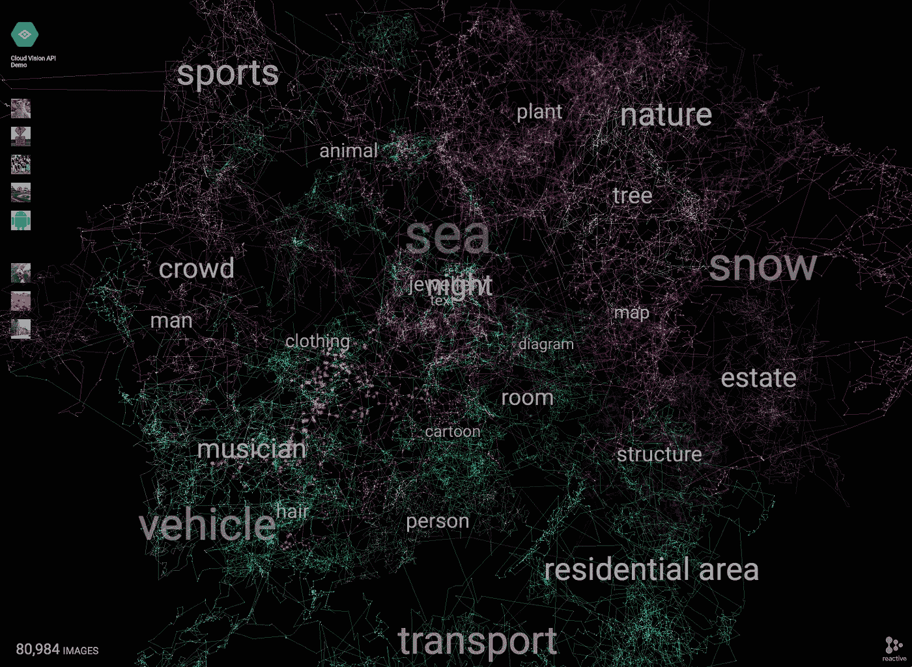

# 2016 年 5 月谷歌云平台新闻综述

> 原文：<https://medium.com/google-cloud/google-cloud-platform-news-roundup-for-may-2016-d1f21ee235bd?source=collection_archive---------0----------------------->

五月份来自 I/O 和其他地方的所有好东西！

云视觉探索者([http://vision-explorer.reactive.ai/](http://vision-explorer.reactive.ai/))

## 本月特色

*   [Firebase 现在是一个集成套件](https://firebase.googleblog.com/2016/05/firebase-expands-to-become-unified-app-platform.html)，具有分析、消息、blob 支持、远程配置、崩溃报告，以及与谷歌云平台的[集成。](https://cloudplatform.googleblog.com/2016/05/Firebase-and-Google-Cloud-better-together.html)
*   [云身份和访问管理(IAM)](https://cloud.google.com/iam/docs/) 变得普遍可用，使用它可以轻松管理和审计复杂组织结构、数百个工作组和任意数量项目中的角色。
*   谷歌宣布，它已经建立并开始使用张量处理单元(TPUs) ，这是一种加速机器学习应用程序的定制芯片。
*   I/O 2016 谷歌云平台的所有会议和演示都可以在我们的 YouTube 播放列表上[查看。](https://www.youtube.com/playlist?list=PLIivdWyY5sqJYl6ZPwwd7OM4Wt_SJsBHs)

## **教程**

*   [我如何通过使用 Google Cloud preemptable instances 降低 48%的云成本](http://www.agileandart.com/2016/05/04/how-i-reduced-my-cloud-cost-using-google-cloud/)作者: [Daniel Cukier](https://twitter.com/danicuki)
*   [大数据和 2016 年选举](/google-cloud/big-data-and-the-elections-2016-5bd53dda2315#.42xkp6xt2)作者[费利佩·霍法](https://twitter.com/felipehoffa)
*   [费利佩·霍法](/google-cloud/showing-off-the-new-free-google-analytics-data-studio-with-reddit-aprils-gilded-comments-for-ebe965dbbb15#.iau02chhe)[展示新的(免费)谷歌数据工作室](https://twitter.com/felipehoffa)
*   [使用 Kubernetes 健康检查](https://www.ianlewis.org/en/using-kubernetes-health-checks)由 [Ian Lewis](https://twitter.com/IanMLewis)
*   [食谱:Docker 日志→ Google Stackdriver 日志](https://www.eightypercent.net/post/docker-gcplogs.html)由[乔·贝达](https://twitter.com/jbeda)
*   [用云视觉 API](https://cloud.google.com/blog/big-data/2016/05/explore-the-galaxy-of-images-with-cloud-vision-api) 探索图像星系 [Kaz Sato](https://twitter.com/kazunori_279)
*   [构建零售实时库存系统](https://cloud.google.com/solutions/building-real-time-inventory-systems-retail)
*   [由](/google-cloud/experimenting-with-googles-cloud-vision-api-intel-edison-8f28501937b0#.di4d9ymf8)[伟伦](https://twitter.com/monkeytypewritr)试验谷歌的云视觉 API +英特尔爱迪生
*   [乔治·斯塔夫雷夫](/google-cloud/node-js-on-app-engine-with-cloud-sql-proxy-43f56279a56b#.xx8m1mtvv)[开发的带有云 SQL 代理](https://twitter.com/gstavrev)的应用引擎上的 node . js
*   [在谷歌应用引擎上部署流星应用](/google-cloud/deploying-a-meteor-app-on-google-app-engine-97d340c63576#.w78qnxq1n)作者[加藤大司](https://twitter.com/dai_shi)
*   [谷歌云平台上的 Apache Spark 集群](/google-cloud/apache-spark-cluster-on-google-cloud-platform-c99d8ebfc248#.yc3uu69iu)作者 [Aditya Choudhary](/@adich)
*   [由](/@SandeepDinesh/using-kube-ui-and-weave-scope-with-google-container-engine-63fadf9656f#.ynq3bj6t8) [Sandeep Dinesh](https://twitter.com/SandeepDinesh) 使用 kube-ui 和带有谷歌容器引擎的 Weave Scope
*   [如何用 Google BigQuery、公共数据集和 TensorFlow](https://cloud.google.com/blog/big-data/2016/05/how-to-forecast-demand-with-google-bigquery-public-datasets-and-tensorflow) 预测需求 [Lak Lakshmanan](https://twitter.com/lak_gcp)
*   [表情平滑](https://github.com/Instrument/emotobooth)和[查询一下！](https://github.com/Instrument/query-it) Github 知识库通过[仪器](https://twitter.com/instrument)
*   [来自谷歌 2016 年输入输出大会的 GCP 代码实验室](https://codelabs.developers.google.com/io2016?cat=Cloud)

## **有趣的文章**

*   [一个独立组织刚刚将谷歌评为最佳云，击败亚马逊](http://finance.yahoo.com/news/independent-organization-just-ranked-google-205459705.html)被朱莉·博尔特[击败](https://twitter.com/Julie188)
*   [谷歌云数据存储:NoSQL 数据库](/google-cloud/google-cloud-datastore-nosql-database-fa16a0b3556c#.jhr8i87yd) by [Sidd](/@sunguy)
*   宣布 SyntaxNet:世界上最精确的解析器开源
*   如何以最简单的方式在谷歌云上安装你的 ASP.NET 应用程序
*   的概述。NET 在谷歌云平台上由 [Mete Atamel](https://twitter.com/meteatamel)
*   [围绕 TensorFlow 和机器学习的嗡嗡声](https://cloud.google.com/blog/big-data/2016/05/the-fizz-buzz-around-tensorflow-and-machine-learning)作者 [Kaz Sato](https://twitter.com/kazunori_279)
*   [管理混合云环境的 5 种最佳实践](http://www.techrepublic.com/article/5-best-practices-for-managing-a-hybrid-cloud-environment/)作者 [Conner Forrest](https://twitter.com/ConnerForrest)
*   [分享你的应用想法，我会在几分钟内在谷歌应用引擎](/google-cloud/share-your-app-idea-and-i-will-implement-it-within-minutes-in-the-cloud-67f6a152f3ef#.qq8arfy3a)上由 [Lipis](https://twitter.com/Lipis) 实现
*   [从共享主机切换到谷歌云](/nested-loops/switching-to-google-cloud-from-shared-hosting-4c1df98706ff#.oemt28bd0)由[安德鲁·沃波尔](https://twitter.com/walpolea)
*   [谷歌云平台的 A 到 Z](/google-cloud/a-to-z-of-google-cloud-platform-a-personal-selection-the-index-39a8fc1a6c99#.jyi8l9vw7)by[Grace](https://twitter.com/grapesfrog)
*   [云、大数据和数据科学平台](/google-cloud/cloud-big-data-and-data-science-platform-9913c7f183e3#.52gg0cl41)由 [Obulapathi N Challa](/@obulpathi)
*   [云计算的未来:谷歌云](/google-cloud/the-future-of-cloud-computing-google-cloud-1d2100fd74b8#.efzsfcd3a)作者 [Obulapathi N Challa](/@obulpathi)
*   [BigQuery 和 Dataproc 在独立大数据平台比较中大放异彩](https://cloud.google.com/blog/big-data/2016/05/bigquery-and-dataproc-shine-in-independent-big-data-platform-comparison)作者 [Felipe Hoffa](https://twitter.com/felipehoffa)

## 看和听

*   [谷歌的微服务:Kubernetes 和 gRPC 与 Sandeep Dinesh](http://softwareengineeringdaily.com/2016/05/19/googles-microservices-kubernetes-grpc-sandeep-dinesh/) 在软件工程每日播客上
*   新[谷歌云平台播客](http://www.gcppodcast.com)集:[约翰·费米娜拉](https://www.gcppodcast.com/post/episode-27-unikernels-with-john-feminella/)的 Unikernels、[古斯塔沃·安布罗齐奥](https://www.gcppodcast.com/post/episode-26-war-dragons-with-gustavo-ambrozio/)的战龙、[安德鲁·格兰德和克里斯·布罗德福特](https://www.gcppodcast.com/post/episode-25-go-with-andrew-and-chris/)的云上之旅、【Terrance Shepherd 的谷歌云平台支持
*   [Kubernetes](https://www.udacity.com/course/scalable-microservices-with-kubernetes--ud615)的可扩展微服务，由[卡特·摩根](https://twitter.com/_askcarter)和[凯尔西·海塔尔](https://twitter.com/kelseyhightower)开发的新 Udacity 课程
*   [用大数据可视化赚大钱:2016 年选举互动演示，由 GCP 和比特纳米介绍](https://www.youtube.com/watch?v=8CDXovGmr-U)

## **谷歌云平台有什么新功能？**

*   谷歌应用引擎上的 Ruby 开始测试
*   [BigQuery 与 Google Drive 集成](https://cloud.google.com/blog/big-data/2016/05/bigquery-integrates-with-google-drive)
*   [App 引擎的 Stackdriver Trace 是 GA；app 延迟无处可藏](https://cloudplatform.googleblog.com/2016/05/Stackdriver-Trace-for-App-Engine-is-GA-app-latency-has-nowhere-to-hide.html)
*   [Firebase 和谷歌云:一起更好](https://cloudplatform.googleblog.com/2016/05/Firebase-and-Google-Cloud-better-together.html)
*   [介绍谷歌容器引擎(GKE)节点池](https://cloudplatform.googleblog.com/2016/05/introducing-Google-Container-Engine-GKE-node-pools.html)

## **查找更多内容**

您可以随时在 Twitter ( [@googlecloud](https://twitter.com/googlecloud) )、 [Medium](https://medium.com/google-cloud) 、 [Flipboard 杂志](https://flipboard.com/@googlecloud/google-cloud-platform-lfoqja31y)上实时关注我们！

如果你创建与谷歌云平台相关的在线内容，我们很乐意看到。请使用[这种形式](https://docs.google.com/a/google.com/forms/d/1nnpzeAib8ioZtkw1SFcsEOv0P0Ex-jdHvP4RVmiL3mo/viewform)([http://bit.ly/gcp-content](http://bit.ly/gcp-content))发送给我们。