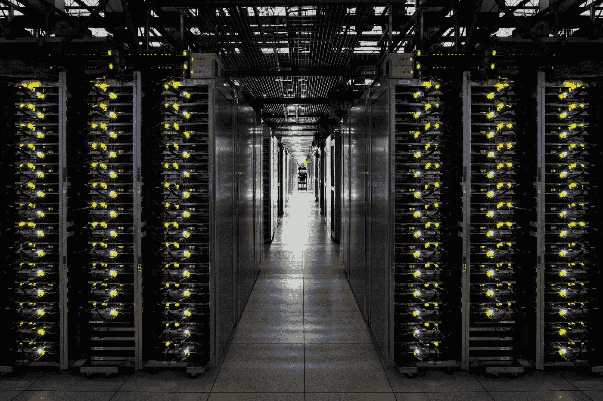

# 2015 年 11 月谷歌云平台新闻综述

> 原文：<https://medium.com/google-cloud/google-cloud-platform-news-roundup-for-november-2015-3e82517cce74?source=collection_archive---------2----------------------->

## 很棒的文章

*   谷歌研究院[宣布开源发布 tensor flow](http://googleresearch.blogspot.com/2015/11/tensorflow-googles-latest-machine_9.html)——他们的第二代机器学习系统。
*   Andrew Greene 分享了【Cord Project 如何以及为什么在 Go on Google App Engine 上构建他们的应用。
*   Ray Tsang [将他的 Go IDE](/google-cloud/my-ide-in-a-container-49d4f177de#.emfna53jg) 打包，以便在任何地方编写代码，而不必重新安装 IDE、组件和插件。
*   Ray 还带领我们在 Google Compute Engine 上运行了 OSv Tomcat 映像，这是他新系列的第一部分，主要关注 GCE 上的 Unikernel。
*   Felipe Hoffa 探索了来自 Reddit 和 Hacker News 的新数据集，[考察了美国总统竞选](/google-cloud/reddit-s-presidential-race-candidate-mentions-in-comment-1f9fd6a7985a#.i381k063t)，[比特币价格，等等。](/google-cloud/big-data-stories-in-seconds-hacker-news-abe52bc5caad#.3eabiishn)
*   Julia Ferraioli 通过向我们展示如何用 Docker 和 Kubernetes 在谷歌云平台上构建一个有趣的(有点荒谬的)她称之为“《我的世界》轮盘赌”的应用程序，结束了她关于集装箱化的《我的世界》系列。
*   Alex Freeman(via Business Insider)[分析了随着谷歌用于数据归档、在线备份和灾难恢复的云存储服务 Nearline](http://www.businessinsider.com.au/google-has-a-killer-cloud-storage-service-that-hardly-anyone-knows-about-yet-2015-10) 的正式发布而出现的挑战和机遇。
*   Alexandre Passant [展示了 iOS 应用 YapMe](http://apassant.net/2015/11/03/using-algolia-search-on-google-appengine/) 的工程方面，该应用使用 Google App Engine + Algolia 构建。
*   Kamal Marhubi 继续他关于开源集群管理器 Kubernetes 的系列教程；到目前为止，这个系列包含了三篇文章，分别是关于 kube let T1、T2、API 服务器 T3 和调度器 T5 的。
*   Pablo Caif [使用 Google Cloud Pub/Sub 和 Dataflow 对数据进行实时反规范化，并将其传输到 BigQuery](http://blog.shinetech.com/2015/10/19/messages-in-the-sky/) 中，以便进行分析和洞察。

## **看和听**

*   Alex Van Boxel 创建了一个与谷歌云平台相关的 [Devoxx 2015 会谈的 YouTube 播放列表。](https://www.youtube.com/playlist?list=PL0RaBAaCTrTql2V4P_yMmWuyFZL0CoOEW)

*   与谷歌人一起喝咖啡[查看了 Cloud Spin](https://www.youtube.com/watch?v=QQelTN2a5Tw&list=PLIivdWyY5sqL5Qn0JPyCHqD0CPvMmErLT&index=1) 的后端系统，该系统拍摄从不同角度拍摄的同步静止图像，将它们缝合在一起，并将其转化为动画 GIF。

*   [云分钟系列](https://www.youtube.com/playlist?list=PLIivdWyY5sqIij_cgINUHZDMnGjVx3rxi)增加了新视频，包括两个聚焦[谷歌云壳](https://cloud.google.com/cloud-shell/docs/)的视频。

## **谷歌云平台有什么新功能？**

*   Diane Greene 领导着云平台、Google for Work 和 Google Apps 团队。
*   [HTTPS 负载平衡现已全面上市](http://googlecloudplatform.blogspot.com/2015/11/bringing-you-more-flexibility-and-better-Cloud-Networking-performance-GA-of-HTTPS-Load-Balancing-and-Akamai-joins-CDN-Interconnect.html)，这意味着您的客户可以减少延迟并提高可用性。
*   [Akamai 是 CDN 互联](http://googlecloudplatform.blogspot.com/2015/11/bringing-you-more-flexibility-and-better-Cloud-Networking-performance-GA-of-HTTPS-Load-Balancing-and-Akamai-joins-CDN-Interconnect.html)的一部分，以谷歌云互联的价格从 GCP 直接连接到 Akamai。
*   [定制机器类型](http://googlecloudplatform.blogspot.com/2015/11/introducing-Custom-Machine-Types-the-freedom-to-configure-the-best-VM-shape-for-your-workload.html)使您能够组合不同数量的 vCPUs 和不同的内存大小，以获得最适合您工作负载的性价比。
*   [网飞的持续交付平台 Spinnaker 可以用来管理你在谷歌云平台](http://googlecloudplatform.blogspot.com/2015/11/Netflixs-Spinnaker-available-now-on-Google-Cloud-Platform.html)上的 CD 工作流程。
*   [云控制台移动应用](http://googlecloudplatform.blogspot.com/2015/11/take-control-of-your-logs-with-the-Cloud-Console-mobile-app.html)中的新日志查看器让你从 [Android](https://play.google.com/store/apps/details?id=com.google.android.apps.cloudconsole) 和 [iOS](https://itunes.apple.com/us/app/google-cloud-console/id1005120814?mt=8#iTunes) 中更深入地了解你的应用环境。
*   [Google Container Engine 和 Container Registry 中的新功能增强和合作伙伴集成](http://googlecloudplatform.blogspot.com/2015/11/enhancements-to-Container-Engine-and-Container-Registry.html)在管理容器映像和运行服务方面提供了更多选项。

## 查找更多内容

您可以随时在 Twitter ( [@googlecloud](https://twitter.com/googlecloud) )、 [Medium](https://medium.com/google-cloud) 、 [Flipboard Magazine](https://flipboard.com/@googlecloud/google-cloud-platform-lfoqja31y) )上实时关注我们！

如果你制作与谷歌云平台相关的在线内容，我们很乐意看到。请用[这张表格](https://docs.google.com/a/google.com/forms/d/1nnpzeAib8ioZtkw1SFcsEOv0P0Ex-jdHvP4RVmiL3mo/viewform)([http://bit.ly/gcp-content](http://bit.ly/gcp-content))寄给我们。