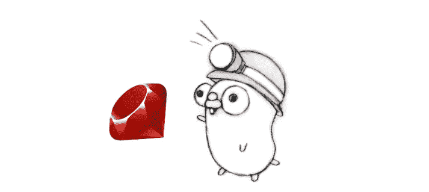
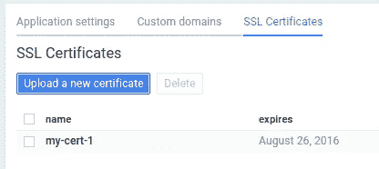

# 2015 年 9 月谷歌云平台新闻综述

> 原文：<https://medium.com/google-cloud/google-cloud-platform-news-roundup-for-september-2015-f2be61f5f1a4?source=collection_archive---------5----------------------->

他们说花时间停下来反思是很重要的。因此，让我们来看一下 **—** 我们九月份最喜欢的更新、文章和视频！

## 正式发布

*   [**谷歌计算引擎可抢占的虚拟机**](http://googlecloudplatform.blogspot.com/2015/09/Compute-Engine-Preemptible-VMs-now-generally-available.html) **—** 大幅打折的虚拟机实例，非常适合分布式容错工作负载。这项服务已经在基因组学、模拟和视频渲染等应用中使用。
*   [**CDN 互联**](http://googlecloudplatform.blogspot.com/2015/09/push-google-cloud-origin-content-out-to-users.html)**——**该服务提供 CDN 提供商和谷歌边缘网络之间的直接互联链接。
*   [**新美东地区:**](http://googlecloudplatform.blogspot.com/2015/10/Bringing-Google-Cloud-Platform-closer-to-more-people-and-businesses.html)**——**东海岸你好！谷歌云平台推出第四个区域，位于南卡罗来纳州伯克利县。
*   [**区域性 Google 云存储**](http://googlecloudplatform.blogspot.com/2015/10/Bringing-Google-Cloud-Platform-closer-to-more-people-and-businesses.html) **—** 现在，您可以将存储桶放在更靠近计算实例的地方，并在四个区域(亚洲-东部 1、欧洲-西部 1、美国-东部 1 和美国-中部 1)中的任何一个区域提供。

## 测试版公告

*   [**Google Cloud data proc**](http://googlecloudplatform.blogspot.com/2015/09/Google-Cloud-Dataproc-Making-Spark-and-Hadoop-Easier-Faster-and-Cheaper.html)**—**托管 Spark 和 Hadoop 集群，可快速启动、扩展和关闭，每个操作平均耗时不超过 90 秒。

## 精彩的文章和视频

我们发布了[开始使用 Ruby](https://cloud.google.com/ruby/) 和[开始使用 Go](https://cloud.google.com/go/) 的文档，补充了 [Node.js](https://cloud.google.com/nodejs/) 和 [Python](https://cloud.google.com/python/) 的相关文档。这些指南将引导您完成首次应用部署，并为您提供使用存储、设置身份验证、登录等资源。

[Satish Talim](/@IndianGuru) 将他的学习笔记翻译成了一个有用的系列([第 1 部分](/google-cloud/go-cloud-endpoints-and-app-engine-19d290dafda3)、[第 2 部分](/google-cloud/go-cloud-endpoints-and-app-engine-e3413c01c484)、[第 3 部分](/google-cloud/go-cloud-endpoints-and-app-engine-64d1c78bea82))，教你如何使用 Go、云端点和 App Engine 编写 REST API。

通过 Andrea Mucci 的教程[了解如何使用 SQLAlchemy 配置 Python 应用程序，以便在本地运行 App Engine 应用程序。](/pixel-heart/sqlalchemy-google-app-engine-mysql-mac-osx-5b5189410509)

[由](/@tribou/getting-started-with-google-cloud-55937aa6b9)[亚伦·特里布](/@tribou)撰写的《Google Cloud 上的 Kubernetes 入门》将带您在几分钟内完成一个单节点集群(约 6 美元/月)。

[云旋转](https://twitter.com/googlecloudspin)背后的团队，你可能已经在[谷歌云平台 Next](https://cloudplatformonline.com/NEXT_Google_Cloud_Platform_Experience_Home.html) 上看到过，发布了一个三部分的系列([第一部分](http://googlecloudplatform.blogspot.com/2015/09/Cloud-Spin-Part-1-180-degree-animations-on-Google-Cloud-Platform.html)、[第二部分](http://googlecloudplatform.blogspot.com/2015/09/cloud-spin-part-2-building-mobile-apps-to-orchestrate-video-recording.html)、[第三部分](http://googlecloudplatform.blogspot.com/2015/10/Cloud-Spin-Part-3-processing-video-using-Google-Cloud-Platform-services.html))，讲述他们如何从概念到现场演示。查看一些即将推出的带有稳定功能的[变化](https://twitter.com/bretmcg/status/649404622839382017)，并在 GitHub 上观看 [Cloudspin，因为他们计划发布完整的演示代码。](https://github.com/cloudspin/cloudspin)

带有自定义域名的谷歌应用引擎变得更好了！看看[最近发布的](https://groups.google.com/forum/#!msg/google-appengine/ge-qFsFgtHM/EVEIJD0vBAAJ)SSL 现在可以在开发者控制台中配置了。

## 看和听

[云分钟系列](https://www.youtube.com/playlist?list=PLIivdWyY5sqIij_cgINUHZDMnGjVx3rxi)继续在谷歌云平台 YouTube 频道播出。自从我们的上一次综述以来，一个新的视频开始在谷歌云平台上添加正常运行时间警报。你永远不知道什么时候一分钟能帮你节省十分钟，所以去看看[播放列表](https://www.youtube.com/playlist?list=PLIivdWyY5sqIij_cgINUHZDMnGjVx3rxi)。

 [## 播客:可抢占的虚拟机降低癌症研究的成本

### 在本期播客中，来自 Cycle Computing 的 Jason Stowe 描述了布罗德研究所是如何利用……

insidehpc.com](http://insidehpc.com/2015/09/podcast-preemptible-vms-lower-cost-of-cancer-research-at-broad-insitutue/) 

Cycle Computing 访问了 [The Rich Report podcast](http://insidehpc.com/2015/09/podcast-preemptible-vms-lower-cost-of-cancer-research-at-broad-insitutue/) 来谈论 Broad Institute 如何使用 Google Cloud Platform preemptable VMs 来使用机器学习技术执行高度复杂的基因组分析，并致力于癌症研究的潜在突破。

谷歌的技术负责人弗朗西斯·佩里(Frances Perry)在@Scale 大会上介绍了使用[谷歌云数据流](https://cloud.google.com/dataflow/)结合流媒体和批量分析，并通过构建数据流管道来处理移动游戏日志来演示这项服务。

[Brian Dorsey](https://twitter.com/briandorsey) 加入了 Google 系列的 [Coffee，讨论使用开源的 Kubernetes 项目来管理容器。](http://goo.gl/HZcIYc)

## 查找更多内容

喜欢这些文章？在 Twitter ( [@googlecloud](https://twitter.com/googlecloud) )、 [Medium](https://medium.com/google-cloud) 和 [Flipboard 杂志](https://flipboard.com/@googlecloud/google-cloud-platform-lfoqja31y)上关注我们！

地鼠角色基于由 [Renée French](http://reneefrench.blogspot.com/) 设计的围棋吉祥物，并根据[知识共享署名 3.0 许可](http://creativecommons.org/licenses/by/3.0/us/)获得版权

红宝石标志是版权(c) 2006，松本幸宏。它是根据知识共享署名-相似分享 2.5 协议的条款授权的:http://creativecommons.org/licenses/by-sa/2.5/