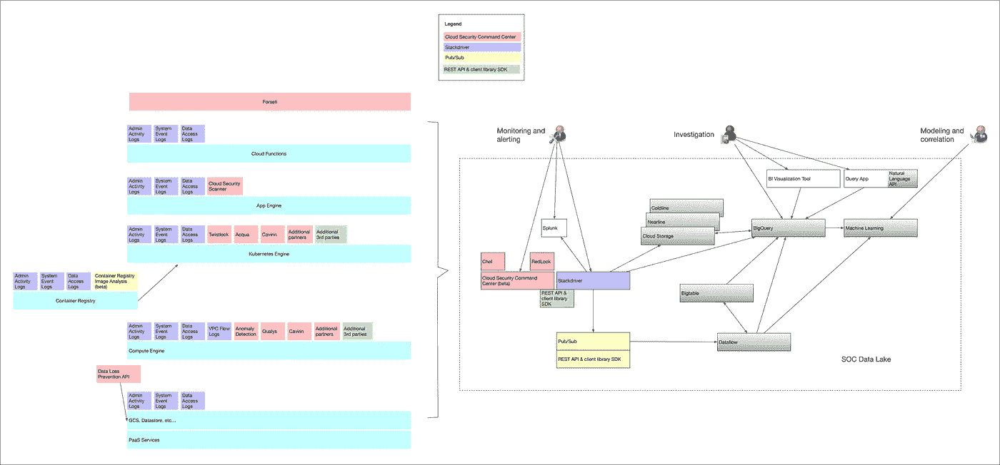

# 谷歌云平台安全运营中心数据湖

> 原文：<https://medium.com/google-cloud/google-cloud-platform-security-operations-center-soc-data-lake-4b31e011f622?source=collection_archive---------1----------------------->

## 狮子、老虎和熊，哦，我的天

谷歌云平台为其各种平台带来了大量的安全监控设施，并提供了包括 [Stackdriver](https://cloud.google.com/stackdriver/) 和[云安全指挥中心](https://cloud.google.com/security-command-center/)在内的工具来监控它们。此外，还有丰富的合作伙伴生态系统，许多客户已经在其 Splunk 实施中实施了安全监控策略。

[这篇解决方案文章](https://cloud.google.com/solutions/build-a-data-lake-on-gcp)提供了如何在谷歌云平台上构建数据湖的概述。下图显示了 Google 云平台安全源和汇之间的关系，以帮助您将数据湖指南映射到安全运营中心(SOC)场景。

安全作战中心数据湖体系结构:相关的源和汇颜色相同。

# 数据湖组件

## Google Stackdriver

[Stackdriver](https://cloud.google.com/stackdriver/) 聚合来自基础设施的指标、日志和事件，为开发人员和运营商提供一组丰富的可观察信号，以加速根本原因分析并缩短解决问题的平均时间(MTTR)。

它提供了与 BigQuery、Cloud Pub/Sub、云存储、云数据实验室等云数据工具的原生集成，以及与 Splunk Enterprise 等工具的现成集成。

您可以[根据组织、文件夹、项目和计费 id 过滤要排除的](https://cloud.google.com/logging/docs/reference/v2/rest/v2/projects.exclusions/create)日志。

您可以[在组织、文件夹或项目级别启用数据访问日志](https://cloud.google.com/logging/docs/audit/configure-data-access)(默认情况下启用其他日志)。

*   您可以指定要接收其审核日志的服务。例如，您可能希望审计日志来自计算引擎，而不是来自云 SQL。

## 谷歌云安全指挥中心

[云安全指挥中心](https://cloud.google.com/security-command-center/)为企业提供跨应用引擎、计算引擎、Kubernetes 引擎、云存储、数据存储、Spanner、云 DNS、服务帐户和 Google 容器注册表的云资产的整合可见性。

云安全指挥中心集成了 Google 云平台安全工具，如云安全扫描程序和云数据丢失防护(DLP) API。

它还集成了第三方安全解决方案，如 Acqua、Cavirin、Cloudflare、CrowdStrike、Dome9、Palo Alto Networks RedLock、Qualys 和 Twistlock，并提供了一个 API 和架构来集成其他第三方工具。

## 谷歌云数据流

[Cloud Dataflow](https://cloud.google.com/dataflow/) 是一项全面管理的服务，用于以流(实时)和批处理(历史)模式转换和丰富数据，具有同等的可靠性和表现力，无需更多复杂的变通办法或妥协。

使用云数据流作为一个方便的集成点，通过将基于 TensorFlow 的云机器学习模型和 API 添加到您的数据处理管道中，将预测分析引入安全事件管理。

## 谷歌大查询

[BigQuery](https://cloud.google.com/bigquery/) 允许组织使用其强大的流接收功能实时捕获和分析安全数据，以便您的洞察力始终保持最新。它通过无缝查询存储在 BigQuery 的托管列存储、云存储、云 Bigtable、Sheets 和 Drive 中的数据，为您提供所有数据的完整视图。

它使您能够分析所有安全运营数据，使用简单的 SQL 构建和实施机器学习解决方案，并以数据集、查询、电子表格和报告的形式在组织内外轻松安全地共享见解。它…

*   集成现有的 ETL 工具，如 Informatica 和 Talend，以丰富您已经使用的数据。
*   支持流行的 BI 工具，如 Tableau、MicroStrategy、Looker 和 Data Studio，因此任何人都可以轻松创建报告和仪表板。

[BigQuery ML](https://cloud.google.com/bigquery/docs/bigqueryml-intro) (beta)使用户能够使用标准的 SQL 查询创建和执行机器学习模型；它还通过消除移动数据的需要提高了开发速度。它支持以下类型的模型:

*   线性回归-这些模型可用于预测数值。
*   二元逻辑回归—这些模型可用于预测两类中的一类(如识别事件是否代表安全威胁)。
*   用于分类的多类逻辑回归-这些模型可用于预测两个以上的类，例如输入是否代表低、中或高影响威胁。

## 谷歌云存储

[谷歌云存储](https://cloud.google.com/storage/)允许在全球范围内随时存储和检索任意数量的数据。

支持的数据源包括 Cloud Pub/Sub、Stackdriver Logging、Dataflow、BigQueryBigQuery 也可以从 Google 云存储中导入。

[对象生命周期管理](https://cloud.google.com/storage/docs/lifecycle)能够将对象存储类别(如近线、冷线)设置为较低成本的类别，用于不经常访问的对象，并根据以下条件删除对象

*   对象年龄
*   日期
*   版本数量

# 记录

另一方面，非云原生的组织在内部拥有一些网络基础设施，可能想看看 Alphabet 剥离的 [Chronicle](https://chronicle.security/) ，它正在构建一个网络安全情报平台，可以帮助组织更好地管理和理解他们自己的数据。Chronicle 旨在通过更快、更容易地分析数据，以及寻找跨来源和随时间推移的模式，来解开有价值的隐藏见解。

# 下一步是什么

阅读关于[容器和虚拟机威胁检测和保护](https://medium.com/p/a40ef4403bca/edit)