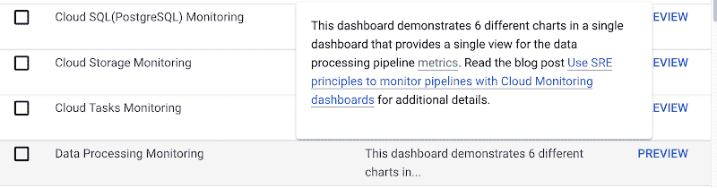
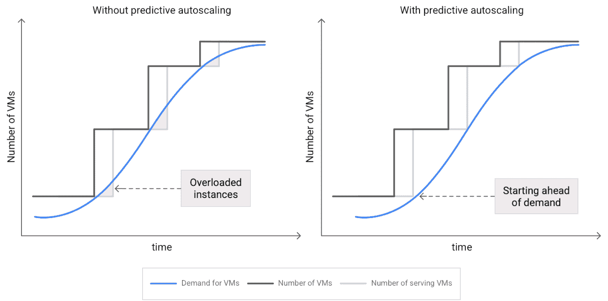
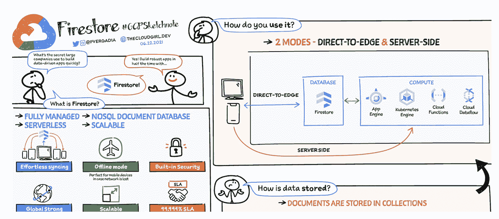

# 谷歌云平台——技术金块——2021 年 7 月 1 日至 15 日

> 原文：<https://medium.com/google-cloud/google-cloud-platform-tech-nuggets-july-1-15-2021-cb8f9a703158?source=collection_archive---------0----------------------->

欢迎参加 2021 年 7 月 1 日至 15 日的谷歌云平台-技术掘金。

**认证更新**

我们推出了一项新的认证**云数字领导者**认证，该认证测试个人对云的一般知识和理解，独立于特定的技术角色。查看[认证](https://cloud.google.com/certification/cloud-digital-leader)页面了解更多详情。

**基础设施**

我们在印度的第二个云区域，德里 NCR 已经[上线](https://cloud.google.com/blog/products/infrastructure/google-cloud-region-in-delhi-ncr-is-now-open)。这将极大地促进印度客户的需求，他们需要在该国设立第二个区域来满足高可用性工作负载以及合规性和数据主权方面的需求。

我们的 GCP 网络现已覆盖全球 26 个地区。查看我们的[谷歌云位置](https://cloud.google.com/about/locations/)页面。

另一方面，我们的计算迁移引擎获得了重大升级，目标是使迁移流程更易于管理。Migrate for Compute Engine (MCE) V5 现已作为托管服务提供，不再需要在云中安装任何特定于迁移的资源。只需在您的 GCP 项目中启用 Migrate for Compute Engine API，并在本地环境中部署 Migrate Connector。点击阅读更多[。](https://cloud.google.com/blog/topics/developers-practitioners/migrate-for-compute-engine-as-a-service)

您是否努力设置云监控仪表板，并决定要监控哪些服务、要获取哪些指标、如何放置图表等？通过我们的[云监控仪表板库](https://cloud.google.com/blog/products/operations/dashboards-cloud-monitoring-made-easier-samples)，您可以获得很好的帮助。正如博客文章所说的“这些示例仪表板现在可以直接从您的云控制台的云监控部分获得。您不必再以编程方式创建它们，只需点击一下鼠标就可以获得所有示例！”

最后，作为我们智能云的一部分，我们[引入了预测性自动扩展](https://cloud.google.com/blog/products/compute/introducing-compute-engine-predictive-autoscaling)，它使用您的实例组的 CPU 历史来预测未来负载，并计算需要多少虚拟机来满足您的目标 CPU 利用率。

**客户案例**

我们的客户神童是一个迎合在线零售商和出版商的绩效营销渠道。对灵活性和大规模需求的需求给他们的遗留数据库系统带来了压力。他们转向 Google Cloud，利用 BigTable 来帮助他们满足这些需求。查看他们如何实现这一目标的故事。

**分析& AI/ML**

首先，如果您正在寻找我们分析产品的公告摘要，只需看看这篇[帖子](https://cloud.google.com/blog/products/data-analytics/new-month-data-analytics-simple-sophisticated-and-secure)，它捕捉了 BigQuery、数据流、数据融合等方面的新功能。

本期有几篇有趣的帖子，我们希望您能看看:

*   如果您对构建数据湖感兴趣，可以在您的内部设置和云中运行，并通过 Spark、Presto 等 oss 产品保留您的工具选择(以避免锁定)。，查看这篇文章[中的](https://cloud.google.com/blog/topics/developers-practitioners/how-build-open-cloud-datalake-delta-lake-presto-dataproc-metastore)，它为您提供了一个架构和一步一步的参考实现。
*   运行数据计划的组织不缺乏帮助收集、处理和分析数据的工具。然而，为了实现真正的数据民主化，并允许具有正确访问控制的团队访问数据集、执行分析和可视化，我们提供了一个关于如何使用 BigQuery 和 Looker 实现统一数据分析平台的[概述](https://cloud.google.com/blog/topics/developers-practitioners/creating-unified-analytics-platform-digital-natives)。

为您的 AI/ML 计划选择合适的技术堆栈不是一件简单的事情。在本文中，Lak Lakshmanan 将带您了解各种选择，并重点关注预测分析、非结构化数据、自动化和个性化等关键用例。

**Dialogflow CX 大赛暨原生 App 开发技能挑战赛**

[Google Cloud Dialogflow](https://cloud.google.com/dialogflow) 是我们的对话式人工智能平台，用于构建运行在网站或多个其他消息平台上的虚拟代理(聊天机器人)。Dialogflow CX 是 Dialogflow 的新版本，提供了更直观和更强大的方式来设计对话体验。如果你想学习 Dialogflow CX，我们刚刚推出了一个[竞赛](https://events.withgoogle.com/dialogflow-cx-competition-global/)，不仅有助于学习，还能在此过程中赢得一些奖品。

Google Cloud 为开发者提供强大的无服务器应用开发服务，包括 Firebase、Cloud Run 等。我们邀请您加入我们关于本地应用开发的 [30 天技能挑战](https://cloud.google.com/blog/topics/training-certifications/introducing-new-native-app-development-skills-challenge)，来帮助了解这些服务。技能挑战是一系列有指导的动手实验，您需要完成这些实验，然后进行最后的挑战实验来测试您的技能。

**奖金**

Firestore 是一个灵活、可扩展的 NoSQL 云数据库，用于存储和同步客户端和服务器端开发的数据。查看此[开发者表](https://cloud.google.com/blog/topics/developers-practitioners/all-you-need-know-about-firestore-cheatsheet)以了解更多关于 Firestore 的信息。

保持联系！

*有问题、意见或其他反馈。一定要把它送过来。*

*想关注新的谷歌云产品发布吗？我们有一个方便的页面，您可以将它加入书签→* [*谷歌云*](https://bit.ly/3umz3cA) *的新功能。*