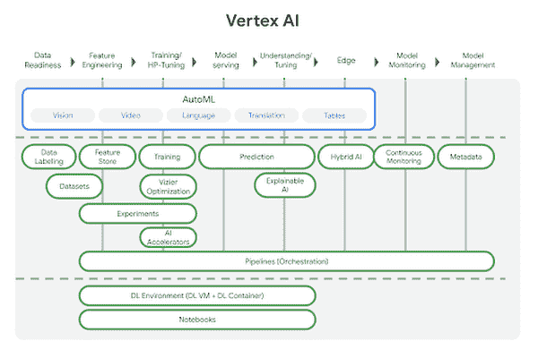
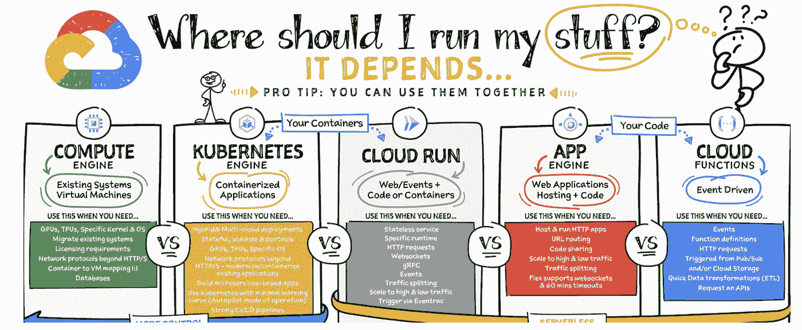

# 谷歌云平台——技术金块——2021 年 7 月 16 日至 31 日

> 原文：<https://medium.com/google-cloud/google-cloud-platform-tech-nuggets-july-16-31-2021-e3521375dfab?source=collection_archive---------2----------------------->

欢迎来到 2021 年 7 月 16 日至 31 日的谷歌云平台-技术掘金版。

首先，请注意 Google Cloud Next 的[注册](https://cloud.withgoogle.com/next/register?utm_source=google&utm_medium=blog&utm_campaign=FY21-Q4-global-ES903-onlineevent-er-next-2021&utm_content=blog-next-21-registration&_ga=2.194198697.-545181806.1627628476)将于 10 月 12 日至 14 日开放

## **基础设施**

在我们的基础设施部分，我们有一个 [Q2 版](https://cloud.google.com/blog/products/compute/what-happened-in-q2-with-google-cloud-iaas)，它涵盖了在这一领域发布的多个产品，从。这是一篇很棒的博文，回顾了围绕谷歌云平台的所有基础设施(计算、网络、存储、容器等)相关新闻。

一个新的云区域在墨尔本开始营业。这使得云区域的数量达到 27 个，我们将继续在这一领域进行投资。请务必阅读连接中东与南欧和亚洲的蓝色和拉曼海底电缆。

如果你使用过谷歌云存储，你很有可能使用过 gsutil 将你的文件传输到 GCP。虽然 gsutil 确实有一些锦囊妙计来将文件传输分成几部分并并行上传，但我们现在在 gcloud SDK 中有了 [**gcloud storage˘** 命令](https://cloud.google.com/blog/products/storage-data-transfer/new-gcloud-storage-enables-super-fast-data-transfers)。该命令使用新的并行化策略来加速向云的传输。我们的测试显示，与使用 **gsutil** 做同样的事情相比，两位数的百分比有所提高。值得一看。

## **客户案例**

了解家得宝如何不仅将其 SAP 应用迁移到 GCP，而且[还利用](https://cloud.google.com/blog/products/sap-google-cloud/how-the-home-depot-migrated-to-sap-on-google-cloud)提供各种分析服务，包括 BigQuery ML 和 AutoML。如果你是 SAP on GCP 的现有客户，并希望利用我们的分析和人工智能，特别是 BigQuery，那么看看这篇[博客文章](https://cloud.google.com/blog/products/sap-google-cloud/design-considerations-for-sap-data-modeling-in-bigquery)，它强调了在 BigQuery 中建立 SAP 数据模型的各种方法。将您的 SAP 数据移动到 Big Query 这样的分析仓库中，不仅可以整合您的 SAP 数据和我们的数据源，还可以帮助您利用谷歌云的关键优势，即人工智能和 ML 服务。

此外，一定要看看天空传媒集团的[之旅](https://cloud.google.com/blog/topics/developers-practitioners/how-sky-saved-millions-with-google-cloud)，开始一项财务运营战略，节省$$$的开支。

## **分析& AI/ML**

Vertex AI 是我们的端到端 ML 平台，就其提供的不同服务而言，可能有点难以理解。

为了帮助您浏览各种服务，我们有一篇[博客文章](https://cloud.google.com/blog/topics/developers-practitioners/new-ml-learning-path-vertex-ai)，通过一个有趣的真实世界用例强调了如何学习和理解要使用的服务。本文介绍了各种选项，包括预训练模型、通过 AutoML 定制模型以及开发您自己的定制模型。本文继续讨论如何部署和监控您的模型以及围绕它的整个 MLOps 工作流。这是帮助你理解顶点人工智能的必要读物。

说到 MLOps，其中一个关键需求是监控生产环境中部署的模型，以发现培训服务偏差。查看这篇关于如何在 Vertex AI 中启用模型监控的[文章](https://cloud.google.com/blog/topics/developers-practitioners/monitor-models-training-serving-skew-vertex-ai)和一个[短视频](https://www.youtube.com/watch?v=IPi1p9d1niM)来了解它。

我们最近发布了 [Datastream](https://cloud.google.com/datastream) ，这是一种无服务器的变更数据捕获和复制服务。查看这篇[帖子](https://cloud.google.com/blog/topics/developers-practitioners/all-you-need-know-about-datastream)，了解它如何使数据变更从源系统流向目标系统。

## **云运营**

如果您一直在使用我们的传统指标和代理来深入了解您的基础架构，我们有统一运营代理，现已正式上市。Ops 代理，一个基于 OpenTelemetry 的代理，现在是我们从计算引擎实例收集遥测数据的主要代理。阅读[更多关于它的](https://cloud.google.com/blog/products/operations/ops-agent-now-ga-and-it-includes-opentelemetry)。

## **奖金**

我们有多种基础设施服务，包括计算引擎、应用引擎、Google Kubernetes 引擎、云运行和云功能，您可以在其中运行您的应用。但问题是，哪种服务最适合您的工作负载，这些工作负载可以是传统的整体式应用程序，也可以是容器化的工作负载，甚至是松散耦合的事件驱动架构。

查看我们的帖子，标题为“[我应该在哪里运行我的东西？选择谷歌云计算选项](https://cloud.google.com/blog/topics/developers-practitioners/where-should-i-run-my-stuff-choosing-google-cloud-compute-option)，帮助你导航。

保持联系！

*有问题、意见或其他反馈。一定要把它送过来。*

*想关注新的谷歌云产品发布吗？我们有一个方便的页面，您可以将它加入书签→* [*谷歌云的新功能*](https://bit.ly/3umz3cA) *。*