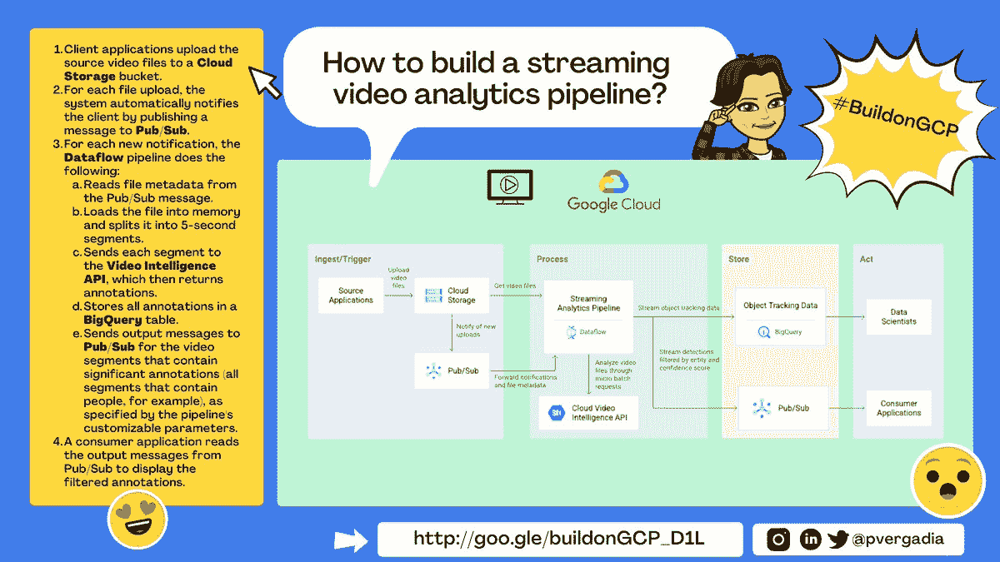
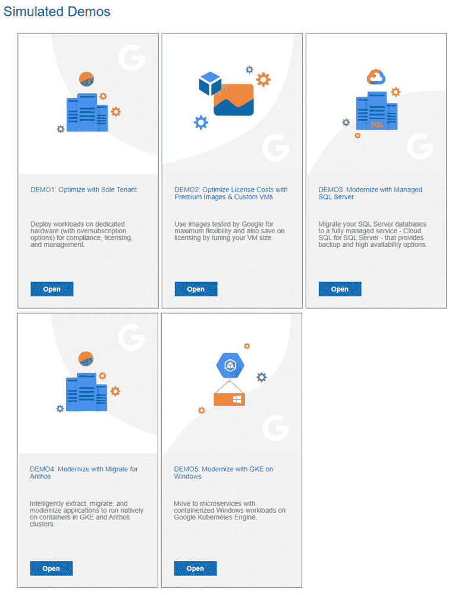

# 谷歌云平台——技术金块——2021 年 6 月 1 日至 15 日

> 原文：<https://medium.com/google-cloud/google-cloud-platform-tech-nuggets-june-1-15-2021-f5866326a5fa?source=collection_archive---------1----------------------->

欢迎参加 2021 年 6 月 1 日至 15 日的谷歌云平台-技术掘金。

我们听到了您关于增加技术掘金频率的反馈，这是我们每两周一次在谷歌云平台上为您带来技术新闻的第一次迭代。对于那些第一次阅读这篇文章的人，我们看看最近的公告，并突出几篇文章，与我们自己的评论一起阅读。

**建造 GCP 建筑系列**

谷歌云的开发者倡导者 Priyanka Vergadia 发布了一个名为“建立在 GCP 之上”的新迷你系列。该系列将在 Twitter 和 LinkedIn 上独家播出，你可以在 Twitter 上关注 [@pvergadia](https://twitter.com/pvergadia) 。已经发布了两集，并引出了该解决方案的架构蓝图，这些蓝图发布在官方的 Google Cloud 文档中:

*   使用谷歌云构建流媒体视频分析管道。([链接](https://twitter.com/pvergadia/status/1404469266439675908))
*   在 Google Cloud 上用数据流和云视觉 API 构建一个  机器学习视觉分析解决方案。([链接](https://twitter.com/pvergadia/status/1404891668126519302))

该系列将持续 13 天，每天都有新的架构发布。

**客户案例**

在本期的客户案例中，了解阿拉伯银行[如何使用谷歌云加速](https://cloud.google.com/blog/products/apigee/arab-bank-accelerates-app-innovation-with-google-cloud)他们的应用程序开发和测试，并实现真正的数字化转型。

**为 Anthos 迁移:现代化工具集**

我们不断听到客户希望采取下一步措施，不仅采用云，还要确保他们顺利实现应用程序现代化。我们的客户在虚拟机(Windows 和 Linux 应用程序)中运行工作负载，并希望迁移到容器化，请向我们咨询一款工具，该工具将有助于发现和评估其应用程序的现代化适应性，并帮助他们进行容器化。我们确实有针对 Anthos 的[迁移，这可以帮助您做到这一点。Google Cloud 的开发者倡导者 Mike Coleman 在](https://cloud.google.com/migrate/anthos)[的博客文章](https://cloud.google.com/blog/topics/developers-practitioners/streamline-your-application-migration-journey-migrate-anthos-and-gke)中描述了今天如何使用 Migrate for Anthos。Mike 发布了一个关于这个主题的[系列视频](https://www.youtube.com/playlist?list=PLIivdWyY5sqLbI6lgiwBLI6OJ94X7AjNW)，从规划阶段开始，迁移基于 Windows 和 Linux 虚拟机的工作负载，第 2 天的操作等等。

**让您的微软和 Windows 工作负载现代化**

谷歌云是运行 Windows 工作负载的绝佳平台。这些工作负载范围广泛，从您在 Windows 虚拟机上运行的本地应用程序，到将您的 SQL Server 数据库迁移到我们完全托管的云 SQL，甚至是在 GKE 上运行 Windows containers。

听起来很有趣？如果您可以尝试上述场景之一，通过我们的模拟演示亲自体验一下会怎么样。今天，您可以通过我们设立的[演示中心](https://cloud.google.com/blog/topics/windows/new-microsoft-and-windows-on-google-cloud-demo-center)来完成这项工作。

**谷歌应用 ML 峰会**

[Google 应用 ML 峰会](https://cloudonair.withgoogle.com/events/summit-ml-practitioners)于 6 月 9 日召开。数字活动涵盖了如何在您的应用中应用我们的机器学习服务。这些会议对我们的机器学习服务进行了广泛的报道，从训练您自己的定制模型、监控模型、构建端到端的 ML 管道等等。

数据云峰会的会议可以点播，如果你正在观看该活动的一些很酷的演示，请查看该网站的演示视频部分，其中包括一个[联络中心人工智能虚拟代理](https://showcase.withgoogle.com/ccai)，一个[披萨认证器](https://showcase.withgoogle.com/experiment/pizza-authenticator/)等等。

**奖励:对于那些在**之前从未使用过 Firestore 的人

Firestore 是我们完全管理的 NoSQL 数据库。如果你以前从未听说过 Firestore，或者想了解更多，这篇文章不仅可以让你熟悉 Firestore，还可以让你了解数据库类型的基本概念。

我们还建议你可以使用他方便的[快速入门指南](https://firebase.google.com/docs/firestore/quickstart)来给 Firestore 一个惊喜。

保持联系！

*有问题、意见或其他反馈。一定要把它送过来。*

*想关注新的谷歌云产品发布吗？我们有一个方便的页面，您可以将它加入书签→* [*谷歌云的新功能*](https://bit.ly/3umz3cA) *。*