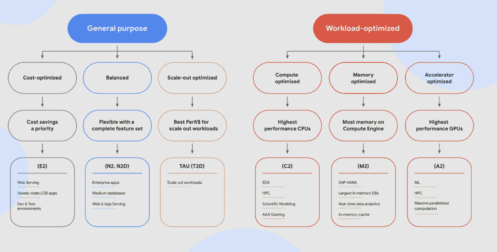

# 谷歌云平台—技术金块—2021 年 6 月 16 日至 30 日

> 原文：<https://medium.com/google-cloud/google-cloud-platform-tech-nuggets-june-16-30-2021-6958d635b705?source=collection_archive---------1----------------------->

欢迎来到 2021 年 6 月 16 日至 30 日的谷歌云平台-技术掘金版。

**Tau VM 家族**

计算引擎(Compute Engine)是 Google Cloud 上提供虚拟机的核心产品，以其安全性、可靠性和灵活性而闻名，可以选择虚拟机来运行您的工作负载。虽然我们为您提供了一系列计算引擎虚拟机系列，从标准、高计算、高内存甚至定制配置，但我们刚刚推出了我们的最新产品: [Tau 虚拟机系列](https://cloud.google.com/blog/products/compute/google-cloud-introduces-tau-vms)，可为横向扩展工作负载提供经济高效的性能。

为了帮助您正确定位新的虚拟机系列，我们还发布了一篇关于[Tau 虚拟机](https://cloud.google.com/blog/topics/developers-practitioners/5-things-you-didnt-know-about-new-tau-vms)的 5 件您应该知道的事情的帖子。作为奖励，我们有一个全新的图表，说明如何为您的工作负载选择合适的虚拟机系列。

**开发者和客户社区**

我们已经宣布对我们的两个核心社区进行投资:开发人员和客户，目标是支持他们采用新技术并利用新技术解决业务问题。

*   **Google Cloud Community** :一个聚集所有人讨论 Google Cloud 各种主题(中心)并通过分享您的知识来回馈您的同行的地方。在 googlecloudcommunity.com[注册，开始使用谷歌云社区](http://googlecloudcommunity.com/)。
*   **堆栈溢出集合**:开发者不需要任何关于堆栈溢出的介绍。谷歌的谷歌云和 Go 语言产品团队将积极参与这两个集体。目标是分享知识，与开发人员密切合作，并认可积极的贡献者。加入谷歌云的[堆栈溢出集合](https://stackoverflow.com/collectives/google-cloud)和/或谷歌 Go 语言的[集合](https://stackoverflow.com/collectives/go)。

**大查询更新**

我们已经[宣布了](https://cloud.google.com/blog/products/data-analytics/bigquery-provides-tighter-controls-over-data-access)big query 中行级安全性(RLS)的普遍可用性。这允许组织将用户限制为同一表中的数据子集。请记住，除了 RLS，BigQuery 还支持对[项目-](https://cloud.google.com/bigquery/docs/access-control) 、[数据集-](https://cloud.google.com/bigquery/docs/dataset-access-controls) 、[表-](https://cloud.google.com/bigquery/docs/table-access-controls-intro) 和[列级](https://cloud.google.com/bigquery/docs/column-level-security)的访问控制。

在一个对企业将事务数据引入分析仓库至关重要的关键特性版本中，我们已经宣布了 BigQuery 中多语句事务的公开预览。正如官方博客文章所说的“多语句事务支持多个 SQL 语句，包括 DML，在单个事务中跨越多个表。这意味着，对与给定事务中的所有语句相关联的多个表中的数据的更改，如果成功，将自动(一次全部)提交，如果失败，将自动全部回滚。

**谷歌云 VMware 引擎更新**

[Google Cloud VMware Engine](https://cloud.google.com/vmware-engine)提供在 Google Cloud 中本地运行的企业级 VMware 堆栈。我们最近[发布了该服务的多个更新](https://cloud.google.com/blog/products/cloud-migration/updates-to-google-cloud-vmware-engine)，下面列出了一些:

*   更快的资源调配时间(30 分钟即可获得专用且安全的 VMware 私有云)。
*   自动扩展功能，您可以使用策略驱动的自动化来扩展您的节点。
*   谷歌云 KMS 集成
*   对活动目录的 NSX-T 支持

对于印度的客户，Google Cloud VMware Engine 现已在孟买地区推出。

**无代码开发**

Google Cloud 的无代码开发平台 AppSheet 让任何只有很少或没有编程经验的人都可以构建可以在桌面或移动设备上运行的定制应用。随着公司最近宣布采用混合模式，当我们都回到工作岗位时，每个人都需要一个应用程序来帮助简化办公室会议室、桌子等的预订。

为了帮助你理解使用 Appsheet 创建一个应用程序是多么容易，这篇[的博客文章](https://cloud.google.com/blog/products/no-code-development/build-no-code-apps-with-appsheet-for-hybrid-work-and-more)，除了你可以定制的源项目，还展示了你如何利用现有的 Google sheet 来设计、开发和自动化一个全功能的应用程序。

**Google for Games 开发者峰会暨#BuildonGCP 架构系列**

2021 年谷歌游戏开发者峰会将于 7 月 12 日至 13 日举行。在线活动将涵盖产品和解决方案、最佳实践等，帮助开发者将游戏体验提升到新的水平。

在上一个版本中，我们介绍了#BuildOnGCP 架构系列。这里有一篇[博文](/google-cloud/top-13-google-cloud-reference-architectures-c8a697546505)，涵盖了该系列的概要，其中有 13 个 GCP 架构供你参考。

**//保持联系！**

*有问题、意见或其他反馈。一定要把它送过来。*

*想关注新的谷歌云产品发布吗？我们有一个方便的页面，您可以将它加入书签→*[*Google Cloud*](https://bit.ly/3umz3cA)*的新功能。*