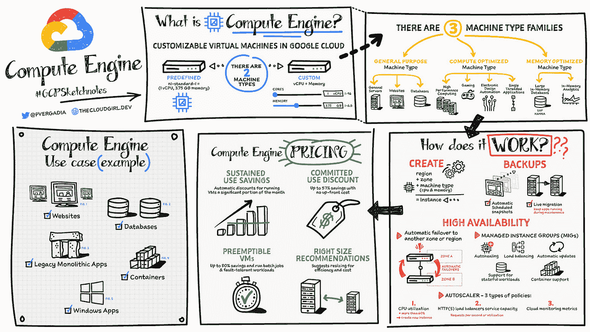

# 谷歌云平台—技术金块—2021 年 6 月

> 原文：<https://medium.com/google-cloud/google-cloud-platform-tech-nuggets-june-2021-eb54079b31fe?source=collection_archive---------1----------------------->

欢迎来到谷歌云平台技术掘金。我们查看了上个月的所有公告，并突出了几篇文章，以便与我们自己的评论一起阅读。

**来自谷歌 I/O 的更新**

我们的年度开发者大会 Google I/O 于 5 月 18 日至 20 日举行，会上发布了一系列产品，包括 Android、WearOS、Flutter、Tensorflow，当然还有 Google Cloud。具体到谷歌云，在人工智能、无服务器和谷歌工作空间领域都有公告。你可以阅读[摘要](https://cloud.google.com/blog/topics/developers-practitioners/google-cloud-launches-google-io-2021)，但更具体地说，请查看[云开发者 I/O 指南](https://cloud.google.com/blog/topics/developers-practitioners/cloud-developers-guide-google-io-2021)，其中包含[会议和研讨会](https://events.google.com/io/program/content/?5=type_workshop&5=type_technicalsession&lng=en)的链接，现在可以点播。如果您想尝试动手实验室，请随意选择活动中的任何[云代码实验室](https://events.google.com/io/learning-lab/?4=topic_cloud&lng=en)。

**客户案例**

我们本月的客户案例重点介绍了 [6 位客户如何选择在谷歌云平台](https://cloud.google.com/blog/products/sap-google-cloud/6-businesses-transforming-sap-google-cloud)上运行其 SAP 工作负载，以及他们今天看到的转型和优势。

查看我们的 [SAP 解决方案网站](https://cloud.google.com/solutions/sap),了解关于 GCP SAP 和我们客户的更多信息。

**Anthos 更新**

我们已经发布了许多关于 Anthos 的文章，我们已经将它们汇总在一篇易于参考的博客文章中，标题为[Anthos in dependent](https://cloud.google.com/blog/topics/hybrid-cloud/anthos-in-depth-blog-series)，其中涵盖了我们在混合和多云开发系列中发布的文章。我们想在这里强调的一篇有趣的文章解决了你购买 Anthos 后的一个常见问题。你下一步要做什么来建立这种势头？我们涵盖了开始你的第一天旅程的六项举措。

如果你想开始学习 Anthos，看看我们的 [Anthos 101 系列](https://cloud.google.com/blog/topics/anthos/anthos-101-learning-series-all-the-videos-in-one-place)。

**安全更新**

Cloud Armor 是我们在 Google Cloud 上的分布式拒绝服务(DDoS)保护和网络应用防火墙(WAF)服务，随着 Google Cloud Armor Managed Protection Plus 的推出，我们看到了[的更新](https://cloud.google.com/blog/products/identity-security/google-cloud-armor-managed-protection-plus-is-now-ga)。这些更新包括:检测第 7 层攻击的机器学习服务，简化应用程序有效访问控制部署的精选规则，24/7 DDoS 响应支持和 DDoS 账单保护，客户将能够提出索赔，以获得因 DDoS 攻击而产生的账单峰值金额。

请务必查看我们的帖子，其中列出了保护您的组织免受勒索软件攻击的最佳实践。在本文中，我们列出了 NIST 在其网络安全框架中确定的 5 个保护支柱(识别、保护、检测、响应和恢复),并为您提供各种谷歌云服务如何帮助您实现这一目标的信息。

谷歌云还发布了 [CISO 透视:2021 年 5 月](https://cloud.google.com/blog/products/identity-security/cloud-ciso-perspectives-may-2021)，提供了云安全和行业亮点的良好综述。

**来自数据云峰会的重大公告**

5 月 26 日举行的[数据云峰会](https://cloudonair.withgoogle.com/events/summit-data-cloud)聚集了领先的公司，分享他们如何使用谷歌云构建他们的数据云。峰会见证了重要的新产品发布和多项服务的更新。你可以点击查看公告列表[。我们想在这里强调几个:](https://cloud.google.com/blog/products/data-analytics/google-cloud-announces-new-data-cloud-products)

*   **Dataplex** :跨数据湖、数据仓库和数据集市集中管理、监控和治理您的数据，并使这些数据能够从单一视图安全地供各种分析和数据科学工具访问。
*   **数据流**:无服务器变更数据捕获(CDC)和复制服务。
*   **Analytics Hub** :一种完全托管的服务，允许您通过数据治理共享数据集和分析资产。

我们还宣布了 [Vertex AI](https://cloud.google.com/blog/products/ai-machine-learning/google-cloud-launches-vertex-ai-unified-platform-for-mlops) ，这是一个人工智能平台，可以简化大规模构建、训练和部署 ML 模型的过程。

数据云峰会的专题讲座可在[点播](https://cloudonair.withgoogle.com/events/summit-data-cloud)。

**奖励:跨云服务提供商和计算引擎的产品供应指南#Sketchnotes**

我们有一个方便的新指南，介绍谷歌云、AWS 和 Azure 的产品。这是我们之前文档的改进版本，但这次能够过滤您正在查看的特定区域，例如计算。查看[博客文章](https://cloud.google.com/blog/topics/developers-practitioners/handy-new-google-cloud-aws-and-azure-product-map)，其中列出了其他有用的资源，如各种 GCP 服务的 2 分钟指南，以及用不超过 4 个字描述每个谷歌云产品。

我们的核心计算产品 Compute Engine 拥有自己的 sketchnotes。[了解](https://cloud.google.com/blog/topics/developers-practitioners/what-compute-engine-use-cases-security-pricing-and-more)该服务、主要使用案例、定价及其工作原理。

保持联系！

*有问题、意见或其他反馈。一定要把它送过来。*

*想关注新的谷歌云产品发布吗？我们有一个方便的页面，您可以将它加入书签→* [*谷歌云*](https://bit.ly/3umz3cA) *的新功能。*