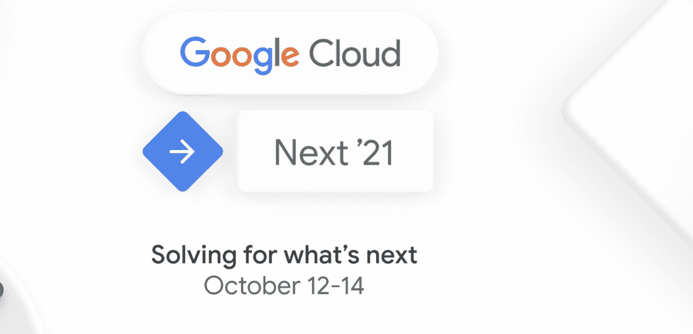

# 谷歌云平台技术金块—2021 年 8 月 1 日至 15 日版

> 原文：<https://medium.com/google-cloud/google-cloud-platform-technology-nuggest-august-1-15-2021-edition-9d053196e4ad?source=collection_archive---------1----------------------->

欢迎参加 2021 年 8 月 1 日至 15 日的谷歌云平台-技术掘金。

友情提醒，Google Cloud Next 的[注册](https://cloud.withgoogle.com/next/register?utm_source=google&utm_medium=blog&utm_campaign=FY21-Q4-global-ES903-onlineevent-er-next-2021&utm_content=blog-next-21-registration&_ga=2.194198697.-545181806.1627628476)将于 10 月 12 日至 14 日开放。

## **基础设施**

Google 内部的应用程序现代化是什么样子的？查看这篇[博客文章](https://cloud.google.com/blog/topics/developers-practitioners/running-anthos-inside-google)，关于谷歌团队如何将供应商管理的应用、Confluence 和 Acronix 从计算引擎虚拟机转移到 Anthos。这篇文章强调了在虚拟机上运行这些应用程序的难点，以及将它们迁移到 Anthos 的好处。

我们发布了许多自助服务指南，帮助[迁移到谷歌云](https://cloud.google.com/blog/products/cloud-migration/30-guides-to-kickstart-your-migration-to-google-cloud)。这些指南分为不同的工作负载，以便围绕存储和数据库迁移(Microsoft、VMware、SAP)到一般迁移。

我们的数据库管理服务最近正式发布，使得将您的 SQL 数据库迁移到云 SQL 变得更加容易。但是您知道吗，您甚至可以使用这项服务来升级您的数据库的主要版本。看看这篇[博文](https://cloud.google.com/blog/topics/developers-practitioners/mysql-major-version-upgrade-using-database-migration-service)。

## 分析和人工智能/人工智能

如果您希望深入了解大查询，有一个名为“大查询管理系列”的精彩系列，已经发布了多个帖子，从资源层次结构到最新的数据治理帖子。查看到目前为止发布的深度文章，并为这个系列添加书签，以便随时参考:

*   [资源层次](https://cloud.google.com/blog/topics/developers-practitioners/bigquery-admin-reference-guide-resource-hierarchy)
*   [作业&预约模式](https://cloud.google.com/blog/topics/developers-practitioners/bigquery-admin-reference-guide-jobs-reservation-model)
*   [存储内部构件](https://cloud.google.com/blog/topics/developers-practitioners/bigquery-admin-reference-guide-storage)
*   [查询处理](https://cloud.google.com/blog/topics/developers-practitioners/bigquery-admin-reference-guide-query-processing)
*   [查询优化](https://cloud.google.com/blog/topics/developers-practitioners/bigquery-admin-reference-guide-query-optimization)
*   [数据治理](https://cloud.google.com/blog/topics/developers-practitioners/bigquery-admin-reference-guide-data-governance)

说到分析，每个组织都希望利用数据洞察力。虽然这是组织想要的目标，但当您构建一个完整的分析管道战略时，仍然会出现一些基本问题。是数据湖还是数据仓库？我们应该使用什么工具？如果我们想对一个典型的数据管道从摄取到可视化和推理的所有阶段进行建模和运行，该怎么办？我们已经写了一篇[论文](https://cloud.google.com/blog/products/data-analytics/building-unified-analytics-data-platform-google-cloud)，展示了如何构建一个统一的分析平台。看看这个。

## 安全性

OWASP Top 10 是由[开放 Web 应用程序安全(OWASP)基金会](https://owasp.org/)列出的每个应用程序所有者都应该注意的十大安全风险。查看我们架构部分的详细指南[,该指南涵盖了各种 Google 云安全产品，以及它有助于降低哪些 OWASP 十大风险。](https://cloud.google.com/architecture/owasp-top-ten-mitigation)

这不仅是了解风险的好方法，也是将风险映射到特定 GCP 安全产品的好方法。例如，下面显示了我们的 DDoS 和 WAF 服务 Google Cloud Armor 的十大风险，您可以单击每个风险(勾选标记)来查看 Google Cloud Armor 的功能。

## 云运营

在用户体验方面的另一个胜利是，我们在计算引擎虚拟机详细信息页面中集成了几个上下文可观察性指标。这有助于排除故障和监控关键指标，同时调查虚拟机本身，而不是在多个 ui 和工具之间切换上下文。

现在，您可以点击任何虚拟机，获得关于 CPU、磁盘、内存、网络和实时进程的丰富可视化内容。

## **奖金**

您是否希望了解更多关于 IOT 的 GCP 故事，以及它提供了哪些服务来帮助您推出下一款由 GCP 支持的物联网产品？看看这份[技术笔记](https://cloud.google.com/blog/topics/developers-practitioners/what-cloud-iot-core)，帮助你了解[物联网核心](https://cloud.google.com/iot-core/)背后的核心组件。

最后，首届[谷歌云创业峰会](https://cloud.google.com/blog/topics/startups/a-digital-event-dedicated-to-startups-by-google-cloud)将于 2021 年 9 月 9 日举行，我们鼓励您注册参加。查看本次活动的[发布日程](https://cloudonair.withgoogle.com/events/startup)。

## 保持联系！

*有问题、意见或其他反馈。一定要把它送过来。*

*想关注新的谷歌云产品发布吗？我们有一个方便的页面，您可以将它加入书签→* [*谷歌云的新功能*](https://bit.ly/3umz3cA) *。*