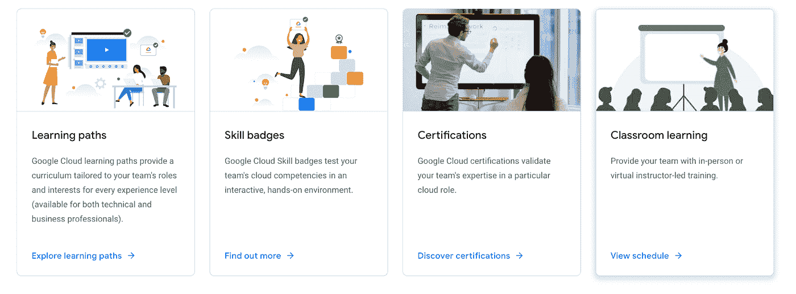

# 谷歌云平台技术金块—2022 年 4 月 1 日至 15 日版

> 原文：<https://medium.com/google-cloud/google-cloud-platform-technology-nuggets-april-1-15-2022-edition-79ce403a597b?source=collection_archive---------0----------------------->

欢迎参加 2022 年 4 月 1 日至 15 日的谷歌云技术金块。

## **云数据峰会**

云数据峰会 22 已经结束，围绕多个产品发布了重要公告。这些会议可以点播，为了帮助浏览，请尝试这篇博文，这篇博文重点介绍了[云数据峰会](https://cloud.google.com/blog/products/data-analytics/top-5-things-to-catch-up-on-from-data-cloud-summit-2022?utm_source=ext&utm_medium=partner&utm_campaign=CDR_rom_gcp_gcptechnuggets_feb-a-2022_021622&utm_content=-)的 5 大要点。

随着谷歌统一数据和人工智能产品的方法，请查看这篇[帖子](https://cloud.google.com/blog/products/ai-machine-learning/new-features-for-google-clouds-unified-data-and-ai-platform?utm_source=ext&utm_medium=partner&utm_campaign=CDR_rom_gcp_gcptechnuggets_feb-a-2022_021622&utm_content=-)，它强调了这些服务如何以统一的方式协同工作，以及云数据峰会的重要公告。

## **可持续性**

谷歌云致力于其可持续发展目标，即到 2030 年，其全球所有数据中心和办公室全天候完全使用无碳能源(CFE)..查看全天候无碳能源的[政策路线图](https://cloud.google.com/blog/topics/sustainability/a-policy-roadmap-for-achieving-247-carbon-free-energy?utm_source=ext&utm_medium=partner&utm_campaign=CDR_rom_gcp_gcptechnuggets_feb-a-2022_021622&utm_content=-)。

## **客户**

如果你是一个棒球和数据分析迷，这是再好不过的了。想象一下下面的数据:MLB 从其 2430 场常规赛的每场比赛中收集了 2500 万个独特的数据点，目的是使用这些数据来改善球员的比赛，更重要的是，改善球迷的体验。

查看[帖子](https://cloud.google.com/blog/products/data-analytics/mlb-pitches-new-data-uses-with-google-cloud-services?utm_source=ext&utm_medium=partner&utm_campaign=CDR_rom_gcp_gcptechnuggets_feb-a-2022_021622&utm_content=-)关于谷歌云如何捕获和处理这些数据，以及该平台的未来。

## **安全**

对于采用云的企业来说，安全性可能是最重要的讨论之一。自从围绕云如何增强组织的安全态势的早期模型以来，我们已经走过了漫长的道路。查看这篇[文章](https://cloud.google.com/blog/topics/public-sector/how-public-cloud-reduces-risk-and-keeps-data-more-secure?utm_source=ext&utm_medium=partner&utm_campaign=CDR_rom_gcp_gcptechnuggets_feb-a-2022_021622&utm_content=-)，它强调了当前的挑战、企业如何应对多重风险、共担责任等等，以帮助保持数据安全。

[谷歌云外部密钥管理器](https://cloud.google.com/blog/products/identity-security/hold-your-own-key-with-google-cloud-external-key-manager?utm_source=ext&utm_medium=partner&utm_campaign=CDR_rom_gcp_gcptechnuggets_feb-a-2022_021622&utm_content=-)(云 EKM)，它让你用加密密钥保护你的云数据，这些密钥存储在谷歌云基础设施之外的第三方密钥管理系统中并进行管理，已经看到一些密钥[更新](https://cloud.google.com/blog/products/identity-security/whats-new-with-cloud-ekm?utm_source=ext&utm_medium=partner&utm_campaign=CDR_rom_gcp_gcptechnuggets_feb-a-2022_021622&utm_content=-)。从 EKM 到 VPC，对非对称密钥的支持等等，还有云 EKM 的最佳实践指南[。](https://cloud.google.com/docs/security/reliable-ekm-architectures?utm_source=ext&utm_medium=partner&utm_campaign=CDR_rom_gcp_gcptechnuggets_feb-a-2022_021622&utm_content=-)

## **德沃普斯和 SRE**

谷歌已经发布了 SRE 的权威指南，但如果你正在寻找不同的格式，SRE 团队已经推出了名为“[谷歌 SRE 产品预测](https://cloud.google.com/blog/products/devops-sre/discover-prodcast-the-site-reliability-engineering-podcast?utm_source=ext&utm_medium=partner&utm_campaign=CDR_rom_gcp_gcptechnuggets_feb-a-2022_021622&utm_content=-)的恰当标题，这是一个采访式的播客，谷歌的网站可靠性工程师在这里讨论关键的 SRE 概念，并分享他们的经验，建议和强烈的意见。直接去 https://sre.google/prodcast/[听前两集:SRE 哲学和以客户为中心的监控。](https://sre.google/prodcast/)

## **数据分析**

其中一个最重要的产品是 BigLake，它是一个统一了数据仓库和数据湖的存储引擎。查看[细节](https://cloud.google.com/blog/products/data-analytics/unifying-data-lakes-and-data-warehouses-across-clouds-with-biglake?utm_source=ext&utm_medium=partner&utm_campaign=CDR_rom_gcp_gcptechnuggets_feb-a-2022_021622&utm_content=-)。

无服务器 Spark 产品得到了[的推动](https://cloud.google.com/blog/products/data-analytics/making-serverless-spark-even-more-powerful?utm_source=ext&utm_medium=partner&utm_campaign=CDR_rom_gcp_gcptechnuggets_feb-a-2022_021622&utm_content=-)，它现在能够通过 Jupyter 笔记本进行无服务器交互开发，与 Vertex AI Workbench 进行了本机集成。不仅如此，它本身在 BigQuery、Vertex AI、Dataplex 和 Dataproc 中都是可用的。

Dataproc 现在[在 GA 的 Google Kubernetes 引擎(GKE)上](https://cloud.google.com/blog/products/infrastructure-modernization/running-spark-on-kubernetes-with-dataproc?utm_source=ext&utm_medium=partner&utm_campaign=CDR_rom_gcp_gcptechnuggets_feb-a-2022_021622&utm_content=-)可用。这有助于您利用 k8s 来管理和优化您的计算平台。

## **数据库**

在数据库方面已经发布了多项产品:

*   Cloud SQL now [支持预览版中 PostgreSQL 和 SQL Server 的](https://cloud.google.com/blog/products/databases/cloud-sql-launches-support-for-in-place-upgrades?utm_source=ext&utm_medium=partner&utm_campaign=CDR_rom_gcp_gcptechnuggets_feb-a-2022_021622&utm_content=-)就地升级。
*   beta 中有一个全新的名为“专业云数据库工程师”[的专业认证。](https://cloud.google.com/blog/products/databases/google-cloud-announces-a-new-certification-for-database-engineers?utm_source=ext&utm_medium=partner&utm_campaign=CDR_rom_gcp_gcptechnuggets_feb-a-2022_021622&utm_content=-)
*   [宣布](https://cloud.google.com/blog/products/databases/migrate-your-databases-to-google-cloud-with-the-new-database-migration-program?utm_source=ext&utm_medium=partner&utm_campaign=CDR_rom_gcp_gcptechnuggets_feb-a-2022_021622&utm_content=-)数据库迁移计划，即将现有开源和专有数据库迁移到 Google Cloud 数据库的方法，无论是在内部还是在云中。
*   数据库迁移服务支持 Oracle 到 PostgreSQL 模式和数据迁移，在预览版中[可用。](https://cloud.google.com/blog/products/databases/migrate-oracle-to-postgresql?utm_source=ext&utm_medium=partner&utm_campaign=CDR_rom_gcp_gcptechnuggets_feb-a-2022_021622&utm_content=-)
*   MySQL 的云 SQL Insights】现已在预览版中推出。以前它只适用于 PostgreSQL。

一定要看看一个旨在成为谷歌云数据库权威指南的新系列。该系列的第一部分已经出版，它讲述了[数据建模基础知识](https://cloud.google.com/blog/topics/developers-practitioners/definitive-guide-databases-google-cloud-part-1-data-modeling-basics?utm_source=ext&utm_medium=partner&utm_campaign=CDR_rom_gcp_gcptechnuggets_feb-a-2022_021622&utm_content=-)。

## **机器学习**

这里有一篇可靠的[博客文章](https://cloud.google.com/blog/topics/developers-practitioners/automating-income-taxes-document-ai?utm_source=ext&utm_medium=partner&utm_campaign=CDR_rom_gcp_gcptechnuggets_feb-a-2022_021622&utm_content=-)描述了 Lending Document AI 如何构建一个解决方案，该解决方案可以从税务表格中提取信息，存储这些数据以供分析/审查，然后帮助生成税务申报文档。虽然此示例主要针对美国特定的税务表单，但它为将来提供了可能性，在将来可以集成跨各种行业的更多区域性文档格式。这篇文章包括一步一步的说明，以获得演示设置。

语音技术使得多种应用成为可能，这些应用使得使用应用的界面更加自然。谷歌云语音技术作为其机器学习 API 的一部分，可以帮助实现一系列应用程序。查看[谷歌云语音人工智能指南](https://cloud.google.com/blog/products/ai-machine-learning/your-ultimate-guide-to-speech-on-google-cloud?utm_source=ext&utm_medium=partner&utm_campaign=CDR_rom_gcp_gcptechnuggets_feb-a-2022_021622&utm_content=-)，该指南强调了多种语音应用，包括翻译、字幕、自然语言处理等。

[优化 AI](https://cloud.google.com/optimization?utm_source=ext&utm_medium=partner&utm_campaign=CDR_rom_gcp_gcptechnuggets_feb-a-2022_021622&utm_content=-) 及其第一个特性:云车队路由(CFR) API，现已正式发布。CFR 的目标是帮助车队运营商创建精确的大规模车队路线计划。查看[帖子](https://cloud.google.com/blog/products/ai-machine-learning/google-cloud-optimization-ai-cloud-fleet-routing-api?utm_source=ext&utm_medium=partner&utm_campaign=CDR_rom_gcp_gcptechnuggets_feb-a-2022_021622&utm_content=-)了解更多详情。

## **无服务器应用开发**

想把你的爱好带给全世界吗？Google Cloud 中的哪些服务可以帮助您部署应用程序，并在扩展时完成繁重的工作？查看这篇[文章](https://cloud.google.com/blog/topics/developers-practitioners/deploy-coloring-page-generator-minutes-cloud-run?utm_source=ext&utm_medium=partner&utm_campaign=CDR_rom_gcp_gcptechnuggets_feb-a-2022_021622&utm_content=-)，它演示了如何构建一个彩色页面生成器。这是一个伟大的一步一步的教程，你可以在你的应用程序中使用。

如果您使用我们的无服务器平台，如云运行、云功能和应用引擎，您通常需要与我们的 API 集成。API 可以分为 Google 云 API 和非云 API。这个博客系列的第一部分[涵盖了如何使用产品客户端库来调用 Google Cloud APIs。](https://cloud.google.com/apis/docs/cloud-client-libraries?utm_source=ext&utm_medium=partner&utm_campaign=CDR_rom_gcp_gcptechnuggets_feb-a-2022_021622&utm_content=-)

Google App Engine 和云函数[增加了新的语言运行时支持](https://cloud.google.com/blog/topics/developers-practitioners/new-java-ruby-python-php-runtimes?utm_source=ext&utm_medium=partner&utm_campaign=CDR_rom_gcp_gcptechnuggets_feb-a-2022_021622&utm_content=-)，这对开发者来说是一个好消息，他们希望迁移到新版本的语言运行时，并利用新的语言功能。从文章中可以看出:

*   对 Java 11/17、Python 3 和 Go 1.12+运行时的 App Engine 传统捆绑服务的访问通常是可用的。
*   Java 17、Ruby 3.0、Python 3.10 和 PHP 8.1 运行时在应用引擎和云函数中预览

查看[博客文章](https://cloud.google.com/blog/topics/developers-practitioners/new-java-ruby-python-php-runtimes?utm_source=ext&utm_medium=partner&utm_campaign=CDR_rom_gcp_gcptechnuggets_feb-a-2022_021622&utm_content=-)了解更多语言特定的运行时细节，因为它的一些方面是在一般可用性(GA)中，而其他方面是在预览模式中。

## **让我们了解一下 GCP**

虽然我们之前已经讨论过这个问题，但值得重复的是，如果你想了解更多关于谷歌云的信息，特别是通过特色学习路径，请查看[云技能提升](https://www.cloudskillsboost.google/?utm_source=ext&utm_medium=partner&utm_campaign=CDR_rom_gcp_gcptechnuggets_feb-a-2022_021622&utm_content=-)计划，该计划提供 30 天的免费路径。如果你负责让你的团队配备谷歌云技能，请查看[谷歌云团队培训](https://cloud.google.com/training/forteams?utm_source=ext&utm_medium=partner&utm_campaign=CDR_rom_gcp_gcptechnuggets_feb-a-2022_021622&utm_content=-)，首先进行评估，然后选择最佳路径。

下载 Google Cloud 委托 IDC 编写的白皮书[以了解全面培训和认证对云采用的影响。](https://cloud.google.com/training/value-of-training-idc-paper?utm_source=ext&utm_medium=partner&utm_campaign=CDR_rom_gcp_gcptechnuggets_feb-a-2022_021622&utm_content=-)

如果您正在寻找 Google Workspace 产品套件的按需培训，请查看这篇博客文章，它提供了各种产品的详细信息以及初级和高级水平的培训。

最后，有趣的是，在真正意义上的全球意义上，使云成为可能的因素中，一个被低估的角色是海底电缆所扮演的关键角色。看看这个名为“[谷歌海底光纤解释](https://cloud.google.com/blog/topics/developers-practitioners/googles-subsea-fiber-optics-explained?utm_source=ext&utm_medium=partner&utm_campaign=CDR_rom_gcp_gcptechnuggets_feb-a-2022_021622&utm_content=-)”的深度潜水。请查看随附的[视频](https://youtu.be/N0ng8R0_Tis?utm_source=ext&utm_medium=partner&utm_campaign=CDR_rom_gcp_gcptechnuggets_feb-a-2022_021622&utm_content=-)。

**保持联系**

对这份时事通讯有任何问题、意见或其他反馈吗？请发送[反馈](https://forms.gle/UAsAS7YLxYSBTNBy9)。

想要关注新的谷歌云产品发布吗？我们有一个方便的页面，您可以将它加入书签→[Google Cloud](https://bit.ly/3umz3cA?utm_source=ext&utm_medium=partner&utm_campaign=CDR_rom_gcp_gcptechnuggets_feb-a-2022_021622&utm_content=-)的新功能。